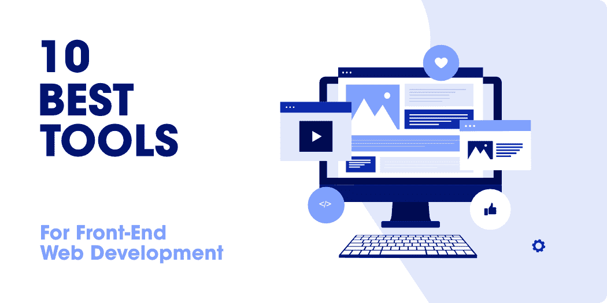

# 10 款前端 Web 开发最佳工具

> 原文:[https://www . geesforgeks . org/10-前端 web 开发最佳工具/](https://www.geeksforgeeks.org/10-best-tools-for-front-end-web-development/)

如您所见，在线企业越来越关注各自网站的 UI，以提供更好的用户体验并产生更好的投资回报率——近年来对前端开发人员的需求也大幅增加。

报道称**一个丰富、创意、优化的 UI** 可以将**网站的转化率提升 200%左右**–*是不是有点意思…？？*

然而，与此同时，我们不能忽视的是，与 10-12 年前相比，前端开发人员的工作也有所增加。他们需要在许多方面进行工作，例如响应性设计、改进的搜索引擎优化、易用性等。除了跟上最新的网页设计趋势。

心满意足地说，有各种[前端网络开发](https://www.geeksforgeeks.org/frontend-vs-backend/)工具可以让你的工作变得更容易。在本文中，我们将详细了解各种这样的工具。

但是在继续之前，让我们先了解一下…

### 这些前端网络开发工具是什么？

前端网络开发工具实际上是一种软件，它允许前端开发人员更有效地构建网站布局和用户界面，而没有任何麻烦。在这些工具的帮助下，前端 web 开发人员的工作，尤其是重复或单调的任务减少了，从而加快了 web 开发过程。

有许多用于各种特定需求的前端网络开发工具，例如**[**【CSS】**](https://www.geeksforgeeks.org/css-tutorials/)和 [**JavaScript**](https://www.geeksforgeeks.org/javascript-tutorial/) 工具、代码编辑工具、部署工具、原型制作&线框工具、安全工具等等。虽然在选择一个特定的工具之前你需要考虑各种因素，比如你的需求(很明显！！)，提供的功能、易用性、平台兼容性、价格等。**

****现在，让我们从几个最好的前端网络开发工具开始:****

### **1.Chrome DevTools(铬 DevTools)**

**Chrome DevTools 是一个广泛使用的网络开发工具，它允许您直接从谷歌 Chrome 浏览器编辑网页，并快速诊断问题以构建更好的网站。在 Chrome DevTools 的帮助下，您可以在实时环境中轻松编辑您的 HTML & CSS 代码或调试 JavaScript 代码。它为您提供了许多额外的突出优势，例如使用“时间轴”您可以方便地识别运行时性能问题，“设备模式”可以帮助您测试网站的响应能力，“源面板”可以使用断点调试 JavaScript，“网络面板”允许您查看和调试网络活动，等等。**

### **2.HTML5 样板文件**

**HTML5 样板是一个简单但非常有用的前端网络开发工具。它允许您创建快速、健壮和适应性强的网站或应用程序。HTML5 样板最好的一点是，它可以与任何前端框架、内容管理系统等集成。你正在使用的。除此之外，它还包括用于 css 规范化的 Normalize.css 和包含各种附加提示和技巧的文档。此外，Apache 服务器配置可帮助您提高网站性能和安全性。你要知道微软、NASA、耐克等。是一些著名的名字，他们在各自的平台上使用 HTML5 样板。**

### **3.厚颜无耻**

**Sass 是世界上使用最广泛的 CSS 扩展语言之一。Sass 所做的——它有助于扩展 CSS 的功能，如变量创建、内联导入、继承、更容易的嵌套等。您需要知道它完全兼容所有的 CSS 版本，这使得开发人员可以方便地使用任何可用的 CSS 库。同时，在使用它之前，您需要在您的项目中安装和设置 Sass。一旦它被安装——你可以方便地使用 sass 命令将你的 Sass 编译成 CSS。Sass 得到了众多知名科技公司的支持&开发商和波旁、指南针、苏西等。是一些用 Sass 构建的流行框架。**

### **4.安古斯**

**更有可能的是，如果你对前端开发有一点了解，你至少应该听说过 AngularJS 这个名字。让我们告诉你它是一个开源的前端 web 框架。它帮助您将静态 HTML 扩展为动态 HTML，从而使您更方便地构建动态和丰富的网站。它允许您使用模型-视图-控制器使用 JavaScript 创建客户端应用程序。AngularJS 提供了许多丰富的特性，例如数据绑定、控制器、指令、可重用组件和许多其他特性。此外，在社区支持方面，AngularJS 肯定会给你留下深刻印象，因为它被世界各地的大量开发人员使用！**

### **5.jQuery**

**jQuery 在 web 开发领域是一个相当流行的名字。它是一个跨平台的 JavaScript 库，可以帮助您实现各种功能，例如 DOM 操作、事件处理、CSS 操作、动画、Ajax/JSON 支持等等。此外，它还可以与其他库一起使用，并为您提供各种插件来合并其他功能。除此之外，它还有一个庞大的开发社区、更好的文档、强大的链接能力以及各种其他优势。根据报告，它是使用最广泛的 JavaScript 库——作为前端开发人员，您肯定应该在下一个项目中探索它。**

### **6.Visual Studio 代码**

**一个更好的代码编辑器是前端开发人员的基本要求——出于同样的考虑，这里我们向您推荐一个最受欢迎的代码编辑器，即 Visual Studio Code。这款由微软开发的开源代码编辑器为您提供了许多显著的功能，例如语法高亮显示、智能代码完成、内置调试器、内置 Git 命令、更简单的部署功能以及许多其他功能。此外，它也适用于 Windows、macOS 和 Linux 此外，Visual Code Studio 还为您提供了对 JavaScript、TypeScript & Node.js 和其他语言(如 C++、Java、Python、PHP 等)的内置支持。也可以使用扩展来支持。强烈建议您尝试一下 Visual Studio Code，尤其是如果您是初级前端开发人员的话。**

### **7.饭桶**

**这个列表中的另一个工具是一个流行的版本控制系统——Git。它允许您管理源代码，跟踪您在代码中所做的更改，甚至以一种非常方便的方式回滚到以前的状态。它节省了每一个变化，并允许团队中的所有开发人员在同一时间处理相同的代码，没有任何麻烦。它通过降低代码冲突等情况的风险，使开发人员之间的协作更加顺畅。与此同时，Git 是免费使用的，开源的，非常安全——您还需要什么来开始使用前端网络开发的丰富工具。**

### **8.以打字打的文件**

**在这个列表中看到 TypeScript 后，你们中的许多人一定会感到惊讶——但老实说，TypeScript 是一个值得用于前端开发的工具。它是一种编程语言，实际上是 JavaScript 编程语言的语法超集。但是，与 JavaScript 相比，它为您提供了几个额外的有价值的特性。您需要知道 TypeScript 可以在任何浏览器或 JavaScript 引擎上执行。此外，由于 JavaScript 是 TypeScript 的一个子集，您可以轻松地在您的 TypeScript 代码中使用所有的 JavaScript 库。此外，它有更好的 API 文档，更结构化和简洁，支持接口，自由静态组合，更好的智能感知工具支持，等等。**

### **9.节点包管理器**

**Npm，节点包管理器实际上是一个 JavaScript 的包管理器。它帮助您发现和安装可重用代码包，以便在程序中使用。有一个命令行客户端，允许您安装和发布这些包。您可以使用这个特殊的命令–“npm init”简单地将 NPM 添加到您的项目中。此外，您可以在名为“node_modules”的文件夹中找到下载的包或依赖项。使用 npm 的一个主要优势是——您只需要运行“npm install”，所有的外部依赖项都会由它来安装。毫无疑问，这个特殊的工具强烈推荐给所有的前端开发人员。**

### **10.咕哝**

**当谈到任务自动化时，Grunt 是最推荐给前端开发人员的工具。它允许您方便地自动执行重复任务，如编译、单元测试、林挺和许多其他任务，以提高效率和生产率。咕噜人的生态系统确实非常庞大，并且在有规律地扩展。Grunt 提供了许多预配置的插件来实现任务自动化。让我们告诉你 Grunt 和 Grunt 插件是通过 NPM(node . js 包管理器)安装和管理的——我们将在下一点讨论。在设置 Grunt 之前，您需要确保您的 npm 已更新。Adobe、Twitter、Mozilla、沃尔玛等。是一些使用 Grunt 的流行名字。**

****还有，名单还没到此结束……！！****

**还有许多其他工具与上述工具同等重要，您可以将它们用于前端网络开发，使事情变得更加容易和方便。此外，这也不是强制性的，你应该去寻找这些特定的工具——你也可以寻找它们的替代品，找到适合你的。例如——我们已经提到了 Visual Studio 代码——但是，您可以探索另一个代码编辑器，如崇高文本等。按照你的要求。**

*   ***HTML 工具:HTML5 样板、HTML5 骨骼、Haml 等。***
*   ***CSS 工具:Bootstrap、Metro UI、Sass 等。***
*   ***JavaScript 工具&框架:AngularJS、Vue.js、React、Ember.js、TypeScript 等。***
*   ***部署工具:CircleCI、竹子、Travis CI 等。***
*   ***性能测试工具:GTmetrix、速度曲线、网页测试等。***
*   ***SEO 工具:谷歌站长搜索控制台、Varvy SEO 工具等。***

**因此，到目前为止，您可能已经知道前端开发领域不再仅限于学习 HTML、CSS 和 JavaScript(尽管这些仍然是网络开发的基础)——现在有各种各样的工具和软件需要您学习，以保持在行业中的生产力和相关性。*现在还在等什么…？？去探索这些工具来升级你的前端网络开发游戏吧！！***