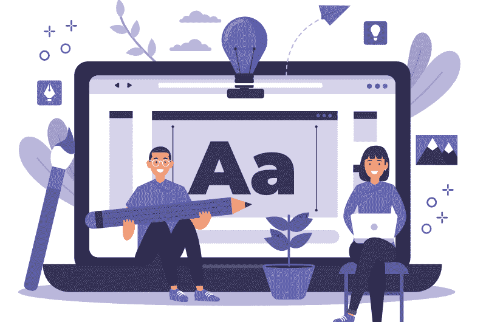

# 2019 年有效网页设计 10 招

> 原文:[https://www . geesforgeks . org/10-2019 年有效网页设计技巧/](https://www.geeksforgeeks.org/10-tips-for-effective-web-designing-in-2019/)

在短短的 10-15 秒内，登陆你网站的访问者可以决定他/她是应该留在那里还是从那里转行。不管你在你网站的后端写了多少复杂的代码，如果你的[用户界面/UX](https://www.geeksforgeeks.org/ui-vs-ux-design-which-career-option-should-you-choose/) 部分不令人印象深刻，那么用户不会对其他东西感兴趣，会离开那里。网站设计是主观的，一个设计对一个用户来说可能令人印象深刻，但对另一个用户来说，同样的设计可能很丑，这就是为什么它是设计师最复杂和最有创意的工作之一。网页设计不仅仅是在你的网站上添加内容和元素来使它变得漂亮，也是关于你如何添加一切来使它*易于使用*。

如果用户无法确定您网站的目的，如果用户在从一个页面导航到另一个页面时面临困难，如果页面布局不令人印象深刻且易于理解，那么这些都是认真关注您网站的标志。糟糕的网站设计背后有很多因素会给用户留下不好的印象。让我们讨论一些有效网站设计的重要因素和技巧…

> 设计不仅仅是它的外观和感觉。设计是如何运作的。
> **-史蒂夫·乔布斯**

### 1.有目标和计划

用户需要一个访问应用程序的理由，这就是为什么你的网站应该清楚地向用户解释或传达你提供的服务或产品。你的网站和它的每一页都应该有一个目的和明确的说明。根据目标(娱乐网站、电商网站、社交媒体等。)制作一个粗略的草图，并确定网站上需要包含的所有关键元素(如导航、联系信息、行动号召、搜索、页脚、按钮、图像、布局)。
从用户的角度理解你的网站，并据此进行规划。在你跳到代码之前，弄清楚你的用户的期望是什么，他们将查看什么页面，他们将阅读什么内容，并根据这些找到你想要元素去哪里。

### 2.简单

复杂性很可怕，在网页设计中“少即是多”的方法更有效。让你的网站变得简单，试着一次显示一个细节，以获得每个部分的单独关注。大多数人在自己的网站上，想把什么都放在同一个页面上就把什么都放在同一个页面上，这使得屏幕变得杂乱，用户会分心和困惑。这里有一些设计一个干净简单的网站的小技巧…

*   不要让你网站主页上的信息过载。如果内容或信息太多，就放在内页。另外，让你的网站在字体系列、字体大小、颜色、图像、标题和其他方面保持一致。
*   在你的设计中包含空白。在部分、段落和框之间留出足够的填充、边距和空间。它突出了内容，使您的网站易于使用。
*   限制拉出式菜单(下拉、折叠等)。)并避免使用边栏、滑块、手风琴、标签和旋转木马，这些是大多数网页设计师更喜欢放在网站上的。用户会分心，忽略网站上其他有用的内容。一项研究[圣母大学](https://erikrunyon.com/2013/07/carousel-interaction-stats/)也表示，我们应该避免使用旋转木马来吸引用户的注意力，增加点击量。

### 3.可读性

用户不应该在阅读你网站上的文本时遇到困难，所以你需要注意你的文本与其背景之间的对比。很多人使用带有文本的背景图像，其中图像没有任何覆盖，文本与图像混合在一起。您应该在图像上使用一些深色覆盖，然后在图像上使用文本，以使您的内容可读。
彩色背景也是如此，比如不要用文字稍浅的深灰色背景代替白色背景，这样会更容易看得见，更易读。另外，不要使字体太小，保持你的正文至少 16pt，并注意元素之间的空白。无衬线字体更适合在网站上使用。

### 4.响应性

人们使用[移动设备进行大部分浏览](https://99designs.com/blog/web-digital/top-web-design-tips/)[50%的网络流量](https://www.statista.com/statistics/241462/global-mobile-phone-website-traffic-share/)来自移动设备。这些都是您的应用程序应该在不同设备上可见的原因。文本、布局、图像网站的所有元素都应该可以在不同的设备上查看和访问，以获得更好的用户体验。学习使用 CSS 网格、媒体查询、引导框架来使您的应用程序具有响应性或移动友好性。

### 5.简单导航

如果访问者找不到他们要找的东西，他们肯定会离开你的网站，这就是关注你网站的导航极其重要的原因。导航组织您的完整网站，并引导用户在您的应用程序中移动。导航菜单应该在你网站的顶部并且是粘性的，这样如果用户向下滚动网页，他们仍然可以找到并访问你网站上的菜单。下面是一些提示，使导航应用程序变得容易…

*   在你的应用程序中使用“*三次点击规则*”，允许用户在三次点击中获得他们需要的所有信息。
*   菜单中更多的项目会让访问者感到困惑，所以尽量列出少于 7 个的项目，同时尽量避免下拉菜单，搜索引擎很难抓取下拉菜单。
*   你网站的品牌标志应该重定向到主页上的用户。
*   你可以包括一些重要的菜单(例如使用条款/常见问题/联系人/博客等。)，菜单的缩短版本或页脚中的社交图标。

### 6.行动呼吁

在你的网站中，有一个明确的行动号召按钮或表格来指示用户在页面上完成任务应该采取的下一步或行动是非常重要的。比如现在买、报名、联系方式表、订阅、登记表、社交媒体按钮等。一旦用户知道了网站的目的，CTA 就会为他/她提供某种指导。没有 CTA，用户将无法发现他/她是否需要购买产品、进行某种注册或订阅，用户可能会在没有完成最终任务的情况下离开网站。如果你把你的 CTA 放在折叠上方，这样访问者就可以在他们面前找到它，这是很好的。

### 7.负载速度

人们非常不耐烦，如果你的网站速度慢，他们不会等太久。如果 id 加载不快，大多数用户会在 5 秒内离开网站。图片或视频的大小对网站速度有很大的影响，所以在添加之前，请尝试压缩图片。此外，将代码合并到一个中央 CSS 或 JavaScript 文件中，以减少 HTTP 请求。Minify HTML、CSS、JavaScript(压缩以加快其加载时间)。限制网站上的大项目，选择合适的主机。

### 8.优先滚动

我们已经提到，你应该避免滑块或手风琴在网站上呈现大量信息。呈现更多内容并将其融入网站的最佳方式是使用滚动条。在一项[研究](https://conversion-rate-experts.com/crazy-egg-case-study/)中发现，当你在网页中添加滚动功能时，转换率会增加 30%。

### 9.选择正确的图像

一张图片说明了一个网站的很多信息，为你的网站选择合适的图片可以吸引很多访问者。我们强烈建议您使用高质量的优化速度，这不会影响您的网站速度。您可以从专业人士或照片库中获取图像，这些照片可以提供具有自然外观的高质量图像。你的图片应该清楚地表达你希望用户理解的信息类型。添加人物照片可以提高网站的转化率。

### 10.调色板颜色

网站的颜色应该与网站的品牌相匹配。选择合适的颜色来代表你的品牌非常重要。在选择颜色时，你还需要注意对比度。当你为你的网站选择颜色的时候，它应该和其他颜色很协调，而且你的文字应该清晰易读。你选择的颜色不应该相互冲突，例如不要用紫色和红色相邻，这会让你的网站变丑。对主要元素(主要元素)、高光(次要元素)和其他不太重要的元素(背景)使用单一颜色。您还需要记住，您的主要、次要和背景颜色应该在整个网站中保持一致。鲜艳的颜色会产生情感，因此应该谨慎使用(例如，用于按钮和行动号召)。