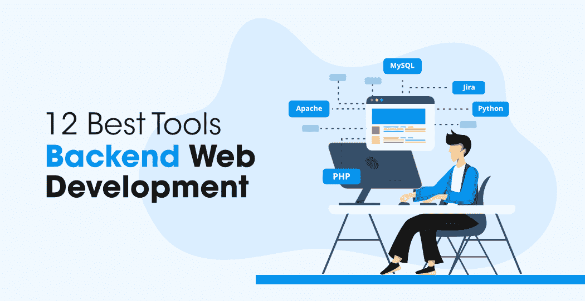

# 12 个 Web 开发人员后端开发工具

> 原文:[https://www . geeksforgeeks . org/12-后端-开发-工具-面向 web-开发人员/](https://www.geeksforgeeks.org/12-backend-development-tools-for-web-developers/)

而前端网络开发关注的是使用网页技术如 HTML、CSS、JavaScript 等设计网站的用户界面。–后端网络开发(或者你可以说服务器端开发)负责网站的适当运行。

*简单来说，当你访问一个电子商务网站时，比如 Flipkart——你在设备上看到的网站吸引人的布局和设计实际上是由 Frontend Developers 创建的，但是当你登录到你的账户，在购物车中添加所需的项目，进行支付和结账时——所有这些服务器端功能都在后端开发下。*

最有可能的是，在阅读了上述场景之后，你会明白后端开发相对比前端开发更难。这确实是一个比看起来更广阔的领域。

然而，如果后端开发人员在技术领域选择了一套合适的后端开发工具，事情会变得更加方便和容易。这些工具包括编程语言、框架、数据库管理系统、网络服务器、测试和部署工具以及其他各种工具。在进行后端开发时，您可以根据自己的需求选择退出这些工具。

**现在，让我们开始使用面向网络开发人员的顶级后端开发工具:**

### 编程语言

### 1.PHP

PHP 是超文本预处理器的首字母缩略词，是一种服务器端脚本语言，也是后端 web 开发最广泛使用的编程语言之一。我们可以通过让您知道像维基百科、WordPress、脸书和许多其他平台都依赖 PHP 来验证这一说法。这种特定的语言是网络开发的首选，因为各种突出的原因，如跨平台兼容性、OOPs 功能、易于与 HTML、CSS、JavaScript 等集成、巨大的社区支持、更好的灵活性和安全性等等。此外，这种语言很容易学习和使用。此外，还有各种著名的 PHP 框架，如 Laravel、Symfony、CodeIgniter 等。你可以考虑。

### 2.[蟒蛇](https://www.geeksforgeeks.org/python-programming-language/)

另一种被优先用于后端开发的语言，特别是在当前，是 Python。它是一种高级通用编程语言，支持多种编程范例，如面向对象、过程和函数。Instagram、Spotify、Google 等。是一些在其技术堆栈中使用 Python 的流行平台。该语言为您提供了一些显著的特性，例如丰富的库支持、易于与其他语言集成、图形用户界面编程支持、与趋势技术的兼容性等。此外，Python 有非常简单的语法，并提供了更好的代码可读性，从而使其易于学习和使用。您可以考虑的几个流行的 Python 网络框架是 Django、Flask 等。

### 3. [JavaScript](https://www.geeksforgeeks.org/javascript-tutorial/)

老实说，JavaScript 在 web 开发中的广泛作用不需要介绍。它实际上是与 HTML 和 CSS 并列的网络开发的基本单元之一。这种语言被大量开发人员用于网络开发，并且在顶级编程语言的各种著名指数中排名靠前。除了 web 开发，该语言还可以用于游戏开发、移动应用开发等。这种特殊语言的一些重要特性是——命令式和结构化、轻量级、面向对象编程支持、平台无关以及许多其他特性。此外，最好的部分是 JavaScript 可以同时用于前端开发和后端开发。

**其他可以考虑的语言:**[Java](https://www.geeksforgeeks.org/java/)[Go](https://www.geeksforgeeks.org/golang/)[Ruby](https://www.geeksforgeeks.org/ruby-programming-language/)等。

### 结构

### 4.拉维尔

Laravel 是科技界最流行的 PHP 框架之一。这个开源网络框架遵循模型-视图-控制器(MVC)架构模式，并为您提供了许多丰富的功能，如名为 Artisan 的内置命令行工具、预安装的面向对象和模块化库、雄辩的 ORM(对象关系映射)、模板引擎和许多其他功能。此外，该框架利用各种工具来完成特定的任务，如依赖注入、单元测试等。Laravel 提供的即用包包括用于管理订阅计费服务的收银台、用于定义您在远程服务器上运行的常见任务的简洁语法的特使、用于与脸书、GitHub、谷歌等提供商进行 OAuth 身份验证的简化机制的社交网站。和各种其他的。

### 5.[姜戈](https://www.geeksforgeeks.org/django-tutorial/)

Django 是一个基于 Python 的开源网络框架，允许您更高效地进行网络开发，没有任何麻烦。Django 遵循模型-模板-视图(MTV)架构模式。这种特定框架的巨大普及和需求背后的原因是它的一些显著特征，例如可扩展性、快速开发、可伸缩性、安全性、庞大的社区等等。企业正在将 Django 用于各种不同的网络开发领域，如社交网络平台、科学计算平台、内容管理系统和其他各种领域。使用 Django 的一些热门网站有–insta gram、Mozilla、Pinterest 等。如果你想进入使用 Python 的网络开发——你当然可以试试 Django。

**其他可以考虑的框架:** Angular、Meteor、Spring、Ruby on Rails 等。

### 数据库

### 6.[蒙戈布](https://www.geeksforgeeks.org/mongodb-an-introduction/)

MongoDB 是一个面向文档的免费开源数据库，在 web 开发人员中非常受欢迎。这个 NoSQL 数据库使用类似 JSON 的文档和可选的模式来存储和检索数据，并提供了急需的可伸缩性和灵活性。MongoDB 为您提供了许多突出的功能，如即席查询、索引、复制、负载平衡、文件存储、聚合、事务等。此外，与其他各种数据库管理系统相比，这个特定数据库的安全性和数据恢复方面相当好。除此之外，MongoDB 还兼容各种标准编程语言，如 C/C++、Java、PHP、Python、Ruby 和其他几种语言。

### 7. [MySQL](https://www.geeksforgeeks.org/sql-tutorial/) 的实现

MySQL 是另一个开源的关系数据库管理系统，广泛用于基于 web 的应用程序。这是一个快速、高性能的数据库，提供了更好的可扩展性、可用性和可靠性。此外，MySQL 提供了跨平台兼容性、强大的索引支持、对安全连接的 SSL 支持、强大的数据加密和准确性、内置的复制支持以及各种其他功能。同时，MySQL 可以在各种不同的操作系统上工作，并与许多流行的语言兼容，如 PHP、Java 等。让我们也告诉你，这个特殊的框架，MySQL，被各种著名的网站使用，像 Flickr、Twitter、脸书、Drupal、Joomla 和许多其他网站。

**其他可以考虑的数据库:** Oracle、 [PostgreSQL](https://www.geeksforgeeks.org/postgresql-tutorial/) 等。

### 网络服务器

### 8.街头流氓

Apache，或者你可以说 Apache HTTP 服务器，是由 Apache 软件基金会开发的开源跨平台网络服务器。它是领先的网络服务器之一，你可以理解为全世界大约一半的网站都是由 Apache 驱动的。Apache 提供了许多有价值的功能，如可加载动态模块、多请求处理模式、CGI 支持、用户和会话跟踪、实时状态视图、XML 和 FTP 支持以及许多其他功能。此外，Apache 网络服务器非常兼容几乎所有的操作系统，如 Linux、macOS、Windows 等。

### 9.NGINX

NGINX 是另一个开源的网络服务器，也用于反向代理、负载平衡、缓存、邮件代理等等。它使用异步事件驱动的方法来处理请求，随后它的模块化事件驱动架构在高负载下提供了更预期的性能。NGINX web 服务器的一些丰富特性是——处理静态文件和自动索引、兼容 IPv6、URL 重写和重定向等。除此之外，还有各种附加功能，如高级负载平衡、基于 cookies 的会话持久性、缓存清除应用编程接口等。都包含在 NGINX Plus 中。收纳盒、网飞、WordPress.com 等。是一些使用 NGINX 的流行平台。

**其他可以考虑的 web 服务器:** Lighttpd，微软 IIS 等。

### 其他工具

### 10.码头工人

Docker 确实是所有开发人员最推荐的工具。它是一个容器化平台，允许您在容器的帮助下创建、部署和运行应用程序，而没有任何麻烦。Docker 利用一致且隔离的环境来利用您，并负责隔离和隔离您的应用程序和资源，以便每个容器能够访问所有所需的资源，而不会干扰或依赖另一个容器。使用 Docker 的其他一些相当大的优势是–快速应用程序部署、可扩展性和灵活性、内置版本控制系统、安全性和成本效益，以及许多其他优势。

### 11.邮递员

说到邮递员，它是一个应用程序编程接口(API)工具，允许您方便高效地构建、测试和修改 API。全世界数百万开发人员使用它来使构建应用编程接口的过程变得更加容易和简单。Postman 为您提供了许多额外的丰富优势，例如支持各种 HTTP 方法、API 到代码的转换、节省进度、将 API 转换为各种语言的代码等等。此外，使用 Postman，您可以自动化手动测试，并将它们集成到您的 CI/CD 管道中，这样代码中的任何更改都不会破坏生产中的应用编程接口。

### 12.吉拉

另一个可以考虑让网页开发过程更加流畅的工具是吉拉。吉拉是一个项目管理平台，它使用看板和 scrum 工作流来管理项目。它帮助您方便地为敏捷项目的开发计划、跟踪和做报告工作。此外，您还可以访问大量具有实时和可操作见解的高级报告。此外，您需要知道，与其他项目管理工具相比，吉拉是非常可定制的。除此之外，您还可以探索吉拉的自动化引擎，该引擎允许您毫无困难地自动化任务和流程。

*等等等等……！！让我们告诉你，名单并没有到此结束。*除了上面提到的**编程、框架、数据库、网络服务器、项目管理工具、**等，还有许多其他同样重要的工具，你也可以作为后端网络开发人员来探索它们。比如，你可以根据自己的需求，进一步探索各种**代码编辑器和 ide、网站性能工具、测试工具、**等！！