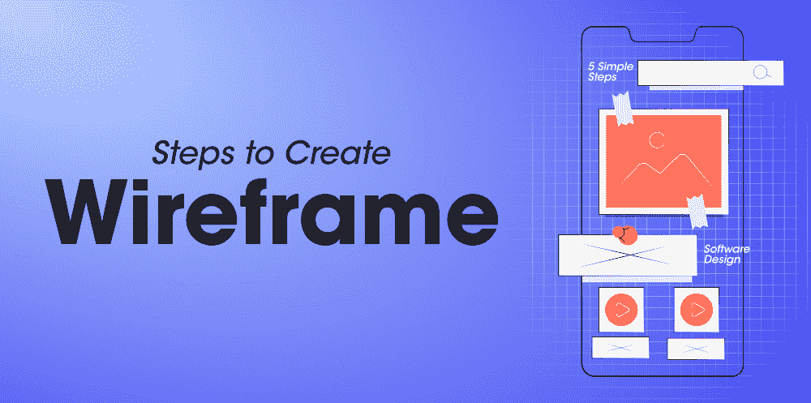

# 在软件设计中创建线框的 5 个简单步骤

> 原文:[https://www . geesforgeks . org/5-创建简单步骤-软件线框-设计/](https://www.geeksforgeeks.org/5-simple-steps-to-create-wireframe-in-software-design/)

如果一个 UX 设计师不注意系统的整个布局，设计一个网站就不是一件容易的事情。在公司里，很多时候，UX 的设计师会因为频繁要求他们在应用程序中更改各种东西而对客户感到沮丧。

利益相关者和 UX 设计师之间产生冲突的原因只是因为缺乏对网页整体结构的沟通。线框解决了这个问题……(*嘿！它实际上是什么？？*)。

如果你在一家小公司工作，或者是 UX 设计流程的新手，那么这可能是一个新的技术术语。基本上，线框给你网页的整体结构。这是 UX 设计过程的第一阶段，它给你的网站的整个布局和功能的愿景。

线框允许你组织你的想法，并让你的最终产品看起来清晰。您将决定特定类型的信息应该如何显示在每个屏幕上。

厌倦了理论概念…？？

让我们深入一些实际细节，并学习创建线框。我们将讨论为你的软件设计创建一个好的线框的一些基本步骤。

您可以使用两种方法创建线框。你可以使用纸和笔，也可以借助一些软件，如 Balsamiq(最流行的)、UXPin、InVision 或线框. cc。你可以探索这些工具并进行实验。你可以选择任何一个你觉得合适的。

现在让我们讨论一些创建线框的基本步骤…

### 1.做自己的研究，获得灵感

在你拿起笔和纸，直接跳到创建线框之前，做你自己的研究。收集需求，了解你的受众，创建用户角色，定义用例，并为你将要设计的类似产品寻找市场。这将有助于你获得一些灵感和想法。

看一些你正在设计的类似产品的线框的例子。例如，如果你正在设计任何一种娱乐网站，那就为类似的网站做一些研究。

浏览像运球和行为这样的网站，看看其他设计师做了什么。你不需要在这上面花太多时间。浏览这些网站，获得一些设计自己产品的想法。如果你正在设计一个新的特性或者完全不同的产品，那么也不要害怕在你的领域之外进行研究。

### 2.列出收集的数据以供快速参考

从你的研究中，你会对不同阶段产生的定量和定性数据有一个概念。如果你立即开始创建你的线框，你将很难保留和调用所有的数据。

准备一份清单或备忘单以供快速参考是很好的。这将有助于您快速绘制线框。在你的备忘单中提到了需求、角色、用例和其他重要的东西。

### 3.别忘了规划用户流

*你的线框需要代表多少个屏幕？*

*你期望用户遵循什么流程？*

*你的用户将来自哪里(哪个营销渠道)，你希望他们最终会在哪里？*

在你为你的软件绘制线框之前，确保你有以上所有问题的答案。如果你是 UX 设计师，那么你可能知道用户流和信息架构这个术语。

注意系统整个架构中的用户流。架构应该以用户或客户在使用您的产品时不会遇到任何问题的方式进行映射。对于用户来说，每次打电话给客服询问怎么做是非常令人沮丧的。因此，请确保在应用程序的各个页面上为用户创建一个流畅的流程。

流畅的布局和架构最终会吸引用户。它从用户端创造了更多的满足和信任。这导致了较低的辍学率或退学率，这仅仅意味着快乐的顾客，更多的收入。所以请记住，系统的整个架构会影响公司的收入。

### 4.积木

最后，我们进行到第 4 步，您需要拿起笔和纸在您的框架上创建电线(*啊啊啊！….我们知道你等了太久才到达这个阶段*)。开始问以下问题…

*   与此页面交互时，预期用户和业务目标是什么？换句话说，用户想要实现什么，业务想要用户完成什么动作？它可以是任何东西。例如:向购物车添加商品。
*   如何组织内容以满足用户的目标？
*   哪些信息应该更突出？
*   用户需要什么按钮或触点来完成所需的操作？
*   您需要在哪里发出行动号召？
*   主要信息和标志放在哪里？
*   用户登陆页面首先应该看到什么？
*   用户期望在页面的某些区域看到什么？

在线框制作中，你需要解决以上所有问题。请记住，您只需要绘制网页的构建块，所以保持简单。概述并表示特征和格式，不详细说明任何内容。无需考虑美观、颜色或字体大小。你只需要关注网页的功能块或框架。

你可能需要在线框中做一些变化。你也可以寻求其他设计师或产品经理的帮助。当你在制作框架时，记住你需要创造一些有用的东西来满足你客户的需求。

### 5.填写详细信息

一旦流程准备好了，你有了基础，采取下一步，升级你的线框。在线框图中填写信息或细节。你可以从上到下，然后从左到右。

*需要填写什么样的细节？(啊…！！！我们知道你会有这些问题..)*

在这个阶段，您需要定义可用性约定，例如将导航放在您的徽标旁边的顶部，或者在右上角放置一个搜索框。想想间距、布局和信息层次。哪些信息最重要，哪些最不重要？你的行动要求是什么？

想一想你想包含的图片？你想把它们放在哪里，图片的大小应该是多少？包括建立信任的因素。你需要什么来建立对用户的信任，这些元素的定位应该是什么？

填写完详细信息后，您就可以进行第一次用户测试了。从你的同事那里获得对你到目前为止所做工作的反馈。如果你有时间和资源，考虑进行可用性测试，突出你可能错过的任何大缺陷。

### **创建良好线框的技巧**

在整个线框制作过程中，有三个大框需要你去勾选…

**1。清晰的表述:**确保你的软件的整个布局回答下面给出的问题…

*   这一页是关于什么的？
*   用户可以在那里做什么？
*   页面布局是否满足用户需求？
*   用户不需要过多思考就能轻松完成自己想要的动作吗？

**2。用户信心:**用户信心就是通过好的设计建立对你品牌的信任。易于导航和明确的行动要求确保产品界面可预测且舒适。

如果你的页面在意想不到的地方有不可预测的按钮和框，用户的信心将迅速同步。在线框中，使用熟悉的导航过程，将按钮放在常用和直观的位置。

**3。简约:**简约就是要遮挡噪音。在线框图中，避免信息过载。过多的内容、链接和按钮确实会让用户不知所措，分心。用户将面临很多问题，他们将无法顺利访问网页。你网页上的用户旅程应该尽可能的流畅和无缝。

你需要仔细决定你想在每个屏幕上包含的信息。请记住，线框与漂亮的颜色和美学无关。它们是关于直观的逻辑布局和良好的信息层次。