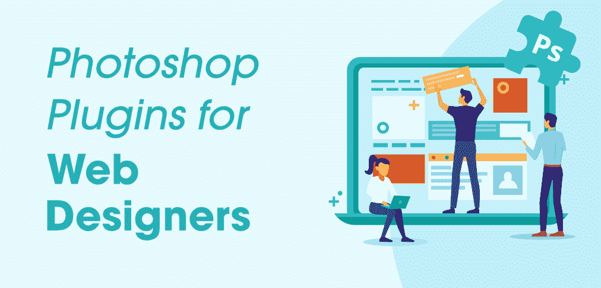

# 6 最推荐网页设计师使用的 Photoshop 插件

> 原文:[https://www . geeksforgeeks . org/6-最推荐-Photoshop-插件-针对网页设计师/](https://www.geeksforgeeks.org/6-most-recommended-photoshop-plugins-for-web-designers/)

有许多可供网页设计师使用的 Photoshop 插件，其中一些非常重要，作为网页设计师，你不能忽视它们。出于同样的考虑，在本文中，我们将讨论几个显著的 Photoshop 插件，它们肯定会让您的工作更加轻松高效。

但是在进一步讨论之前，让我们来看一个常见的问题——插件或扩展做什么？用最简单的话来说，如果我们试图回答这个问题，我们可以说插件/扩展是浏览器的一个附加组件，并提供了宽大处理&通过在浏览器中提供一些额外的功能，使我们的任务变得更容易。

*现在，让我们从 Photoshop 插件开始:*

### 1\. CSS3Ps

CSS3 插件使我们能够轻松地将 Photoshop 图层转换为 CSS3。你只需要选择要转换成 CSS3s 的图层，点击 CSS3s 按钮提交转换请求。CSS3Ps 是一个依赖云的插件，你不用担心新的更新到来和错误或 bug。此外，您可以方便地查看云中的计算结果。它允许你一键编辑多个图层，并且可以自由使用。CSS3Ps 的其他几个显著特点是——文本层、投影、外发光等等。

### 2.墨水

有时，缺乏深度信息(规范)会导致恶性的前端输出。因此，最终产品输出与实际输出不匹配，超出了我们的预期结果。Ink 是一个插件，它通过记录你的图层，从排版到效果和形状大小，给你一些额外的重要信息。“墨迹”面板还会为您呈现一些额外的功能。例如，您可以打印图层的尺寸和颜色，可以生成一个 XML 文件，以及文档排版、渐变、笔画效果和其他样式元素。您所需要做的就是选择您想要记录的层，然后您可以开始添加您想要交付给开发人员的信息。此外，墨迹可以在苹果和视窗上工作。

### 3.Shutterstock

它为四种不同类型的 Adobe 实例提供了不同的功能:

**i. Adobe Photoshop:** 在这里，您可以访问最大和最新的图像集合，而无需将 Adobe Photoshop 应用程序与原始插件一起离开。

*特征:*

*   最新精选的肖像画、风景和背景
*   更精简的设计节省时间
*   更多免版税内容有待发掘

**二。Adobe Illustrator:** 您可以创建图形、插图、图标等。Adobe Illustrator 应用程序的插件。此外，您可以更容易地获得大量矢量，并可以找到您专门挑选的集合，包括:

*特征:*

*   背景，如纹理和图案
*   字符和字体是可用的，从平面到三维类型，流行艺术到剪影
*   用户界面元素，包括模板、图标、字体和信息图表。

**三。** **Adobe InDesign:** 它让您可以毫不延迟地进行设计，无论是打印还是数字，您都可以找到每个设计项目的图像。

*特征:*

*   用户可以访问个人需要的任何图像，而无需离开或退出工作应用程序
*   免费预览任何带水印的图像

**iv。Adobe Premium Pro:** 使用快门库存插件，工作不受干扰。

*特征:*

*   查看和编辑时间线中的剪辑
*   您的照片和视频将被自动重新应用
*   在这里，您可以通过相应的帧速率和屏幕分辨率来搜索视频剪辑

### 4.盖蒂图像

Getty image 使您能够高效地使用 Photoshop 软件，而无需从软件中添加无与伦比的高质量视频、照片和矢量。它可用于 Adobe Illustrator、InDesign、Photoshop、Premiere Pro 和 After Effects。它包含了大量免版税的图片。

*要求:*

*   要在您的系统中使用它，您需要 Mac OS X 10.9 操作系统或更高版本，
*   对于 Windows 操作系统，应该是–Windows 7 服务包 1、Windows 8.1、Windows 10 或更高版本

**特征:**

*   它有助于快速搜索和过滤图像，插图，视频，并提供了一个方便的菜单调色板板部署了先进的盖蒂图像搜索功能
*   您可以从成千上万的图像和视频剪辑中选择最佳设计
*   它为您提供了自动更新功能，当您从开始阶段进入最终许可版本时，可以继续编辑您的图像和视频
*   您还可以设置自己喜欢的首选项，以获得更方便、更高效的插件体验。

### 5.超文本标记语言块

该插件使用 WebKit 引擎，并在 Photoshop 应用程序中提供了一个特殊的块，我们可以在其中放置我们的 HTML/CSS 代码，并可以看到实时效果(在 Photoshop 中提供浏览器视图)。它可以用于网页字体，字体平滑，外部 CSS，原生元素等。还有，HTML Block 是免费使用的！

### 6.支持它

对于需要为基于 iOS 或 Retina 的网站从 PSD 中切片 UI 元素的常规设计师和前端开发人员来说，RetinizeIt 是最佳选择和推荐。尽管您需要记住，如果您正在为要切片的图层使用投影或内部阴影属性，您必须确保“使用全局光源”复选标记未选中。否则，阴影的角度将被更改为 Photoshop 中设置的默认角度。

*主要由包内 3 个动作组成:*

*   1x 仅用于切片选定的层或组，非常适合以原始尺寸快速导出元素。
*   1x，2x，用于对选定元素进行切片，并按 200%版本进行缩放。它非常适合视网膜就绪的网站。
*   1x、2x、3x，用于选定元素+缩放 200% +缩放 300%。这对 iOS 资产来说是完美的。