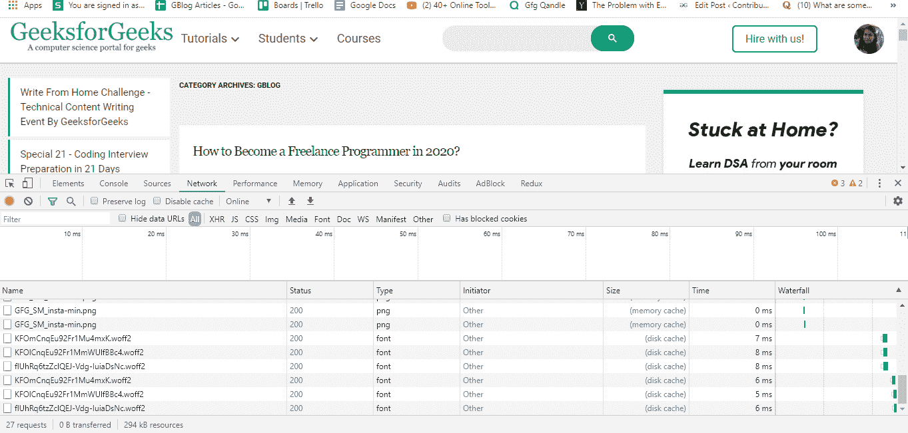
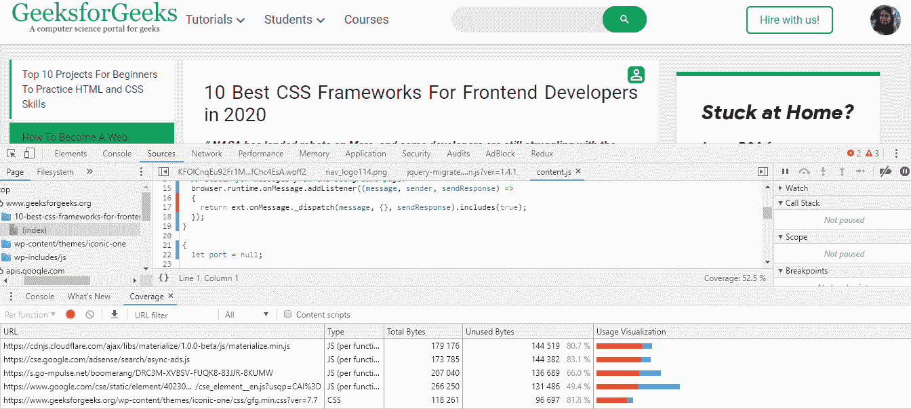

# 网络开发中性能优化的 7 个技巧

> 原文:[https://www . geesforgeks . org/7-性能提示-网络开发中的优化/](https://www.geeksforgeeks.org/7-tips-for-performances-optimization-in-web-development/)

***你知道一个事实吗，因为页面加载时间比以前长了 5 秒，谷歌一度面临着 20%的流量下降。***
***你知道吗，沃尔玛的页面加载时间每增加 1 秒，转化率就会增加 2%？***
以上两个例子都足以告诉你为什么网络应用程序的性能对于成功运营企业来说非常重要。今天，在这个数字世界里，没有人愿意等待任何事情。我们希望任何应用程序的可访问性尽可能快。如果你点击谷歌上的搜索结果，如果几秒钟内没有加载，你可以快速切换到其他选项。在各种组织中，在构建应用程序时，许多开发人员和其他团队成员过于关注一些重要的东西，如设计、内容和数字营销，但他们经常忘记网络性能的重要性。

当网站加载非常慢时，用户会感到沮丧并离开网站。事实上，在一项调查中发现 **40%的人**放弃加载时间超过 **3 秒**的网站。在本博客的开头，我们还举了两个主要的例子。所以你网站的速度肯定会对你的产品、商品、服务和品牌形象产生正面或负面的印象。针对各种设备和网站流量优化您的网站非常重要。现在让我们仔细看看为什么网络性能对公司来说真的很重要，以及它如何影响企业。

### 为什么网速优化很重要？

我们考虑一下，你网站的速度不重要……
*你知道会发生什么吗？*

嗯根据[阿伯丁集团研究](http://loadstorm.com/2014/04/infographic-web-performance-impacts-conversion-rates/)每**一秒**延迟页面加载时间产生:

*   页面浏览量减少 11%
*   客户满意度下降 16%
*   转化率损失 7%

对于一个网络应用程序来说，吸引访问者并使销售每秒都很重要。加载速度更快的网站会创造更多的流量并产生更多的收入。网站获得更好的用户参与度、更高的转化率、更高的 SEO 排名等等。 **47%** 的消费者期望网站在两秒或更短时间内加载， **46%** 的用户不会重访表现不佳的网站。如果用户正在使用移动设备，那么他/她可以离开网站，因为加载需要 5 秒以上的时间。谷歌的工程师还发现，如果页面加载时间低于 0.4 秒，搜索结果会更少。

*   其中一项[调查](https://neilpatel.com/blog/loading-time/)显示， **79%** 的访问者不太可能访问有性能问题的网站。此外， **52%** 的购物者表示，更快的网站对网站忠诚度很重要。 **44%** 还表示，他们会告诉朋友糟糕的网站体验。现在根据这项调查，你可以想象一个缓慢的网站对你的业务的最坏影响。
*   **沃尔玛**一家知名公司在改善页面加载时间时得到了好处。该公司分享了以下统计数据:
    1.  **页面加载时间每提高一秒，转化率提高 2%** 。
    2.  每进步 100 毫秒，公司的增量收入就增长 1%**。**
*   ****火狐**的下载量每年上升 **15.4%** 或者 1000 万，增加 **2.2 秒**的页面速度。**
*   ****Pinterest** 在将感知等待时间减少 **40%** 后，搜索引擎流量和注册量增加了 15%。**
*   **英国广播公司(BBC)发现，他们的网站每多加载一秒钟，就会多流失 10%的用户**。****

****以上所有的调查和例子都清楚地显示了速度较快的网站的积极影响和速度较慢的网站的消极影响。网站速度优化影响网站成功的关键因素…****

1.  ******转换:**意思是让你的访客做你想让他们做的事情。****
2.  ******可见性:**表示用户找到你网站的难易程度。换句话说，谷歌排名结果。谷歌下调了运行缓慢的网站的排名。排名还考虑了页面的移动版本。****
3.  ******可用性:**如果网站表现良好，它会提供更好的用户体验，从而带来更高水平的客户满意度。它也影响着忠实顾客的数量。****

### ****网站性能优化的技巧和技巧****

****web 应用程序的性能取决于很多因素。有很多方法和技巧可以让你的网站更快地运行。您需要在 web 应用程序的客户端和服务器端都使用技术。让我们讨论一些优化网站的主要技术或步骤…****

#### ****1.缓存和内容交付网络****

****在单个服务器上托管您的网站会增加网站的加载时间。每个用户都必须在同一台服务器上发出请求，处理每个请求都需要时间。网站经历了沉重的流量负载，页面加载时间较长。此外，当用户远离服务器时，负载时间会增加更多，因为信息的传播距离更远。解决这个问题的方法是使用 CDN。基本上，CDN 是服务器的一个地理分布组，您可以在其中传输加载互联网内容所需的所有资产，包括 HTML 页面、JavaScript 文件、样式表、图像和视频。CDN 将所有这些文件缓存在离用户更近的服务器上，减轻了网站的沉重负担，使应用程序运行更快。****

#### ****2.最小化 HTTP 请求****

****如果您的网站发出大量的 HTTP 请求，那么网页将需要更多的时间来加载。根据雅虎的说法，[网页 80%的加载时间](https://developer.yahoo.com/performance/rules.html#num_http)用于下载页面的不同部分，如图像、样式表和脚本。当访问者想要访问您网站上的这些元素时，需要更多的 HTTP 请求，并且需要很长时间来呈现页面。****

********

****首先使用 chrome developer(左下角)工具中的网络选项卡确定有多少 HTTP 请求。您可以使用一些技术来减少请求的数量，例如…****

*   ****不要使用不必要的插件、图像、JavaScript 和 CSS****
*   ****将你的资产打包。将 JavaScript 文件合并成一个，并对 CSS 文件做同样的事情。****
*   ****除非绝对需要，否则不要使用第三方框架****
*   ****使用**精灵**。您可以使用精灵在一个请求中传递多个图像。通过在 CSS 中使用背景位置属性，您可以引用单个图像。****
*   ****缩小你的 HTML、CSS 和 JavaScript 文件。缩小消除文件中不必要的字符。有几种方法和工具可以缩小这些文件，如[willpayy](http://www.willpeavy.com/minifier/)、 [JavaScript Minifier](https://javascript-minifier.com/) 或 [Grunt](https://gruntjs.com/) 工具。****

#### ****3.减少重定向****

****为了移动和删除页面或消除断开链接的问题，您可能会使用重定向，但这些重定向会产生更多的 HTTP 请求，并对性能产生负面影响。重定向(301，302)会降低页面速度，降低网站性能。首先你应该使用一些工具来检测所有的重定向，比如[尖叫青蛙](https://www.screamingfrog.co.uk/seo-spider/)，然后确定哪一个在你的网站上是不必要的。消除不必要的重定向，只保留重要的重定向。****

#### ****4.启用压缩****

****[根据谷歌](https://developers.google.com/web/fundamentals/performance/optimizing-content-efficiency/optimize-encoding-and-transfer)的说法，网络世界每天都看到由于未压缩的网络内容而浪费了 99 年的人类岁月。文件越大，页面加载越慢。减少文件大小是实现更好页面速度的一个很好的技术，所以总是尽量压缩文件。它减少了 HTTP 请求，并有助于使网站更快。
[GZIP](https://www.gnu.org/software/gzip/) 是压缩文件最有效、最常用的手法。它适用于各种类型的文件。您可以启用 [GZIP](https://www.gnu.org/software/gzip/) 并在服务器级压缩网页、CSS 和 JavaScript，然后再将其发送到浏览器。基本上，它是一个软件应用程序，允许您在文件中找到类似的字符串或代码实例，然后用较短的字符临时替换它。在用户端，浏览器解压缩文件并呈现原始内容。您可以使用网址 [GZIP 压缩测试](https://www.giftofspeed.com/gzip-test/)来检查您的网站是否启用了 [GZIP](https://www.gnu.org/software/gzip/) 。****

1.  ****如果你的网站在 WordPress 上，使用 [WP-rocket](https://wp-rocket.me/) 或 [W3 总缓存](https://wordpress.org/plugins/w3-total-cache/)插件启用 GZIP 压缩。****
2.  ****启用 GZIP 压缩的最佳方式是在 Apache 或 Nginx 的服务器级。****

******注意:**不要 GZIP 图像、PDF 或其他二进制数据。这些已经被压缩了，所以只会浪费 CPU 资源。
*另一个选项:*你也可以使用 [Brotli](https://github.com/google/brotli) 进行压缩，这是一个相当新的选项，但在市场上越来越受欢迎。****

#### ****5.贮藏****

****当用户访问一个网站时，这些元素被存储在一个叫做缓存的临时硬盘中。下次同一个人访问同一页面时，他/她可以加载该页面，而无需向服务器发送另一个 HTTP 请求。这个过程可以更快地加载页面。基本上，缓存将网站的当前版本存储在主机上，并呈现该版本，直到网站更新。对于缓存的页面，不需要每次都发送数据库请求。****

****设置网站缓存取决于网站运行的平台。如果我们谈论 WordPress，那么您可以使用插件 [W3 总缓存](https://wordpress.org/plugins/w3-total-cache/)来轻松启用缓存。您可以通过导航到常规设置>浏览器缓存并选中“启用”旁边的框来启用浏览器缓存对于 VPS 和专用服务器，您可以通过常规设置启用对象缓存，以加快站点上的动态元素。在共享托管的情况下，缓存不是最好的选择。对于静态 HTML 站点，您可以通过在中启用缓存。htaccess 文件。****

#### ****6.优化数据库****

****数据库也对 web 应用程序的性能产生了巨大的影响。CMS 充满了复杂的插件，增加了数据库的大小和网页的加载时间。禁用数据库中不需要的插件。WordPress CMS 存储帖子、评论、页面和其他形式的文本和加密数据，需要大量存储。随着时间的推移，数据库变得拥挤不堪，它开始收集垃圾数据，如垃圾邮件队列中的评论、未经批准的评论、帖子修订、帖子等垃圾项目以及页面。去掉所有这些垃圾数据和无用内容。限制、禁用和删除帖子修订。不同的 CMS 有不同的优化技术。对于 WordPress，可以考虑 [WP-Optimize。](https://wordpress.org/plugins/wp-optimize/)****

#### ****7.优化 HTML、CSS 和 JavaScript****

1.  ****始终将脚本放在底部。将 JavaScript 属性放在标题标签内或靠近 HTML 文档的顶部会阻止 HTML 和 CSS 元素的加载过程。为了获得更好的性能，请在结束正文标签之前放置它们。您也可以尝试**异步/延迟**属性。****
2.  ****通过将所有资源放在外部文件中来使用缓存。这包括像跟踪脚本、内联样式这样的片段，以及每次请求 HTML 时下载的脚本。****
3.  ****减少 DOM 元素的数量。****
4.  ****将样式表放在 HTML 文档的顶部。此外，降低选择器的复杂性，使用额外的类来代替它。避免 CSS 中的布局更改(宽度、高度或左右布局更改)。****
5.  ****使用 chrome developer 工具中的 coverage 标签来识别页面加载时我们真正需要的代码。红色部分突出显示的代码不会立即执行。这意味着您可能会推迟并在加载完成后请求它。****

********

#### ****8.优化图像****

****无论我们谈论公司标志还是我们需要向客户展示产品，图像在网站建设中起着重要作用。一项调查发现， **66%** 的客户在购买产品前希望至少看到一个产品的 **3 张照片**，所以对于电商公司来说，图片是至关重要的部分。它增加了用户的参与度，但它们通常是大文件，因此它也降低了网页的速度。下一步是什么？压缩图像。可以使用 [Compressor.io](https://compressor.io/) 、 [JPEGmini](http://www.jpegmini.com/) 、[北海巨妖](https://kraken.io/)、 [WP Smush](https://wordpress.org/plugins/wp-smushit/) (对于 WordPress)、 [TinyPNG](https://wordpress.org/plugins/tiny-compress-images/) 等工具对图像进行压缩，而不影响图像质量。余灿还使用了[擎天柱](https://optimus.io/)以及一个专注于无损和有损图像压缩结合的应用编程接口。****

1.  ****使用 HTML 响应图像和属性。它根据用户显示属性调整图像大小。****
2.  ****当质量是高优先级，并且在上传之前不需要修改图像时，请使用 jpg。对于动画视觉效果，使用 GIF。对于图标、徽标、插图、标志和文本，请使用 PNG 格式。****
3.  ****当您在网站上显示图像时，请尝试将图像的自然大小与最终显示大小相匹配。如果图像的最大宽度永远不会超过 300 像素，那么你的尺寸也不应该超过 300 像素。以正确的大小裁剪图像，并使用浏览器调整大小功能，通过设置固定宽度和自动高度指令使图像具有响应性。****

****我们已经讨论了 8 种技术，但是为了提高网页的性能，还有一些技术你应该知道。您可以通过选择合适的托管服务、优化字体、使用预取技术(链接预取、域名系统预取、预渲染)、使用极简框架、热链接保护以及最大限度地减少到达第一个字节的时间来提高网站的性能。****