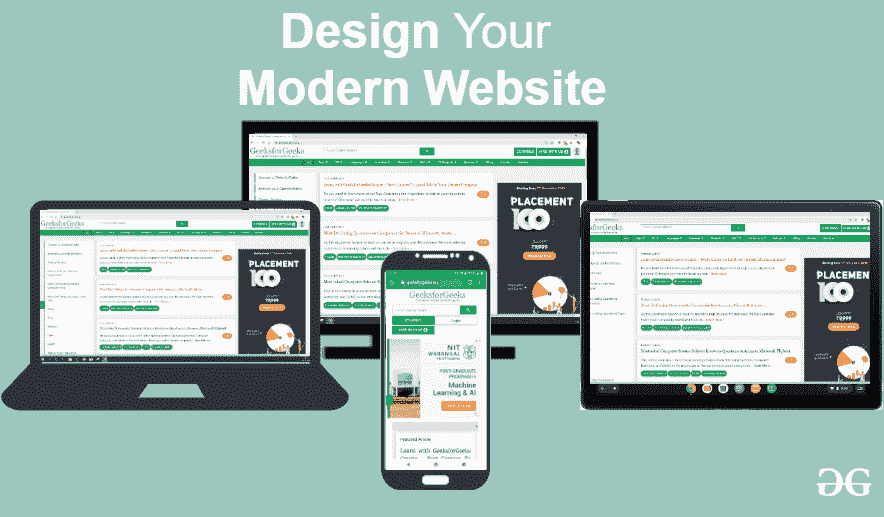

# 毁掉你下一个网站设计的 8 种方式

> 原文:[https://www . geesforgeks . org/8-沉船之路-你的下一个网站-设计/](https://www.geeksforgeeks.org/8-ways-to-shipwreck-your-next-website-design/)

一个网站只有很少的时间来吸引用户的兴趣。越来越多的科技时代，很多网站都有特定的主题，那么为什么要选择又老又无聊的网站呢？你的网站需要的不仅仅是信息。它需要一个吸引人的外观，将它带入现代，使它真正适合当前的数字世界。但是要小心，不要在让它有吸引力的同时破坏它。
在本文中，我们将讨论设计网站时必须牢记的 8 点。

**1。在设计你的网站时，一定不要吹嘘太多。永远记住用户想要什么，他们为什么访问你的网站。来访者只关心他们问题的解决方案，所以不要只是吹嘘你的成就。预测他们的问题，并强调您的企业如何解决这些问题。让他们相信你能让他们的生活变得更好。**

**2。为所有错误的原因重新设计**
在这个竞争日益激烈的时代，一个人必须总是比其他人更好，但不能过分沉迷于此。你应该重新设计你的网站，让你的用户得到更好的界面，他们永远不会对你的网站感到厌烦。一个人不应该仅仅因为竞争对手这样做就重新设计网站。任何更新都应该在牢记用户的同时进行。

**3。响应性&平台无关**
一个网站的设计应该记住用户可以通过哪些来源浏览它。不要让你的网站高度图形化，以至于普通移动用户无法访问。确保你的网站甚至可以从小屏幕智能手机访问到电脑。你的网站也可以通过慢速连接浏览，你需要大量的访问者，所以要确保它可以被一大群人访问。大多数人使用智能手机，所以网站应该包含所有这些东西，可以很容易地通过它们查看。使用简单的文本样式，只有那些必要的图像应该做。

**4。可爱或聪明，而不是清晰**
你的口号应该有吸引力，这样它会引起人们的兴趣，但同时也应该清晰，即人们应该清楚地理解你想说什么。你可能有一个花哨的词汇，但如果用户不能理解你想说什么，那就没用了。如果你的访问者在几秒钟内没有理解，你就失去了他们。让你的网站有吸引力是必要的，但与此同时，人们找到他们正在寻找的东西也是必要的。他们会欣赏它的外观，但认为如果他们不知道他们在寻找什么，它会有什么好处。

**5。谁在乎船员？**
在设计一个网站的时候，你需要很多人，不同的人，他们是各自领域的专家。营销人员、文案、程序员和社交媒体专家在设计网站时都有非常重要的作用。你不能自己设计网站。你需要记住网站如何吸引更多访问者的每个方面。总是听取你的团队提供的建议，在最终设计之前听取每个人的意见。

**6。让他们自己想办法**
人们喜欢上网，他们对了解很多东西感兴趣。但是他们为什么喜欢它，他们喜欢它是因为他们很快得到他们的搜索结果。他们得到准确的内容。因此，确保你的网站速度快，用户获得所需的内容。这会把用户一次又一次带到你的网站。确保你没有很多弹出广告，因为它们会激怒用户。您的搜索结果应该是准确的，它应该只需要很少的时间加载。不要让访问者在你的网站上挣扎，让他们开心。

**7。使用良好的网站结构**
人们需要能够轻松地探索你的网站，并快速找到他们正在寻找的东西。如果他们感到困惑，他们会被激怒并离开网站。确保你的网站提供良好的用户界面，用户可以轻松访问网站。速度是关键因素之一，请确保您的图像得到优化。图像下载需要花费大量时间，尤其是在小型设备中。将图像缩小到尽可能小的尺寸。

**8。一旦启动，您就万事俱备了！**
一旦你的网站上线，你就可以走了。尽量多带些游客。但是你没有时间在这里放松，真正的工作是在网站上线后开始的。你必须比以前做更多的工作。你必须确保用户得到他们正在搜索的任何东西。你的网站不是一本小册子，而是一个强大的 24 小时潜在客户生成工具。你应该检查用户想要什么，并提出一些与他的搜索相关的建议。但是你不应该像订阅时事通讯、太多弹出窗口等那样过多地打扰用户。总是努力让他的搜索经历值得记住。

遵循这些要点，就会有一个好的稳定的网站。设计一个网站需要团队合作。每个人的意见都很重要。充分利用分析数据和客户偏好，可以有效地维护网站。这 8 点只是一个网站的基本构件，每个网站开发者都应该遵循。始终牢记客户的需求，并随时听取他们的反馈。这个反馈会改善你的网站。遵循这一点，你不仅可以吸引和留住你的特定目标受众，还可以让你的网站保持惊人的运转。