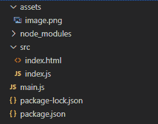
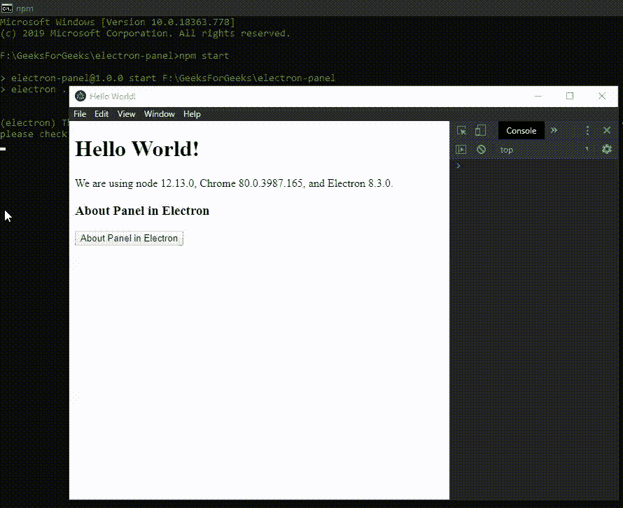
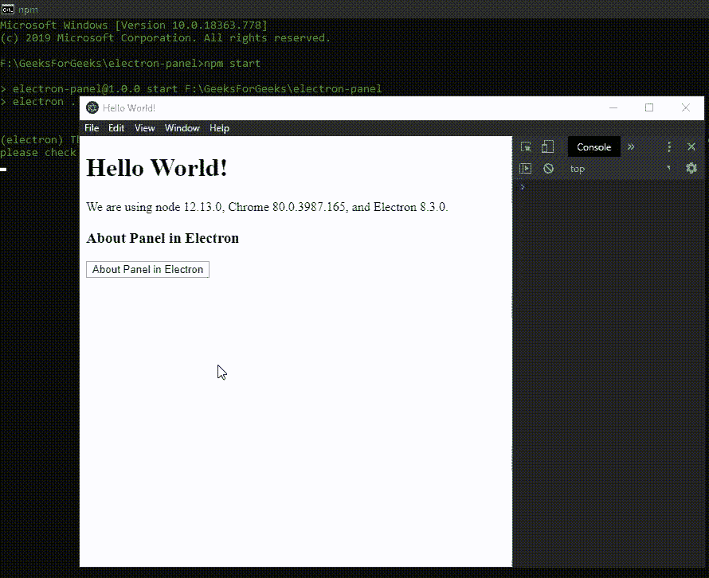
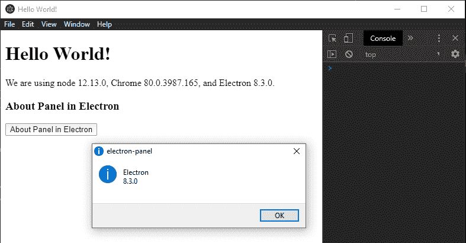

# 关于电子表格中的面板

> 原文:[https://www.geeksforgeeks.org/about-panel-in-electronjs/](https://www.geeksforgeeks.org/about-panel-in-electronjs/)

[**electronijs**](https://www.geeksforgeeks.org/introduction-to-electronjs/)是一个开源框架，用于使用能够在**Windows****macOS**和 **Linux** 操作系统上运行的 HTML、CSS 和 JavaScript 等 web 技术构建跨平台原生桌面应用。它将 Chromium 引擎和 [**NodeJS**](https://www.geeksforgeeks.org/introduction-to-nodejs/) 结合成一个单一的运行时。

在传统的网络应用中，**关于**页面是网站上访问量最大、最重要的页面之一。这是访问者了解网站的机会。“关于”页面提供了一点关于网站及其背后的人的背景和介绍。只需点击一下主页，就能给人留下快速的印象。Electron 还为我们提供了一种方法，通过这种方法，我们可以使用**应用程序**模块的实例方法将“关于面板”包含在桌面应用程序中。本教程将演示如何将**关于**面板包含在电子中。

我们假设您熟悉上述链接中介绍的先决条件。电子要工作， [**节点**](https://www.geeksforgeeks.org/introduction-to-nodejs/) 和 [**npm**](https://www.geeksforgeeks.org/node-js-npm-node-package-manager/) 需要预装在系统中。

*   **项目结构:**



**示例:**按照 [**电子公告**](https://www.geeksforgeeks.org/custom-notifications-in-electronjs/) 中的自定义通知中给出的步骤设置基本的电子应用程序。复制文章中提供的 **main.js** 文件和**index.html**文件的样板代码。还要对**包. json** 文件进行必要的更改，以启动电子应用程序。我们将继续使用相同的代码库构建我们的应用程序。设置电子应用程序所需的基本步骤保持不变。

**package.json:**

```htmlhtml
{
  "name": "electron-panel",
  "version": "1.0.0",
  "description": "About Panel in Electron",
  "main": "main.js",
  "scripts": {
    "start": "electron ."
  },
  "keywords": [
    "electron"
  ],
  "author": "Radhesh Khanna",
  "license": "ISC",
  "dependencies": {
    "electron": "^8.3.0"
  }
}

```

根据项目结构创建**资产**文件夹。将您选择的任何图像文件复制到**资产**文件夹中，并将其命名为**image.png**。在本教程中，我们将使用电子标志作为***image.png***文件。
**输出:**此时，我们的基本电子应用程序就设置好了。启动应用程序后，我们应该会看到以下结果。

[](https://media.geeksforgeeks.org/wp-content/uploads/20200512225834/Output-1105.png)

**关于电子面板:**应用程序模块用于控制应用程序的事件生命周期。该模块是**主流程**的一部分。要导入并使用**渲染器流程**中的 **app** 模块，我们将使用电子**远程**模块。

**index.html**:在该文件中添加以下片段。

## 超文本标记语言

```htmlhtml
<h3>About Panel in Electron</h3>
  <button id="about">
    About Panel in Electron
  </button>
```

**index.js** :在该文件中添加以下代码片段。

## java 描述语言

```htmlhtml
const electron = require('electron')
const path = require('path')

// Importing the app module using Electron remote
const app = electron.remote.app

var about = document.getElementById('about');
about.addEventListener('click', (event) => {
    app.setAboutPanelOptions({
        applicationName: 'About Panel in Electron',
        applicationVersion: '1.0.0',
        copyright: 'GeeksForGeeks',
        credits: 'GeeksForGeeks',
        authors: ['Radhesh Khanna'],
        website: 'https://www.geeksforgeeks.org/',
        iconPath: path.join(__dirname, '../assets/image.png'),
    });

    app.showAboutPanel();
});
```

代码中使用的 **app** 模块的所有实例方法的详细说明如下:

*   **app.setAboutPanelOptions(选项)**此实例方法用于设置关于面板的选项。在 *Linux* 上，必须通过选项才能在“关于”面板中显示。它不支持任何默认值。此方法没有任何返回类型。它接受以下参数。更多详细信息，请参考[链接](https://www.electronjs.org/docs/api/app#appsetaboutpaneloptionsoptions)。
    *   **选项:对象**它接受以下参数:
        *   **应用程序名称:字符串(可选)**设置要在“关于”面板中显示的应用程序名称。
        *   **应用版本；字符串(可选)**设置要在“关于”面板中显示的应用程序版本。
        *   **版权:字符串(可选)**设置要在“关于”面板中显示的应用程序版权信息。
        *   **版本:字符串(可选)**此参数仅在 *macOS* 中支持。它设置要在“关于”面板中显示的应用程序构建版本号。
        *   **积分:String(可选)**此参数仅在 *Windows* 和 *Linux* 支持。它将应用程序信用信息设置为显示在“关于”面板中。
        *   **作者:String[](可选)**此参数仅在 *Linux* 支持。此参数采用字符串数组。它设置应用程序的作者列表。
        *   **网站:String(可选)**此参数仅在 *Linux* 支持。它设置应用程序网站信息。
        *   **图标路径:字符串(可选)**此参数仅在 *Windows* 和 *Linux* 中支持。它采用应用程序图标的路径。在 *Linux* 上，图标将显示为 64×64 像素的图像，同时保持纵横比。在我们的代码中，我们使用了**image.png**文件作为我们的应用程序图标。
*   **app.showAboutPanel()** 此实例方法仅显示应用程序**关于**面板，其中使用**app . setaboutpanel options()**方法设置了选项。如果没有提供选项，则在*窗口*和 *macOS* 上使用默认值。 *Linux* 不支持“关于”面板的任何默认值。在*窗口*上，它只是显示应用程序中当前运行的电子版本作为默认选项。

**输出:**

[](https://media.geeksforgeeks.org/wp-content/uploads/20200603000508/Output-12.gif)

*   从**应用程序中移除**图标路径**属性。** 

[](https://media.geeksforgeeks.org/wp-content/uploads/20200603001021/Output-22.gif)

*   在窗口的**应用程序中传递一个空的**选项**对象。** 

[](https://media.geeksforgeeks.org/wp-content/uploads/20200603001405/Output-385.png)