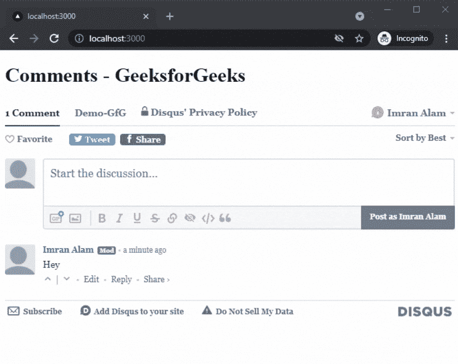

# 在 NextJS

中添加评论区

> 原文:[https://www . geesforgeks . org/add-comment-section-in-nextjs/](https://www.geeksforgeeks.org/add-comment-section-in-nextjs/)

在本文中，我们将学习如何在 NextJs 中添加注释部分。使用评论区，用户可以在你的 NextJs 应用中写下他们的想法和疑问。

NextJS 是一个基于 React 的框架。它有能力为不同的平台开发漂亮的网络应用程序，如视窗、Linux 和 mac。动态路径的链接有助于有条件地呈现您的 NextJS 组件。

**方法:**要添加我们的评论部分，我们将使用 Disqus 平台。Disqus 是一个网络社区平台，被网络上成千上万的网站使用。首先，我们将在 Disqus 平台上创建一个帐户，并安装 Disqus 包，然后我们将创建一个新文件，在其中为注释部分编写代码。然后在我们的主页上，我们将导入我们的评论部分。

**创建 NextJS 应用程序:**您可以使用以下命令创建一个新的 NextJs 项目:

```
npx create-next-app gfg
```

**安装所需的软件包:**现在我们将使用以下命令安装 Disqus 软件包:

```
npm install disqus-react
```

**项目结构:**会是这样的。


**在 Disqus 中创建账户:**接下来我们要在 Disqus 中创建新账户。为此，请遵循以下步骤:

1.前往 [Disqus 官方网站](https://disqus.com/)点击开始。然后点击注册。


2.注册后，点击“我想在我的网站上安装 Disqus”按钮。


3.之后，输入您的网站名称并选择一个类别。


就这样。现在我们准备在我们的 NextJs 应用程序中添加评论部分。

**添加评论区:**现在添加我们的评论区，我们将在 gfg 目录中创建一个名为“components”的新文件夹，在这个文件夹中，我们将创建一个名为**“Comment . js”**的新 javascript 文件。

在我们的 **Comment.js** 文件中添加以下内容:

## java 描述语言

```
import {DiscussionEmbed} from "disqus-react"

const Comments = () => {
  const disqusShortname = "Demo-GfG"

  const disqusConfig = {
    url: "http://localhost:3000",
    identifier:'123', 
    title: "Demo Post" 
  }

  return (
    <div>
      <DiscussionEmbed
        shortname={disqusShortname}
        config={disqusConfig}
      />
    </div>
  )
}

export default Comments;
```

在上面的代码中，我们首先从 disqu-react 导入讨论嵌入。之后，我们创建了一个名为注释的新组件，在这个组件中，我们存储了 disqusShortname。不同常量变量中的网址、标识符和标题。然后我们返回我们的讨论嵌入函数。

现在我们可以将上面的文件导入我们的主页来显示我们的评论区。

在 **index.js** 文件中添加以下内容:

## java 描述语言

```
import React from 'react'
import Comments from '../components/Comment'

export default function Text() {
  return (
    <div>
      <h1>Comments - GeeksforGeeks</h1>
      <Comments/>
    </div>
  )
}
```

现在，当我们运行我们的 NextJs 应用程序时，index.js 文件将充当应用程序的主页。

**运行应用的步骤:**在终端运行下面的命令运行应用。

```
npm run dev
```

### 输出:

