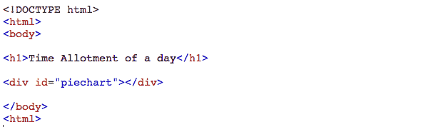
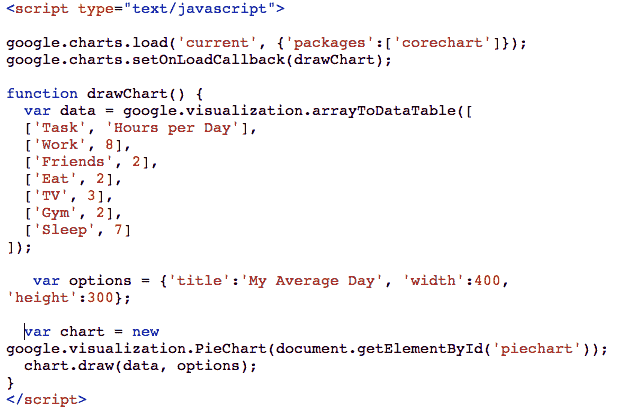
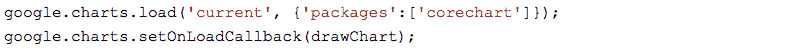
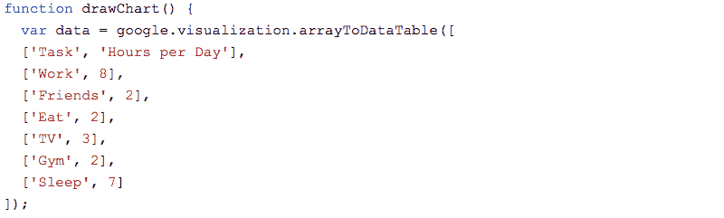
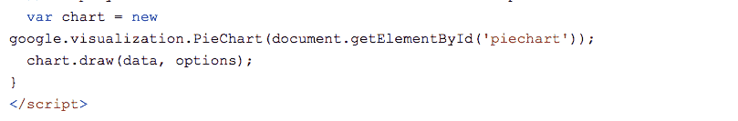
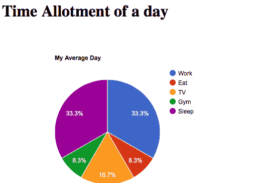
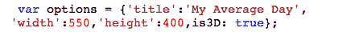
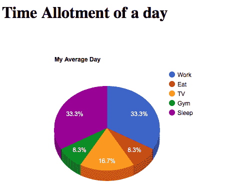

# 如何在网页上添加谷歌图表？

> 原文:[https://www.geeksforgeeks.org/add-google-charts-webpage/](https://www.geeksforgeeks.org/add-google-charts-webpage/)

**什么是饼图？**
饼图(或圆形图)是一种圆形的统计图形，它被分成几个部分来说明数字比例。在饼图中，每个切片的弧长(以及其中心角度和面积)与其所代表的数量成正比。虽然它的名字是因为它与切片的馅饼相似，但它的呈现方式有所不同。

**饼图的应用**

*   饼图通常用于显示企业中不同项目的销售百分比或比例数据。
*   在选举中用来显示每个政党获得的选票百分比。
*   在调查中用于描述每个类别中的项目数量。
*   广泛用于数据库和 excel 表格。

**按照步骤在网页上添加谷歌饼图:**
**第一步:从一个简单的基础网页开始。**
添加一个 id 为“piechart”的“div”元素:


**步骤 2:添加引用**
添加对 google.com 的图表 API 的引用。


**第三步:添加一个 JavaScript 函数**

 ****解释:**下面的代码用于加载 Google charts :

下面的代码用于绘制图表并为每个分部设置用户特定的值:

下面的代码用于显示图表内部的“div”元素，id = " piechart ":

T18】INPUT:**

```html
<!DOCTYPE html>
<html lang="en-US">
<body>

<h1>Time Allotment of a day</h1>

<div id="piechart"></div>

<script type="text/javascript"
 src="https://www.gstatic.com/charts/loader.js"></script>

<script type="text/javascript">
google.charts.load('current', {'packages':['corechart']});
google.charts.setOnLoadCallback(drawChart);

function drawChart() {
  var data = google.visualization.arrayToDataTable([
  ['Task', 'Hours per Day'],
  ['Work', 8],
  ['Eat', 2],
  ['TV', 4],
  ['Gym', 2],
  ['Sleep', 8]
]);
  var options = {'title':'My Average Day', 'width':550, 'height':400};
  var chart =
 new google.visualization.PieChart(document.getElementById('piechart'));
  chart.draw(data, options);
}
</script>

</body>
</html>
```

****输出:**
** 

**要获得 3d 饼图，请将**“is3d”**选项设置为真:

**输入:****

```html
<!DOCTYPE html>
<html lang="en-US">
<body>

<h1>Time Allotment of a day</h1>

<div id="piechart"></div>

<script type="text/javascript" 
src="https://www.gstatic.com/charts/loader.js"></script>

<script type="text/javascript">
google.charts.load('current', {'packages':['corechart']});
google.charts.setOnLoadCallback(drawChart);

function drawChart() {
  var data = google.visualization.arrayToDataTable([
  ['Task', 'Hours per Day'],
  ['Work', 8],
  ['Eat', 2],
  ['TV', 4],
  ['Gym', 2],
  ['Sleep', 8]
]);

  var options = 
   {'title':'My Average Day',  'width':550,'height':400,is3D: true};

  var chart = 
  new google.visualization.PieChart(document.getElementById('piechart'));
  chart.draw(data, options);
}
</script>

</body>
</html>
```

****输出:**
**