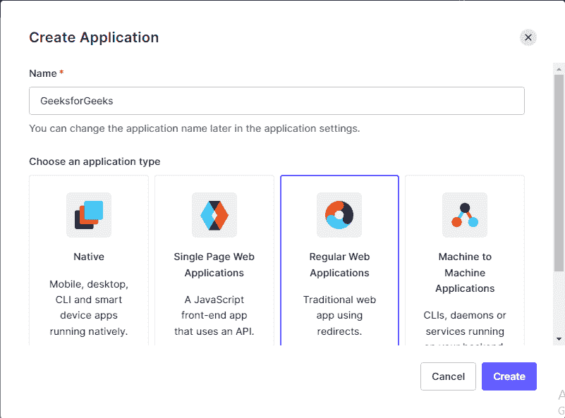
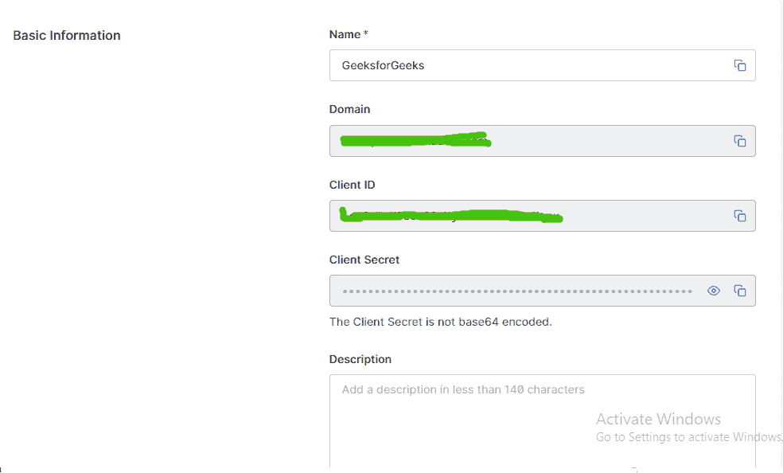
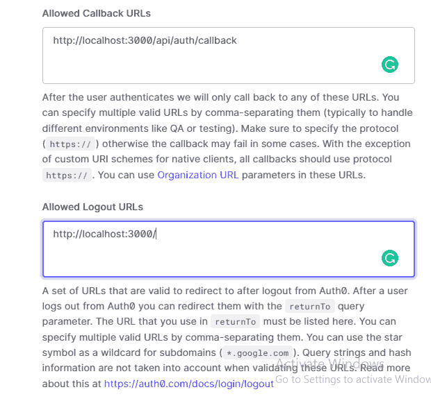
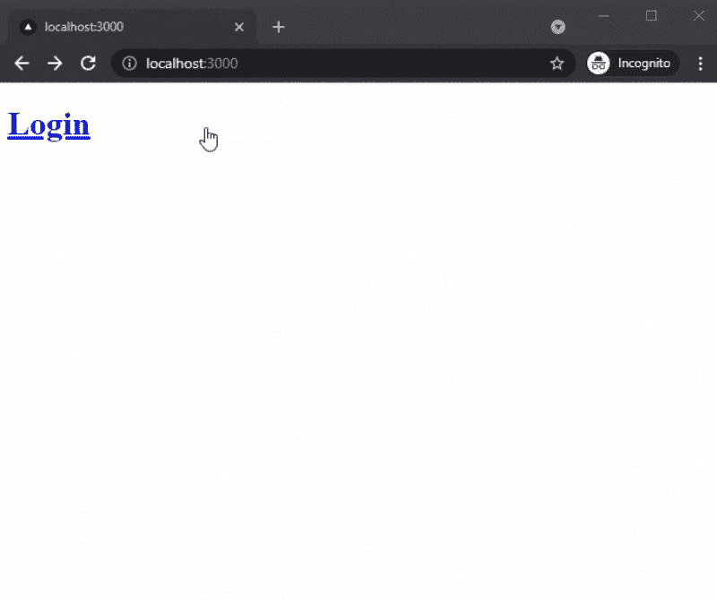

# 使用 Auth0 在 NextJS 中添加用户认证

> 原文:[https://www . geesforgeks . org/add-user-authentication-in-next js-using-auth 0/](https://www.geeksforgeeks.org/adding-user-authentication-in-nextjs-using-auth0/)

在本文中，我们将学习如何使用 Auth0 在我们的 NextJS 项目中添加用户身份验证。NextJS 是一个基于 React 的框架。它有能力为不同的平台开发漂亮的网络应用程序，如视窗、Linux 和 mac。动态路径的链接有助于有条件地呈现您的 NextJS 组件。

**方法:**为了在我们的项目中首先添加使用 auth0 的用户认证，我们将安装 auth0 模块。之后，我们将使用 *[…auth0]创建一个动态文件。js* 名称。然后我们将在每个页面上添加用户提供者。之后，我们将在主页上添加一个登录和注销选项。

**创建下一个应用程序:**

**步骤 1:** 使用以下命令创建一个新的 NextJs 项目:

```
npx create-next-app gfg
```

**项目结构:**会是这样的。


**第二步:**在 auth0 网站创建一个免费账号，创建一个新的应用。



**第三步:**从账户的设置标签中获取你的域、客户端 id 和客户端密钥。



**第四步:**添加回拨和注销网址。回调用户用于登录后重定向用户，注销 URL 用于注销后重定向用户。



**步骤 5:** 现在我们将使用以下命令安装 auth0 模块:

```
npm install @auth0/nextjs-auth0
```

**步骤 6:** 用以下代码创建一个新的*环境本地*文件:

```
AUTH0_SECRET=
  "[A 32 characters secret used to encrypt the cookies]"
AUTH0_BASE_URL="http://localhost:3000"
AUTH0_ISSUER_BASE_URL="YOUR_AUTH0_DOMAIN"
AUTH0_CLIENT_ID="YOUR_AUTH0_CLIENT_ID"
AUTH0_CLIENT_SECRET="YOUR_AUTH0_CLIENT_SECRET"
```

**步骤 7:** 在*页面/api* 目录中创建一个名为 auth 的新文件夹。在这个文件夹中创建一个名为 *[…auth0]的新动态路由文件。js* 并在文件内部添加以下内容。

**文件名:[…auth0]。js**

## java 描述语言

```
import { handleAuth } from '@auth0/nextjs-auth0';

export default handleAuth();
```

**第 8 步:**现在我们必须在每个页面上添加 auth0 的 UserProvider。为此，我们将用以下内容更改 *_app.js* 文件的内容。

**文件名:_app.js**

## java 描述语言

```
import React from 'react';
import { UserProvider } from '@auth0/nextjs-auth0';

export default function App({ Component, pageProps }) {
  return (
    <UserProvider>
      <Component {...pageProps} />
    </UserProvider>
  );
}
```

**第九步:**现在我们将在主页上添加登录和注销按钮。为此，在 index.js 文件中添加以下几行。

**文件名:index.js**

## java 描述语言

```
import { useUser } from "@auth0/nextjs-auth0";

export default function Login(){
 const { user, error, isLoading } = useUser()

 if (user) {
   return (
     <div>
       <h2>Hey {user.name}, You are logged in</h2>
       <a href="/api/auth/logout"><h1>Logout</h1></a>
     </div>
   );
 }
 return <a href="/api/auth/login"><h1>Login</h1></a>;
};
```

**运行应用程序的步骤:**之后，使用以下命令运行应用程序:

```
npm run dev
```

**输出:**

