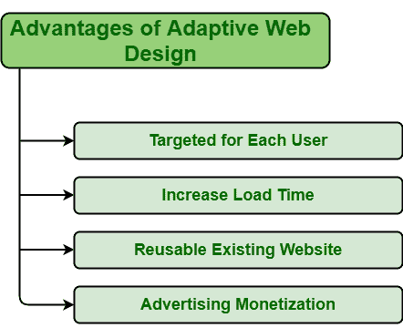
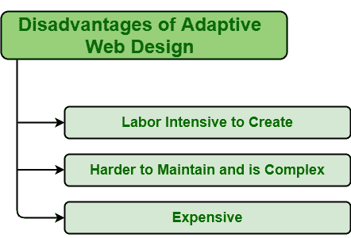

# 自适应网页设计的优缺点

> 原文:[https://www . geeksforgeeks . org/自适应网页设计的优缺点/](https://www.geeksforgeeks.org/advantages-and-disadvantages-of-adaptive-web-design/)

自适应网页设计是特别开发的，以适应浏览器或屏幕的大小。在自适应网页设计中，创建不同的网站布局以最适合不同设备的特定屏幕尺寸。

网站基本上一般会创建两个版本，一个是小屏即移动版创建，一个是大屏即桌面版创建。移动版本用于智能手机、平板电脑等。，而台式机版本则用于笔记本电脑、台式机。网站或服务器检测设备屏幕的大小，然后选择最适合设备屏幕的网站布局。

选择正确的网站设计会带来更好的业绩和积极的结果，因为不同的业务有不同的需求和要求。因此，在选择任何网页设计之前，确定你的需求是什么，网页设计是否有益。

适应性网页设计有几个优点和缺点，有助于决策。其中一些如下:

#### 优势

*   **针对每个用户:**自适应网页设计为不同的设备创建不同版本的网站，以增加单个设备的用户体验。在每台设备上，用户都应该有积极的体验。在这种网页设计中，用户可以定制和更改页面内容、布局以最适合屏幕并改善用户体验。

*   **增加加载时间:**自适应网页设计为不同的设备创建不同的布局，并显示最适合特定网站的功能。每当用户在他们的设备上加载网站时，最适合设备屏幕的布局就会被加载。随着流量的减少，这将提高装载速度。甚至，服务器检测设备大小，然后提供最适合设备屏幕的布局。只有在检测到高密度屏幕时，它才能提供高分辨率图形。

*   **可重用的现有网站:**一些复杂的网站是使用遗留代码开发的，即使用过时技术编写的源代码，或者不再受支持且不可理解。自适应网站对于不同的设备有不同的布局版本。因此，如果一个人想改变或更新某些东西，那么他们不需要回到画板，并再次从起点重新编码现有的网站。

*   **广告货币化:**用广告货币化网站，只会带来更多的钱，给更多的赚钱机会。自适应网站是优化广告选项的最佳方式，因为自适应网站被设计为最适合在其上观看的设备。不需要改变或替换横幅、图片等的比例。，因为较小版本的网站可用，所以较小的分辨率在屏幕上显示效果最好。

#### 不足之处

*   **劳动密集型创造:**适应性网页设计不容易创造。这需要很强的思维能力和更多的劳动来创造。自适应网页设计需要更多的时间和精力，因为不同的网站布局被创建为最适合屏幕。不同的网站布局意味着不同的 html 代码，代码越多，开发代码的工作量就越大。

*   **较难维护且复杂:**适应性网站不容易维护，因为不容易将所有网站版本维护在同一级别。一个人必须随时更新和维护每个版本的网站。

*   **昂贵:**自适应网页设计是劳动密集型的，即需要更多的开发人员或劳动力来创建它，并且还需要大量的预算来处理复杂性。自适应设计既复杂又复杂，因此成本很高。建造和维护成本更高。