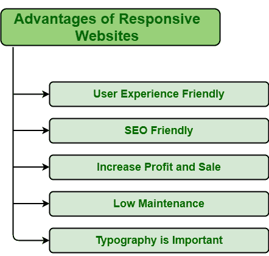
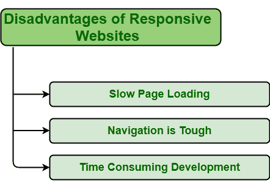

# 响应式网页设计的优缺点

> 原文:[https://www . geeksforgeeks . org/响应式网页设计的优缺点/](https://www.geeksforgeeks.org/advantages-and-disadvantages-of-responsive-web-design/)

今天的这一代人生活在一个一切都在快速变化的世界里，技术每天都在进步和变化，企业也在广泛扩张和增长。人们通常会尽最大努力扩大、保持、提高规模、知名度、增加品牌价值，并从其他竞争对手那里抢得先机。该网站在促进业务增长方面发挥着重要作用。网站是吸引更多客户或观众的最佳方式，进而提升用户体验。现在，人们大多用手机浏览网站，因为它携带方便。因此，建立一个不仅在台式机或笔记本电脑上好看，而且在手机和平板电脑上也好看的网站是非常必要的。这就是响应性网页设计的来源。响应式网页设计基本上是设计一个网站，它不仅在桌面上看起来很好，而且可以根据屏幕大小调整自己的大小。它不仅看起来不错，适合屏幕大小，而且内容和其他元素的质量也得到保持，增加了用户体验。因此，开发一个响应性的网站或将网站转换为响应性的网站至关重要。但是并不是所有的网站都要转换成响应性的。每个企业都有不同的需求和要求。因此，在选择任何网页设计之前，确定你的需求是什么，网页设计是否有益。有几个优点和缺点的反应网页设计，可以帮助决策。其中一些如下:

#### 优势

*   **用户体验友好:**响应式网页设计是专门根据客户或用户的行为及其需求，根据屏幕大小等进行响应。它用于创建一个网站，平滑地调整到不同的屏幕尺寸，特别是移动观看。因此，它增加了手机、平板电脑等小型设备对客户和用户的影响。
*   **SEO 友好:**有响应的网站一般负责在 SEO(搜索引擎优化)排名靠前。在移动设备或小型设备上，响应性网站的加载速度比台式机或笔记本电脑快得多。这自动增加了积极的用户体验，进而在搜索引擎优化上给网站一个更高的排名。
*   **增加利润和销量:**响应性网页设计易于创建，实施速度更快。这是因为小型设备不需要另一个网站。一个响应迅速的网站是专门为适应所有屏幕尺寸而设计的。因此，可以节省与为小型设备创建另一个网站相关的时间、精力、维护成本和开发成本。它通常会提高用户体验，并通过小设备接触更多受众。更多的将是观众，更多的将是利润和销售。
*   **低维护:**响应式网站设计适合所有屏幕尺寸。内容和其他元素没有变化，以适应不同的设备。该网站在所有设备上使用相同的内容。只有一个网站适合所有屏幕尺寸，因此维护两个网站的成本也得以节省，因为为一个小设备维护一个单独的网站需要大量的测试和支持。管理单个网站需要更少的维护、更少的成本、节省时间等。
*   **易追踪用户:**响应性网站加载时间更少，省时省钱，省去了为小设备创建另一个网站的开发工作。人们可以利用这些时间和精力来跟踪他们的网站访问者。

#### 不足之处

*   **页面加载慢:**虽然，有响应的网站很容易维护，但有时加载页面需要很长时间。它包括一些高分辨率的图像和视频，有时需要大量的时间来加载。
*   **导航很难:**响应式网站是专门为适应小型设备而设计的。但是为小设备维护大型网站的简单性有时变得很困难。这是因为小设备的屏幕尺寸较小，这又使得通过小设备浏览网站变得更加困难。
*   **耗时的开发:**响应性网站必不可少，但与普通网站的开发时间相比，开发过程需要花费大量时间。