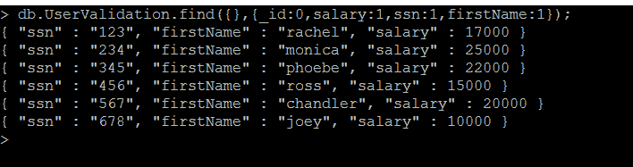
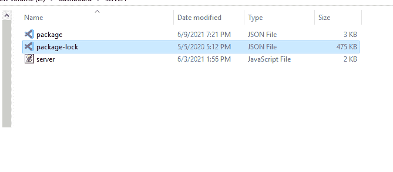
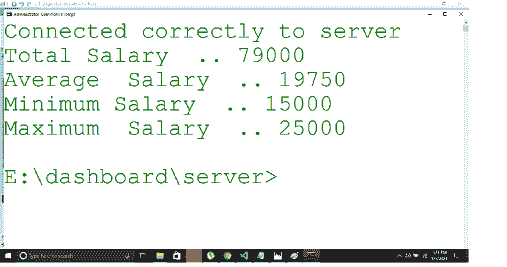

# 聚合查询

> 原文:[https://www.geeksforgeeks.org/aggregate-queries/](https://www.geeksforgeeks.org/aggregate-queries/)

MongoDB 是一个 NoSQL 文档模型数据库，主要用于选举投票结果、一个行业过去几年的增长等大数据分析。，为了进行巨大的计算，在 MongoDB 中，我们使用聚合。

聚合将来自多个文档的数据分组，并提供汇总结果、大型结果集的平均值、大型结果集的最小值/最大值等。在本文中，让我们看看如何使用 Mongoose 执行聚合。

**模块安装:**使用以下命令安装所需的模块。

```html
npm install mongoose
```

**数据库:**以下是 MongoDB 数据库集合中的样本数据。

```html
Database Name: UserDB
Collection Name: UserValidation
```

下图显示了文档在其中的存在。具体单拿 *ssn* 和薪资栏目来说。

```html
db.UserValidation.find({},{_id:0,salary:1,ssn:1,firstName:1});
```



“用户验证”集合中存在数据

**项目结构:**会是这样的。



**例 1:薪资值的总和。**

**语法:**当我们对字段求和时，我们需要一个分组操作($group)，后跟求和($sum)，如下所示。

```html
db.UserValidation.aggregate([  
 {  
   $group: {
     _id: null,  
     salarycount: {
       $sum: "$salary"
     }
   }
 }
]); 
```

**文件名:server.js**

## java 描述语言

```html
// Requiring module
const mongoose = require("mongoose");

// Assumption is in our local, we have "UserDB" 
// named mongoDB database available
mongoose.connect(
    "mongodb://localhost:27017/UserDB",
    function (err, db) {

        console.log("Connected correctly to server");

        // "UserValidation" named collection 
        // available and each document contains
        // "salary" named column
        var col = db.collection('UserValidation');

        // By applying aggregate functionality,
        // finding the summation of salary and 
        // the result is in "summedUpDocument"
        col.aggregate([{
            $group:
                { _id: null, total: { $sum: '$salary' } }
        }]).toArray(function (err, summedUpDocument) {

            // Summed up salary value can be printed
            // as like below
            console.log(summedUpDocument[0].total)
            db.close();
        })
    });
```

**运行程序的步骤:**使用以下命令运行服务器。

```html
node server.js
```

**输出:**


**例 2:** 计算基于位置的员工工资总和。

**语法:**为了提供额外的过滤条件，我们可以使用$match 运算符。

```html
db.UserValidation.aggregate([
{  
  $match: {
    address: {
      $eq: "Chennai"
    }
  }
},        
{  
  $group: {
    _id: null,  
    salarycount: {
      $sum: "$salary"
    }
  }
}]);  
```

这里我们匹配*地址*列，只有*钦奈*。因此，与地址*钦奈*的值相匹配的任何文件仅被汇总。

**文件名:server.js**

## java 描述语言

```html
// Requiring module
const mongoose = require("mongoose");

// Assumption is in our local, we have
// "UserDB" named mongoDB database
// available
mongoose.connect(
    "mongodb://localhost:27017/UserDB",
    function (err, db) {

        console.log("Connected correctly to server");

        // "UserValidation" named collection 
        // available and each document contains
        // "salary" named column
        var col = db.collection('UserValidation');

        // By applying aggregate functionality, 
        // finding the summation of salary 
        // Here applied match condition where 
        // matching address equal to 
        // Chennai and result will be in 
        // summedUpDocumentForChennai
        col.aggregate([
            { $match: { address: { $eq: "Chennai" } } },
            {
                $group:
                    { _id: null, total: { $sum: '$salary' } }
            }
        ]).toArray(function (err, summedUpDocumentForChennai) {

            // Summed up salary value can be printed
            // as like below
            console.log(summedUpDocumentForChennai[0].total)
            db.close();
        })
    });
```

**运行程序的步骤:**使用以下命令运行服务器。

```html
node server.js
```

**输出:**


**示例 3:** 获取平均值/最小值/最大值

**语法:**我们需要使用以下语法将平均功能用于平均/最小功能，将最小/最大功能用于最大功能。

```html
db.UserValidation.aggregate([{
    $match: { address: { $eq: "Chennai" } }
    },
    {
        $group: {
            _id: null,
            totalSalary: { $sum: "$salary" },
            averageSalary: { $avg: "$salary" },
            minimumSalary: { $min: "$salary" },
            maximumSalary: { $max: "$salary" }
        }
    }
])
```

**文件名:server.js**

## java 描述语言

```html
// Requiring module
const mongoose = require("mongoose");

// Assumption is in our local, we have
// "UserDB" named mongoDB database 
// available
mongoose.connect(
    "mongodb://localhost:27017/UserDB", 
    function (err, db) {

    console.log("Connected correctly to server");

    // "UserValidation" named collection
    // available and each document contains
    // "salary" named column
    var col = db.collection('UserValidation');

    // By applying aggregate functionality,
    // finding the summation of salary 
    // Here applied match condition where
    // matching address equal to Chennai 
    // We are calculating total, average,
    // minimum and maximum amount
    col.aggregate([
        { $match: { address: { $eq: "Chennai" } } },
        {
            $group:
            {
                _id: null, totalSalary: { $sum: "$salary" },
                averageSalary: { $avg: "$salary" },
                minimumSalary: { $min: "$salary" },
                maximumSalary: { $max: "$salary" }
            }
        }
    ]).toArray(function (err, projectFunctionality) {
        console.log("Total Salary  ..", 
            projectFunctionality[0].totalSalary)

        console.log("Average  Salary  ..", 
            projectFunctionality[0].averageSalary)

        console.log("Minimum Salary  ..", 
            projectFunctionality[0].minimumSalary)

        console.log("Maximum  Salary  ..", 
            projectFunctionality[0].maximumSalary)
        db.close();
    })
});
```

**运行程序的步骤:**使用以下命令运行服务器。

```html
node server.js
```

**输出:**



**注意:**默认情况下，输出文档将使用 _id 字段。我们可以使用 1 在输出文档中包含一个字段，使用 0 隐藏。

**结论:**聚合查询非常强大，它们的功能类似于 SQL 中的*按*子句分组(即$group)和*具有*功能(即$match)。MongoDB 是一个强大得多的 NoSQL documentum 类型的数据库，聚合查询在其中起着至关重要的作用。

**参考文献:**T2】https://docs.mongodb.com/manual/aggregation/