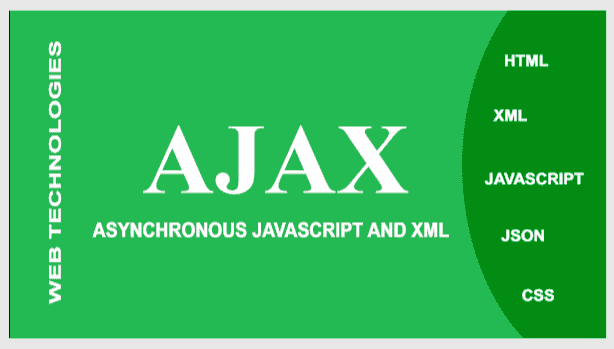

# AJAX 完整形式

> 原文:[https://www.geeksforgeeks.org/ajax-full-form/](https://www.geeksforgeeks.org/ajax-full-form/)

[](https://media.geeksforgeeks.org/wp-content/uploads/20200610193715/AJAX.png)

[**AJAX**](https://www.geeksforgeeks.org/ajax-introduction/) 是**异步 JavaScript 和 XML** 的缩写。AJAX 是一种技术，而不是编程语言，开发人员使用它来使网站像桌面应用程序一样运行。它在客户端运行，用于创建异步 web 应用程序。AJAX 是一组使用多种网络技术来创建一套网络开发技术的技术。

AJAX 允许通过在后台与 web 服务器交换数据来逐个更新多个网页。这意味着网页的一部分可以被更新，而不需要一次又一次地刷新整个页面。

让我们以 **facebook** 页面为例，在 **facebook** 新闻提要中，当我们按下喜欢、喜爱等按钮或评论任何图片时，它会简单地喜欢、喜爱该图片，而无需重新加载整个页面。而在此之前，当我们点击 like 按钮时，它会重新加载整个页面。这种改变是因为 AJAX，即 AJAX 允许网页的一部分被更新，而不干扰整个页面。

AJAX 使用以下两者的混合:

*   **XMLHttpRequest 对象:**为了从网络服务器请求数据，ajax 使用了一个内置的 **XMLHttpRequest** 对象。
*   **JavaScript 和 HTML DOM:** 为了显示或使用数据，ajax 使用 [**JavaScript**](https://www.geeksforgeeks.org/javascript-tutorial/) 和 [**HTML DOM**](https://www.geeksforgeeks.org/html-dom-html-object/) 。

**AJAX 涉及的技术有:**

*   **HTML–**在客户端使用。
*   **JavaScript–**用于发出请求。
*   **CSS–**客户端也使用。
*   **XML–**它只是一种请求格式。
*   **JSON–**也是一种请求格式。
*   **PHP–**在服务器端使用。

**Ajax 的历史:**

*   **20 世纪 90 年代初:**在这个时期，大多数网站都是基于完整的 HTML 页面。无论何时进行任何更改，都必须通过重新加载页面来完成这些更改，尽管更改很少，但所有内容都必须重新加载，这使得带宽成为一个限制因素。
*   **1996:**IE 推出的 [**iframe 标签**](https://www.geeksforgeeks.org/html-iframes/)；像 object 元素一样，它可以异步加载或获取内容。
*   **1998 年:**微软 outlook web access 团队开发了 **XMLHttpRequest** 脚本对象背后的概念。
*   **2000 :** 后台 **HTTP 请求**和异步 web 技术的效用一直相当模糊，直到它开始出现在 Outlook Web Access 等大规模在线应用程序中。
*   **2004 & 2005 :** 谷歌在 2004 年用 Gmail 和 2005 年用谷歌地图广泛部署了符合标准的跨浏览器 AJAX。
*   **2005 年 2 月 18 日:**2005 年 2 月 18 日，*杰西·詹姆斯·加莱特*在一篇名为

> **AJAX:** 一种新的网络应用方法，基于谷歌页面上使用的技术。

**Ajax 的特点:**

*   **在 AJAX 中，网页充当应用程序:** AJAX 比 HTML 更重要，因为它们充当桌面应用程序。AJAX 与后端服务器交互没有任何麻烦，它们比 HTML 更具响应性。
*   **数据存储在服务器上不同于页面:**在 HTML 中，当用户向服务器发送动态数据时，服务器将整个 HTML 页面转换为客户端可读的格式。在 AJAX 中，不需要进行上述过程，因为 AJAX 服务器不必转换所有的页面，它直接接收数据并将其发送到客户端。在 AJAX 中，服务器处理数据，而不是页面。
*   **提供持续动态的用户体验:**用户无需刷新页面，即可与页面交互，同时存储数据。在其他情况下，我们必须等待响应被处理并获得结果，但是在 AJAX 的情况下，我们获得了同步响应。我们可以用 AJAX 执行多个任务，因为它提供了非线性工作流。

**Ajax 结构:**

```
function geeksforgeeks(str) 
{
  var gfg=new XMLHttpRequest();
  gfg.open("get","url?name_you_want_to_Send="+str,true);
  gfg.send();
  gfg.onreadystatechange=function gfg1() 
  {
     // if true means reaponse is arrived
     if(gfg.readyState==4 && gfg.status==200)          
     {
            document.getElementById("name").innerHTML=
            gfg.responseText;
     }
  }
}
```

**Ajax 的优势:**

*   AJAX 的响应时间很长，因此它提高了速度和性能。
*   AJAX 支持很多浏览器。
*   一些复杂的 AJAX 应用程序给人的感觉是我们正在桌面上使用它。
*   服务器和客户端之间的时间要求较低。
*   AJAX 允许同时执行多个任务。

**Ajax 的缺点:**

*   我们在 AJAX 中面临浏览器兼容性问题。
*   如果用户禁用了 JavaScript，那么这些用户就不能使用 AJAX，因为 AJAX 需要启用 JavaScript。
*   像谷歌这样的各种搜索引擎都不能索引 AJAX 页面。
*   我们不能为 AJAX 更新的页面内容添加书签。
*   由于数据可以从客户端下载，因此 AJAX 不太安全。