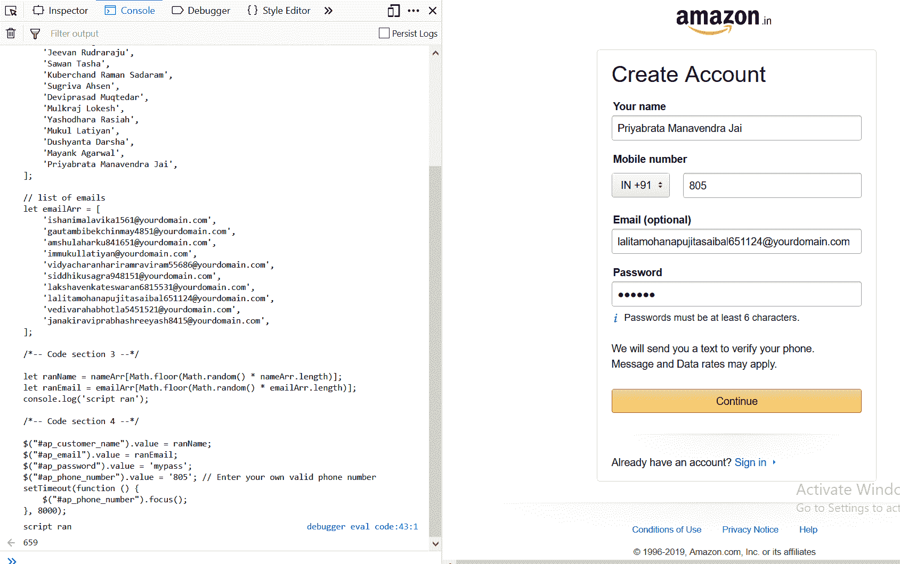

# 亚马逊自动注册脚本

> 原文:[https://www.geeksforgeeks.org/amazon-auto-signup-script/](https://www.geeksforgeeks.org/amazon-auto-signup-script/)

脚本非常强大，因为它们给了我们不同的功能，我们可以用它们来操作网络应用程序和网站。作为最流行的脚本语言，Javascript 也具有这些特性，我们可以利用它们来操纵网站和网络应用程序的内容。在本文中，我们将使用简单的 javascript 代码(脚本)，这将允许我们填写亚马逊注册表单，而无需手动填写细节。我们将使用 JQuery，这是一个 javascript 库，通过它 DOM(文档对象模型)操作变得更加容易。

**第一步:**

转到链接: [**【亚马逊-注册】**](https://ocul.in/amazonsignup) ，将下面给出的 javascript 代码粘贴到开发者工具控制台窗口。
**注意:**要在开发者工具中打开 javascript 控制台，请在 windows 上按 *Ctrl+Shift+k* 或在 mac 上按 *Command+Option+K* 。

**工作原理:**

下面给出的代码将自动化亚马逊注册的过程，一旦你把它放入网络控制台，所有的值，如姓名，电子邮件被自动从代码中挑选，然后你可以手动编辑电话号码部分，然后密码类似。

## java 描述语言

```html
/*-- Code section 1 --*/

javascript: var fileref = document.createElement('script');
fileref.setAttribute("type", "text/javascript");
fileref.setAttribute("src", "https://ajax.googleapis.com/ajax/libs/jquery/1.12.0/jquery.min.js");
document.body.appendChild(fileref);

/*-- Code section 2 --*/

// list of names
let nameArr = [
    'Jeevan Rudraraju',
    'Sawan Tasha',
    'Kuberchand Raman Sadaram',
    'Sugriva Ahsen',
    'Deviprasad Muqtedar',
    'Mulkraj Lokesh',
    'Yashodhara Rasiah',
    'Mukul Latiyan',
    'Dushyanta Darsha',
    'Mayank Agarwal',
    'Priyabrata Manavendra Jai',
];

// list of emails
let emailArr = [
    'ishanimalavika1561@yourdomain.com',
    'gautambibekchinmay4851@yourdomain.com',
    'amshulaharku841651@yourdomain.com',
    'immukullatiyan@yourdomain.com',
    'vidyacharanhariramraviram55686@yourdomain.com',
    'siddhikusagra948151@yourdomain.com',
    'lakshavenkateswaran6815531@yourdomain.com',
    'lalitamohanapujitasaibal651124@yourdomain.com',
    'vedivarahabhotla5451521@yourdomain.com',
    'janakiraviprabhashreeyash8415@yourdomain.com',
];

/*-- Code section 3 --*/

let ranName = nameArr[Math.floor(Math.random() * nameArr.length)];
let ranEmail = emailArr[Math.floor(Math.random() * emailArr.length)];
console.log('script ran');

/*-- Code section 4 --*/

$("#ap_customer_name").value = ranName;
$("#ap_email").value = ranEmail;
$("#ap_password").value = 'mypass';
$("#ap_phone_number").value = '805'; // Enter your own valid phone number
setTimeout(function () {
    $("#ap_phone_number").focus();
}, 8000);
```

**说明:**

上面的代码分为四个部分(1-4)，每个部分做不同的事情。
**第一节:**
第一节是关于创建一个我们称之为“脚本”的 DOM 元素，然后使用 DOM setAttribute()方法设置这个元素的“类型”和“src”，该方法将特定的属性添加到一个元素中，并给它指定的值。这个元素基本上就是我们试图运行的脚本(jQuery 代码)，在这一节的最后一行，我们将这个元素追加到 DOM 主体中。
**第二部分:**
第二个代码部分包含两个数组‘namerer’和‘emailArr’，其中包含几个名称和电子邮件，我们可以对其进行迭代并从中随机选择值。这些随机选择的魔术发生在代码部分 3，而分配给 DOM 发生在代码部分 4。
**第 3 节:**
在这一节中，我们使用了数学对象在 javascript 中提供的 Math.floor()和 Math.random()方法。Math.random()方法用于从数组中返回随机数或元素，请注意，我们将它乘以数组长度，以便它覆盖整个数组。然后我们使用数学. floor()方法进行舍入。然后，我们将获得的值赋给一个变量，稍后我们将该变量传递给最终将被插入到表单中的 DOM 元素。
**第 4 节:**
在最后一个代码节中，我们基本上是在为使用 JQuery“{ content }”提取的 DOM 元素赋值；符号，它需要一个选择器，然后对它执行一些操作。这里我们只是选择和赋值，最后是 setTimeout()方法。

**输出:**

