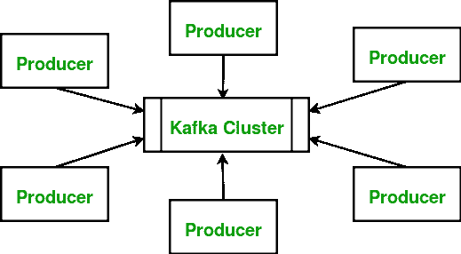
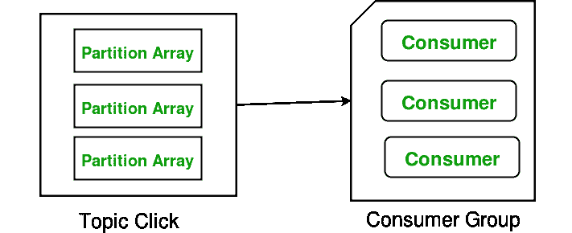

# 阿帕奇卡夫卡|简介

> 哎哎哎:# t0]https://www . geeksforgeeks . org/Apache-Kaka/

Apache Kafka 是一个发布-订阅消息系统。消息系统允许您在进程、应用程序和服务器之间发送消息。广义地说，Apache Kafka 是一个可以定义主题(一个主题可能是一个类别)并进一步处理的软件。应用程序可能会连接到此系统，并将消息传递到主题上。消息可以包括任何类型的信息，来自您个人博客上的任何事件，也可以是触发任何其他事件的非常简单的文本消息。

**卡夫卡经纪人**

kafka 集群通常由一个或多个服务器(称为 Kafka 代理)组成，这些服务器在其上运行 Kafka。**生产者**是将数据(通过触发器推送消息)发布到指定代理内的卡夫卡主题的过程。话题的消费者从卡夫卡的话题中提取信息。

**卡夫卡话题:**话题基本上是在操作过程中存储和发布消息的类别或提要名称。消息大多是字节数组，可以以任何格式存储任何对象。是的，这是卡夫卡最好的地方。任何对象都可以存储为字节数组。此外，正如我们之前讨论的，所有卡夫卡的信息都被组织成主题。如果你想发送一条消息，你就把它发送到一个特定的主题，如果你想阅读一条消息，你就从一个特定的主题阅读它。
**消费者和消费者群体:**消费者总是可以从特定的偏移量开始读取消息，并被允许从他们选择的任何偏移量点进行读取。这允许消费者在任何时间点加入集群。这使得功能和工作非常顺利。
**分区允许您通过将特定主题中的数据拆分到多个代理来并行处理一个主题。**

**阿帕奇卡夫卡和重要服务器概念**

*   **主题分区** : Kafka 主题分为多个分区，可以让你跨多个经纪人拆分数据。
*   **消费群**:消费群包括订阅特定主题的一组消费流程。
*   **节点**:节点是 Apache Kafka 集群中的单台计算机。
*   **副本:**分区的副本是分区的“备份”。副本从不读取或写入数据。它们用于防止数据丢失。
*   **生产者**:发送消息的应用程序。
*   **消费者**:接收消息的应用。

**实时应用程序**

*   **推特**:注册用户可以阅读和发布推文，未注册用户只能阅读推文。推特使用暴风卡夫卡作为他们的流处理基础设施的一部分。
*   **LinkedIn** : Apache Kafka 在 LinkedIn 用于活动流数据和运营指标。Kafka 消息系统帮助 LinkedIn 使用各种产品，如 LinkedIn Newsfeed、LinkedIn Today，用于在线消息消费，此外还有 Hadoop 等离线分析系统。
*   **网飞**:网飞是一家美国的按需互联网流媒体跨国提供商。网飞使用卡夫卡进行实时监控和事件处理。
*   **Box** :在 Box，Kafka 用于生产分析管道&实时监控基础设施。

**参考文献**:

[卡夫卡官方](https://kafka.apache.org/)T2[维基](https://en.wikipedia.org/wiki/Apache_Kafka)

本文由 **[阿育什·维尔马](http://geekyayush.com/)** 供稿。如果你喜欢 GeeksforGeeks 并想投稿，你也可以使用[contribute.geeksforgeeks.org](http://www.contribute.geeksforgeeks.org)写一篇文章或者把你的文章邮寄到 contribute@geeksforgeeks.org。看到你的文章出现在极客博客主页上，帮助其他极客。

如果你发现任何不正确的地方，或者你想分享更多关于上面讨论的话题的信息，请写评论。