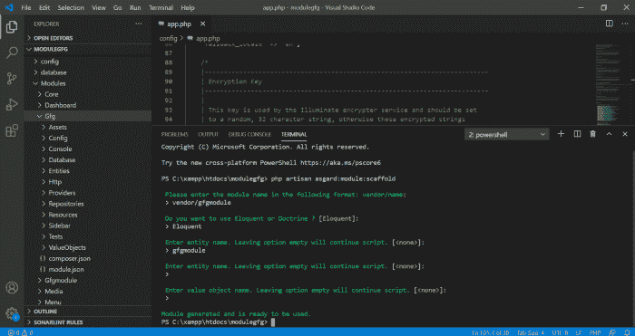
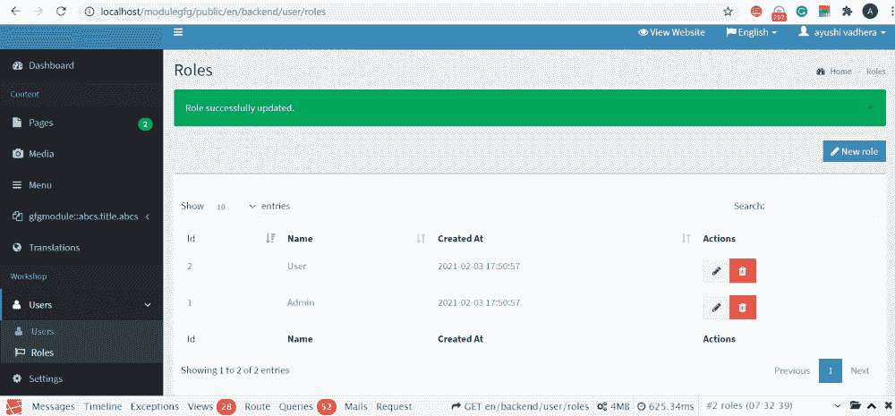
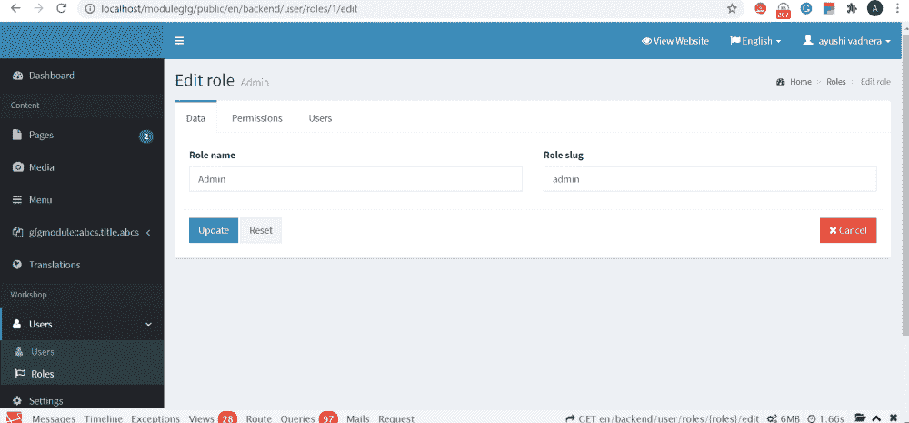
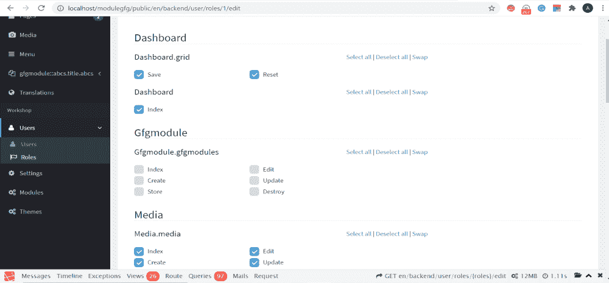
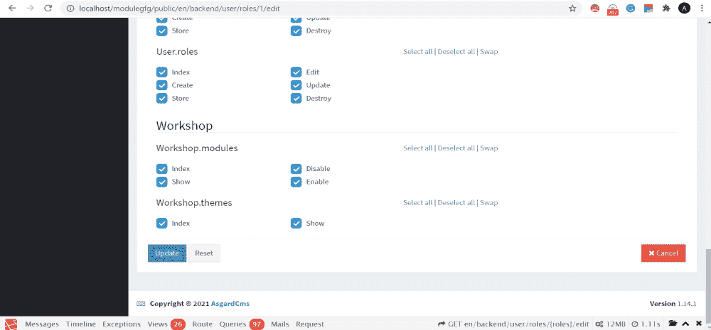

# 阿斯加德 CMS–模块的引入和生成

> 原文:[https://www . geesforgeks . org/asgardcms-模块介绍和生成/](https://www.geeksforgeeks.org/asgardcms-introduction-and-generation-of-modules/)

AsgardCMS 为我们提供了在应用程序中添加现有模块之外的新模块的功能。我们可以根据项目的需要和需求增加一个新模块。有时，我们的项目需要添加各种模块。例如，如果你正在从事一个保险项目，那么我们需要有诸如客户、保险、设施等模块，其中每个模块都涵盖一些特定的兴趣领域。

模块架子工是一个命令，它有助于在很短的时间内生成所需的模块，让开发人员可以轻松地完成工作。

为了生成一个新模块，您需要在转到项目文件夹后将以下命令放入 CMD:

> php artisan asgard:模块:脚手架

输入该命令后，系统会询问一些与所需模块相关的问题。提出的问题有:

1.  **模块名称是什么？**

    以**供应商/模块名称**的格式提及模块。命名模块时不应使用破折号。

2.  **你想用教义还是雄辩？**

    **原则**仅使用旧的 PHP 结构，而**雄辩的**具有对象-关系-映射的 ORM 概念。这告诉开发人员希望生成什么类型的实体。您可以根据您的项目需求在两者之间进行选择。我的项目需要 ORM 的逻辑，所以我选择了同样的雄辩。

3.  **Enter your desired entities**

    您可以输入所有必需的实体。它们的数量可以是 N，你可以全部提及。如果您将它留空，将生成上述实体，下一个问题将出现在屏幕上。

4.  **输入你想要的数值对象**

    根据开发需求，可以输入所有需要的对象。在不需要值对象的情况下，可以将它留空来跳过这一步。一旦回答了这些问题，模块就生成了。参考下面的截图，了解模块创建是如何工作的。

创建新模块 gfgmodule

默认情况下，生成的新模块没有权限，所以我们必须通过转到页面上的用户部分来授予它权限。

为了给新模块提供权限，您必须登录到您的 asgardCMS 项目。您可以参考本文了解如何登录到项目。 [阿斯加德 CmS–查看创建的项目和框架](https://www.geeksforgeeks.org/asgardcms-viewing-the-created-project-and-the-framework/)

提供权限的步骤是:

1.  登录后，单击页面上的用户部分。

    

    开发网页

2.  选择角色下拉列表

3.  选择管理超链接

4.  从标题菜单中选择权限

    

    管理页面

5.  选择新模块的所有权限。

    

    权限

    

    添加了新模块的权限。

最后，创建新模块。