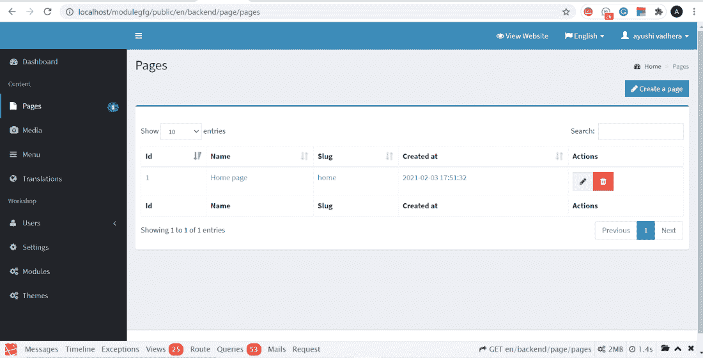
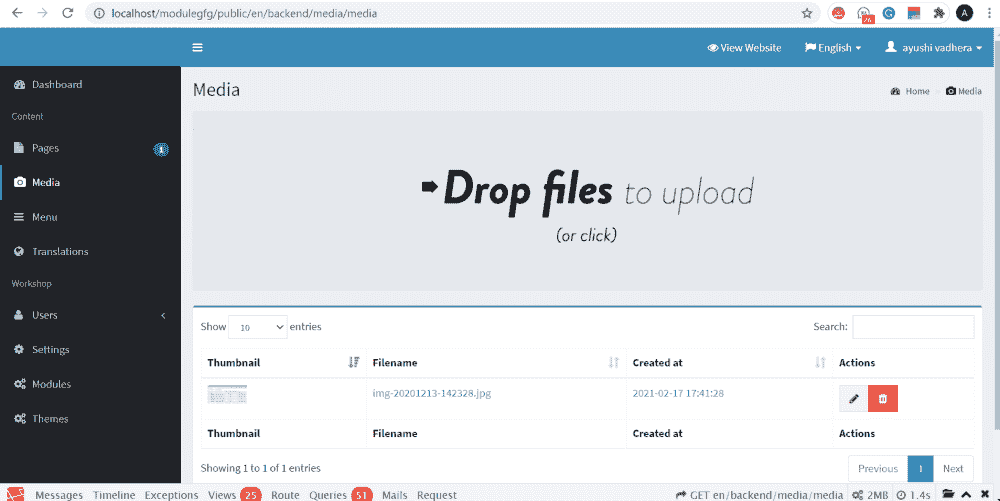
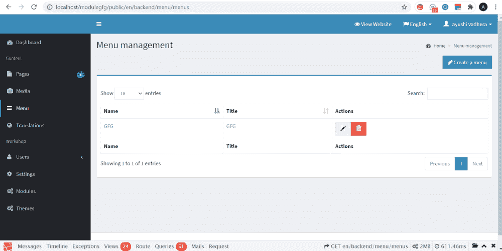
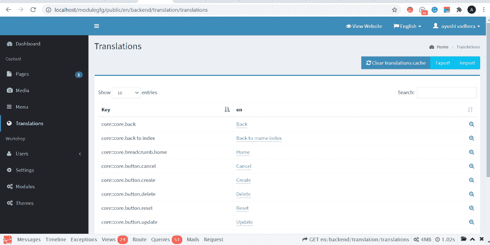

# 阿斯加德 CMS–内置和即用模块介绍

> 原文:[https://www . geesforgeks . org/asgardcms-内置即用模块介绍/](https://www.geeksforgeeks.org/asgardcms-introduction-of-in-built-and-ready-to-use-modules/)

当我们谈论 AsgardCMS 时，很明显，它是一个框架，通过为项目提供基本的架构，为开发人员提供了便利。如果我们创建一个新的 AsgardCMS 项目，会自动创建各种内置模块。

我们可以在项目的模块文件夹中查看所有这些模块，也可以在本地主机服务器上登录到项目后查看它们。

内置和即用模块及其功能包括:

*   **页面管理:**包含我们项目中页面的信息。因为在项目开始时，我们默认只有一个页面被命名为主页。我们可以直接编辑或删除项目中的任何页面。下面是一个截图，展示了页面模块的外观，以及我们如何编辑或删除模块。

页面管理模块

*   **媒体模块:**是一个帮助直接上传媒体文件的媒体管理模块，上传文件不需要制作具体的代码。巴布亚新几内亚。jpeg 等文件夹。如果你想上传一个不太常见类型的文件。csv 文件，您必须创建自己的代码。因此，该模块为用户提供了基本功能和概述，并使开发变得容易。

媒体模块

*   **菜单模块:**该模块帮助创建菜单，如主菜单、页脚菜单等，这有助于增强前端布局，并使在特定页面上查找所有内容更加用户友好。您可以将菜单项链接到新页面，也可以在其中包含更多子菜单。通过这个模块，可以管理多个菜单，排列它们的顺序，并为其他页面提供超链接。

菜单模块

*   **翻译模块:**如果您的项目需要涵盖多种语言，翻译模块将有助于理解和提供多种语言的类似内容。在 AsgardCMS 中，添加新的翻译和更新现有的翻译变得很容易。我们可以通过后端图形用户界面轻松管理翻译。如果我们需要翻译，我们可以将 translation-gui 设置为 true，然后它也将开始在该上下文中实现。如果不需要翻译，我们可能会删除翻译文件，以减少项目的大小。它包含了所有 AsgardCms 模块的翻译文件。

翻译模块