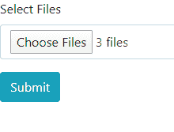
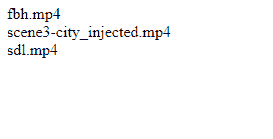

# AJAX 中的异步文件传输

> 原文:[https://www . geesforgeks . org/异步-文件传输-in-ajax/](https://www.geeksforgeeks.org/asynchronous-file-transfer-in-ajax/)

要使用 Ajax 在 jQuery 中传输文件，我们遵循以下步骤和一个示例:

1.  使用 HTML5，我们可以使用表单上传文件。内容类型被指定为**多部分/表单数据**。
2.  为要上传的文件创建一个输入字段，输入类型为**文件**。
3.  我们可以使用 multiple 属性允许上传多个文件，也可以使用 accept 属性过滤掉文件类型。
4.  上传时，监听器迭代地将上传的文件追加到文件列表中。
5.  使用提交按钮，创建一个 ajax 请求，表单数据被发送到指定的 url。

**示例:**这里考虑异步发送视频的情况。

*   我们已经创建了如下的 HTML5 表单:

    ```
    <div>
        <form method="POST" enctype="multipart/form-data"
                action="" id="capt">
            <div class="form-group">
                <label>Select Files</label>
                <input type="file" id="file" name="file[]"
                    accept="video/*" class="form-control"
                    multiple="multiple" required>
            </div>

            <input type="submit" class="btn btn-info"
                    value="Submit">
        </form>
    </div>
    ```

    *   使用 jQuery，我们创建了适当的方法来异步上传和发送文件。

    ```
    var fileList = [];

    $('#file').on('change', function (event) {

        fileList = [];

        // Append files to fileList
        for (var i = 0; i < this.files.length; i++) {
            fileList.push(this.files[i]);
        }
    });

    sendFile = function (file) {

        // Create Ajax Request
        $.ajax({
            url: 'notify.php',
            type: 'POST',
            data: new FormData($('form')[0]),
            cache: false,
            contentType: false,
            processData: false
        });
    }

    $('#capt').on('submit', function (event) {
        event.preventDefault();

        //Asynchronous Transfer
        sendFile(file);
    });
    ```

    *   为了演示输出，我们创建了一个最小的 PHP 文件，如下所示:

    ```
    <?php

    $video = $_FILES['file']['name'];
    foreach($video as $vd){
        echo $vd."<br>";
    }
    ?>
    ```

*   **Output(notify.php):**

    
    