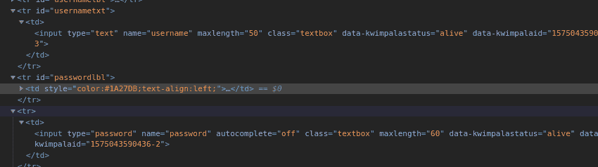
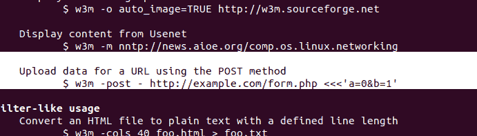

# Linux 中专属门户的自动登录

> 原文:[https://www . geeksforgeeks . org/Linux 中的自动登录专属门户/](https://www.geeksforgeeks.org/automated-login-for-captive-portals-in-linux/)

每次连接到专用网络，可能是你的学院、办公室、学校等。将出现强制门户屏幕，您必须在其中输入组织提供的凭据。我们的想法是自动化这个过程，这样每当我们连接到同一个网络中的任何路由器时，它都会自动登录。

**注意:**在下面的文章中，提供的步骤可能并不适用于每一个网络，但思路是了解流程，可以尝试一下，因为大部分圈养门户都是松散构建的，所以值得一试。

**系统要求:**任何基于 Unix 的系统，最好是 ubuntu Linux。

**需要安装的包:**[wget](https://www.geeksforgeeks.org/wget-command-in-linux-unix/)[w3m](https://www.geeksforgeeks.org/how-to-browse-from-the-linux-terminal-using-w3m/)。(可以使用 apt-get 安装)

**步骤 1:** 研究专属门户页面。这是重要的步骤之一，必须认真执行。右键单击提供的文本区域并选择检查(考虑到使用的浏览器是 Chrome/Firefox)。请注意输入文本区域中的“名称”字段。它必须类似于“用户名”或“密码”(如图所示)。



HTML 中会嵌入 JavaScript(显然！).注意它调用的函数。

**第二步:**学习 JavaScript 代码。我们之前看到的函数必须在浏览器正在使用的 javascript 代码中。可以像访问 HTML 一样访问。去检查，这次，点击来源，你会看到网站的 JS 代码。

*注:*一般这些码会在一条直线上，所以很难解读。因此，任何在线美化程序都可以用来格式化代码，使其更具可读性。

**第三步:**找到链接！众所周知，每个 HTTP POST 请求都是用来向服务器发送数据的。因此，现在在 javascript 代码中，必须有一个链接或者说查询正在被构建并发送 POST 请求。所以我们必须找到查询。这里重要的部分不是找到查询，而是找到与链接一起使用的签名。

签名在这里意味着所需变量的数量、它们的顺序等。有时候有些变量需要时间戳，所以可以给它提供一个伪值(如果需要，也可以使用实际的时间戳)。请注意，在给定的图像中，“模式”变量的给定值为 191，表示登录状态，值为 193，表示注销状态。这可以通过敏锐地阅读代码得到。

为登录找到的查询:

> query string = " mode = 191 & username = "+编码器组件(UserValue) + "&password=" +编码器组件(document . frmhttpclientlog . password . value)+" & a = "+(新日期)。gettime()+product type；

为注销找到的查询:

> query string = " mode = 193 & username = "+编码器组件(document . frmhttpclientlog . username . value)+a = "+(新日期)。gettime()+product type；

**步骤 4:** 用变量创建自己的查询字符串。一旦观察到查询，就很容易用相同的变量进行自己的查询，并相应地填充适当的数据。本案中的联系如下:

```
'mode=191&username=admin&password=root&a=1551345153461'
```

这里需要注意的一件重要的事情是，人们可能会认为这个字符串可以附加到强制门户的 IP 上，然后在浏览器中使用。例如，

> http://192 . 168 . 1 . 8/login page . html？模式= 191 & username = admin & password = root & a = 1551345153461

但是需要注意的是，这并不是在所有情况下都有效，这只能在使用像 PHP 这样的后端技术的情况下有效，在这种情况下，可以使用链接进行变量解析。

**步骤 5:** 使用终端发送开机自检请求。一旦终端可以在 Linux 中发送 POST 请求，就可以将其插入 bash 脚本中进行自动化。为了在这里发送开机自检请求，使用了一个为 Linux 制作的非图形浏览器。有许多非图形浏览器，如 lynx、w3m 等。在这种情况下，使用了 w3m 浏览器。从 Linux 的手册页可以很容易的学习到。w3m 对 POST 的使用在其手册页中有很好的解释(如图所示)。



在这种情况下，Ajax 用于与后端通信，请求-响应是用 XML 表示的，因此 POST 请求将被发送到一个 XML 链接，而不是一个普通的 HTML 页面。这可能因网络而异。请求要发送到的页面可以在找到变量的相同 JavaScript 代码中识别。最后，命令看起来像这样:

> w3m-post–http://192 . 168 . 1 . 8:8294/log in . XML < < < < ' mode = 191 & username = admin & password = root & a = 1551345153461 '

**第六步:**将其插入 bash 脚本。为了使这个过程自动化，有必要创建一个 bash 脚本文件，它将在您每次连接到组织的网络时运行。要制作一个简单的 bash 脚本，请转到终端并键入

```
nano autologin
```

Nano 是一个命令行编辑器，现在将创建一个名为 autologin 的文件。现在，通过按下`ctrl+shift+V`，将以下脚本粘贴到编辑器中。

**注意:**要创建 bash 文件，不要输入文件扩展名，因为 Linux 从不使用扩展名，而是在内部识别文件。Linux 自己知道，文件是 ASCII 文本文件、doc 文件还是 bash 文件。

```
#!/bin/bash

wget -q --tries=10 --timeout=10  http://192.168.1.8:8294
if [[ $? -eq 0 ]]; then
    w3m -post - http://192.168.1.8:8294/login.xml <<<'mode=191&username=admin&password=root&a=1551345153461'
        echo "Online!"
else
        echo "Unreachable!"
fi

```

**说明:**

*   代码的第一行表示文件是一个 bash 脚本，只使用 bash 执行，其位置为 **/bin/bash** 。
*   **wget** 是一个 Linux 命令，它基本上是一个用来从互联网获取内容的程序。
*   这里，在这种情况下，wget 用于检查 PC 与网络的连接，检查 IP 是否处于活动状态。如果该 IP 未激活，则意味着设备未连接到组织的专用网络，脚本将不会进一步执行。
*   wget 的标志是中止之前的尝试次数，类似于超时。-q 用于关闭 verbose。
*   **$？**是一个环境变量，用于在 Linux 环境下存储返回值。如果 wget 返回 false，$？转到 0，控制将转到其他位置，不会发生任何事情。
*   但是当 IP 是活动的，也就是 wget 什么时候会返回一个正的返回值，就会体现在$？并且将执行命令 w3m，登录将成功完成。

**步骤 7:** 每次连接到网络时，使脚本可执行。这是最后一部分，每次连接到任何网络时，脚本都是可执行的。它将在内部查找网络是否是组织的专用网络，并相应地登录。对于这一步，转到您的`/etc/network`文件夹。

在这个文件夹中，有 4 个文件夹(从最新版本的 ubuntu-19.10 开始)名为:`if-down.d`、`if-post-down.d`、`if-pre-up.d`、`if-up.d`。刚写好的剧本要贴在“`if-up.d`”文件夹里。Linux 每次连接到新网络时都会在内部调用这个文件夹中的所有脚本。

*注意:*如果默认找不到 4 个文件夹，创建我们需要的文件夹，并将条目添加到`/etc/network/interfaces`文件中。要粘贴脚本，请转到脚本所在的目录，然后键入:

```
sudo cp autologin /etc/network/if-up.d

```

**步骤 8:** 使文件可执行并重新启动网络。文件的所有权必须更改为 root。因此，请键入以下命令:

```
sudo chown root:root autologin

```

然后授予使文件可执行的权限:

```
sudo chmod +x autologin

```

最后，重新启动网络管理器以进行新的设置！

```
/etc/init.d/network-manager restart

```

这将使您的电脑能够在每次连接到网络时自动登录到专用网络！虽然现在您已经登录，但是每次连接到网络时，强制门户的弹出窗口可能总是会出现，以便您登录到网络。要摆脱它，请转到**设置- >隐私**并关闭连接检查。