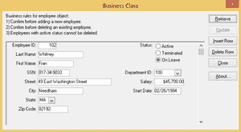
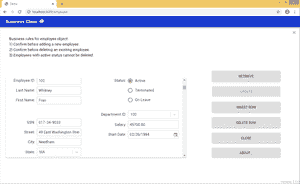

# 将 PowerBuilder 桌面应用程序自动迁移至网络

> 原文:[https://www . geeksforgeeks . org/power builder 桌面应用程序到 web 的自动迁移/](https://www.geeksforgeeks.org/automated-migration-of-powerbuilder-desktop-applications-to-web/)

最近，越来越多的企业打算将其业务应用程序从桌面迁移到网络。

这一决定通常是由纯桌面应用程序无法支持新的创新功能和桌面应用程序支持的高成本所驱动的。您的企业将从可访问性、功能、性能和 web 开发最佳实践中获益。客户越来越多地参与创新和创造性的应用程序使用。

但是，成功的桌面应用程序迁移需要谨慎和全面的场景。这就是需要智能解决方案的地方。

在这一阶段，我们希望分享我们在将 PowerBuilder 应用程序迁移到网络方面的经验。我们将向您展示这个任务最合适的解决方案(以及代码)。

我们已经尝试了许多潜在的目标 ASP.NET 和 Java web 技术，如 ASP.NET Web forms、ASP.NET MVC、ASP.NET Web API/Java Spring Boot REST API+AngularJS/ReactJS、JSP、Java Spring 等。

在开发合适的解决方案时，我们注意了应用程序的可用性、规模和基础架构管理。仔细的研究和分析导致了最充分的方法开发。它满足了我们的架构和性能要求。

**PowerBuilder 到 ReactJS 自动化迁移解决方案**

在下面，您可以看到 PowerBuilder 标准演示应用程序在其原始桌面和迁移的网络 SPA 版本中的外观:

**基本上**、**解决方案实现了 2 个主要技术部分:**

用户界面和业务逻辑位于客户端。

无状态 REST API 服务器(可以是 C#或 Java Spring Boot)，带有对数据库(ADO)的调用。NET，实体框架或 Java Hibernate，JDBC)。

**采用 SPA 架构的优势**

理解单页应用程序(SPA)的优势从使用和实现它们的简单性开始。但是还有更多:

*   类似桌面的架构允许实现高转换自动化水平。
*   快速，因为大多数资源(HTML+CSS+脚本)在应用程序的整个生命周期中只加载一次。只有数据来回传输。
*   迁移和进一步开发被简化和精简。不需要编写代码来在服务器上呈现页面。
*   谷歌浏览器易于调试，因为你可以监控网络运行，调查页面元素和相关数据。
*   可以有效缓存任何本地存储。一个应用程序只发送一个请求，存储所有数据，然后它可以使用这些数据，在某些情况下甚至脱机工作。

### 解决方案的基本特征

*   客户端使用最新的 JS 框架——ReactJS、Redux、Redux Saga、Material UI。
*   单向数据流的流量架构。

**注**。Flux 是脸书用于构建客户端 web 应用程序的应用程序架构。

*   只有流行的/维护良好的库包被使用。
*   没有定制“框架”，附加定制组件/功能的数量很少。
*   目标技术堆栈开箱即用，涵盖了 PFC 的大部分功能。
*   继承到合成转换。

**注**。继承和组合是开发人员用来在类和对象之间建立关系的两种编程技术。继承从另一个类派生出一个类，而组合将一个类定义为它的各个部分的总和。

*   变量从带匈牙利符号的下划线重命名为 camel 大小写。
*   易于理解和维护的文件结构。
*   将虚拟化用于长列表。
*   精简数据访问层。
*   服务器部分可以使用。. NET 或 Java。
*   具有基本自适应(可调整大小)布局的现代网络界面。
*   报告样式可以下载，并保持与 PowerBuilder 中相同。
*   达到了高百分比的转换自动化水平。然而，转换精度和编码最佳实践是最受关注的，而不是 100%的自动化水平。

**最需要考虑的 4 个重要问题:**

*   多一些 JavaScript，少一些 C#或者 Java 代码。
*   资源的初始加载可能没有那么快，但是可以通过使用代码拆分/块来进一步优化。
*   PowerBuilder 的一些 description()/Modify()案例仍然没有很好地自动化。
*   应用编码最佳实践的附加手动工作:

1.  向 SQL 查询添加标识、分页、排序/过滤器(将在服务器或数据库端实现，不是自动的)。
2.  入口点、主页框架、数据库连接、授权/认证、用户角色、高级布局。
3.  应审查所有交易案例，并使其适应当前的架构。

**技术挑战解决:**

*   复杂的继承和大部分转换已经在转换工具中自动化了。
*   实现了类似的 PowerBuilder 控件和材质用户界面的使用，控件的设置和样式集中在一个地方。
*   适应性布局，控制，现代网络用户界面。
*   在数据窗口中单独编辑特定记录，以获得更好的用户体验和性能。
*   要加载的许多数据和记录的性能优化:虚拟化、分页、向数据库添加自定义存储过程。DDDWs、搜索、过滤等。
*   报表迁移及其导出到 HTML 和 Excel、PDF、CSV 等。
*   自定义格式的解析和加载。使用微软 Word 功能(书签)。
*   通过 JWT 认证(JSON 网络令牌)。
*   使用定制的 SOAP 服务。
*   Windows 的特殊调度程序。

**结论:**如果您正在考虑迁移您的旧式 PowerBuilder 应用程序(无论是否更改数据库)，我们强烈建议您将注意力放在这款经过实战检验的 PowerBuilder 上，以重新获得自动化迁移解决方案。
上述方法已成功应用于以下 2 个商业移民项目。