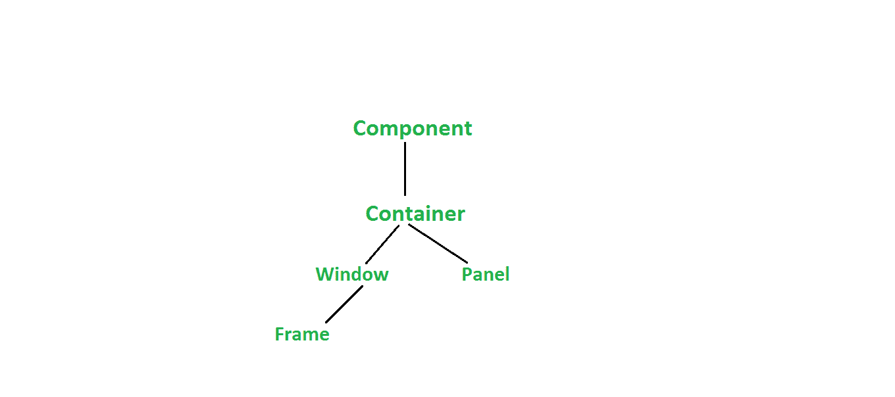

# AWT 完整形式

> 原文:[https://www.geeksforgeeks.org/awt-full-form/](https://www.geeksforgeeks.org/awt-full-form/)

**AWT** 代表**抽象视窗工具包**。

用 Java 开发图形用户界面或基于窗口的应用程序是一个依赖于平台的应用编程接口。它是由太阳微系统公司在 1995 年开发的。它在使用中非常重要，因为它是由系统的主机操作系统生成的。它包含大量的类和方法，用于创建和管理图形用户界面。

#### Java AWT 层次结构

#### 特征

*   它是一组本机用户界面组件。
*   它本质上非常健壮。
*   它包括各种编辑工具，如图形工具和图像工具。
*   它使用本机窗口系统控件。
*   它提供了包括形状、颜色和字体类的功能。

#### 优势

*   开发图形用户界面和执行程序所需的内存非常少。
*   它非常稳定，因为它很少崩溃。
*   它依赖于操作系统，因此性能很高。
*   由于其简单的界面，对于初学者来说很容易使用。

#### 不足之处

*   AWT 的按钮不支持图片。
*   它本质上是重量级的。
*   两个非常重要的组件树和表不存在。
*   扩展性是不可能的，因为它依赖于平台