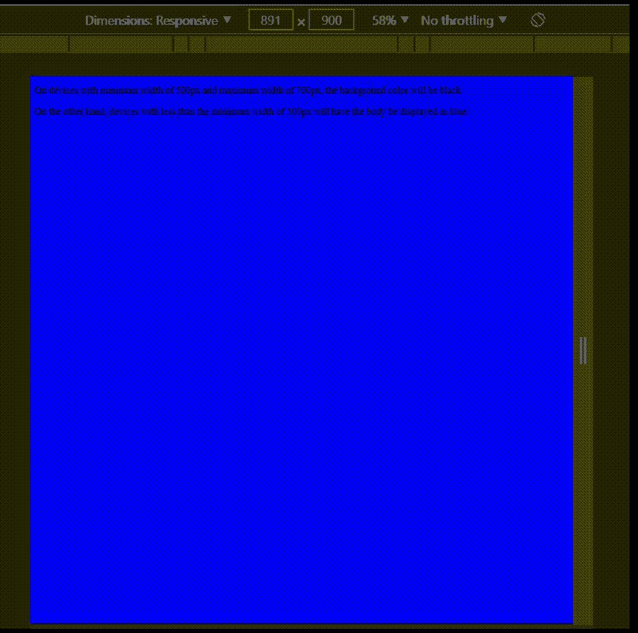

# 响应性网页设计基础–媒体查询

> 原文:[https://www . geesforgeks . org/基础-响应-网页-设计-媒体-查询/](https://www.geeksforgeeks.org/basics-of-responsive-web-design-media-queries/)

媒体查询是一种 CSS 技术，用于生成响应性设计。本质上，它包括条件，只有满足这些条件，才会显示响应设计。为什么这个有用？假设您想让图像在所有移动设备上变小，但在所有其他设备(如 iPads、笔记本电脑和台式机)上变大，那么实现这一点的最佳方法是使用媒体查询。

使用媒体查询的一般方法包括:

## 半铸钢ˌ钢性铸铁(Cast Semi-Steel)

```htmlhtml
@media only screen and (/*condition goes here */) {
    body {
        /* Conditions goes here */
    }
  }
```

**说明:**以上是调用媒体查询的一般方式。在括号中，我们添加了浏览器窗口的条件，例如您希望浏览器窗口的最小/最大大小是多少，以使**中的条件出现在**中。

**示例:**考虑以下代码:

## 半铸钢ˌ钢性铸铁(Cast Semi-Steel)

```htmlhtml
@media only screen and (max-width: 500px) {
  body {
    background-color: black;
  }
}
```

在这种情况下，我们基本上是说让这个条件成立:

```htmlhtml
body {    
    background-color: black; 
}
```

**当且仅当**器件宽度小于或等于 500px。当然，你可以改变条件，根据你的愿望来做。然而，这是媒体查询如何工作的一般想法。

我们还可以为浏览器的宽度添加另一个条件，考虑下面的代码:

## 半铸钢ˌ钢性铸铁(Cast Semi-Steel)

```htmlhtml
@media only screen and (min-width: 300px) and (max-width: 500px) {
  body {
    background-color: black;
  }
}
```

在这种情况下，请注意括号中给出了两个条件。我们基本上是说，当且仅当浏览器的最小尺寸为 300px，最大尺寸为 500px 时，才执行下面的代码。因此，如果浏览器窗口小于 300px 或大于 500px，代码将不会执行。它应该在 300px 到 500px(含)之间。这是使用媒体查询满足您可能有的条件的另一种方式。

**示例:**

## 超文本标记语言

```htmlhtml
<!DOCTYPE html>
<html>

<head>
    <style>
        body {
            background-color: blue;
        }

        @media only screen and (min-width: 500px) 
                and (max-width: 700px) {
            body {
                background-color: red;
            }
        }
    </style>
</head>

<body>
    <p>
        On devices with minimum width of 500px
        and maximum width of 700px, the background
        color will be black
    </p>

    <p>
        On the other hand, devices with less than the
        minimum width of 500px will have the
        body be displayed in blue
    </p>
</body>

</html>
```

**输出:**当您希望特定代码仅在满足与窗口大小相关的条件时才执行时，媒体查询非常有用。例如，如果您希望页面的背景颜色在较大的设备上为黑色，而在较小的设备上为蓝色，那么媒体查询是处理这种情况的最佳方式。

