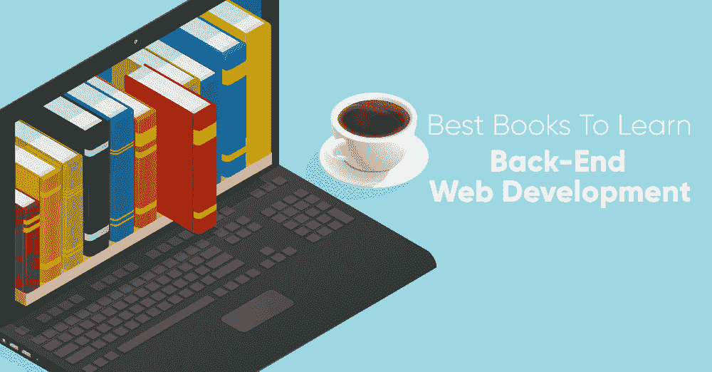
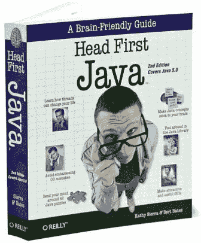
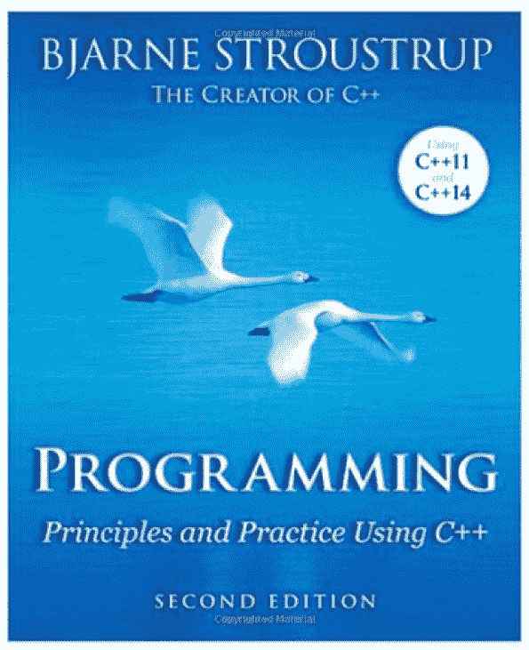
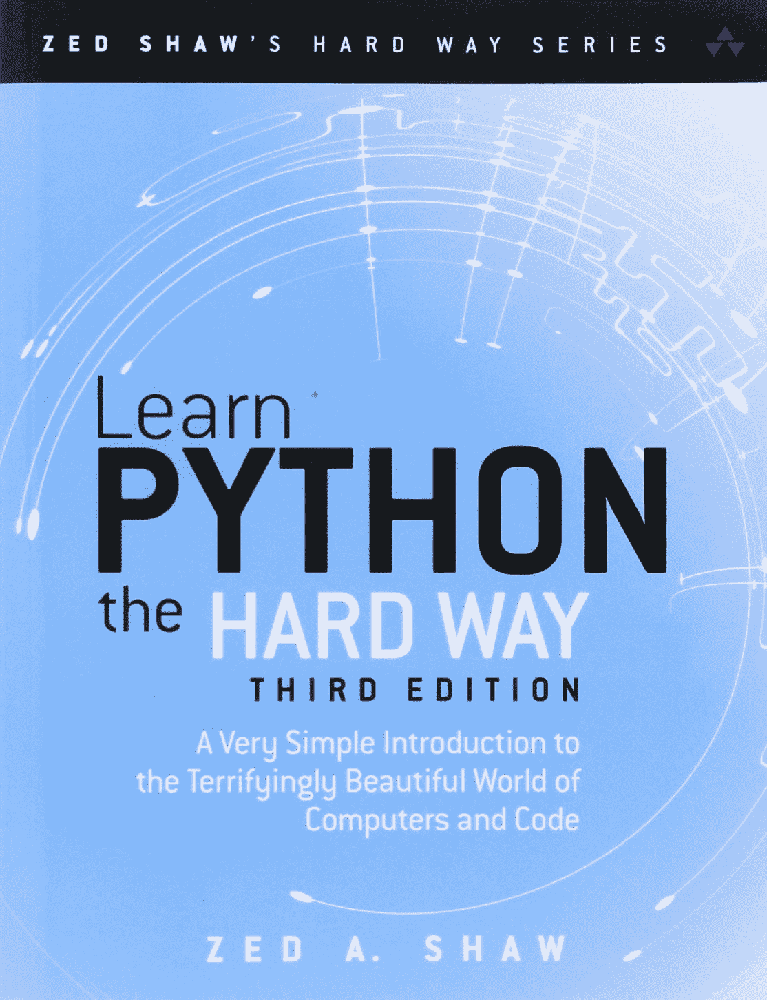
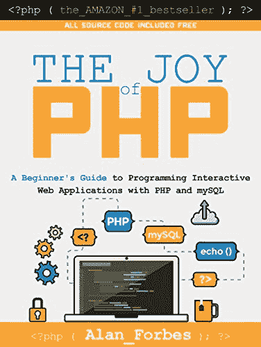
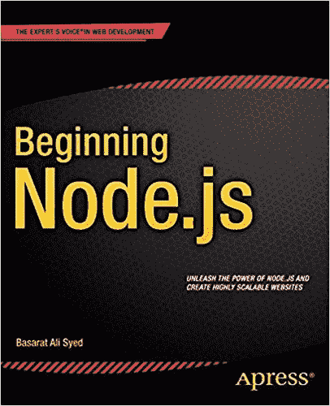
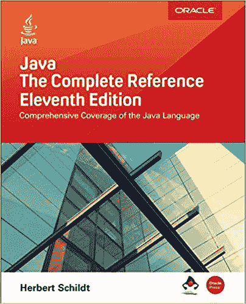
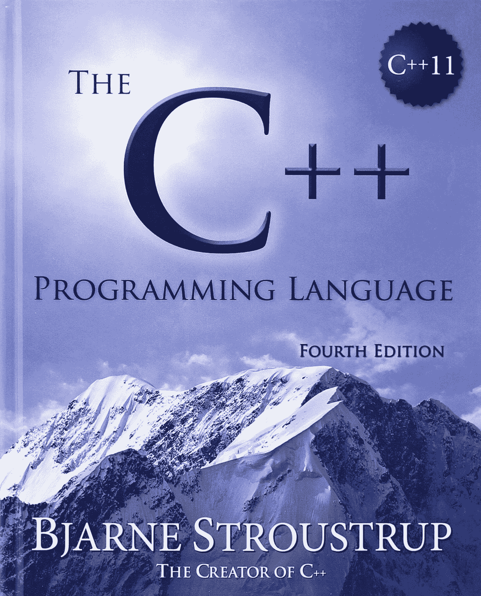
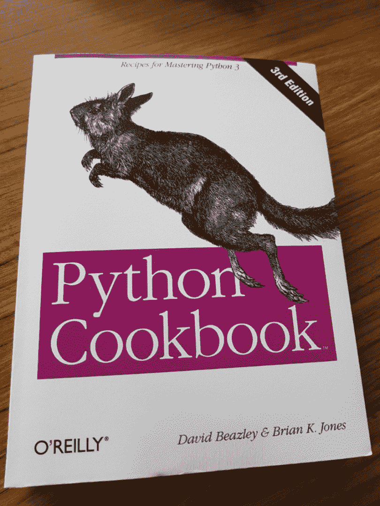
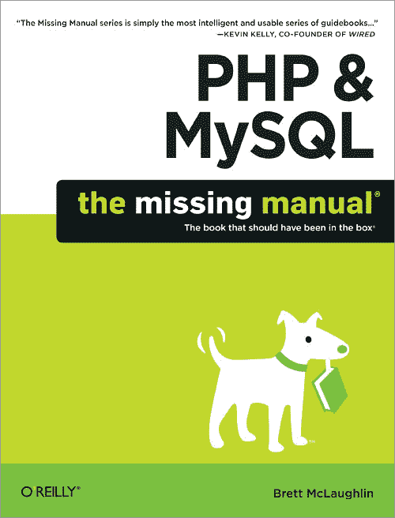

# 学习后端网络开发的最佳书籍

> 原文:[https://www . geesforgeks . org/best-books-to-learn-back-end-web-development/](https://www.geeksforgeeks.org/best-books-to-learn-back-end-web-development/)

如果初学者没有找到好的资源或书，理解后端网络开发的概念对他们来说并不容易。关于后端有太多的东西要学习，每周发布的框架或库太多，很难找到从零开始到高级的一切从哪里开始。不仅仅是初学者，有软件开发经验的人有时也会寻找一些好的资源或书籍来复习他们的技能。
作为一名入门级或经验丰富的开发人员，有些书你需要放在书架上以供参考，或者作为初学者开始你的编程之旅。我们已经为初学者和有经验的人在服务器端语言的基础上对这些书进行了分类，我们也强烈建议你绞尽脑汁，在编程中应用你的逻辑，并运行你自己的代码来进行深入和更好的学习。

### 适合初学者

**1。Head First Java:作者:Kathy Sierra，Bert Bates:** 这是一本从零开始学习 [Java](https://www.geeksforgeeks.org/java/) 的最好的初学者友好的经典书籍，它用适当的图表和视觉效果涵盖了所有的概念。这本书不需要任何先决知识。这本书最棒的地方在于它的简单，你会发现很多现实生活中的例子来澄清所有的概念。为了更好地掌握 Java 语言，本书的所有章节都以测验、练习和谜题结束。
这本书涵盖了所有在 Java 中非常重要的面向对象的概念。首先，它涵盖了类、对象、线程、集合、语言特性，如泛型、枚举、变量参数或自动装箱等。在高级部分，它涵盖了 Swing、网络和 Java IO 等，这是所有初学者的最佳学习曲线。这本书有点过时，但是如果你是编程和 java 的新手，这本书是最好的书。
[**买头优先 Java 2e(一个对大脑友好的指南)书**](https://www.amazon.in/gp/product/0596009208/ref=as_li_qf_asin_il_tl?ie=UTF8&tag=geeksforgeeks-21&creative=24630&linkCode=as2&creativeASIN=0596009208&linkId=a194c279d28f863a8dc9721d1e780bd3)

图片来源:谷歌

**2。编程:使用 C++的原理和实践:作者:比雅尼·斯特劳斯特鲁普:**这本书有 1200 多页，由于它的大小，对于完全初学者来说可能很可怕，但是读完这本书，你会对编程更有信心。是由 [C++](https://www.geeksforgeeks.org/c-plus-plus/) 的原实现者写的，对绝对初学者来说不错。它涵盖了泛型编程和面向对象编程。
在这本书的开头，你将学习如何构造你的代码。你会发现关于编程、计算机科学的简短讨论，然后你会转向 C++的核心概念，比如对象、类型、语句、函数、错误、向量、类、输入/输出等。这本书还包括几十个练习，让你的概念更加清晰。
[**购买编程:使用 C++书籍的原理和实践**](https://www.amazon.in/gp/product/B00KPTEH8C/ref=as_li_qf_asin_il_tl?ie=UTF8&tag=geeksforgeeks-21&creative=24630&linkCode=as2&creativeASIN=B00KPTEH8C&linkId=847c78f617a99dbec7c123d954d363a7)

图片来源:谷歌

**3。学习 python 的艰难之路:作者:Zed A. Shaw:** 这本书确实用一种实用的方法帮助了很多学习 Python 的人。作者包含了一些练习，你需要自己输入代码，然后你需要修正代码中的错误。解决这些练习将帮助你写一个好的程序，也将帮助你学习一些调试技巧。首先，您将了解 Python 环境的安装，然后它涵盖了基本的数学、变量、程序设计、数据结构、字符串、文件、循环和其他基本概念。如果你真的想通过亲身体验从头开始学习 python，那就去读这本书吧。
[**买学蟒蛇硬道理**](https://www.amazon.in/gp/product/9332582106/ref=as_li_qf_asin_il_tl?ie=UTF8&tag=geeksforgeeks-21&creative=24630&linkCode=as2&creativeASIN=9332582106&linkId=f708bfcd6b645aa6190fb175e96afd92)

图片来源:谷歌

**4。PHP 编程的乐趣:作者艾伦·福布斯:**如果你是编程的绝对初学者，想成为一名专业的网络开发人员，但不知道从哪里开始，那么这本书最适合你从头开始学习一切。这本书首先介绍了 HTML 基础知识，这样新手就可以轻松地从它开始，然后一步一步地介绍 PHP 的所有概念，并帮助您阅读、编写、修改和制作自己的动态网站。这本书包括安装 [PHP](https://www.geeksforgeeks.org/php/) ，PHP 语法，控制结构，以及 MySQL。最初，你将学习创建和运行基本的 PHP 脚本，然后你将开始修改网页，你还将在本书中解决一些具有挑战性和趣味性的练习。

[**购买 PHP 编程书的乐趣**](https://www.amazon.in/gp/product/1522792147/ref=as_li_qf_asin_il_tl?ie=UTF8&tag=geeksforgeeks-21&creative=24630&linkCode=as2&creativeASIN=1522792147&linkId=55d4bd3d86d0b0be6ea30af57b5b503e)

图片来源:谷歌

**5。begin node . js:By Basarat Ali Syed:**这本书涵盖了 NodeJS 的所有核心概念，将为您讲解所有原理。您将学习设置完整的环境、SPA(单页应用程序)概念、包、流、处理回调以及测试和调试应用程序。您还将了解 Express 框架、数据维护以及如何在互联网上部署您的 web 应用程序。本书中的所有内容都通过例子和图表进行了介绍，以便更好地理解，并从初学者的角度学习曲线。

[**购买开始节点书**](https://www.amazon.in/gp/product/1484201884/ref=as_li_qf_asin_il_tl?ie=UTF8&tag=geeksforgeeks-21&creative=24630&linkCode=as2&creativeASIN=1484201884&linkId=0c3cdd5446e89e9d97f65d319877f3a9)

图片来源:谷歌

### 对于有经验的人

**1。《Java:完全参考》，第十一版:作者:赫伯特·席尔德:**赫伯特·席尔德写过关于不同编程语言的畅销书，这本书有深入了解 Java 编程语言成为大师的一切。这本书很适合专业人士参考。它包括真实世界的例子，并解释了 java 的所有基础和高级概念，如 JavaBeans、servlets、applets、swing 和 Java 8 APIs。

[**购买 Java:完整参考书**](https://www.amazon.in/gp/product/1260440230/ref=as_li_qf_asin_il_tl?ie=UTF8&tag=geeksforgeeks-21&creative=24630&linkCode=as2&creativeASIN=1260440230&linkId=648f19212790b7137e100ac3ea5b1a12)

图片来源:谷歌

**2。C++编程语言:作者:比雅尼·斯特劳斯特鲁普:**我们向中级或高级 C++程序员推荐这本书，它是由这种语言的原始实现者编写的。这本书的第四版包括 C++11 的特性和标准库。它从 C++的一些基础知识开始，然后慢慢地，你将转向结构、语句、函数、联合和枚举。它还包括容器、算法、抽象机制、并发性、实用程序、模板和元编程。

[**购买 C++编程语言书籍**](https://www.amazon.in/gp/product/B00DUW4BMS/ref=as_li_qf_asin_il_tl?ie=UTF8&tag=geeksforgeeks-21&creative=24630&linkCode=as2&creativeASIN=B00DUW4BMS&linkId=ef138daea737599b07aa29f207adb8a1)

图片来源:谷歌

**3。Python 食谱:掌握 Python 的食谱 3:** 如果你是一个有经验的 Python 程序员，那么这本书对你掌握编程技能有好处。完整的书是关于 Python3 代码的，所以它将帮助你使用现代工具和习惯用法而不是标准的编码技术进行编程。这本书很好地解释了为什么以及代码是如何工作的。这本书里的每一个食谱都是从问题陈述开始的，解决方案是用扩展的代码和讨论给出的。
您将获得关于数据编码、[数据结构](https://www.geeksforgeeks.org/data-structures/)、[算法](https://www.geeksforgeeks.org/fundamentals-of-algorithms/)、元编程、并发、迭代器、函数、类、模块、装饰器模式、闭包、包、测试、调试和异常等主题的指导。

[**购买巨蟒食谱:掌握巨蟒的食谱 3 本书**](https://www.amazon.in/gp/product/B00DQV4GGY/ref=as_li_qf_asin_il_tl?ie=UTF8&tag=geeksforgeeks-21&creative=24630&linkCode=as2&creativeASIN=B00DQV4GGY&linkId=f9516db3afa484f87e8f8ff19411f91d)

图片来源:谷歌

**4。PHP & MySQL:缺失的手册:**如果你已经有了 PHP 编程的经验，那么这本书将带你更上一层楼。这本书有 546 页，帮助程序员管理内容、建立数据库和与用户互动。在数据库管理系统的正确指导下，您还将了解 PHP 和 MySQL 的连接性。你将在这本书里学到的几个概念是处理图像和复杂性，二进制对象和图像加载，列表，迭代和管理，认证&授权，制作动态网页&网络应用。

[**购买 PHP & MySQL:缺失的手册**](https://www.amazon.in/gp/product/144934190X/ref=as_li_qf_asin_il_tl?ie=UTF8&tag=geeksforgeeks-21&creative=24630&linkCode=as2&creativeASIN=144934190X&linkId=d258893d01ca238a0348049226363aa2)

图片来源:谷歌

**其他书籍:**

*   [有效 Java](https://www.amazon.in/gp/product/B078H61SCH/ref=as_li_qf_asin_il_tl?ie=UTF8&tag=geeksforgeeks-21&creative=24630&linkCode=as2&creativeASIN=B078H61SCH&linkId=b850d930cb5bb9922f892e641ad4186e)
*   [Java:初学者指南，第七版](https://www.amazon.com/Java-Beginners-Seventh-Herbert-Schildt/dp/1259589315?tag=javamysqlanta-20)
*   [C++第一(5 版)](https://www.amazon.in/Primer-5th-Stanley-B-Lippman/dp/0321714113?tag=hackr0df-21)
*   [加速 C++:实例编程实用](https://www.amazon.in/Accelerated-Practical-Programming-Example-Depth/dp/020170353X)
*   [蟒蛇速成班](https://www.amazon.in/dp/1593276036?tag=hackr0df-21)
*   [Django 初学者版](https://www.amazon.in/gp/product/B079ZZLRRL/ref=as_li_qf_asin_il_tl?ie=UTF8&tag=geeksforgeeks-21&creative=24630&linkCode=as2&creativeASIN=B079ZZLRRL&linkId=4d732c1f0385194bb62d4b97a9c006ef)
*   [PHP & MySQL 新手到忍者](https://www.amazon.in/PHP-MySQL-Novice-Ninja-5e/dp/0987153080?tag=hackr0df-21)
*   [PHP 和 MySQL Web 开发](https://www.amazon.in/PHP-MySQL-Development-Developers-Library/dp/0672329166?tag=hackr0df-21)
*   [Node.js 设计模式–第二版](https://www.amazon.com/Node-js-Design-Patterns-Mario-Casciaro/dp/1785885588/)
*   [掌握节点 js](https://www.amazon.in/gp/product/B00GX9HM8A/ref=as_li_qf_asin_il_tl?ie=UTF8&tag=geeksforgeeks-21&creative=24630&linkCode=as2&creativeASIN=B00GX9HM8A&linkId=209a382604effb9e485a3bbb70e141fd)