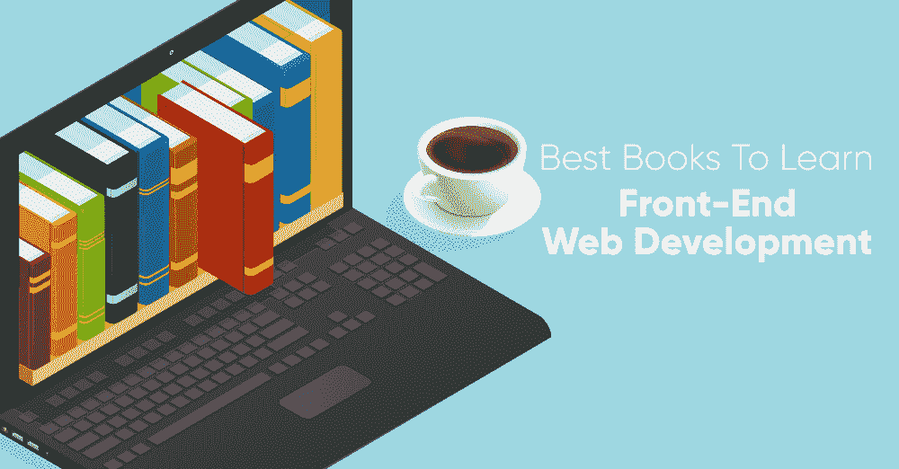
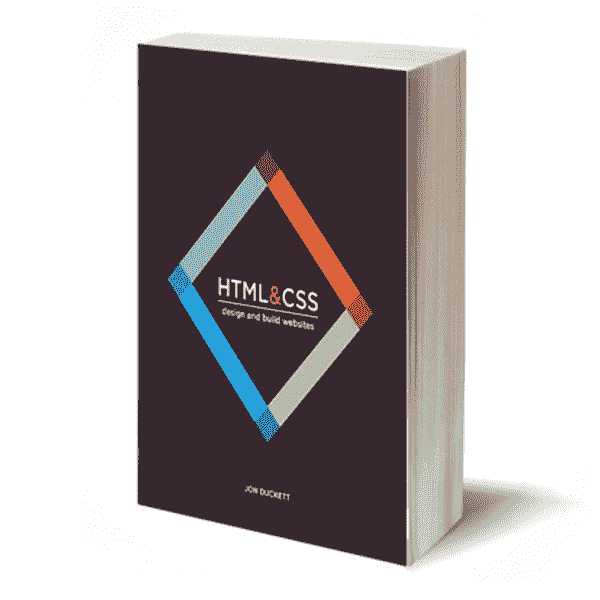
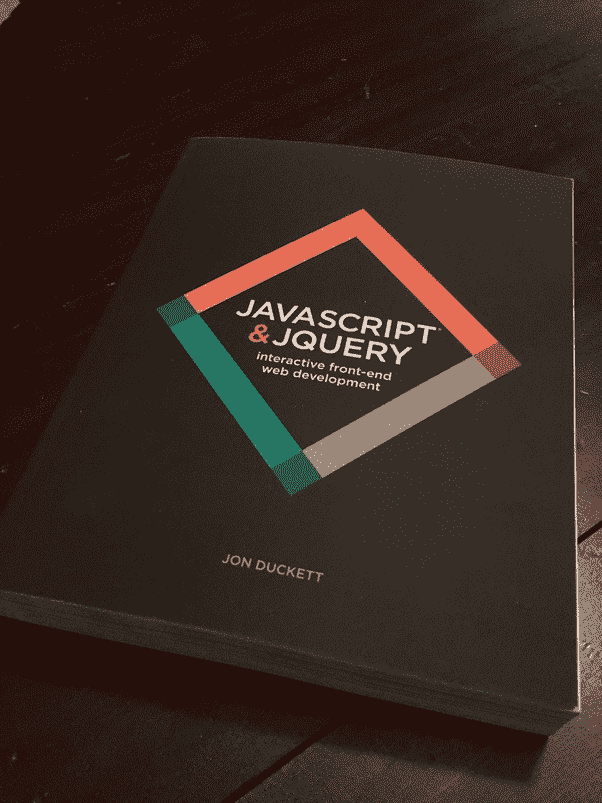
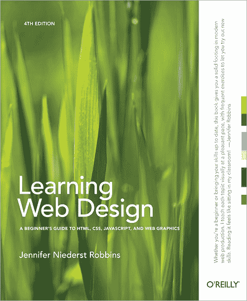
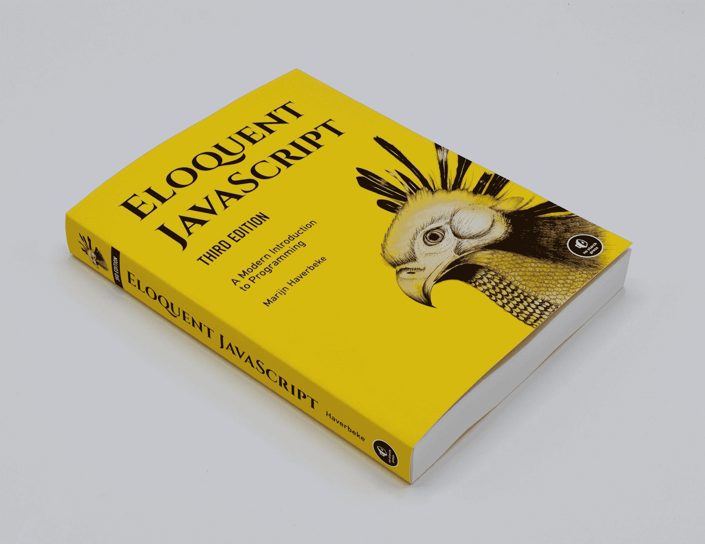

# 学习前端 Web 开发的最佳书籍

> 原文:[https://www . geesforgeks . org/best-books-to-learn-front-web-development/](https://www.geeksforgeeks.org/best-books-to-learn-front-end-web-development/)

IT 行业对前端 Web 开发人员或 Web 设计师的需求巨大，前端开发人员工作也是高薪工作之一。这些都是人们热爱选择这个领域的原因。前端开发都是关于 [UI/UX](https://www.geeksforgeeks.org/ui-vs-ux-design-which-career-option-should-you-choose/) 的，主要关心的是网站的布局、造型或者设计。每个网页设计师或前端开发人员的旅程都是从 [HTML](https://www.geeksforgeeks.org/html-tutorials/) 和 [CSS](https://www.geeksforgeeks.org/css-tutorials/) 开始的，在更好地理解这两者之后，他们需要跳到 [Javascript](https://www.geeksforgeeks.org/javascript-tutorial/) 中，在你的 HTML 和 CSS 设计中添加交互功能。说到前端开发的学习方法，大多数人都喜欢使用在线视频或材料，但有时作为参考或从头到尾深入理解概念，书籍是最好的选择。

以下是一些学习前端开发或网页设计的最佳书籍列表。这些书对入门级和有经验的开发人员都有好处。我们把这些书分成了两个部分——对于初学者和有经验的人。有一点你需要记住，在编程中，你需要不断更新自己，但基础概念总是保持不变，在进入高级水平之前，他们应该首先掌握基础概念。

### 适合初学者

**1。HTML 和 CSS:设计和构建网站，作者:乔恩·达克特:**乔恩·达克特的这本书非常受欢迎。如果你是一个设计初学者，最近开始学习 HTML 和 CSS，那么这本书最适合你从零开始学习到专家水平。这本书的内容质量很高，而且每样东西的呈现都很有条理。您会发现每个主题的定义以及代码和它的输出。这本书的作者把代码做得如此直观，以至于每个人都能理解它。在这本书里，图形非常精彩，所有的属性、例子、代码都是用颜色编码系统来解释的。它有杂志风格的布局和高质量的页面设计。
[**购买 HTML 和 CSS:设计和构建网站书籍**](https://amzn.to/2LrksaL)

图片来源:谷歌

**2。JavaScript 和 JQuery:交互式前端 Web 开发，作者:Jon Duckett:** 为了在您的 HTML 和 CSS 代码中添加功能，我们再次建议您遵循 Jon Duckett 编写的这本书。javascript 的所有概念都非常清楚，并且在本书中以一种良好的结构和组织方式从头开始。Jon Duckett 是 javascript 方面的专家，这本书将通过一个现实的例子来教你如何在现实应用中使用 javascript。首先，您将学习 javascript 中的基础知识、DOM 操作和用户事件处理，然后慢慢转向 jquery。
[**购买 JavaScript 和 JQuery Book**](https://amzn.to/2HICgNJ)

图片来源:谷歌

### 对于有经验的人

**1。《学习网页设计:HTML、CSS、Javascript 和网络图形入门指南》，作者:Jennifer Niederst Robbins:** 这本书大约有 600 页，这本书最大的优点是它有大量的练习来测试和实验你的代码，这将使你的概念更加清晰。在这本书里，你将学习到 HTML、CSS、Javascript 以及网页图形和响应网页设计。这本书的标题提到这本书是为初学者准备的，但是大多数初学者发现它有高级的主题，所以如果你已经有了网页设计的基本知识，那么这本书对你来说最好有网页设计的深入知识。如果你是初学者，我们建议你先学习基础知识，然后再拿起这本书。
[**购买学习网页设计书**](https://amzn.to/2Lvf1aK)

图片来源:谷歌

**2。雄辩的 Javascript:作者:Marijn Haverbake:**Marijn Haverbecke 在本书中漂亮地涵盖了 javascript 的所有概念，他将从变量、控制结构、函数和数据结构开始，为您讲解 javascript 的基础知识。然后，您将转向高级主题，如面向对象编程和正则表达式。
这本书的第三版涵盖了 2017 年版本的 javascript，将带您了解一些新概念，如类符号、模板字符串、黑色范围、箭头函数、迭代器、异步函数等。作者还在这本书里增加了练习和一些小项目来测试你的技能，并很好地掌握这本书里解释的所有概念。在拿起这本书之前，你需要记住一件事，就像名字暗示的那样，这本书介绍了更多关于使用 javascript 编程的介绍，它本质上不是一本 javascript 书。此外，我们在有经验的部分对此进行了分类，因为你在解决练习时可能会遇到困难。你可能需要从互联网上寻求帮助来澄清，但这将使你的概念更加清晰。

*   [**购买雄辩的 Javascript 书**](https://amzn.to/2NNC7MI)
*   [**在线阅读雄辩的 JavaScript**](https://eloquentjavascript.net/)

图片来源:谷歌

**前端 Web 开发的其他书籍:**

*   [不要让我再去想](https://amzn.to/2HITSZO)
*   [用网络标准设计](https://amzn.to/2PGV2eJ)
*   [响应性网页设计](https://amzn.to/2HMo0TU)
*   [CSS 精通:高级网络标准解决方案](https://amzn.to/2PIiRTh)
*   [前端网页开发:大书呆子牧场指南](https://amzn.to/2PJGXx1)
*   [你不知道 JS–ES6&超越](https://amzn.to/2PEVJ8e)
*   [JavaScript:好的部分](https://amzn.to/2ZNsRL1)
*   [JavaScript:权威指南](https://amzn.to/2Zy7WQS)
*   [Javascript 延长](https://amzn.to/2ZOgsGx)
*   [通过互动练习直观学习 JavaScript】](https://amzn.to/2Zy8RRk)

jQuery 是一个开源的 JavaScript 库，它简化了 HTML/CSS 文档之间的交互，它以其“少写多做”的理念而闻名。
跟随本 [jQuery 教程](https://www.geeksforgeeks.org/jquery-tutorials/)和 [jQuery 示例](https://www.geeksforgeeks.org/jquery-examples/)可以从头开始学习 jQuery。