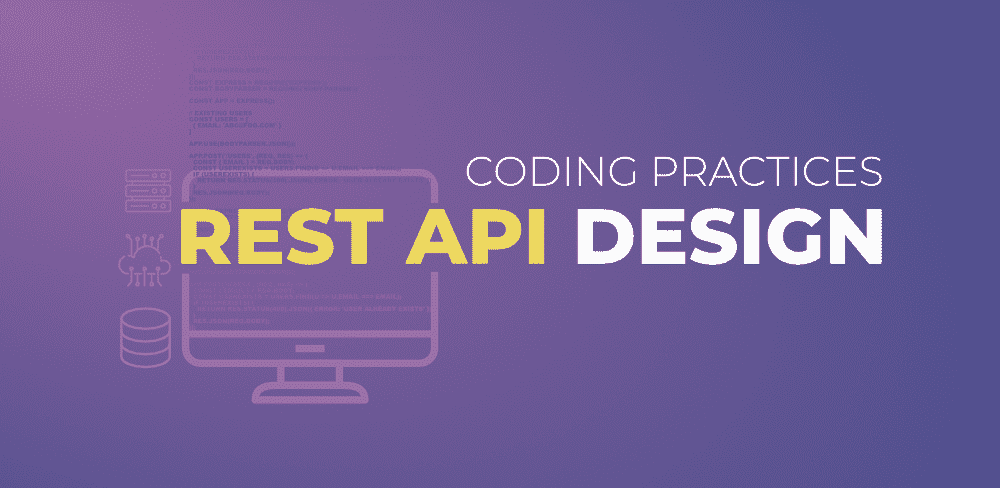

# 【Rest API 设计的最佳编码实践

> 原文:[https://www . geesforgeks . org/best-coding-practices-for-rest-API-design/](https://www.geeksforgeeks.org/best-coding-practices-for-rest-api-design/)

***JSON、端点、邮递员、CRUD、Curl、HTTP、状态码、请求、响应、认证、***

如果你在后端开发，并且已经在 [API(应用程序编程接口)](https://www.geeksforgeeks.org/introduction-to-apis/)上工作过，那么这些词对你来说都很熟悉。作为一名开发人员，您可能已经开发过某种 API(尤其是那些经验丰富的开发人员)。可能是支付网关应用程序接口、谷歌地图应用程序接口、发送电子邮件应用程序接口，或者任何其他类型的应用程序接口，这取决于应用程序的类型和要求。



很多时候，开发人员会阅读应用编程接口的文档部分并实现它，但是当他们在应用程序中实现任何类型的应用编程接口时，他们并不专注于构建一个干净的、可理解的和可扩展的架构。当应用程序随着时间增长时，这些事情会对系统产生很大影响。

考虑一个场景，您已经构建了一个应用程序，现在您需要向用户公开接口。你真的认为你们俩会坐在同一张桌子上吗？你认为他们会理解你试图在你的系统中描述的同样的事情吗？

当您构建一个 Restful API 时，正确设计它以避免应用程序中的任何错误或问题是很重要的。您需要关注 API 消费者的性能、安全性和易用性。遵循一些好的约定来构建一个干净的、可理解的、易于使用的应用编程接口是很好的。

在应用程序中构建 Restful API 时，有很多方面需要考虑。在这个博客中，我们将详细强调这些方面。让我们讨论在应用程序中构建 REST API 的最佳编码约定。

### 1.端点的名称应该伴随着 HTTP 方法

作为后端开发人员，您可能已经熟悉了在应用程序中执行 CRUD 操作的各种 HTTP 请求方法，尤其是常见的方法，如 **GET、POST、PUT、DELETE 和 PATCH。**如果您对这些方法不熟悉，那么请阅读博客[HTTP 请求方法](https://www.geeksforgeeks.org/http-request-methods-python-requests/)。

当您实现一个应用编程接口时，请确保与资源链接的端点的名称与您在应用程序中使用的动作相关的 HTTP 方法一致。请看下面给出的例子供参考…

```
- GET /get_customers
- POST /insert_customers
- PUT /modify_customers
- DELETE /delete_customers
+ GET /customers
+ POST /customers
+ PUT /customers
+ DELETE /customers
```

### 2.根据我们的应用编程接口的结果返回标准错误代码

实现应用编程接口时，端点返回操作成功与否的结果。结果总是与一些状态代码相关联。例如:如果您获得状态 200(正常)，则意味着结果成功，如果您获得状态代码 400(错误请求)，则结果失败(您可以使用一些工具(如 Postman)检查响应，以了解您在应用程序中执行的操作的状态代码)。

优雅地处理错误，并返回 HTTP 响应代码来指示生成了什么类型的错误。这有助于 API 维护人员了解问题并排除故障。

确保您知道现有的状态代码，以确定您需要应用它们中的每一个的情况。有时返回的消息与状态代码不匹配，这给开发人员以及使用 REST API 的消费者造成了混乱。这对应用程序确实有害。因此，最好注意应用程序中执行的操作的状态代码。以下是其中一个例子…

```
// Bad, status code 200 (Success)
// associated with an error object
{
    "status": 200,
    "error": {...}
}// Good
{
    "status": 200,
    "data": [...]
}
```

一些常见的错误代码如下…

*   00 错误请求–客户端输入未通过验证。
*   401 未经授权–用户无权访问资源。它通常在用户未通过身份验证时返回。
*   403 禁止-用户经过身份验证，但不允许访问资源。
*   404 未找到–未找到资源。
*   500 内部服务器错误–一般服务器错误。它可能不应该被显式抛出。
*   502 坏网关–这表明上游服务器的响应无效。
*   503 服务不可用–服务器端出现意外情况(可能是服务器过载、系统某些部分出现故障等。).

### 3.支持筛选、排序和分页

***如果您在应用程序中实现了一个 API，而端点以百万计地返回结果，那么您的服务器会有什么反应？？？？**T3】*

你的服务器会停机，它真的会在你面前哭……(笑话分开……)

很多时候，我们只需要从我们的服务器上消耗一些特定的或更少的资源。原因可能是任何事情。它可以是系统的性能、搜索系统，也可以是不需要一次性返回的大量信息。您可以使用过滤器根据条件返回一些特定的项目。如果你想一次返回几个结果，那么在你的 API 中使用分页。

这些概念将帮助您只显示特定类型的信息，并且通过消耗更少的资源来提高系统的性能。例子如下…

*   **过滤:**用以下属性过滤客户…姓史密斯，年龄 30。
    GET/客户？姓氏=史密斯&年龄=30
*   **分页:**从 0 开始返回 20 行
    GET /customers？极限=20 &偏移=0
*   **排序:**返回占优势的按邮件排序的行。
    GET/客户？sort_by=asc(电子邮件)

### 4.端点名称应该是复数

如果您已经在应用程序中实现了任何类型的 API，那么您可能会遇到一个问题:端点名称应该是单数还是复数。请记住，您需要在整个应用程序中保持一致性。因此，最好以复数形式构建端点，以便在数据库中保持一致。

你不必总是得到一件单品。您可以在一个表中有许多项目，但是即使您考虑只获得一个结果的情况，并且您将它放在任何地方都是单数，那么您将无法保持路线名称的一致性。

```
- GET /article
- GET /article/:id
+ GET /articles
+ GET /articles/:id
```

### 5.**分层对象的嵌套资源**

在实现应用编程接口时，您需要注意端点的路径。端点的路径处理嵌套资源。若要创建此路径，请将嵌套资源视为路径的名称，并将其追加到父资源之后。确保嵌套资源与您存储在数据库中的表匹配，否则会给您造成混乱。

如果你不明白上面的观点，那么你应该明白，你的数据库里有一份学生名单。他们每个人都选择了自己感兴趣的科目。将“主题”表视为数据库中“学生”表的子表。

现在，如果您想为与学生相关联的科目创建端点，请将/subjects 路径附加到/student 路径的末尾。如果您使用的是 GET 方法，那么端点路径的一个例子将看起来如下所示…

/学生/

我们获取学生标识所标识的学生的主题，然后将返回响应。在这里，学生是家长的资源，主体是学生的孩子的资源。如前所述，我们在“/学生/:studentId”后面添加了主题。每个学生都有自己的科目。同样的嵌套结构也将应用于其他方法，如 POST、PUT 和 DELETE 端点。

### 6.遵循良好的安全实践

当您实现一个应用编程接口时，请确保客户端和服务器之间的通信是私有的，因为您经常发送和接收私有信息。出于安全目的，您可以使用 SSL/TLS。

使用 SSL 证书并不太困难。您可以轻松地将其加载到服务器上，SSL 证书的成本也是免费的，而且非常低。不要让你的 REST API 打开。它应该通过安全通道进行通信。

当用户访问信息时，他们不应该能够访问他们请求的更多数据。作为一名用户，您不允许访问其他用户的信息或管理员的数据。

要实现最小权限原则，请为每个用户添加单个角色或多个粒度角色的角色检查。如果你想把用户分成几个角色，那么他们应该被允许覆盖所有他们需要的，不要再多了。

对于用户可以访问的每个功能，如果您有更精细的权限，那么请确保管理员可以相应地轻松地为每个用户添加和删除这些功能。添加一些可以应用于组用户的预设角色。您不必手动为每个用户执行此操作。

### 7.缓存数据以提高性能

您可能在应用程序的某些功能的实现过程中使用了缓存。缓存确实是加速应用程序性能的强大工具。使用缓存可以获得更快的结果，并且不必为同一个查询多次从数据库中提取数据。

在应用编程接口的实现过程中使用缓存。这将加快应用程序的性能，并减少资源消耗。最好是缓存数据，而不是运行同样的查询，要求数据库给出同样的结果(你的数据库会在你面前哭起来…lolzzz)。

你需要注意的一个预防措施是不要获取过时的数据。由于旧的数据，可能会发生一些错误，并且您的系统可能会在生产环境中产生许多错误。不要将信息长时间保存在缓存中。在缓存中短期保存数据是很好的。

根据需要，您可以更改数据的缓存方式。实现缓存的一个很好的服务是 Redis

### 8.版本控制

保留不同版本的应用编程接口将有助于您跟踪更改，并有助于您恢复以前的版本，以防最新版本出现问题。考虑一个场景，您实现了一个应用编程接口，部署了它，许多客户端开始使用它。现在，在某个时候，您想要进行一些更改，并从资源中添加或删除了数据。

有可能它会在使用接口的外部服务上产生错误。这就是为什么您应该保留不同版本的应用编程接口。从以前的版本，您可以获得备份并进一步处理它。

版本控制可以根据语义版本来完成。不要强迫每个人同时在同一个版本上工作，一旦你看到不再需要旧版本的应用编程接口，你就可以逐渐删除它。大多数时间版本控制都是通过/v1/、/v2/，等等来完成的。在 API 路径的开始处添加。

```
GET /v1/customers
GET /v2/students
```

### 结论

JSON、SSL/TLS、HTTP 状态代码是现代网络应用程序接口的标准构建块。要设计一个高质量的 Restful API，请遵循我们上面讨论过的最佳约定。

作为一名后端开发人员，你的工作不仅仅是实现要求你完成的功能。你也需要注意尽可能以最好的方式去做。当你实现一个应用编程接口时，应用最好的原则，这样消费和使用它的人就能像它一样工作。