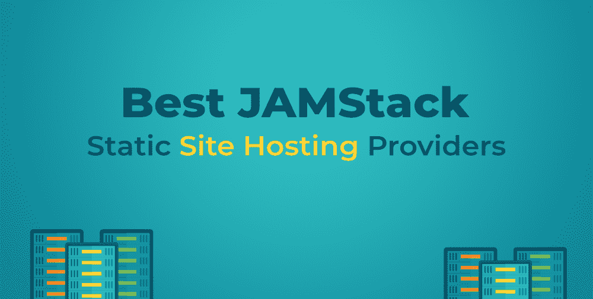

# 最佳 Jamstack 或静态网站托管提供商

> 原文:[https://www . geesforgeks . org/best-jamstack-or-static-site-hosting-providers/](https://www.geeksforgeeks.org/best-jamstack-or-static-site-hosting-providers/)

有一句我们很多人经常听到的流行语，“老了就是金子”。互联网已经从使用拨号调制解调器等待几分钟连接到互联网发展到同时下载数兆字节的信息。同样，网站内容的处理和管理也发生了变化。我们已经从 20 世纪 90 年代的 HTML 和 CSS 发展到 21 世纪初的像 WordPress 这样的内容管理系统。即使现在 WordPress 很受欢迎，但是开发人员正在转向一个新的堆栈，叫做 JAMStack。本文帮助您根据项目需求选择 JAMStack 提供者。

### 什么是 JAMStack？

如果你试图选择一个更好的托管提供商，你可能已经知道什么是 JAMStack，即使这里没有 JAMStack 的基本介绍。JAM 代表 JavaScript 应用编程接口和标记。JAM 堆栈是一种基于客户端 JavaScript、可重用 API 和预构建标记的现代网站架构。JavaScript 和 API 一起为网站提供动态内容。标记有助于使用静态站点生成器(如杰基尔、盖茨比、雨果等)从源文件(如标记文件、HTML 模板和 CSS)生成网站。开发人员采用 JAMstack 的最常见原因是:更快的性能，因为没有服务器端呈现，并且大多数 HTML 已经预先构建，使用 CDN 加载网页的速度更快。由于没有服务器来处理，它本身使网页不太容易受到服务器端攻击和数据库漏洞。比普通网站托管更便宜。可扩展性很容易，因为它只需要升级我们支付的带宽。

### 最佳 JAMStack/静态网站托管提供商

随着一些大玩家也加入游戏，JAMStack 的发展为开发者提供了大量选择。

### 1\. 网流

Netlify 经常被认为是 JAMstack 的先驱。在这个过程中，Netlify 很容易上手。Netlify 从您的 GitHub 存储库中提取内容，并根据您的构建设置构建站点，并将其部署到他们的 CDN。Netlify 还具有广泛的功能，如分析、识别管理、自定义标题、带有免费 SSL 的自定义域、无服务器功能。他们还有一个慷慨的免费计划，100GB 的带宽和 300 分钟的构建时间可以根据需要升级。是初学者的理想选择。

**特征:**

*   提供免费计划
*   部署预览
*   即时回滚
*   身份管理
*   分析学
*   带有免费 SSL 的自定义域
*   全站点密码保护
*   无服务器功能
*   关于电子邮件、可宽延时间、GitHub 请求的最新通知

### 2 .真的

Vercel(也被称为 Zeit)是 Netlify 最大的竞争对手之一。它们还提供了与 Netlify 类似的功能，如部署预览、从 GitHub 存储库中提取内容、带有 SSL 的自定义域、无服务器功能和分析。Vercel 还有一个 100GB 带宽的免费计划，500 个版本也可以升级。

**特征:**

*   提供免费计划
*   部署预览
*   即时回滚
*   分析学
*   带有免费 SSL 的自定义域
*   全站点密码保护
*   无服务器功能

### 3.github pages/GitLab pages(github 页面/gitlab 页面)

GitHub Pages 是 GitHub 的产品，GitHub Pages 是 GitHub 的产品。两者在工作和极限上是相似的。GitHub Pages 是免费的，没有任何升级计划，并且对带宽(100GB)有硬限制，只有一个自定义域，带有免费 SSL。它们不提供额外的好处，如分析、无服务器功能等。它们是为开发人员而不是企业量身定制的。它们在像 Netlify 这样的开发人员中一样受欢迎。

**特征:**

*   仅免费，因此您不会被收取费用
*   直接从您的存储库中
*   带有免费 SSL 的自定义域

### 4.Cloudflare 页面

Cloudflare 在网络托管、网络基础设施公司中非常有名，提供网站安全、域名系统托管、网络应用防火墙等。Cloudflare 在世界各地都有自己的数据中心，它们是域注册中心，有自己的无服务器功能(Netlify/Vercel 依赖上游提供商提供这些功能)。他们也因隐私优先倡议而闻名。像其他公司一样，他们也提供分析、GitHub 拉取、使用 Cloudflare 访问识别管理、使用 SSL 的自定义域。他们的免费计划有无限带宽(如果根据他们的 AUP 使用)，有 500 个版本，可以升级。

**特征:**

*   提供免费计划
*   部署预览
*   访问策略
*   分析学
*   带有免费 SSL 的自定义域
*   无服务器功能
*   其他 Cloudflare 服务，如 SSL、CDN、WAF、DNS 等

### 5.蔚蓝静态网络应用

作为 Azure 服务的一部分，微软也开始了他们自己的 JAMStack，托管 Azure 静态网络应用程序，这些应用程序最近变得普遍可用。它们可能是新的，但它们拥有最可靠的基础设施之一。他们确实有一个 100GB 带宽的免费计划，以及他们自己的无服务器产品 Azure 功能，可以升级。它对于初学者来说可能不太理想，但是如果您有现有的 Azure 基础设施，您可以轻松尝试。

**特征:**

*   提供免费计划
*   带有免费 SSL 的自定义域
*   无服务器功能
*   使用 AAD、GitHub、谷歌、推特进行认证和授权
*   由 Azure 基础设施支持

### 6.S3 +云前线(亚马逊网络服务)

这并不是 JAMStack 托管的直接提供，而是许多 AWS 粉丝相当流行的做法。他们也没有任何免费计划，但他们的现收现付模式相对便宜。如果你是 AWS 的粉丝，你可以试试。

**特征:**

S3+云前线不是 AWS 的直接产品，所以大部分功能要么是 S3(或)云前线的，可能会产生费用

*   现收现付计划可用免费计划在前 12 个月可用)
*   通过云前端定制域和 SSL
*   通过λ@ edge 的边缘函数和通过λ函数的无服务器函数
*   通过 Cloudfront 提供访问控制
*   由自动气象站基础设施支持

这些是一些最好的 JAMStack/Static Site Hosting 提供商，你可以从他们各自的网站上了解更多关于他们的产品。