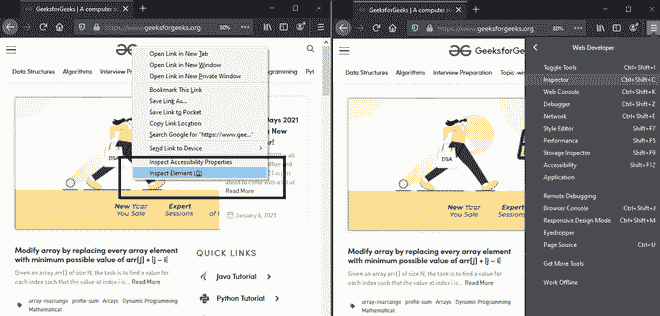
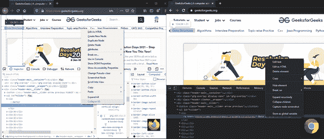
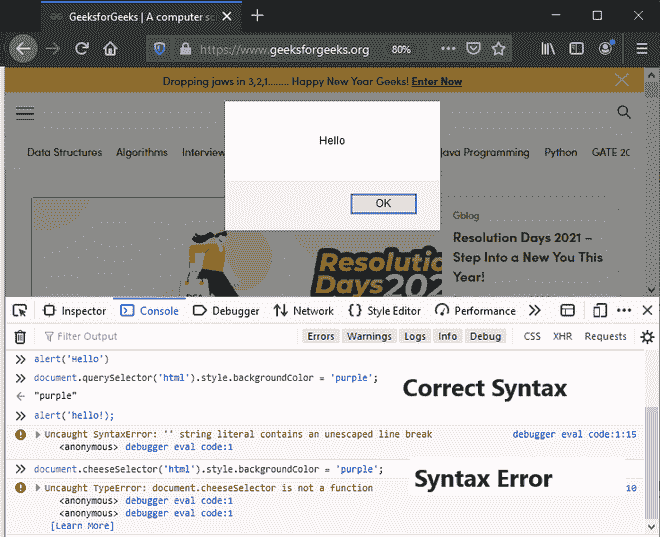
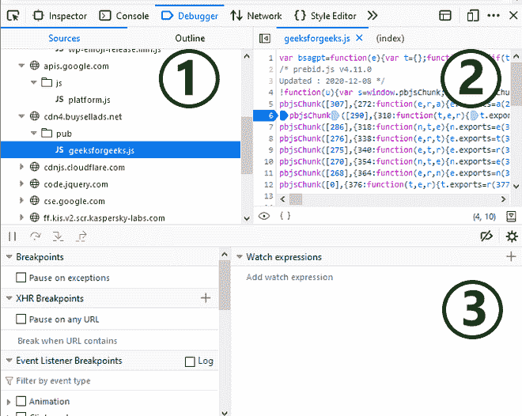
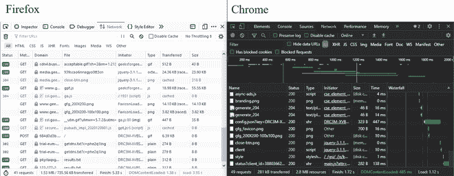
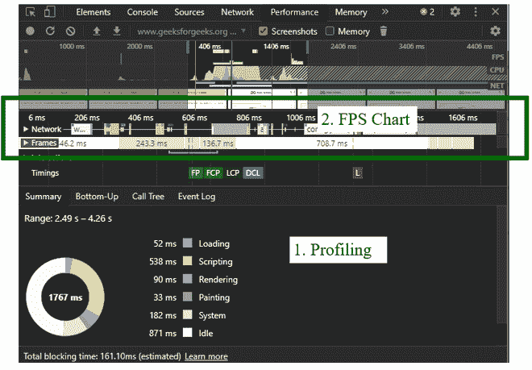
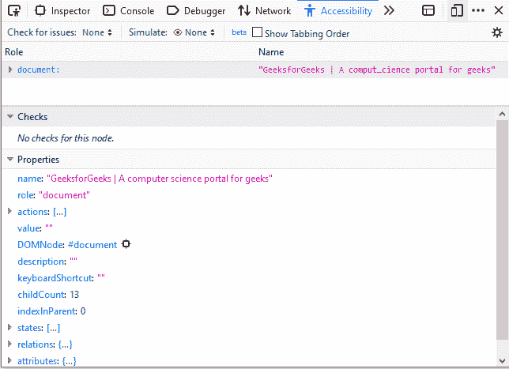

# 浏览器开发者工具

> 原文:[https://www.geeksforgeeks.org/browser-developer-tools/](https://www.geeksforgeeks.org/browser-developer-tools/)

每个 web 开发人员都需要一些基本的工具来理解代码的底层结构，并使我们能够检查 web 内容。开发人员工具直接内置于浏览器中。这些工具依赖于浏览器。大多数这些工具在各种浏览器中很常见，它们可以做很多事情，从检查当前加载的 HTML、CSS 和 JavaScript 的元素。使用开发工具，我们可以直接与获取到系统客户端的源代码进行交互。本文将解释浏览器开发工具的这些基本功能。

在所有浏览器中，开发人员工具的基本功能保持不变，只是命名约定和术语发生了变化。在本文中，我们将主要关注两种流行的浏览器火狐和 Chrome。

## 如何在浏览器中打开开发工具

有许多方法可以打开浏览器开发工具。

*   要访问网页的 DOM 或 CSS，请右键单击页面上所需的元素，然后选择“检查”。或者按 Command+Option+C (Mac)，Control+Shift+C/I (Windows、Linux、Chrome OS)，或者按 F12 (Internet Explorer、Edge)。

## 1.检查员

“检查器”工具允许您查看当前正在检查的网页的 HTML 和 CSS。有了它，您可以检查页面上的每个元素应用了什么样的 CSS。它还允许您预览浏览器中实时反映的对 HTML 和 CSS 的即时更改。这些更改不是永久性的，在您刷新浏览器窗口后会被重置。

*   **编辑为 HTML(添加属性/编辑文本):**这允许更改 HTML 并实时查看结果。对调试和测试最有用。
*   **创建节点:**创建另一个空的内部划分。
*   **复制节点:**创建分割的精确副本，以及相同的属性。
*   **删除节点:**删除当前元素。
*   **复制/复制为 HTML:** 复制当前选中的 HTML。
*   **更改伪类(:悬停/:活动/:焦点):**强制打开元素状态。使我们能够查看元素上的特定样式。**T3】**
*   **复制 CSS 路径/复制 XPath:**Inspector 最有用的功能(该功能可以手动启用)它允许复制 CSS 选择器或 XPath 表达式，这将选择当前的 HTML 元素。

### 应用:

*   查看和更改 DOM/ CSS
*   检查和更改网页。
*   检查动画
*   查找未使用的 CSS。

## 2.安慰

控制台用于调试网页源代码中的 JavaScript。控制台窗口充当我们的调试窗口，允许我们处理不按预期工作的 JavaScript。它允许您针对浏览器中当前加载的页面运行代码块或单行 JavaScript。控制台报告浏览器在尝试执行代码时遇到的错误。

*   控制台识别出了正确的语法，并生成了与 JavaScript 代码相对应的警报消息。
*   它还识别出类型错误，并为我们提供了错误语法的错误消息。

### 应用:

*   查看记录的消息
*   运行 JavaScript
*   保留日志
*   将相似元素分组
*   记录 XmlHttpRequests
*   保持生动的表达

## 3.调试器(火狐)/源代码(Chrome)

源代码/调试器用户界面面板监视 JavaScript 代码，并允许您设置断点和监视变量值。断点设置在代码中我们想要暂停执行周期并调试或识别执行问题的地方。使用这个面板，您可以调试 JavaScript。

**该面板有三个部分:**

**1。** **文件列表(火狐)/文件导航器(Chrome):** 列出与我们正在调试的页面相关联的每个文件。

**2。** **源代码(火狐)/代码编辑器(Chrome):** 所选文件的内容显示在此面板中。断点也可以在这个面板中设置，我们希望暂停执行。

**3。观察表达式和断点:**这些是检查页面 JavaScript 的工具。

还有两个部分只在代码运行时出现。

**4。调用堆栈:**它向您显示执行了什么代码来到达当前行。

**5。范围:**它显示给定代码中从不同角度可见的值。

### 应用:

*   用断点暂停代码。
*   使用工作区将更改保存到磁盘。
*   从任何页面运行代码片段。
*   查找未使用的 JavaScript。
*   使用本地覆盖跨页面重载保持更改。
*   获取一个 JavaScript 调试参考。

## 3.网络监视器

网络面板用于确保正在下载或上传的所有资源都按预期完成。它使我们能够查看页面加载时发出的网络请求。它会告诉您每个请求需要多长时间，以及每个请求的详细信息。监视器加载时为空，监视器打开时一旦执行任何操作，就会创建日志。

网络日志的每一行都代表一个资源列表。这些资源按照以下结构列出:

1.  **状态:**HTTP 响应代码。
2.  **类型**:资源类型。
3.  **启动器:**启动器列是一个超链接，可将您带到请求的源代码。
4.  **时间:**请求所花费的时间。
5.  **时间线/瀑布:**这些请求的各个阶段的图形表示。

### 应用:

*   检查单个资源的属性(HTTP 头、内容、大小)。
*   检查网络请求列表
*   查看网络流量记录
*   创建性能分析
*   检查 web 套接字
*   检查服务器发送的事件
*   抑制网络速度

## 4.性能工具

性能是在运行时记录的，它告诉页面在运行时如何执行，而不是加载。该工具提供了对站点总体响应能力有多好的总体了解。它还测量网站的 JavaScript 和布局性能。该工具创建网站在一段时间内的记录/简档，使该工具运行。使用 RAIL 模型创建了一个概述，列出了为渲染网站而进行的浏览器活动的所有框架。

### 应用:

*   模拟移动中央处理器
*   记录我们网站的运行时性能
*   每秒分析帧数
*   找到瓶颈容量
*   设置 CSS 属性的动画

## 5.辅助检查器

该工具提供了一种访问重要信息的方法，这些信息通常通过辅助功能树显示在当前视图页面上的辅助技术堆栈中。它允许检查缺少什么元素或者需要注意什么。

可访问性是创建尽可能多的人可以使用的网站的实践。该工具尽最大努力不阻止任何人因任何残疾而获取信息。残疾还包括用户由于用于访问网站的设备缺乏功能而无法使用的任何功能。这可能包括他们的网络连接速度，或者他们的地理位置或地区。

辅助功能窗口显示为树形图，表示当前页面上的所有项目。具有嵌套子级的项目有这些箭头，可以单击这些箭头来显示子级的嵌套级别。

### **应用:**

*   全键盘可控
*   将可访问性树打印到 JSON
*   显示网页跳转顺序
*   检查可访问性问题
*   如果被色盲观看，模拟网页
*   用户界面项目的突出显示
*   检查该项是否设置了正确的角色

我们已经讨论了浏览器开发工具面板中的 5 个主要工具，它们是任何用户最常用的。从测试和调试的角度来看，这些工具对开发也很重要。因此，人们总是知道有这样的基本开发和调试工具，这将使它变得容易

### 结论:

浏览器开发工具是非常有用和重要的网络开发工具。实时直接在浏览器中工作的能力有助于简化开发过程。有了这些工具，我们可以利用它们广泛的应用程序来预览样式变化、修改 HTML 或帮助编写 JavaScript 代码以及进行一些调试。使用这些列出的开发工具的方法还有很多，可能性是无穷无尽的。因此，我们总是鼓励尝试每一种工具，因为每一种工具都开启了网络开发的另一个维度。