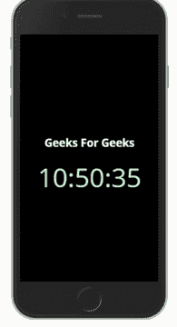

# 用 Apache Cordova 构建应用

> 原文:[https://www . geesforgeks . org/building-apps-with-Apache-Cordova/](https://www.geeksforgeeks.org/building-apps-with-apache-cordova/)

Apache Cordova 是一个混合移动开发框架，用于从渐进式网络应用程序中创建移动应用程序。但是，Apache Cordova 用于使用 web view 制作移动应用程序，不能用于原生安卓应用程序开发。web view 应用程序的缺点是性能比原生应用程序慢，尽管如此，这还不足以改变性能速度。

### 获得阿帕奇科尔多瓦

首先，为您各自的计算机规格安装 [Node.js](https://nodejs.org/en/download/) ，并设置 npm 环境变量。

节点包管理器(npm)用于轻松地在您的计算机上安装、升级或卸载包。我们必须安装科尔多瓦软件包。我们键入以下命令:

```
npm install -g cordova

```

*-g* 表示包是全局安装的，这意味着你可以在电脑的任何地方设置你的 Cordova 项目。

然后下载[安卓 SDK](https://developer.android.com/studio) 安装到你的电脑上。

您已经成功地在电脑中安装了 Cordova 和 Android SDK。现在让我们创建我们的项目。在本文中，我们将使用 HTML、CSS 和 JavaScript 构建一个简单的时钟应用程序。

### 创建项目

转到要在其中创建项目的文件夹。使用以下命令创建第一个项目:

```
cordova create projectDirectory com.example.name ProjectName

```

***com.example.name*** 是项目 ID， ***ProjectName*** 是项目名称，***project directory***是现在为构建我们的 Cordova app 而创建的目录。将工作目录更改为您刚刚创建的项目。

```
cd projectDirectory

```

现在让我们添加我们的平台。需要注意的是，Cordova 是一个混合应用开发框架，这意味着同一个代码库可以部署到 Windows Desktop、Android Phones、iOS Phones 等多个平台。，在本例中，我们将部署到 android。

```
cordova platform add android

```

**注意:**如果要为苹果 iOS 开发，需要有 XCode，只能安装在 MacOS 桌面上。

现在我们已经成功地创建了一个项目，并添加了 android 所需的所有模块。

### 为我们的应用编码

我们将要使用的所有代码文件都将被创建在一个名为 *www* 的文件夹中。这里我们可以看到一个 index.html 文件，js/index.js 文件。我们的切入点将是 index.html。Apache Cordova 应该已经创建了一个简单的入门模板。我们将不再需要它，因为我们将从头开始编码。因此，打开一个代码编辑器，删除 index.html、js/index.js 和 css/index.css 中的所有代码。

现在让我们制作一个简单的 HTML，它有一个显示时钟的 div 容器和一个标题文本。让我们将样式表和 JavaScript 链接到 HTML。现在我们已经有了这个应用的基本视图结构，但是它仍然没有任何作用。为了增加功能，让我们编写一些 javascript 代码。

## 超文本标记语言

```
<!DOCTYPE html>
<html lang="en">
<head>
    <meta charset="UTF-8">
    <meta name="viewport" 
    content="width=device-width, initial-scale=1.0">
    <title>Geeks For Geeks Clock</title>
    <link rel="stylesheet" href="css/index.css">
</head>
<body>    
    <div>
        <h2 id="Text">Geeks For Geeks</h2>
        <div id="ClockDisplay"></div>
    </div>
    <script src="js/index.js"></script>
</body>
</html>
```

让我们在 js/index.js 中添加一些功能，创建一个名为 *showTime* 的函数，该函数接收 *Date* 对象，并将 *ClockDisplay* 所在的容器的内部文本设置为 *time* 。此外，设置功能需要重复的时间间隔。这里，该功能每 1000 毫秒或 1 秒重复一次。

## java 描述语言

```
function showTime() {
    var date = new Date();
    var h = date.getHours();
    var m = date.getMinutes();
    var s = date.getSeconds();

    var time = h + ":" + m + ":" + s;
    document.getElementById("ClockDisplay").innerText = time;
    document.getElementById("ClockDisplay").textContent = time;
}
setInterval(showTime, 1000);
```

现在我们有一个看起来很无聊的钟。因此，让我们在 css/index.css 中添加一些 CSS 来使它看起来更好。

## 半铸钢ˌ钢性铸铁(Cast Semi-Steel)

```
html {
  height: 100%;
}
body {
  height: 100%;
  display: flex;
  align-items: center;
  justify-content: center;
  background-color: black;
  font-family:'Open Sans', sans-serif;
}

#ClockDisplay {
  width: 80%;
  font-size: 20px;
  text-align: center;
  font-size: 19vw;
  color: #acfac1;
  /*text-shadow: 0 0 5px #fff, 0 0 10px #fff,
    0 0 15px #82e896, 0 0 20px #82e896, 
   0 0 25px #82e896, 0 0 30px #82e896, 0 0 35px #82e896;*/
}

#Text {
  color:white;
  font-family:'Open Sans', sans-serif;
  text-align: center;
  font-size: 30px;
}
```

在浏览器上打开 index.html，看看它是否工作。现在我们必须进入下一个阶段，即构建安卓应用程序包(或。apk 文件)。

### 构建我们的应用程序

Apache Cordova 使构建应用程序变得非常简单。打开终端，将目录改为科尔多瓦项目目录。只需键入以下命令即可构建:

```
cordova build android

```

构建过程需要一些时间，将输出文件保存在*”(project folder)\ project \ platforms \ Android \ app \ build \ outputs \ apk \ debug”*中为“*app-debug . apk”*。

将此文件传输到您的手机并安装。



本文旨在教授 Cordova 的基础知识，但是同样的内容可以扩展到构建更复杂的应用程序。