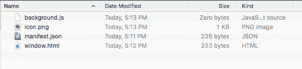
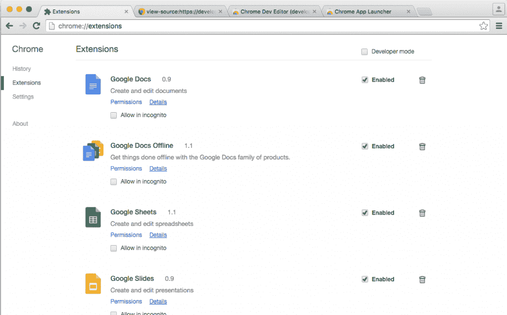
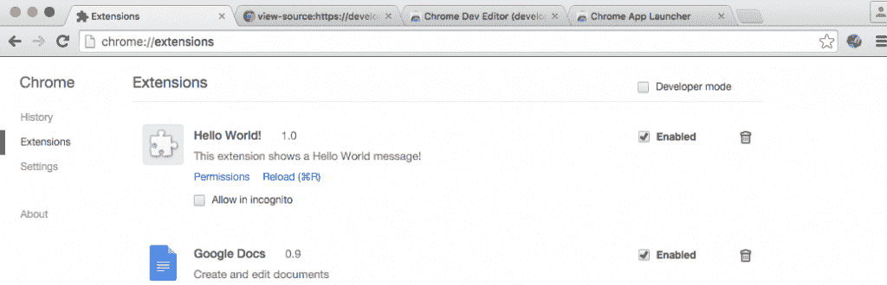
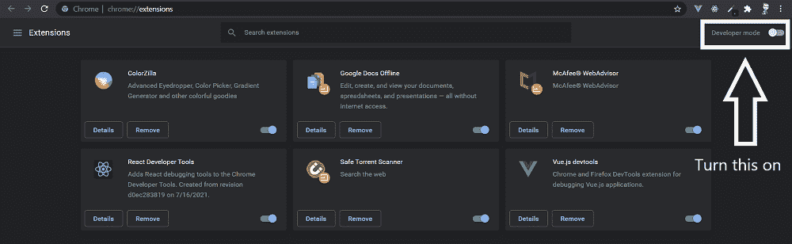
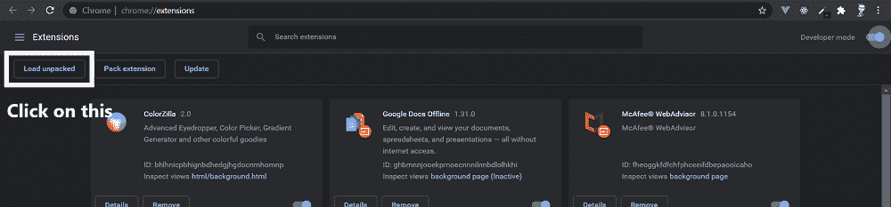
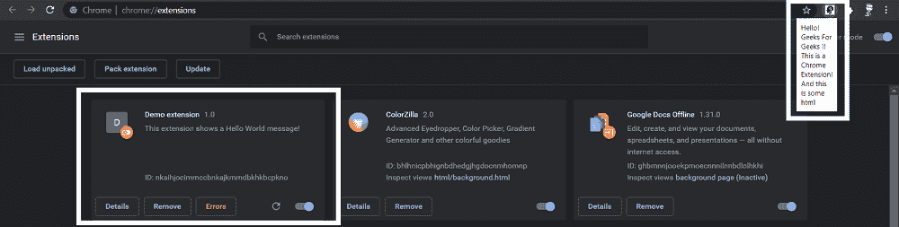

# 构建基本的 Chrome 扩展

> 原文:[https://www . geesforgeks . org/building-basic-chrome-extension/](https://www.geeksforgeeks.org/building-basic-chrome-extension/)

这是您可以开始构建 Chrome Extensions 的地方，最终提高您的工作效率并加快我们的任务。无论是现场比赛配乐、音乐、GeeksforGeeks 新文章更新，还是整页截图，你都可以为每一项任务构建自己的 Chrome 扩展。

所以需要一些基本的东西，就像做一个网站，有一个清单！

*   [**HTML**](https://www.geeksforgeeks.org/html-tutorials/) **:** 所有网站的构建模块，一种标准标记语言，与 CSS 和 JAVASCRIPT 一起被网络开发者用来创建网站、移动用户界面和应用程序。
*   [**【CSS】**](https://www.geeksforgeeks.org/css-tutorials/)**:**一种用于设置 HTML 元素样式的样式表语言。
*   [**JavaScript**](https://www.geeksforgeeks.org/javascript-tutorial/)**:**常用于在网页浏览器内创建交互效果。

**JSON: JavaScript 对象标注**，是一种开放的标准格式，使用人类可读的文本来传输由属性值对组成的数据对象。它是用于异步浏览器/服务器通信(AJAJ)的主要数据格式，在很大程度上取代了 XML(AJAX 使用)。

**一些预备知识:** Chrome 扩展遵循特定的目录结构。这意味着，文件名已经是固定的，它们应该按照指示以某种方式组织。

**Chrome App 主要组件:**

*   **清单**告诉 Chrome 你的应用，它是什么，如何启动它，以及它需要的额外权限。
*   **后台脚本**用于创建负责管理应用生命周期的事件页面。
*   所有代码都必须包含在 Chrome 应用包中。这包括 HTML、JS、CSS 和本机客户端模块。
*   所有**图标**和其他资产也必须包含在包中。

**目录结构:**

*   json
*   <content>。Javascript 文件</content>
*   <markup>。html [ HTML 文件]</markup>
*   巴布亚新几内亚

在这里，我们将为本教程做一个简单的“Hello World”扩展。需要基本理解的有效和有意义的扩展将在接下来跟进

**步骤 1:** 创建一个新的目录，这是我们保存所有文件的地方。

**步骤 2:** 创建一个名为 Manifest.json 的文件

这是基本格式。

```
{
"manifest_version": 2,
"name": “EXTENSION NAME",
"description": "DESCRIPTION",
"version": "1.0",
"browser_action": {
"default_icon": “ICON (WITH EXTENSION) ”,
"default_popup": “LAYOUT HTML FILE"
},
"permissions": [
//ANY OTHER PERMISSIONS
]
}
```

这是我们的 Manifest.json 文件

```
{
"manifest_version": 2,
"name": "Hello World!",
"description": "This extension shows a Hello World message!",
"version": "1.0",
"browser_action": {
"default_icon": "icon.png",
"default_popup": "window.html"
}
}
```

所以一旦你掌握了 manifest.json 的窍门，我们就开始吧。

**步骤 3:** 创建一个名为 window.html 的新文件。

它是当你点击 Chrome 扩展按钮时弹出的 HTML。

```
<!DOCTYPE html>
<html>
<head>
<script src="background.js"></script>
</head>
<body>
<div>Hello! Geeks For Geeks !!</div>
<div>This is a Chrome Extension!</div>
<div>And this is some html</div>
</body>
</html>
```

**步骤 4:** 创建 javascript 文件，我们称之为 background.js，因为我们正在创建一个简单的 HTML 文件，所以您可以完全跳过这一步，因为我们当前的项目不需要任何 javascript。

我们创建它只是为了演示如何将脚本包含在扩展中。

**第五步:**你一定观察到了，图标是扩展不可分割的一部分，在这里你可以点击并开始执行扩展。

我们正在添加一个图标文件，您可以从中获得一个想法。

> icon.png



这就是你的目录在创建完所有 4 个文件后的样子。

**最后一个:**

要加载扩展，

*   将扩展名文件所在的目录拖放到浏览器中的 chrome://extensions 上进行加载。
*   如果扩展有效，它将立即被加载并激活！



打开 <u>chrome://extensions</u> 页面。

将文件夹拖到 <u>chrome://extensions</u> 页面。



安装成功！

点击图标，信息就会显示出来！


**对于 Windows:** 如果使用的是 Windows，可以按照以下步骤操作。

*   在你的谷歌 chrome 浏览器中转到 chrome://extensions。选中右上角的开发人员模式复选框。



*   单击“加载未打包”查看文件选择对话框。



*   选择您的扩展目录，如果扩展有效，它将立即被加载并激活！



这个简单的 Hello World 扩展为我们提供了如何开始创建 Chrome Extensions 的基本知识，就像我们现在熟悉的 manifest.json 和目录结构一样，这是除了 HTML、CSS、JavaScript、JQuery 等基本 web 技术之外的两个新事物。

本文由**赫蒙库马尔**供稿。如果你发现任何不正确的地方，或者你想分享更多关于上面讨论的话题的信息，请写评论。