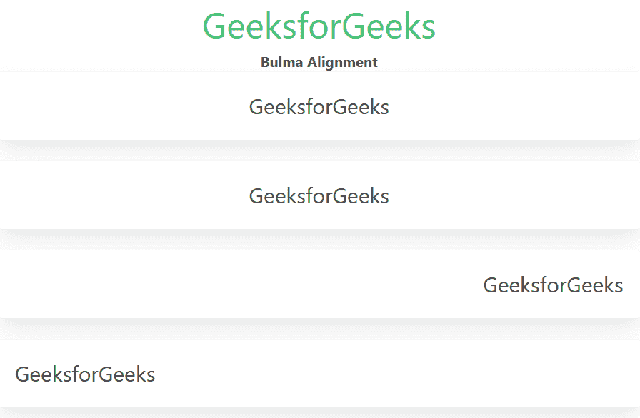

# 布尔玛线形

> 原文:[https://www.geeksforgeeks.org/bulma-alignment/](https://www.geeksforgeeks.org/bulma-alignment/)

[布尔玛](https://www.geeksforgeeks.org/bulma-introduction/)对齐用来对齐你的网站内容，布尔玛有 4 个不同的对齐类。您可以使用它们中的任何一个来调整您的上下文。

**校准等级:**

*   **has-text-centered:** 这个类用于对齐居中的上下文。
*   **has-text-aligned:**这个类用于对齐上下文对齐。
*   **has-text-left:** 这个类用来左对齐上下文。
*   **has-text-right:** 这个类是用来将上下文右对齐的。

**示例:**以下示例说明了布尔玛的“Alignment”类。

## 超文本标记语言

```
<!DOCTYPE html>
<html>

<head>    
    <link rel='stylesheet'
          href=
'https://cdn.jsdelivr.net/npm/bulma@0.9.0/css/bulma.min.css'>
</head>

<body class="has-text-centered">
    <h1 class="is-size-2 has-text-success">
        GeeksforGeeks
    </h1>
    <b>Bulma Alignment</b>
    <br>
    <div class="container">
        <p class="has-text-centered is-size-4 box">
           GeeksforGeeks</p>

        <!-- This can be left align, it's centered because
             of has-text-centered class in body tag  -->
        <p class="has-text-justify is-size-4 box">
             GeeksforGeeks</p>

        <p class="has-text-right is-size-4 box">
             GeeksforGeeks</p>

        <p class="has-text-left is-size-4 box">
           GeeksforGeeks</p>
    </div>
</body>
</html>
```

**输出:**



布尔玛路线

**参考:**[https://bulma . io/documentation/helper/排版-helper/# alignment](https://bulma.io/documentation/helpers/typography-helpers/#alignment)