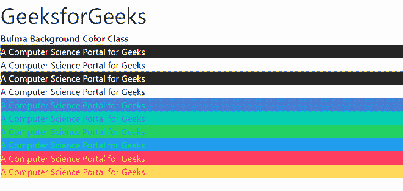

# 布尔玛背景色

> 原文:[https://www.geeksforgeeks.org/bulma-background-color/](https://www.geeksforgeeks.org/bulma-background-color/)

布尔玛是一个基于 Flexbox 的免费开源 CSS 框架。它是组件丰富的，兼容的，并且有很好的文档记录。它本质上是高度反应的。它使用类来实现它的设计。背景类在布尔玛接受很多价值，所有的属性都包含在类的形式中。通过使用这个类，我们可以给任何背景上色。在 CSS 中，我们通过使用 CSS 颜色属性来做到这一点。

**语法:**

```
<tag class="has-background-*">
    Text
</tag>
```

**背景色类**

在上面的语法中，我们可以在*的位置使用下面列出的任何颜色:

*   has-background-white:这个类用来设置背景色为白色。
*   has-background-black:这个类用于将背景颜色设置为黑色。
*   has-背景光:这个类用来设置背景色奶油色。
*   has-background-dark:这个类用来设置背景色为深棕色。
*   has-background-primary:这个类用来设置背景色浅青色。
*   has-background-link:这个类用来设置背景色为蓝色。
*   has-background-info:这个类用于将背景颜色设置为浅蓝色。
*   has-background-success:此类用于将背景颜色设置为绿色。
*   has-background-warning:此类用于将背景颜色设置为黄色。
*   has-background-dance:这个类用来设置背景颜色为红色。

**注意:**您可以将任何元素设置为 10 种颜色或 9 种灰色中的一种。您可以在浅色和深色版本中使用每种颜色。只需追加***-亮**或***-暗**。以下示例说明了布尔玛的文本颜色:

**示例:**

## 超文本标记语言

```
<!DOCTYPE html>
<html>

<head>
    <link rel="stylesheet" href=
"https://cdnjs.cloudflare.com/ajax/libs/bulma/0.7.5/css/bulma.css">
</head>

<body>
    <h1 class="is-size-2">
        GeeksforGeeks
    </h1>
    <b>Bulma Background Color Class</b>
    <br>
    <div>
        <p class="has-text-white has-background-black">
            A Computer Science Portal for Geeks
        </p>

        <p class="has-text-black has-background-white">
            A Computer Science Portal for Geeks
        </p>

        <p class="has-text-light has-background-dark">
            A Computer Science Portal for Geeks
        </p>

        <p class="has-text-dark has-background-light">
            A Computer Science Portal for Geeks
        </p>

        <p class="has-text-primary has-background-link">
            A Computer Science Portal for Geeks
        </p>

        <p class="has-text-link has-background-primary">
            A Computer Science Portal for Geeks
        </p>

        <p class="has-text-info has-background-success">
            A Computer Science Portal for Geeks
        </p>

        <p class="has-text-success has-background-info">
            A Computer Science Portal for Geeks
        </p>

        <p class="has-text-warning has-background-danger">
            A Computer Science Portal for Geeks
        </p>

        <p class="has-text-danger has-background-warning">
            A Computer Science Portal for Geeks
        </p>
    </div>
</body>

</html>
```

**输出:**



**参考:**[https://bulma . io/documentation/helper/color-helper/# background-color](https://bulma.io/documentation/helpers/color-helpers/#background-color)