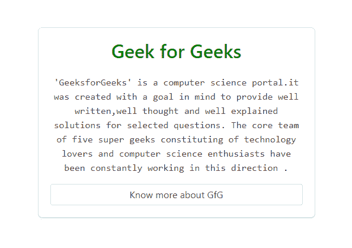
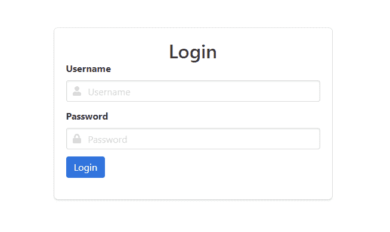
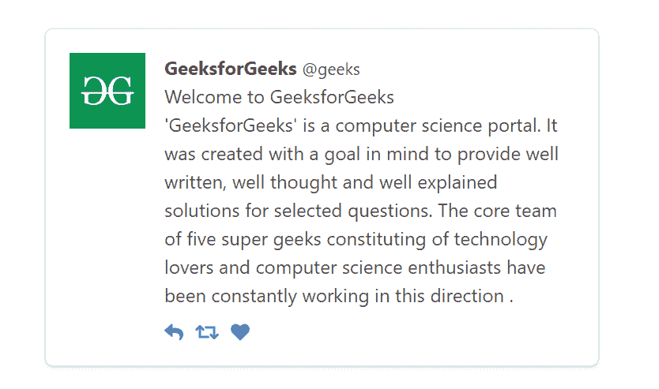

# Bulma | Box

> 哎哎哎:# t0]https://www . geeksforgeeks . org/bulma-box/

**布尔玛**是一个基于 Flexbox 的免费、开源的 CSS 框架。它是组件丰富的，兼容的，并且有很好的文档记录。它本质上是高度反应的。它使用类来实现它的设计。
box 元素只是一个带有阴影、边框、半径和一些填充的容器。在我们的项目设计中，我们可以在许多地方使用它。它给我们的项目一个互动的外观。

**示例 1:** 本示例使用布尔玛创建一个箱式容器。

```htmlhtml
<!DOCTYPE html>
<html>

<head>
    <title>Bulma Box</title>
    <link rel='stylesheet' href=
'https://cdnjs.cloudflare.com/ajax/libs/bulma/0.7.5/css/bulma.css'>

    <!-- custom css -->
    <style>
        div.columns {
            margin-top: 80px;
        }

        .buttons {
            margin-top: 15px;
        }
    </style>
</head>

<body>
    <div class='container has-text-centered'>
        <div class='columns is-mobile is-centered'>
            <div class='column is-5'>
                <div class='box'>
                    <h1 class='title' 
                        style='color:green'>
                        Geek for Geeks
                    </h1>

                    <p class='is-family-monospace'>
                        'GeeksforGeeks' is a computer 
                        science portal.it was created 
                        with a goal in mind to provide
                        well written, well thought and
                        well explained solutions for 
                        selected questions. The core 
                        team of five super geeks 
                        constituting of technology 
                        lovers and computer science 
                        enthusiasts have been constantly 
                        working in this direction.
                    </p>

                    <div class='buttons'>
                        <button class='button 
                            is-fullwidth'>
                            Know more about GfG
                        </button>
                    </div>
                </div>
            </div>
        </div>
    </div>
</body>

</html>
```

**输出:**


**示例 2:** 本示例使用布尔玛创建输入框。

```htmlhtml
<!DOCTYPE html>
<html>

<head>
    <title>Bulma Box</title>
    <link rel='stylesheet' href=
'https://cdnjs.cloudflare.com/ajax/libs/bulma/0.7.5/css/bulma.css'>

    <!-- custom css -->
    <style>
        div.columns {
            margin-top: 80px;
        }

        .buttons {
            margin-top: 12px;
        }
    </style>
</head>

<body>
    <!-- font-awesome cdn -->
    <script src=
'https://cdnjs.cloudflare.com/ajax/libs/font-awesome/5.12.0-2/js/all.min.js'>
    </script>

    <div class='container'>
        <div class='columns is-mobile is-centered'>
            <div class='column is-5'>
                <div class="box">
                    <div>
                        <h1 class='title 
                            has-text-centered'>
                            Login
                        </h1>
                    </div>
                    <form action='#' method='post'>
                        <div class='field'>
                            <label class='label' 
                                id='username'>Username</label>
                            <div class='control has-icons-left'>
                                <input class='input' type='text' 
                                    for='username' 
                                    placeholder='Username'>

                                <span class="icon is-small is-left">
                                    <i class="fas fa-user"></i>
                                </span>
                            </div>
                        </div>

                        <div class='field'>
                            <label class='label' id='password'>
                                Password
                            </label>

                            <div class='control has-icons-left'>
                                <input class='input' type='password'
                                    for='password' 
                                    placeholder='Password'>
                                <span class="icon is-small is-left">
                                    <i class="fas fa-lock"></i>
                                </span>
                            </div>

                            <div class='buttons'>
                                <button class='button is-link'>
                                    Login
                                </button>
                            </div>
                        </div>
                    </form>
                </div>
            </div>
        </div>
    </div>
</body>

</html>
```

**输出:**


**示例 3:** 本示例使用布尔玛创建消息框。

```htmlhtml
<html>

<head>
    <title>Bulma Box</title>
    <link rel='stylesheet' href=
'https://cdnjs.cloudflare.com/ajax/libs/bulma/0.7.5/css/bulma.css'>

    <!-- custom css -->
    <style>
        div.columns {
            margin-top: 80px;
        }

        .buttons {
            margin-top: 15px;
        }
    </style>
</head>

<body>
    <!-- font-awesome cdn -->
    <script src=
'https://cdnjs.cloudflare.com/ajax/libs/font-awesome/5.12.0-2/js/all.min.js'>
    </script>

    <div class='container has-text-centered'>
        <div class='columns is-mobile is-centered'>
            <div class='column is-5'>
                <div class="box">
                    <article class="media">
                        <div class="media-left">
                            <figure class="image is-64x64">
                                
                            </figure>
                        </div>
                        <div class="media-content">
                            <div class="content">
                                <p>
                                    <strong>GeeksforGeeks</strong> 
                                    <small>@geeks</small> 
                                    <br>
                                    Welcome to GeeksforGeeks
                                    </br>
                                    'GeeksforGeeks' is a computer 
                                    science portal. It was created 
                                    with a goal in mind to provide 
                                    well written, well thought and 
                                    well explained solutions for 
                                    selected questions. The core 
                                    team of five super geeks 
                                    constituting of technology lovers 
                                    and computer science enthusiasts 
                                    have been constantly working 
                                    in this direction .
                                </p>
                            </div>
                            <nav class="level is-mobile">
                                <div class="level-left">
                                    <a class="level-item">
                                        <span class="icon is-small">
                                            <i class="fas fa-reply"></i>
                                        </span>
                                    </a>
                                    <a class="level-item">
                                        <span class="icon is-small">
                                            <i class="fas fa-retweet"></i>
                                        </span>
                                    </a>
                                    <a class="level-item">
                                        <span class="icon is-small">
                                            <i class="fas fa-heart"></i>
                                        </span>
                                    </a>
                                </div>
                            </nav>
                        </div>
                    </article>
                </div>
            </div>
        </div>
    </div>
</body>

</html>
```

**输出:**


**注意:**在上面所有的例子中，我们使用了一些额外的布尔玛类，比如容器、列、标题、按钮、媒体、图像、输入、标签等，来很好地设计我们的内容。