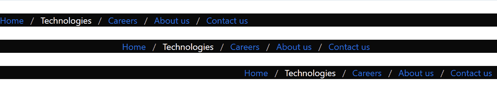
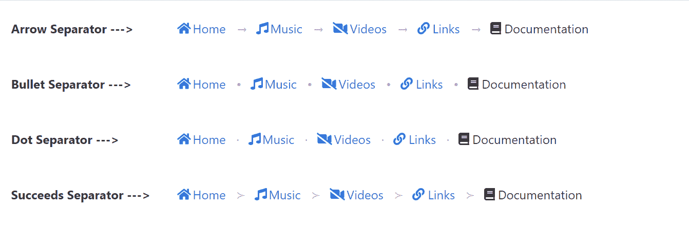

# bulma | bread rum

> 哎哎哎::1230【https://www . geeksforgeeks . org/bulma-breadcrum/

**布尔玛**是一个基于 Flexbox 的免费开源 CSS 框架。它是组件丰富的，兼容的，并且有很好的文档记录。它本质上是高度反应的。它使用类来实现它的设计。
布尔玛面包屑是一个简单的导航组件。导航链接之间的分隔线是在导航标签中添加类别“面包屑”时自动创建的。它使用 li 标签中的“is-active”修饰符来指示当前页面。

**例 1:**

```
<html>
  <head>
    <title>Bulma Breadcrumb</title>
    <link rel='stylesheet' 
          href=
'https://cdnjs.cloudflare.com/ajax/libs/bulma/0.7.5/css/bulma.css'>
    <!-- custom css -->
    <style>
      ul{
        margin-top:24px
      }

    </style>
  </head>
  <body>
    <div class='container'>
      <div>
        <nav class="breadcrumb" aria-label="breadcrumbs">
          <ul>
            <li><a href="#">Home</a></li>
            <li class='is-active'>
                      <a href="#" aria-current="page">
                            Technologies
                      </a>
            </li>
            <li><a href="#">Careers</a></li>
            <li><a href="#">About us</a></li>
            <li><a href="#">Contact us</a></li>
          </ul>
        </nav>
    </div>
    </div>
  </body>
</html>
```

**输出:**


**示例 2:** 不同对齐的面包屑

```
<html>
  <head>
    <title>Bulma Breadcrumb</title>
    <link rel='stylesheet'
          href=
'https://cdnjs.cloudflare.com/ajax/libs/bulma/0.7.5/css/bulma.css'>
    <!-- custom css -->
    <style>
      .breadcrumb ul{
        margin-top:24px;
      }

      li.is-active a{
        color:white !important
      }

    </style>
  </head>
  <body>
    <div>
      <nav class="breadcrumb has-background-black" 
                  aria-label="breadcrumbs">
        <ul>
          <li><a href="#">Home</a></li>
          <li class='is-active'>
                  <a href="#" aria-current="page">
                       Technologies
                  </a>
          </li>
          <li><a href="#">Careers</a></li>
          <li><a href="#">About us</a></li>
          <li><a href="#">Contact us</a></li>
        </ul>
      </nav>
    </div>

    <div>
      <nav class="breadcrumb is-centered has-background-black"
           aria-label="breadcrumbs">
        <ul>
          <li><a href="#">Home</a></li>
          <li class='is-active'>
               <a href="#" aria-current="page">
                           Technologies
               </a>
          </li>
          <li><a href="#">Careers</a></li>
          <li><a href="#">About us</a></li>
          <li><a href="#">Contact us</a></li>
        </ul>
      </nav>
    </div>

    <div>
      <nav class="breadcrumb is-right has-background-black"
           aria-label="breadcrumbs">
        <ul>
          <li><a href="#">Home</a></li>
          <li class='is-active'>
               <a href="#" aria-current="page">
                     Technologies
               </a>
          </li>
          <li><a href="#">Careers</a></li>
          <li><a href="#">About us</a></li>
          <li><a href="#">Contact us</a></li>
        </ul>
      </nav>
    </div>
  </body>
</html>
```

**输出:**



**例 3:** 不同大小的面包屑

```
<html>
  <head>
    <title>Bulma Breadcrumb</title>
    <link rel='stylesheet'
          href=
'https://cdnjs.cloudflare.com/ajax/libs/bulma/0.7.5/css/bulma.css'>
    <!-- custom css -->
    <style>
      .breadcrumb ul{
        margin-top:24px;
      }

      li.is-active a{
        color:white !important
      }

    </style>
  </head>
  <body>
    <div>
      <nav class="breadcrumb is-small has-background-black" 
           aria-label="breadcrumbs">
        <ul>
          <li><a href="#">Home</a></li>
          <li class='is-active'>
                <a href="#" aria-current="page">Technologies
             </a></li>
          <li><a href="#">Careers</a></li>
          <li><a href="#">About us</a></li>
          <li><a href="#">Contact us</a></li>
        </ul>
      </nav>
    </div>

    <div>
      <nav class="breadcrumb is-medium has-background-black"
                aria-label="breadcrumbs">
        <ul>
          <li><a href="#">Home</a></li>
          <li class='is-active'>
                <a href="#" aria-current="page">
                 Technologies</a></li>
          <li><a href="#">Careers</a></li>
          <li><a href="#">About us</a></li>
          <li><a href="#">Contact us</a></li>
        </ul>
      </nav>
    </div>

    <div>
      <nav class="breadcrumb is-large has-background-black"
           aria-label="breadcrumbs">
        <ul>
          <li><a href="#">Home</a></li>
          <li class='is-active'>
                  <a href="#" aria-current="page">
             Technologies</a></li>
          <li><a href="#">Careers</a></li>
          <li><a href="#">About us</a></li>
          <li><a href="#">Contact us</a></li>
        </ul>
      </nav>
    </div>
  </body>
</html>
```

**输出:**


**示例 4:** 带图标的面包屑

```
<html>
  <head>
    <title>Bulma Breadcrumb</title>
    <link rel='stylesheet' 
          href=
'https://cdnjs.cloudflare.com/ajax/libs/bulma/0.7.5/css/bulma.css'>
    <!-- custom css -->
    <style>
      .breadcrumb ul{
        margin-top:24px;
      }

      span{
        margin-right:2px;
      }

    </style>
  </head>
  <body>
    <!-- font-awesome cdn -->
    <script src=
'https://cdnjs.cloudflare.com/ajax/libs/font-awesome/5.12.0-2/js/all.min.js'>
    </script>

    <div>
      <nav class="breadcrumb aria-label="breadcrumbs">
        <ul>
          <li>
            <a href="#">
              <span>
                <i class="fas fa-home"
                    aria-hidden="true"></i>
              </span>
              <span>Home</span>
            </a>
          </li>

          <li>
            <a href="#">
              <span>
                <i class="fas fa-music" 
                    aria-hidden="true"></i>
              </span>
              <span>Music</span>
            </a>
          </li>

          <li>
            <a href="#">
              <span>
                <i class="fas fa-video-slash"
                    aria-hidden="true"></i>
              </span>
              <span>Videos</span>
            </a>
          </li>

          <li>
            <a href="#">
              <span>
                <span>
                  <i class="fas fa-link" 
                      aria-hidden="true"></i>
                </span>
              </span>
              <span>Links</span>
            </a>
          </li>

          <li class='is-active'>
            <a href="#" aria-current="page">
              <span>
                <span>
                  <i class="fas fa-book" aria-hidden="true"></i>
                </span>
              </span>
              <span>Documentation</span>
            </a>
          </li>

        </ul>
      </nav>
    </div>

  </body>
</html>
```

**输出:**


**实施例 5:** 不同的分离器

```
<html>
  <head>
    <title>Bulma Breadcrumb</title>
    <link rel='stylesheet'
          href=
'https://cdnjs.cloudflare.com/ajax/libs/bulma/0.7.5/css/bulma.css'>
    <!-- custom css -->
    <style>
      .breadcrumb ul{
        margin-top:24px;
      }

      p{
        margin-top:24px;
        margin-left:15px;
      }

      span{
        margin-right:2px;
      }

    </style>
  </head>
  <body>
    <!-- font-awesome cdn -->
    <script src=
'https://cdnjs.cloudflare.com/ajax/libs/font-awesome/5.12.0-2/js/all.min.js'>
    </script>

    <div class='columns'>
      <div class='column is-3'>
        <p><strong>Arrow Separator ---> </strong></p>
      </div>
      <div class='column is-8'>
        <nav class="breadcrumb has-arrow-separator" 
             aria-label="breadcrumbs">
          <ul>
            <li>
              <a href="#">
                <span>
                  <i class="fas fa-home" 
                     aria-hidden="true"></i>
                </span>
                <span>Home</span>
              </a>
            </li>

            <li>
              <a href="#">
                <span>
                  <i class="fas fa-music" 
                     aria-hidden="true"></i>
                </span>
                <span>Music</span>
              </a>
            </li>

            <li>
              <a href="#">
                <span>
                  <i class="fas fa-video-slash" 
                     aria-hidden="true"></i>
                </span>
                <span>Videos</span>
              </a>
            </li>

            <li>
              <a href="#">
                <span>
                  <span>
                    <i class="fas fa-link"
                       aria-hidden="true"></i>
                  </span>
                </span>
                <span>Links</span>
              </a>
            </li>

            <li class='is-active'>
              <a href="#" aria-current="page">
                <span>
                  <span>
                    <i class="fas fa-book"
                       aria-hidden="true"></i>
                  </span>
                </span>
                <span>Documentation</span>
              </a>
            </li>

          </ul>
        </nav>
      </div>
    </div>

    <div class='columns'>
      <div class='column is-3'>
        <p><strong>Bullet Separator ---> </strong></p>
      </div>
      <div class='column is-8'>
        <nav class="breadcrumb has-bullet-separator" 
             aria-label="breadcrumbs">
          <ul>
            <li>
              <a href="#">
                <span>
                  <i class="fas fa-home" aria-hidden="true"></i>
                </span>
                <span>Home</span>
              </a>
            </li>

            <li>
              <a href="#">
                <span>
                  <i class="fas fa-music" 
                      aria-hidden="true"></i>
                </span>
                <span>Music</span>
              </a>
            </li>

            <li>
              <a href="#">
                <span>
                  <i class="fas fa-video-slash" 
                     aria-hidden="true"></i>
                </span>
                <span>Videos</span>
              </a>
            </li>

            <li>
              <a href="#">
                <span>
                  <span>
                    <i class="fas fa-link"
                        aria-hidden="true"></i>
                  </span>
                </span>
                <span>Links</span>
              </a>
            </li>

            <li class='is-active'>
              <a href="#" aria-current="page">
                <span>
                  <span>
                    <i class="fas fa-book" 
                       aria-hidden="true"></i>
                  </span>
                </span>
                <span>Documentation</span>
              </a>
            </li>

          </ul>
        </nav>
      </div>
    </div>

    <div class="columns">
      <div class="column is-3">
        <p><strong>Dot Separator ---> </strong></p>
      </div>
      <div class='column is-8'>
        <nav class="breadcrumb has-dot-separator" 
             aria-label="breadcrumbs">
          <ul>
            <li>
              <a href="#">
                <span>
                  <i class="fas fa-home" aria-hidden="true"></i>
                </span>
                <span>Home</span>
              </a>
            </li>

            <li>
              <a href="#">
                <span>
                  <i class="fas fa-music" aria-hidden="true"></i>
                </span>
                <span>Music</span>
              </a>
            </li>

            <li>
              <a href="#">
                <span>
                  <i class="fas fa-video-slash" aria-hidden="true"></i>
                </span>
                <span>Videos</span>
              </a>
            </li>

            <li>
              <a href="#">
                <span>
                  <span>
                    <i class="fas fa-link" aria-hidden="true"></i>
                  </span>
                </span>
                <span>Links</span>
              </a>
            </li>

            <li class='is-active'>
              <a href="#" aria-current="page">
                <span>
                  <span>
                    <i class="fas fa-book" aria-hidden="true"></i>
                  </span>
                </span>
                <span>Documentation</span>
              </a>
            </li>

          </ul>
        </nav>
      </div>
    </div>

    <div class="columns">
      <div class="column is-3">
        <p><strong>Succeeds Separator ---> </strong></p>
      </div>
      <div class='column is-8'>
        <nav class="breadcrumb has-succeeds-separator" 
             aria-label="breadcrumbs">
          <ul>
            <li>
              <a href="#">
                <span>
                  <i class="fas fa-home" aria-hidden="true"></i>
                </span>
                <span>Home</span>
              </a>
            </li>

            <li>
              <a href="#">
                <span>
                  <i class="fas fa-music" aria-hidden="true"></i>
                </span>
                <span>Music</span>
              </a>
            </li>

            <li>
              <a href="#">
                <span>
                  <i class="fas fa-video-slash" aria-hidden="true"></i>
                </span>
                <span>Videos</span>
              </a>
            </li>

            <li>
              <a href="#">
                <span>
                  <span>
                    <i class="fas fa-link" aria-hidden="true"></i>
                  </span>
                </span>
                <span>Links</span>
              </a>
            </li>

            <li class='is-active'>
              <a href="#" aria-current="page">
                <span>
                  <span>
                    <i class="fas fa-book" aria-hidden="true"></i>
                  </span>
                </span>
                <span>Documentation</span>
              </a>
            </li>

          </ul>
        </nav>
      </div>
    </div>

  </body>
</html>
```

**输出:**

