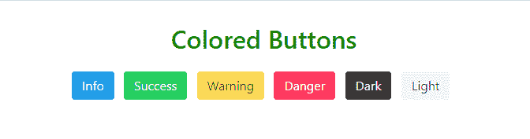
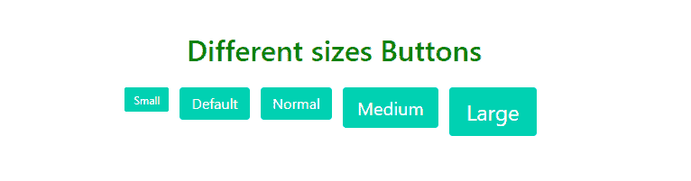
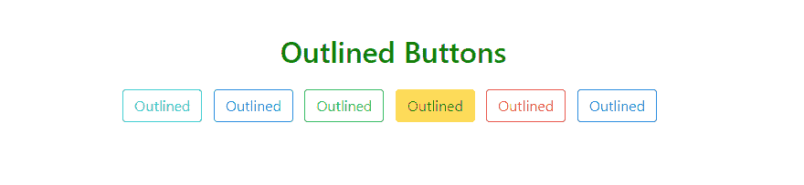
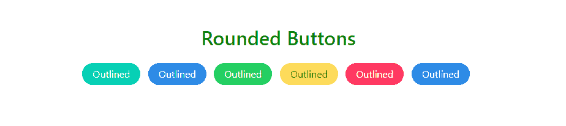
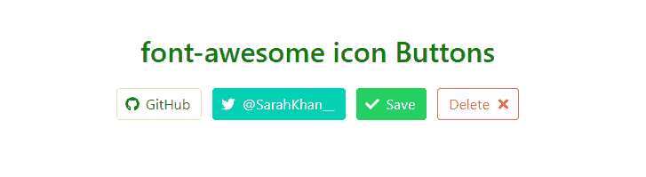

# 茶壶|按钮

> 哎哎哎:# t0]https://www . geeksforgeeks . org/bulma-button/

**布尔玛**是一个基于 Flexbox 的免费、开源的 CSS 框架。它是组件丰富的，兼容的，并且有很好的文档记录。它本质上是高度反应的。它使用类来实现它的设计。布尔玛 CSS 中的
**按钮**有不同颜色、大小和状态的经典设计，这使得它具有交互性。

**示例 1:** 本示例使用布尔玛创建彩色按钮。

```html
<!DOCTYPE html>
<html>

<head>
    <title>Bulma buttons</title>

    <link rel='stylesheet' href=
'https://cdnjs.cloudflare.com/ajax/libs/bulma/0.7.5/css/bulma.css'>

    <!-- custom css -->
    <style>
        .buttons {
            display: block;
        }
    </style>
</head>

<body>
    <div class='container has-text-centered'>
        <h1 style='color:green;margin-top:30px' 
            class='title'>Colored Buttons</h1>

        <div class='buttons'>
            <button class="button is-info">
                Info
            </button>
            <button class="button is-success">
                Success
            </button>
            <button class="button is-warning">
                Warning
            </button>
            <button class="button is-danger">
                Danger
            </button>
            <button class="button is-dark">
                Dark
            </button>
            <button class="button is-light">
                Light
            </button>
        </div>
    </div>
</body>

</html>
```

**输出:**


**示例 2:** 本示例创建不同大小的按钮。

```html
<!DOCTYPE html>
<html>

<head>
    <title>Bulma buttons</title>
    <link rel='stylesheet' href=
'https://cdnjs.cloudflare.com/ajax/libs/bulma/0.7.5/css/bulma.css'>
    <!-- custom css -->
    <style>
        .buttons {
            display: block;
        }
    </style>
</head>

<body>
    <div class='container has-text-centered'>
        <h1 style='color:green;margin-top:30px'
            class='title'>
            Different sizes Buttons
        </h1>

        <div class='buttons'>
            <button class="button is-small is-primary">
                Small
            </button>
            <button class="button is-primary">
                Default
            </button>
            <button class="button is-normal is-primary">
                Normal
            </button>
            <button class="button is-medium is-primary">
                Medium
            </button>
            <button class="button is-large is-primary">
                Large
            </button>
        </div>
    </div>
</body>

</html>
```

**输出:**


**示例 3:** 本示例创建轮廓按钮。

```html
<!DOCTYPE html>
<html>

<head>
    <title>Bulma buttons</title>
    <link rel='stylesheet' href=
'https://cdnjs.cloudflare.com/ajax/libs/bulma/0.7.5/css/bulma.css'>
    <!-- custom css -->
    <style>
        .buttons {
            display: block;
        }
    </style>
</head>

<body>
    <div class='container has-text-centered'>
        <h1 style='color:green;margin-top:80px'
            class='title'>Outlined Buttons</h1>

        <div class='buttons'>
            <button class="button is-primary 
                is-outlined">Outlined</button>
            <button class="button is-info 
                is-outlined">Outlined</button>
            <button class="button is-success 
                is-outlined">Outlined</button>
            <button class="button is-warning 
                is-outlined">Outlined</button>
            <button class="button is-danger 
                is-outlined">Outlined</button>
            <button class="button is-link 
                is-outlined">Outlined</button>
        </div>
    </div>
</body>

</html>
```

**输出:**


**注意:**轮廓按钮仅表示按钮的轮廓可见，当悬停在按钮上时，它会变成全块按钮，背景颜色可见，就像图片中的第四个按钮一样。

**示例 4:** 本示例使用布尔玛创建圆形按钮。

```html
<!DOCTYPE html>
<html>

<head>
    <title>Bulma buttons</title>
    <link rel='stylesheet' href=
'https://cdnjs.cloudflare.com/ajax/libs/bulma/0.7.5/css/bulma.css'>
    <!-- custom css -->
    <style>
        .buttons {
            display: block;
        }
    </style>
</head>

<body>
    <div class='container has-text-centered'>
        <h1 style='color:green;margin-top:80px' 
            class='title'>Rounded Buttons</h1>

        <div class='buttons'>
            <button class="button is-primary 
                is-rounded">Outlined</button>
            <button class="button is-info 
                is-rounded">Outlined</button>
            <button class="button is-success 
                is-rounded">Outlined</button>
            <button class="button is-warning 
                is-rounded">Outlined</button>
            <button class="button is-danger 
                is-rounded">Outlined</button>
            <button class="button is-link 
                is-rounded">Outlined</button>
        </div>
    </div>
</body>

</html>
```

**输出:**


**示例 5:** 本示例使用布尔玛创建加载按钮。

```html
<!DOCTYPE html>
<html>

<head>
    <title>Bulma buttons</title>
    <link rel='stylesheet' href=
'https://cdnjs.cloudflare.com/ajax/libs/bulma/0.7.5/css/bulma.css'>
    <!-- custom css -->
    <style>
        .buttons {
            display: block;
        }
    </style>
</head>

<body>
    <div class='container has-text-centered'>
        <h1 style='color:green;margin-top:80px' 
            class='title'>Loading Buttons</h1>

        <div class='buttons'>
            <button class="button is-primary 
                is-loading">Loading</button>
            <button class="button is-info 
                is-loading">Loading</button>
            <button class="button is-success 
                is-loading">Loading</button>
            <button class="button is-warning 
                is-loading">Loading</button>
            <button class="button is-danger 
                is-loading">Loading</button>
            <button class="button is-link 
                is-loading">Loading</button>
        </div>
    </div>
</body>

</html>
```

**输出:**


**注意:**按钮中的半圆保持旋转，即有东西被加载。

**示例 6:** 本示例创建字体棒极了的图标按钮。

```html
<!DOCTYPE html>
<html>

<head>
    <title>Bulma buttons</title>
    <link rel='stylesheet' href=
'https://cdnjs.cloudflare.com/ajax/libs/bulma/0.7.5/css/bulma.css'>

    <!-- custom css -->
    <style>
        .buttons {
            display: block;
        }
    </style>
</head>

<body>
    <!-- font-awesome cdn -->
    <script src=
'https://cdnjs.cloudflare.com/ajax/libs/font-awesome/5.12.0-2/js/all.min.js'>
    </script>

    <div class='container has-text-centered'>
        <h1 style='color:green;margin-top:80px' 
            class='title'>
            font-awesome icon Buttons
        </h1>

        <div class="buttons">
            <button class="button">
                <span class="icon">
                    <i class="fab fa-github"></i>
                </span>
                <span>GitHub</span>
            </button>
            <button class="button is-primary">
                <span class="icon">
                    <i class="fab fa-twitter"></i>
                </span>
                <span>@SarahKhan__</span>
            </button>
            <button class="button is-success">
                <span class="icon is-small">
                    <i class="fas fa-check"></i>
                </span>
                <span>Save</span>
            </button>
            <button class="button is-danger 
                    is-outlined">
                <span>Delete</span>
                <span class="icon is-small">
                    <i class="fas fa-times"></i>
                </span>
            </button>
        </div>
    </div>
</body>

</html>
```

**输出:**
