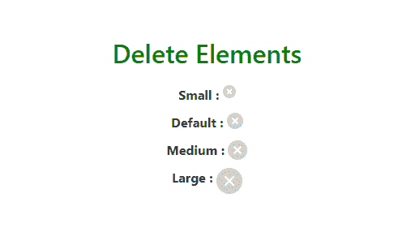
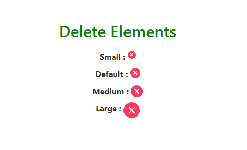
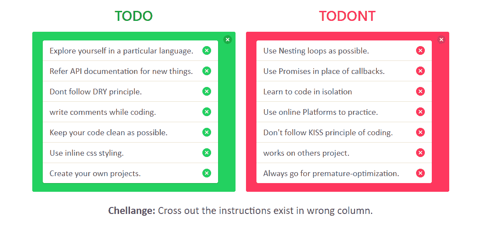

# 查找\删除

> 原文:[https://www.geeksforgeeks.org/bulma-delete/](https://www.geeksforgeeks.org/bulma-delete/)

**布尔玛**是一个基于 Flexbox 的免费开源 CSS 框架。它是组件丰富的，兼容的，并且有很好的文档记录。它本质上是高度反应的。它使用类来实现它的设计。
**删除**是一个可以在不同上下文中使用的元素。这是一个链接或按钮，用于弹出页面、框或页面上的模型。当有人点击删除按钮时，会触发一些 JavaScript 代码，这些 JavaScript 代码会导致该模型弹出(布尔玛是一个纯 CSS 框架，它只负责设计部分)。
**示例 1:** 本示例创建不同的大小来删除元素选项。

## 超文本标记语言

```html
<!DOCTYPE html>
<html>

<head>
    <title>Bulma Delete</title>
    <link rel='stylesheet' href=
'https://cdnjs.cloudflare.com/ajax/libs/bulma/0.7.5/css/bulma.css'>

    <!-- custom css -->
    <style>
        div.columns {
            margin-top: 80px;
        }

        h1 {
            width: 100%;
            margin-top: 70px;
            color: green !important
        }

        div.columns {
            margin-top: 10px;
        }

        div.column {
            text-align: center;
        }

        .custom {
            margin-bottom: 10px;
        }
    </style>
</head>

<body>
    <div class='container'>
        <div>
            <h1 class='title has-text-centered'>
                Delete Elements
            </h1>
        </div>

        <div class='columns is-mobile is-centered'>
            <div class='column is-5'>
                <div class='custom'>
                    <strong>Small : </strong>
                    <a class="delete is-small"></a>
                </div>

                <div class='custom'>
                    <strong>Default : </strong>
                    <a class="delete"></a>
                </div>

                <div class='custom'>
                    <strong>Medium : </strong>
                    <a class="delete is-medium"></a>
                </div>

                <div class='custom'>
                    <strong>Large : </strong>
                    <a class="delete is-large"></a>
                </div>
            </div>
        </div>
    </div>
</body>

</html>
```

**输出:**



**示例 2:** 本示例使用背景色创建删除元素。

## 超文本标记语言

```html
<!DOCTYPE html>
<html>

<head>
    <title>Bulma Delete</title>
    <link rel='stylesheet' href=
'https://cdnjs.cloudflare.com/ajax/libs/bulma/0.7.5/css/bulma.css'>

    <!-- custom css -->
    <style>
        div.columns {
            margin-top: 80px;
        }

        h1 {
            width: 100%;
            margin-top: 70px;
            color: green !important
        }

        div.columns {
            margin-top: 10px;
        }

        div.column {
            text-align: center;
        }

        .custom {
            margin-bottom: 10px;
        }
    </style>
</head>

<body>
    <div class='container'>
        <div>
            <h1 class='title has-text-centered'>
                Delete Elements
            </h1>
        </div>

        <div class='columns is-mobile is-centered'>
            <div class='column is-5'>
                <div class='custom'>
                    <strong>Small : </strong>
                    <a class="delete is-small
                        has-background-danger"></a>
                </div>

                <div class='custom'>
                    <strong>Default : </strong>
                    <a class="delete
                        has-background-danger"></a>
                </div>

                <div class='custom'>
                    <strong>Medium : </strong>
                    <a class="delete is-medium
                        has-background-danger"></a>
                </div>

                <div class='custom'>
                    <strong>Large : </strong>
                    <a class="delete is-large
                        has-background-danger"></a>
                </div>
            </div>
        </div>
    </div>
</body>

</html>
```

**输出:**



**例 3:**

## 超文本标记语言

```html
<html>

<head>
    <title>Bulma Delete</title>
    <link rel='stylesheet' href=
'https://cdnjs.cloudflare.com/ajax/libs/bulma/0.7.5/css/bulma.css'>

    <!-- custom css -->
    <style>
        div.columns {
            margin-top: 80px;
        }

        h1 {
            margin-top: 10px;
            margin-bottom: 20px;
        }

        div.columns {
            margin-top: 10px;
        }

        div.column {
            text-align: center;
        }

        .custom {
            margin-bottom: 10px;
        }

        p {
            font-size: 20px;
            font-family: calibri;
            text-align: left;
        }

        p button.delete {
            float: right;
            margin-top: 5px;
        }

        span {
            font-size: 25px;
            font-family: calibri;
        }

        #challenge {
            font-size: 25px;
            font-family: calibri;
        }
    </style>
</head>

<body>
    <div class='container'>
        <div class='columns
            is-mobile is-centered'>

            <!-- Start of DO -->
            <div class='column is-5'>
                <div>
                    <h1 class='title has-text-centered'
                        style='color:green'>TODO</h1>
                </div>
                <div class='notification is-success'>
                    <button class="delete"></button>

                    <div class='list'>
                        <div class='list-item'>

<p>
                                Explore yourself in a
                                particular language.
                                <button class="delete
                                    has-background-success">
                                </button>
                            </p>

                        </div>

                        <div class='list-item'>

<p>
                                Refer API documentation
                                for new things.
                                <button class="delete
                                    has-background-success">
                                </button>
                            </p>

                        </div>

                        <div class='list-item'>

<p>
                                Dont follow DRY principle.
                                <button class="delete
                                    has-background-success">
                                </button>
                            </p>

                        </div>

                        <div class='list-item'>

<p>
                                write comments while coding.
                                <button class="delete
                                    has-background-success">
                                </button>
                            </p>

                        </div>

                        <div class='list-item'>

<p>
                                Keep your code clean
                                as possible.
                                <button class="delete
                                    has-background-success">
                                </button>
                            </p>

                        </div>

                        <div class='list-item'>

<p>
                                Use inline css styling.
                                <button class="delete
                                    has-background-success">
                                </button>
                            </p>

                        </div>

                        <div class='list-item'>

<p>
                                Create your own projects.
                                <button class="delete
                                    has-background-success">
                                </button>
                            </p>

                        </div>

                    </div>
                </div>
            </div>

            <!-- Start of DONT -->
            <div class='column is-5 '>
                <div>
                    <h1 class='title has-text-centered'
                        style='color:red'>TODONT</h1>
                </div>
                <div class='notification is-danger'>
                    <button class="delete"></button>

                    <div class='list'>
                        <div class='list-item'>

<p>
                                Use Nesting loops as possible.
                                <button class="delete
                                    has-background-danger">
                                </button>
                            </p>

                        </div>

                        <div class='list-item'>

<p>
                                Use Promises in place
                                of callbacks.
                                <button class="delete
                                    has-background-danger">
                                </button>
                            </p>

                        </div>

                        <div class='list-item'>

<p>
                                Learn to code in isolation
                                <button class="delete
                                    has-background-danger">
                                </button>
                            </p>

                        </div>

                        <div class='list-item'>

<p>
                                Use online Platforms to
                                practice.
                                <button class="delete
                                    has-background-danger">
                                </button>
                            </p>

                        </div>

                        <div class='list-item'>

<p>
                                Don't follow KISS
                                principle of coding.
                                <button class="delete
                                    has-background-danger">
                                </button>
                            </p>

                        </div>

                        <div class='list-item'>

<p>
                                works on others project.
                                <button class="delete
                                    has-background-danger">
                                </button>
                            </p>

                        </div>

                        <div class='list-item'>

<p>
                                Always go for
                                premature-optimization.
                                <button class="delete
                                    has-background-danger">
                                </button>
                            </p>

                        </div>

                    </div>
                </div>
            </div>
        </div>

        <!-- challenge -->
        <div class='has-text-centered'>
            <strong id='challenge'>Challenge: </strong>
            <span>
                Cross out the instructions
                exist in wrong column.
            </span>
        </div>
    </div>
</body>

</html>
```

**输出:**



**注意:**在上面所有的例子中，我们使用了一些额外的布尔玛类，如容器、列、标题、列表等。设计好我们的内容。