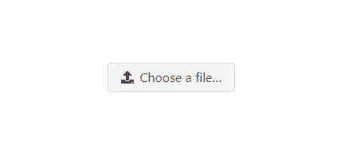
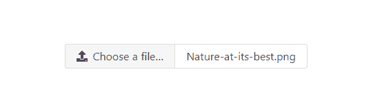
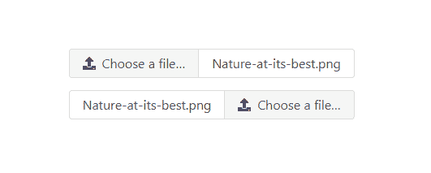
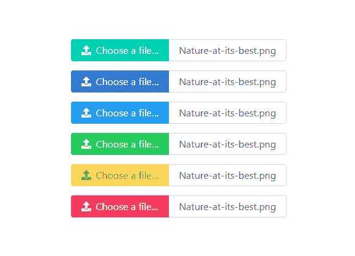
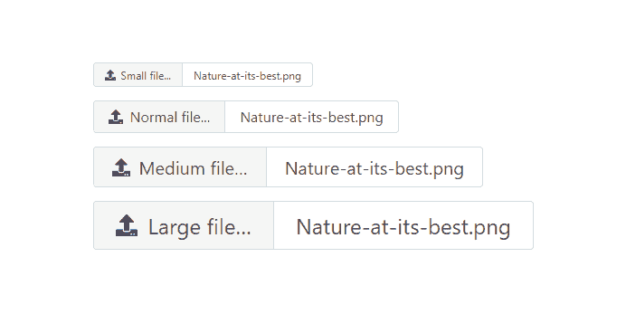
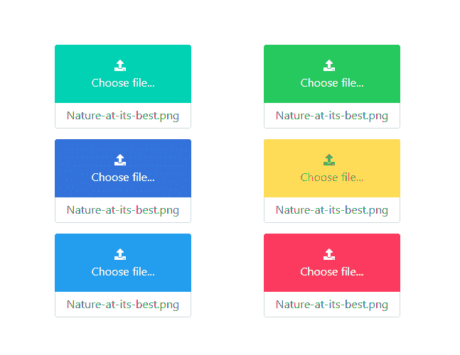

# Bulma | File

> 哎哎哎:# t0]https://www . geeksforgeeks . org/bulma-file/

布尔玛是一个基于 Flexbox 的免费开源 CSS 框架。它是组件丰富的，兼容的，并且有很好的文档记录。它本质上是高度反应的。它使用类来实现它的设计。

**文件**元素用于上传自定义文件输入。“文件”组件由几个子元素组成，我们必须专门添加这些子元素才能很好地设计我们的内容。下面列出了这些元素。

*   **file-label**

    **–**

    *   **文件输入****–**它是原生文件输入，为造型目的而隐藏。
    *   **文件-CTA–**是上传的行动号召。
        *   **文件-图标-** 是可选的上传图标
        *   **文件-标签****–**“选择文件…”文本
    *   **文件名–**所选文件名的容器。

    **示例 1:** 此示例显示了简单的布尔玛文件输入。

    ```
    <!DOCTYPE html>
    <html>
      <head>
        <title>Bulma File</title>
        <link rel='stylesheet' 
              href=
    'https://cdnjs.cloudflare.com/ajax/libs/bulma/0.7.5/css/bulma.css'>
        <!-- custom css -->
        <style>
          div.columns{
            margin-top: 100px;
          }
        </style>
      </head>
      <body>
        <!-- font-awesome cdn -->
        <script src=
    'https://cdnjs.cloudflare.com/ajax/libs/font-awesome/5.12.0-2/js/all.min.js'>
         </script>   
        <div class='container'>
          <div class='columns is-mobile is-centered'>
            <div class='column is-5'>
              <div class="file">
                <label class="file-label">
                  <input class="file-input" 
                         type="file" 
                         name="image">
                  <span class="file-cta">
                    <span class="file-icon">
                      <i class="fas fa-upload"></i>
                    </span>
                    <span class="file-label">
                      Choose a file…
                    </span>
                  </span>
                </label>
              </div>
            </div>
          </div>
        </div>
      </body>
    </html>
    ```

    **输出:**

    

    简单文件输入

    **示例 2:** 该示例显示了将选定文件名包装在盒子容器中的文件输入。

    ```
    <!DOCTYPE html>
    <html>
      <head>
        <title>Bulma File</title>
        <link rel='stylesheet' 
              href=
    'https://cdnjs.cloudflare.com/ajax/libs/bulma/0.7.5/css/bulma.css'>
        <!-- custom css -->
        <style>
          div.columns{
            margin-top: 100px;
          }
        </style>
      </head>
      <body>
        <!-- font-awesome cdn -->
        <script src=
    'https://cdnjs.cloudflare.com/ajax/libs/font-awesome/5.12.0-2/js/all.min.js'>
        </script>   
        <div class='container'>
          <div class='columns is-mobile is-centered'>
            <div class='column is-5'>
              <div class="file has-name">
                <label class="file-label">
                  <input class="file-input" 
                         type="file" name="image">
                  <span class="file-cta">
                    <span class="file-icon">
                      <i class="fas fa-upload"></i>
                    </span>
                    <span class="file-label">
                      Choose a file…
                    </span>
                  </span>
                  <span class="file-name">
                    Nature-at-its-best.png
                  </span>
                </label>
              </div>
            </div>
          </div>
        </div>
      </body>
    </html>
    ```

    **输出:**

    

    具有选定文件名的文件输入

    **示例 3:** 本示例显示文件输入和所选文件名的不同对齐方式。

    ```
    <!DOCTYPE html>
    <html>
      <head>
        <title>Bulma File</title>
        <link rel='stylesheet' 
              href=
    'https://cdnjs.cloudflare.com/ajax/libs/bulma/0.7.5/css/bulma.css'>
        <!-- custom css -->
        <style>
          div.columns{
            margin-top: 100px;
          }

          div.file{
            margin-bottom: 15px;
          }

        .file.is-right {
          justify-content:flex-start;
        }
        </style>
      </head>
      <body>
        <!-- font-awesome cdn -->
        <script src=
    'https://cdnjs.cloudflare.com/ajax/libs/font-awesome/5.12.0-2/js/all.min.js'>
            </script>   
        <div class='container'>
          <div class='columns is-mobile is-centered'>
            <div class='column is-5'>
              <div class="file has-name">
                <label class="file-label">
                  <input class="file-input" 
                         type="file" name="image">
                  <span class="file-cta">
                    <span class="file-icon">
                      <i class="fas fa-upload"></i>
                    </span>
                    <span class="file-label">
                      Choose a file…
                    </span>
                  </span>
                  <span class="file-name">
                    Nature-at-its-best.png
                  </span>
                </label>
              </div>

              <div class="file has-name is-right">
                <label class="file-label">
                  <input class="file-input" 
                         type="file" 
                         name="image">
                  <span class="file-cta">
                    <span class="file-icon">
                      <i class="fas fa-upload"></i>
                    </span>
                    <span class="file-label">
                      Choose a file…
                    </span>
                  </span>
                  <span class="file-name">
                    Nature-at-its-best.png
                  </span>
                </label>
              </div>
            </div>
          </div>
        </div>
      </body>
    </html>
    ```

    **输出:**

    

    不同的联盟文件输入

    **示例 4:** 该示例显示了不同的颜色文件输入。

    ```
    <!DOCTYPE html>
    <html>
      <head>
        <title>Bulma File</title>
        <link rel='stylesheet'
              href=
    'https://cdnjs.cloudflare.com/ajax/libs/bulma/0.7.5/css/bulma.css'>
        <!-- custom css -->
        <style>
          div.columns{
            margin-top: 100px;
          }

          div.file{
            margin-bottom: 15px;
          }

        .file.is-right {
          justify-content:flex-start;
        }
        </style>
      </head>
      <body>
        <!-- font-awesome cdn -->
        <script src=
    'https://cdnjs.cloudflare.com/ajax/libs/font-awesome/5.12.0-2/js/all.min.js'>
         </script>   
        <div class='container'>
          <div class='columns is-mobile is-centered'>
            <div class='column is-5'>
              <div class="file has-name is-primary">
                <label class="file-label">
                  <input class="file-input" 
                         type="file" name="image">
                  <span class="file-cta">
                    <span class="file-icon">
                      <i class="fas fa-upload"></i>
                    </span>
                    <span class="file-label">
                      Choose a file…
                    </span>
                  </span>
                  <span class="file-name">
                    Nature-at-its-best.png
                  </span>
                </label>
              </div>

              <div class="file has-name is-link">
                <label class="file-label">
                  <input class="file-input" 
                         type="file" 
                          name="image">
                  <span class="file-cta">
                    <span class="file-icon">
                      <i class="fas fa-upload"></i>
                    </span>
                    <span class="file-label">
                      Choose a file…
                    </span>
                  </span>
                  <span class="file-name">
                    Nature-at-its-best.png
                  </span>
                </label>
              </div>

              <div class="file has-name is-info">
                <label class="file-label">
                  <input class="file-input"
                          type="file" 
                         name="image">
                  <span class="file-cta">
                    <span class="file-icon">
                      <i class="fas fa-upload"></i>
                    </span>
                    <span class="file-label">
                      Choose a file…
                    </span>
                  </span>
                  <span class="file-name">
                    Nature-at-its-best.png
                  </span>
                </label>
              </div>

              <div class="file has-name is-success">
                <label class="file-label">
                  <input class="file-input"
                         type="file" 
                         name="image">
                  <span class="file-cta">
                    <span class="file-icon">
                      <i class="fas fa-upload"></i>
                    </span>
                    <span class="file-label">
                      Choose a file…
                    </span>
                  </span>
                  <span class="file-name">
                    Nature-at-its-best.png
                  </span>
                </label>
              </div>

              <div class="file has-name is-warning">
                <label class="file-label">
                  <input class="file-input"
                         type="file" 
                          name="image">
                  <span class="file-cta">
                    <span class="file-icon">
                      <i class="fas fa-upload"></i>
                    </span>
                    <span class="file-label">
                      Choose a file…
                    </span>
                  </span>
                  <span class="file-name">
                    Nature-at-its-best.png
                  </span>
                </label>
              </div>

              <div class="file has-name is-danger">
                <label class="file-label">
                  <input class="file-input" 
                         type="file" 
                         name="image">
                  <span class="file-cta">
                    <span class="file-icon">
                      <i class="fas fa-upload"></i>
                    </span>
                    <span class="file-label">
                      Choose a file…
                    </span>
                  </span>
                  <span class="file-name">
                    Nature-at-its-best.png
                  </span>
                </label>
              </div>
            </div>
          </div>
        </div>
      </body>
    </html>
    ```

    **输出:**

    

    不同的颜色文件输入

    **示例 5:** 本示例显示了不同大小的文件输入。

    ```
    <!DOCTYPE html>
    <html>
      <head>
        <title>Bulma File</title>
        <link rel='stylesheet' 
              href=
    'https://cdnjs.cloudflare.com/ajax/libs/bulma/0.7.5/css/bulma.css'>
        <!-- custom css -->
        <style>
          div.columns{
            margin-top: 100px;
          }

          div.file{
            margin-bottom: 15px;
          }

        .file.is-right {
          justify-content:flex-start;
        }
        </style>
      </head>
      <body>
        <!-- font-awesome cdn -->
        <script src=
    'https://cdnjs.cloudflare.com/ajax/libs/font-awesome/5.12.0-2/js/all.min.js'>
         </script>   
        <div class='container'>
          <div class='columns is-mobile is-centered'>
            <div class='column is-6'>
              <div class="file has-name is-small">
                <label class="file-label">
                  <input class="file-input" 
                          type="file" 
                          name="image">
                  <span class="file-cta">
                    <span class="file-icon">
                      <i class="fas fa-upload"></i>
                    </span>
                    <span class="file-label">
                      Small file...
                    </span>
                  </span>
                  <span class="file-name">
                    Nature-at-its-best.png
                  </span>
                </label>
              </div>

              <div class="file has-name">
                <label class="file-label">
                  <input class="file-input" 
                         type="file" 
                         name="image">
                  <span class="file-cta">
                    <span class="file-icon">
                      <i class="fas fa-upload"></i>
                    </span>
                    <span class="file-label">
                      Normal file...
                    </span>
                  </span>
                  <span class="file-name">
                    Nature-at-its-best.png
                  </span>
                </label>
              </div>

              <div class="file has-name is-medium">
                <label class="file-label">
                  <input class="file-input"
                         type="file" 
                         name="image">
                  <span class="file-cta">
                    <span class="file-icon">
                      <i class="fas fa-upload"></i>
                    </span>
                    <span class="file-label">
                      Medium file…
                    </span>
                  </span>
                  <span class="file-name">
                    Nature-at-its-best.png
                  </span>
                </label>
              </div>

              <div class="file has-name is-large">
                <label class="file-label">
                  <input class="file-input" 
                          type="file" 
                         name="image">
                  <span class="file-cta">
                    <span class="file-icon">
                      <i class="fas fa-upload"></i>
                    </span>
                    <span class="file-label">
                      Large file…
                    </span>
                  </span>
                  <span class="file-name">
                    Nature-at-its-best.png
                  </span>
                </label>
              </div>

            </div>
          </div>
        </div>
      </body>
    </html>
    ```

    **输出:**

    

    不同大小的文件输入

    **示例 6:** 该示例显示了装箱块输入

    ```
    <!DOCTYPE html>
    <html>
      <head>
        <title>Bulma File</title>
        <link rel='stylesheet' 
              href=
    'https://cdnjs.cloudflare.com/ajax/libs/bulma/0.7.5/css/bulma.css'>
        <!-- custom css -->
        <style>
          div.columns{
            margin-top: 100px;
          }

          div.file{
            margin-bottom: 15px;
          }

        </style>
      </head>
      <body>
        <!-- font-awesome cdn -->
        <script src=
    'https://cdnjs.cloudflare.com/ajax/libs/font-awesome/5.12.0-2/js/all.min.js'>
        </script>   
        <div class='container'>
          <div class='columns is-mobile is-centered'>
            <div class='column is-3'>
              <div class="file has-name is-boxed is-primary">
                <label class="file-label">
                  <input class="file-input"
                         type="file" name="image">
                  <span class="file-cta">
                    <span class="file-icon">
                      <i class="fas fa-upload"></i>
                    </span>
                    <span class="file-label">
                      Choose file...
                    </span>
                  </span>
                  <span class="file-name">
                    Nature-at-its-best.png
                  </span>
                </label>
              </div>

              <div class="file has-name is-boxed is-link">
                <label class="file-label">
                  <input class="file-input" 
                         type="file" name="image">
                  <span class="file-cta">
                    <span class="file-icon">
                      <i class="fas fa-upload"></i>
                    </span>
                    <span class="file-label">
                      Choose file...
                    </span>
                  </span>
                  <span class="file-name">
                    Nature-at-its-best.png
                  </span>
                </label>
              </div>

              <div class="file has-name is-boxed is-info">
                <label class="file-label">
                  <input class="file-input" 
                         type="file" name="image">
                  <span class="file-cta">
                    <span class="file-icon">
                      <i class="fas fa-upload"></i>
                    </span>
                    <span class="file-label">
                      Choose file...
                    </span>
                  </span>
                  <span class="file-name">
                    Nature-at-its-best.png
                  </span>
                </label>
              </div>
            </div>

            <div class='column is-3'>
              <div class="file has-name is-boxed is-success">
                <label class="file-label">
                  <input class="file-input" 
                         type="file" name="image">
                  <span class="file-cta">
                    <span class="file-icon">
                      <i class="fas fa-upload"></i>
                    </span>
                    <span class="file-label">
                      Choose file...
                    </span>
                  </span>
                  <span class="file-name">
                    Nature-at-its-best.png
                  </span>
                </label>
              </div>

              <div class="file has-name is-boxed is-warning">
                <label class="file-label">
                  <input class="file-input"
                         type="file" name="image">
                  <span class="file-cta">
                    <span class="file-icon">
                      <i class="fas fa-upload"></i>
                    </span>
                    <span class="file-label">
                      Choose file...
                    </span>
                  </span>
                  <span class="file-name">
                    Nature-at-its-best.png
                  </span>
                </label>
              </div>

              <div class="file has-name is-boxed is-danger">
                <label class="file-label">
                  <input class="file-input"
                         type="file" name="image">
                  <span class="file-cta">
                    <span class="file-icon">
                      <i class="fas fa-upload"></i>
                    </span>
                    <span class="file-label">
                      Choose file...
                    </span>
                  </span>
                  <span class="file-name">
                    Nature-at-its-best.png
                  </span>
                </label>
              </div>

            </div>
          </div>
        </div>
      </body>
    </html>
    ```

    **输出:**

    

    盒装块输入