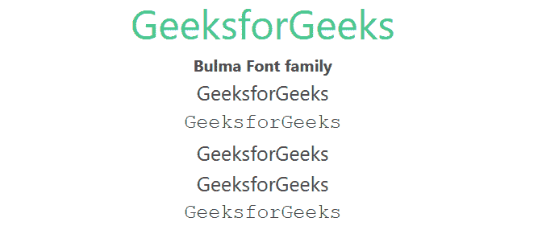

# Bulma 字体系列

> 原文:[https://www.geeksforgeeks.org/bulma-font-family/](https://www.geeksforgeeks.org/bulma-font-family/)

[布尔玛](https://www.geeksforgeeks.org/bulma-introduction/)字体族类用于设置字体族。布尔玛有 5 种字体的家庭课。您可以使用 5 个字体系列助手中的一个来更改字体系列。

**字体系列类别:**

*   **is-family-sans-serif:** 该类用于设置 family-sans-serif 的字体系列。
*   **is-family-monospace:** 该类用于设置 family-monospace 的字体系列。
*   **为-族-主:**此类用于设置族-主的字体族。
*   **为-族-辅:**此类用于设置族-辅的字体族。
*   **是-族码:**该类用于设置族码的字体族。

**示例:**下面的示例说明了布尔玛的字体家族类。

## 超文本标记语言

```
<!DOCTYPE html>
<html>

<head>
    <title>Bulma Typography</title>
    <link rel='stylesheet'
          href=
'https://cdn.jsdelivr.net/npm/bulma@0.9.3/css/bulma.min.css'>
</head>

<body class="has-text-centered">
    <h1 class="is-size-2 has-text-success">
        GeeksforGeeks
    </h1>
    <b>Bulma Font family</b>
    <br>
    <div class="container">
        <p class="is-size-5 is-family-sans-serif">GeeksforGeeks</p>

        <p class="is-size-5 is-family-monospace">GeeksforGeeks</p>

        <p class="is-size-5 is-family-primary">GeeksforGeeks</p>

        <p class="is-size-5 is-family-secondary">GeeksforGeeks</p>

        <p class="is-size-5 is-family-code">GeeksforGeeks</p>

    </div>
</body>
</html>
```

**输出:**



布尔玛字体系列

**参考:**[https://bulma . io/documentation/helper/排版-helper/# font-family](https://bulma.io/documentation/helpers/typography-helpers/#font-family)