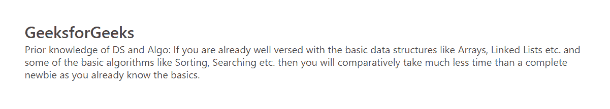
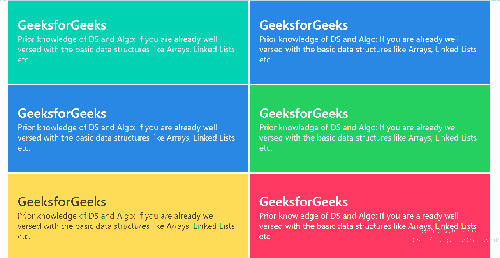
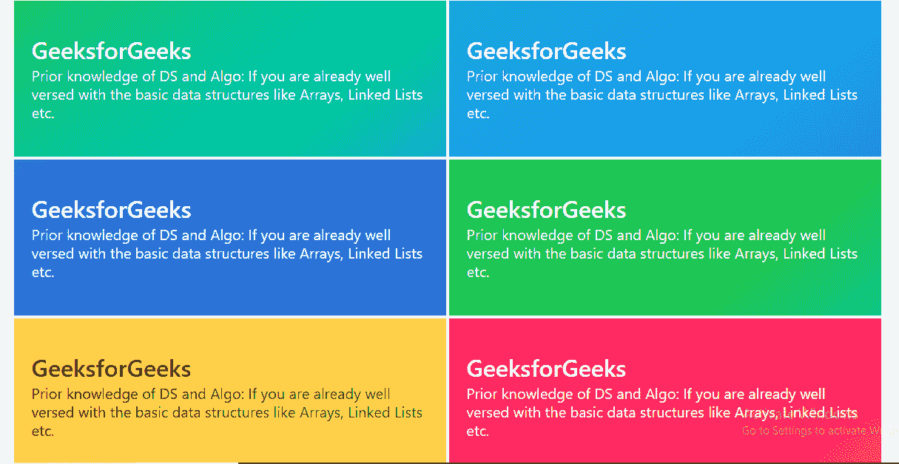

# 英雄茶壶

> 哎哎哎:# t0]https://www . geeksforgeeks . org/bulma-hero/

布尔玛是一个基于 Flexbox 的免费开源 CSS 框架。它是组件丰富的，兼容的，并且有很好的文档记录。它本质上是高度反应的。它使用类来实现它的设计。英雄是一面气势磅礴的英雄旗帜，用来展示一些东西。

英雄组件允许你添加一个全宽的横幅到你的网页，它可以选择覆盖整个页面的高度。英雄组件包括几个其他组件，我们必须专门添加这些组件来很好地设计我们的内容。下面列出了这些组件。

*   **英雄:**是主容器。
*   **英雄-身体:**是可以放所有内容的地方。

**示例 1:** 本示例说明了普通英雄元素。

## 超文本标记语言

```
<!DOCTYPE html>
<html>

<head>
  <title>Bulma Hero</title>
  <link rel='stylesheet' href=
'https://cdnjs.cloudflare.com/ajax/libs/bulma/0.7.5/css/bulma.css'>

  <!-- custom css -->
  <style>
    div.adjust {
      margin-top: 50px;
    }
  </style>
</head>

<body>
  <div class='container adjust'>
    <section class="hero">
      <div class="hero-body">
        <div class="container">
          <h1 class="title">
            GeeksforGeeks
          </h1>
          <h2 class="subtitle">
            Prior knowledge of DS and Algo:
            If you are already well versed
            with the basic data structures
            like Arrays, Linked Lists etc.
            and some of the basic algorithms
            like Sorting, Searching etc. then
            you will comparatively take much
            less time than a complete newbie
            as you already know the basics.
          </h2>
        </div>
      </div>
    </section>
  </div>
</body>

</html>
```

**输出:**



质朴的英雄元素

**例 2:** 这个例子说明了多彩的英雄布尔玛元素。

## 超文本标记语言

```
<!DOCTYPE html>
<html>

<head>
  <title>Bulma Hero</title>
  <link rel='stylesheet' href=
'https://cdnjs.cloudflare.com/ajax/libs/bulma/0.7.5/css/bulma.css'>

  <!-- custom css -->
  <style>
    div.adjust {
      margin-top: 10px;
    }

    div.column.is-6 {
      padding: 2px;
    }
  </style>
</head>

<body>
  <div class='container adjust'>
    <div class='columns'>
      <div class='column is-6'>
        <section class="hero is-primary">
          <div class="hero-body">
            <div class="container">
              <h1 class="title">
                GeeksforGeeks
              </h1>
              <h2 class="subtitle">
                Prior knowledge of DS and
                Algo: If you are already
                well versed with the basic
                data structures like Arrays,
                Linked Lists etc.
              </h2>
            </div>
          </div>
        </section>
      </div>

      <div class='column is-6'>
        <section class="hero is-info">
          <div class="hero-body">
            <div class="container">
              <h1 class="title">
                GeeksforGeeks
              </h1>
              <h2 class="subtitle">
                Prior knowledge of DS and
                Algo: If you are already
                well versed with the basic
                data structures like Arrays,
                Linked Lists etc.
              </h2>
            </div>
          </div>
        </section>
      </div>
    </div>

    <div class='columns'>
      <div class='column is-6'>
        <section class="hero is-link">
          <div class="hero-body">
            <div class="container">
              <h1 class="title">
                GeeksforGeeks
              </h1>
              <h2 class="subtitle">
                Prior knowledge of DS and
                Algo: If you are already
                well versed with the basic
                data structures like Arrays,
                Linked Lists etc.
              </h2>
            </div>
          </div>
        </section>
      </div>

      <div class='column is-6'>
        <section class="hero is-success">
          <div class="hero-body">
            <div class="container">
              <h1 class="title">
                GeeksforGeeks
              </h1>
              <h2 class="subtitle">
                Prior knowledge of DS and
                Algo: If you are already
                well versed with the basic
                data structures like Arrays,
                Linked Lists etc.
              </h2>
            </div>
          </div>
        </section>
      </div>
    </div>

    <div class='columns'>
      <div class='column is-6'>
        <section class="hero is-warning">
          <div class="hero-body">
            <div class="container">
              <h1 class="title">
                GeeksforGeeks
              </h1>
              <h2 class="subtitle">
                Prior knowledge of DS and
                Algo: If you are already
                well versed with the basic
                data structures like Arrays,
                Linked Lists etc.
              </h2>
            </div>
          </div>
        </section>
      </div>

      <div class='column is-6'>
        <section class="hero is-danger">
          <div class="hero-body">
            <div class="container">
              <h1 class="title">
                GeeksforGeeks
              </h1>
              <h2 class="subtitle">
                Prior knowledge of DS and
                Algo: If you are already
                well versed with the basic
                data structures like Arrays,
                Linked Lists etc.
              </h2>
            </div>
          </div>
        </section>
      </div>
    </div>
  </div>
</body>

</html>
```

**输出:**



多彩的布尔玛英雄元素

**例 3:** 这个例子说明了带有渐变效果的英雄元素(Add is-bold 修改器)。

## 超文本标记语言

```
<!DOCTYPE html>
<html>

<head>
  <title>Bulma Hero</title>
  <link rel='stylesheet' href=
'https://cdnjs.cloudflare.com/ajax/libs/bulma/0.7.5/css/bulma.css'>

  <!-- custom css -->
  <style>
    div.adjust {
      margin-top: 10px;
    }

    div.column.is-6 {
      padding: 2px;
    }
  </style>
</head>

<body>
  <div class='container adjust'>
    <div class='columns'>
      <div class='column is-6'>
        <section class="hero is-primary is-bold">
          <div class="hero-body">
            <div class="container">
              <h1 class="title">
                GeeksforGeeks
              </h1>
              <h2 class="subtitle">
                Prior knowledge of DS and Algo:
                If you are already well versed
                with the basic data structures
                like Arrays, Linked Lists etc.
              </h2>
            </div>
          </div>
        </section>
      </div>

      <div class='column is-6'>
        <section class="hero is-info is-bold">
          <div class="hero-body">
            <div class="container">
              <h1 class="title">
                GeeksforGeeks
              </h1>
              <h2 class="subtitle">
                Prior knowledge of DS and Algo:
                If you are already well versed
                with the basic data structures
                like Arrays, Linked Lists etc.
              </h2>
            </div>
          </div>
        </section>
      </div>
    </div>

    <div class='columns'>
      <div class='column is-6'>
        <section class="hero is-link is-bold">
          <div class="hero-body">
            <div class="container">
              <h1 class="title">
                GeeksforGeeks
              </h1>
              <h2 class="subtitle">
                Prior knowledge of DS and Algo:
                If you are already well versed
                with the basic data structures
                like Arrays, Linked Lists etc.
              </h2>
            </div>
          </div>
        </section>
      </div>

      <div class='column is-6'>
        <section class="hero is-success is-bold">
          <div class="hero-body">
            <div class="container">
              <h1 class="title">
                GeeksforGeeks
              </h1>
              <h2 class="subtitle">
                Prior knowledge of DS and Algo:
                If you are already well versed
                with the basic data structures
                like Arrays, Linked Lists etc.
              </h2>
            </div>
          </div>
        </section>
      </div>
    </div>

    <div class='columns'>
      <div class='column is-6'>
        <section class="hero is-warning is-bold">
          <div class="hero-body">
            <div class="container">
              <h1 class="title">
                GeeksforGeeks
              </h1>
              <h2 class="subtitle">
                Prior knowledge of DS and Algo:
                If you are already well versed
                with the basic data structures
                like Arrays, Linked Lists etc.
              </h2>
            </div>
          </div>
        </section>
      </div>

      <div class='column is-6'>
        <section class="hero is-danger  is-bold">
          <div class="hero-body">
            <div class="container">
              <h1 class="title">
                GeeksforGeeks
              </h1>
              <h2 class="subtitle">
                Prior knowledge of DS and Algo:
                If you are already well versed
                with the basic data structures
                like Arrays, Linked Lists etc.
              </h2>
            </div>
          </div>
        </section>
      </div>
    </div>
  </div>
</body>

</html>
```

**输出:**



具有渐变效果的英雄元素