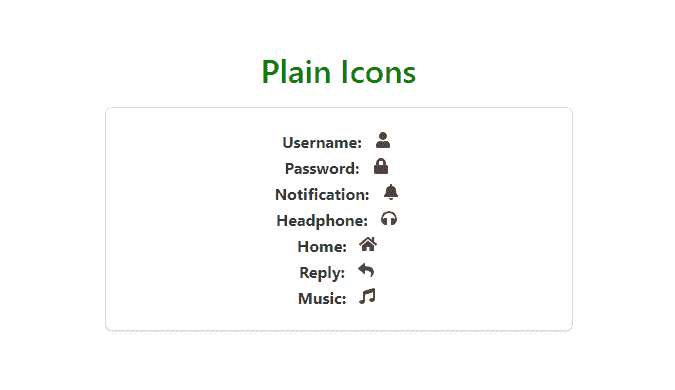
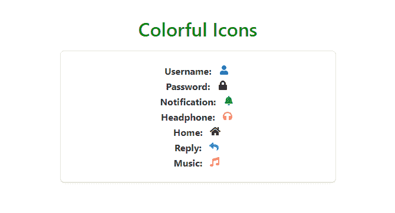
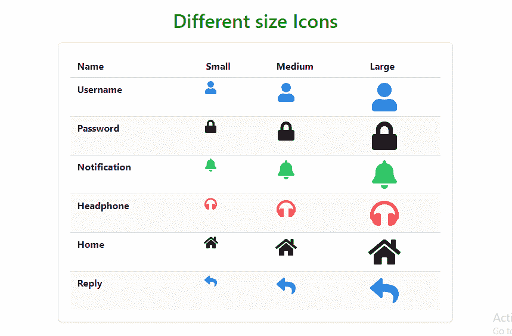
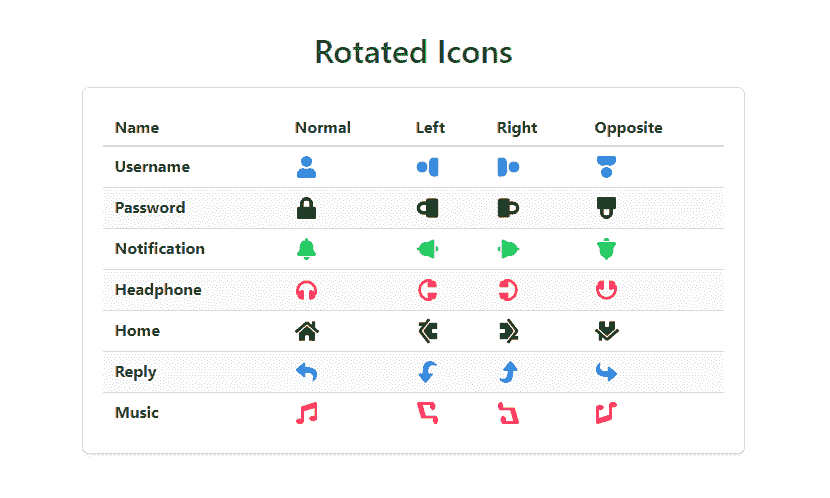
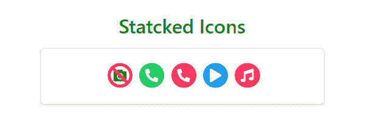

# Bulma | Icon

> 哎哎哎:# t0]https://www . geeksforgeeks . org/bulma-icon/

**布尔玛**是一个基于 Flexbox 的免费开源 CSS 框架。它是组件丰富的，兼容的，并且有很好的文档记录。它本质上是高度反应的。它使用类来实现它的设计。
**图标**是一种为图标字体预留空间的方形容器。布尔玛兼容所有图标字体库:字体真棒，材料设计图标，爱奥尼亚等。
**示例 1:** 本示例使用布尔玛创建普通图标。

## 超文本标记语言

```html
<!DOCTYPE html>
<html>

<head>
    <title>Bulma Icon</title>
    <link rel='stylesheet' href=
'https://cdnjs.cloudflare.com/ajax/libs/bulma/0.7.5/css/bulma.css'>

    <!-- custom css -->
    <style>
        div.columns {
            margin-top: 80px;
        }

        h1 {
            margin-top: 10px;
            margin-bottom: 20px;
            color: green !important
        }

        div {
            text-align: center;
        }

        strong {
            margin-right: 5px;
        }
    </style>
</head>

<body>
    <!-- font-awesome cdn -->
    <script src=
'https://cdnjs.cloudflare.com/ajax/libs/font-awesome/5.12.0-2/js/all.min.js'>
    </script>

    <div class='container'>
        <div class='columns is-mobile is-centered'>
            <div class='column is-5'>
                <div>
                    <h1 class='title has-text-centered'>
                        Plain Icons
                    </h1>
                </div>

                <div class='box'>
                    <div>
                        <strong>Username:</strong>
                        <span class="icon">
                            <i class="fas fa-user"></i>
                        </span>
                    </div>

                    <div>
                        <strong>Password:</strong>
                        <span class="icon">
                            <i class="fas fa-lock"></i>
                        </span>
                    </div>

                    <div>
                        <strong>Notification:</strong>
                        <span class="icon">
                            <i class="fas fa-bell"></i>
                        </span>
                    </div>

                    <div>
                        <strong>Headphone:</strong>
                        <span class="icon">
                            <i class="fas fa-headphones"></i>
                        </span>
                    </div>

                    <div>
                        <strong>Home:</strong>
                        <span class="icon">
                            <i class="fas fa-home"></i>
                        </span>
                    </div>

                    <div>
                        <strong>Reply:</strong>
                        <span class="icon">
                            <i class="fas fa-reply"></i>
                        </span>
                    </div>

                    <div>
                        <strong>Music:</strong>
                        <span class="icon">
                            <i class="fas fa-music"></i>
                        </span>
                    </div>
                </div>
            </div>
        </div>
    </div>
</body>

</html>
```

**输出:**



**示例 2:** 本示例使用布尔玛创建一些彩色图标。

## 超文本标记语言

```html
<!DOCTYPE html>
<html>

<head>
    <title>Bulma Icon</title>
    <link rel='stylesheet' href=
'https://cdnjs.cloudflare.com/ajax/libs/bulma/0.7.5/css/bulma.css'>

    <!-- custom css -->
    <style>
        div.columns {
            margin-top: 80px;
        }

        h1 {
            margin-top: 10px;
            margin-bottom: 20px;
            color: green !important
        }

        div {
            text-align: center;
        }

        strong {
            margin-right: 5px;
        }
    </style>
</head>

<body>
    <!-- font-awesome cdn -->
    <script src=
'https://cdnjs.cloudflare.com/ajax/libs/font-awesome/5.12.0-2/js/all.min.js'>
    </script>

    <div class='container'>
        <div class='columns is-mobile is-centered'>
            <div class='column is-5'>
                <div>
                    <h1 class='title
                        has-text-centered'>
                        Colorful Icons
                    </h1>
                </div>

                <div class='box'>
                    <div>
                        <strong>Username:</strong>
                        <span class="icon">
                            <i class="fas fa-user
                                has-text-link"></i>
                        </span>
                    </div>

                    <div>
                        <strong>Password:</strong>
                        <span class="icon">
                            <i class="fas fa-lock
                                has-text-black"></i>
                        </span>
                    </div>

                    <div>
                        <strong>Notification:</strong>
                        <span class="icon">
                            <i class="fas fa-bell
                                has-text-success"></i>
                        </span>
                    </div>

                    <div>
                        <strong>Headphone:</strong>
                        <span class="icon">
                            <i class="fas fa-headphones
                                has-text-danger"></i>
                        </span>
                    </div>

                    <div>
                        <strong>Home:</strong>
                        <span class="icon">
                            <i class="fas fa-home
                                has-text-black"></i>
                        </span>
                    </div>

                    <div>
                        <strong>Reply:</strong>
                        <span class="icon">
                            <i class="fas fa-reply
                                has-text-info"></i>
                        </span>
                    </div>

                    <div>
                        <strong>Music:</strong>
                        <span class="icon">
                            <i class="fas fa-music
                                has-text-danger"></i>
                        </span>
                    </div>
                </div>
            </div>
        </div>
    </div>
</body>

</html>
```

**输出:**



**示例 3:** 本示例创建不同大小的图标。

## 超文本标记语言

```html
<!DOCTYPE html>
<html>

<head>
    <title>Bulma Icon</title>
    <link rel='stylesheet' href=
'https://cdnjs.cloudflare.com/ajax/libs/bulma/0.7.5/css/bulma.css'>

    <!-- custom css -->
    <style>
        div.columns {
            margin-top: 25px;
        }

        h1 {
            margin-top: 10px;
            margin-bottom: 20px;
            color: green !important
        }

        strong {
            margin-right: 5px;
        }
    </style>
</head>

<body>
    <!-- font-awesome cdn -->
    <script src=
'https://cdnjs.cloudflare.com/ajax/libs/font-awesome/5.12.0-2/js/all.min.js'>
    </script>

    <div class='container has-text-centered'>
        <div class='columns is-mobile is-centered'>
            <div class='column is-7'>
                <div>
                    <h1 class='title
                        has-text-centered'>
                        Different size Icons
                    </h1>
                </div>

                <div class='box'>
                    <!-- creating table to show
                        different sizes of a icon -->
                    <table class='table is-fullwidth is-striped'>
                        <thead>
                            <tr>
                                <th>Name</th>
                                <th>Small</th>
                                <th>Medium</th>
                                <th>Large</th>
                            </tr>
                        </thead>

                        <tbody>
                            <tr>
                                <td><strong>Username</strong></td>
                                <td>
                                    <span class="icon is-small">
                                        <i class="fas fa-user
                                        fa-lg has-text-link "></i>
                                    </span>
                                </td>
                                <td>
                                    <span class="icon is-medium">
                                        <i class="fas fa-user
                                        fa-2x has-text-link"></i>
                                    </span>
                                </td>
                                <td>
                                    <span class="icon is-large">
                                        <i class="fas fa-user
                                        fa-3x has-text-link"></i>
                                    </span>
                                </td>
                            </tr>

                            <tr>
                                <td><strong>Password</strong></td>
                                <td>
                                    <span class="icon is-small">
                                        <i class="fas fa-lock
                                        fa-lg has-text-black "></i>
                                    </span>
                                </td>
                                <td>
                                    <span class="icon is-medium">
                                        <i class="fas fa-lock
                                        fa-2x has-text-black"></i>
                                    </span>
                                </td>
                                <td>
                                    <span class="icon is-large">
                                        <i class="fas fa-lock
                                        fa-3x has-text-black"></i>
                                    </span>
                                </td>
                            </tr>

                            <tr>
                                <td><strong>Notification</strong></td>
                                <td>
                                    <span class="icon is-small">
                                        <i class="fas fa-bell
                                        fa-lg has-text-success"></i>
                                    </span>
                                </td>
                                <td>
                                    <span class="icon is-medium">
                                        <i class="fas fa-bell fa-2x
                                        has-text-success"></i>
                                    </span>
                                </td>
                                <td>
                                    <span class="icon is-large">
                                        <i class="fas fa-bell
                                        fa-3x has-text-success"></i>
                                    </span>
                                </td>
                            </tr>

                            <tr>
                                <td><strong>Headphone</strong></td>
                                <td>
                                    <span class="icon is-small">
                                        <i class="fas fa-headphones
                                        fa-lg has-text-danger"></i>
                                    </span>
                                </td>
                                <td>
                                    <span class="icon is-medium">
                                        <i class="fas fa-headphones
                                        fa-2x has-text-danger"></i>
                                    </span>
                                </td>
                                <td>
                                    <span class="icon is-large">
                                        <i class="fas fa-headphones
                                        fa-3x has-text-danger"></i>
                                    </span>
                                </td>
                            </tr>

                            <tr>
                                <td><strong>Home</strong></td>
                                <td>
                                    <span class="icon is-small">
                                        <i class="fas fa-home
                                        fa-lg has-text-black"></i>
                                    </span>
                                </td>
                                <td>
                                    <span class="icon is-medium">
                                        <i class="fas fa-home
                                        fa-2x has-text-black"></i>
                                    </span>
                                </td>
                                <td>
                                    <span class="icon is-large">
                                        <i class="fas fa-home
                                        fa-3x has-text-black"></i>
                                    </span>
                                </td>
                            </tr>

                            <tr>
                                <td><strong>Reply</strong></td>
                                <td>
                                    <span class="icon is-small">
                                        <i class="fas fa-reply
                                        fa-lg has-text-info"></i>
                                    </span>
                                </td>
                                <td>
                                    <span class="icon is-medium">
                                        <i class="fas fa-reply
                                        fa-2x has-text-info"></i>
                                    </span>
                                </td>
                                <td>
                                    <span class="icon is-large">
                                        <i class="fas fa-reply
                                        fa-3x has-text-info"></i>
                                    </span>
                                </td>
                            </tr>
                        </tbody>
                    </table>
                </div>
            </div>
        </div>
    </div>
</body>

</html>
```



**示例 4:** 旋转图标

## 超文本标记语言

```html
<!DOCTYPE html>
<html>
  <head>
    <title>Bulma Icon</title>
    <link rel='stylesheet' href=
'https://cdnjs.cloudflare.com/ajax/libs/bulma/0.7.5/css/bulma.css'>

    <!-- custom css -->
    <style>
      div.columns{
        margin-top: 25px;
      }
      h1{
        margin-top:10px;
        margin-bottom:20px;
        color:green !important
      }

      strong{
        margin-right: 5px;
      }

    </style>
  </head>

  <body>
    <!-- font-awesome cdn -->
    <script src=
'https://cdnjs.cloudflare.com/ajax/libs/font-awesome/5.12.0-2/js/all.min.js'>
    </script>

    <div class='container has-text-centered'>
      <div class='columns is-mobile is-centered'>
        <div class='column is-7'>
          <div>
            <h1 class='title has-text-centered'>
                Rotated Icons
            </h1>
          </div>

          <div class='box'>
            <!-- creating table to show
                different sizes of a icon -->
            <table class='table
                is-fullwidth is-striped'>
              <thead>
                <tr>
                  <th>Name</th>
                  <th>Normal</th>
                  <th>Left</th>
                  <th>Right</th>
                  <th>Opposite</th>
                </tr>
              </thead>

              <tbody>
                <tr>
                  <td><strong>Username</strong></td>
                  <td>
                    <span class="icon">
                      <i class="fas fa-user
                        fa-lg has-text-link"></i>
                    </span>
                  </td>
                  <td>
                    <span class="icon">
                      <i class="fas fa-user
                        fa-lg has-text-link "
                        data-fa-transform="rotate-270"></i>
                    </span>
                  </td>
                  <td>
                    <span class="icon">
                      <i class="fas fa-user
                      fa-lg has-text-link"
                      data-fa-transform="rotate-90"></i>
                    </span>
                  </td>
                  <td>
                    <span class="icon">
                      <i class="fas fa-user
                      fa-lg has-text-link"
                      data-fa-transform="rotate-180"></i>
                    </span>
                  </td>
                </tr>

                <tr>
                  <td><strong>Password</strong></td>
                  <td>
                    <span class="icon">
                      <i class="fas fa-lock
                      fa-lg has-text-black"></i>
                    </span>
                  </td>
                  <td>
                    <span class="icon">
                      <i class="fas fa-lock
                      fa-lg has-text-black"
                      data-fa-transform="rotate-270"></i>
                    </span>
                  </td>
                  <td>
                    <span class="icon">
                      <i class="fas fa-lock
                      fa-lg has-text-block"
                      data-fa-transform="rotate-90"></i>
                    </span>
                  </td>
                  <td>
                    <span class="icon">
                      <i class="fas fa-lock
                      fa-lg has-text-black"
                      data-fa-transform="rotate-180"></i>
                    </span>
                  </td>
                </tr>

                <tr>
                  <td><strong>Notification</strong></td>
                  <td>
                    <span class="icon">
                      <i class="fas fa-bell
                      fa-lg has-text-success"></i>
                    </span>
                  </td>
                  <td>
                    <span class="icon">
                      <i class="fas fa-bell fa-lg
                        has-text-success"
                        data-fa-transform="rotate-270"></i>
                    </span>
                  </td>
                  <td>
                    <span class="icon">
                      <i class="fas fa-bell fa-lg
                      has-text-success"
                      data-fa-transform="rotate-90"></i>
                    </span>
                  </td>
                  <td>
                    <span class="icon">
                      <i class="fas fa-bell
                      fa-lg has-text-success"
                      data-fa-transform="rotate-180"></i>
                    </span>
                  </td>
                </tr>

                <tr>
                  <td><strong>Headphone</strong></td>
                  <td>
                    <span class="icon">
                      <i class="fas fa-headphones
                      fa-lg has-text-danger"></i>
                    </span>
                  </td>
                  <td>
                    <span class="icon">
                      <i class="fas fa-headphones
                      fa-lg has-text-danger"
                      data-fa-transform="rotate-270"></i>
                    </span>
                  </td>
                  <td>
                    <span class="icon">
                      <i class="fas fa-headphones
                      fa-lg has-text-danger"
                      data-fa-transform="rotate-90"></i>
                    </span>
                  </td>
                  <td>
                    <span class="icon">
                      <i class="fas fa-headphones
                      fa-lg has-text-danger"
                      data-fa-transform="rotate-180"></i>
                    </span>
                  </td>
                </tr>

                <tr>
                  <td><strong>Home</strong></td>
                  <td>
                    <span class="icon">
                      <i class="fas fa-home
                      fa-lg has-text-black"></i>
                    </span>
                  </td>
                  <td>
                    <span class="icon">
                      <i class="fas fa-home
                      fa-lg has-text-black"
                      data-fa-transform="rotate-270"></i>
                    </span>
                  </td>
                  <td>
                    <span class="icon">
                      <i class="fas fa-home
                      fa-lg has-text-black"
                      data-fa-transform="rotate-90"></i>
                    </span>
                  </td>
                  <td>
                    <span class="icon">
                      <i class="fas fa-home
                      fa-lg has-text-black"
                      data-fa-transform="rotate-180"></i>
                    </span>
                  </td>
                </tr>

                <tr>
                  <td><strong>Reply</strong></td>
                  <td>
                    <span class="icon">
                      <i class="fas fa-reply
                      fa-lg has-text-info"></i>
                    </span>
                  </td>
                  <td>
                    <span class="icon">
                      <i class="fas fa-reply
                      fa-lg has-text-info"
                      data-fa-transform="rotate-270"></i>
                    </span>
                  </td>
                  <td>
                    <span class="icon">
                      <i class="fas fa-reply
                      fa-lg has-text-info"
                      data-fa-transform="rotate-90"></i>
                    </span>
                  </td>
                  <td>
                    <span class="icon">
                      <i class="fas fa-reply
                      fa-lg has-text-info"
                      data-fa-transform="rotate-180"></i>
                    </span>
                  </td>
                </tr>

                <tr>
                  <td><strong>Music</strong></td>
                  <td>
                    <span class="icon">
                      <i class="fas fa-music
                      fa-lg has-text-danger"></i>
                    </span>
                  </td>
                  <td>
                    <span class="icon">
                      <i class="fas fa-music
                      fa-lg has-text-danger"
                      data-fa-transform="rotate-270"></i>
                    </span>
                  </td>
                  <td>
                    <span class="icon">
                      <i class="fas fa-music
                      fa-lg has-text-danger"
                      data-fa-transform="rotate-90"></i>
                    </span>
                  </td>
                  <td>
                    <span class="icon">
                      <i class="fas fa-music f
                      a-lg has-text-danger"
                      data-fa-transform="rotate-180"></i>
                    </span>
                  </td>
                </tr>
              </tbody>
            </table>
          </div>
        </div>
      </div>
    </div>
  </body>
</html>
```

**输出:**



**示例 5:** 堆叠图标

## 超文本标记语言

```html
<!DOCTYPE html>
<html>
  <head>
    <title>Bulma Icon</title>
    <link rel='stylesheet' href=
'https://cdnjs.cloudflare.com/ajax/libs/bulma/0.7.5/css/bulma.css'>

    <!-- custom css -->
    <style>
      div.columns{
        margin-top: 25px;
      }
      h1{
        margin-top:10px;
        margin-bottom:20px;
        color:green !important
      }

      .fa-stack-1x{
        left:6px;
        top:2px;
        bottom:2px;
        right:1px;
      }
    </style>
  </head>

  <body>
    <!-- font-awesome cdn -->
    <script src=
'https://cdnjs.cloudflare.com/ajax/libs/font-awesome/5.12.0-2/js/all.min.js'>
    </script>

    <div class='container has-text-centered'>
      <div class='columns is-mobile is-centered'>
        <div class='column is-5'>
          <div>
            <h1 class='title has-text-centered'>
                Statcked Icons
            </h1>
          </div>

          <div class='box'>
            <div>
              <span class="icon is-large">
                <span class="fa-stack fa-lg">
                  <i class="fas fa-camera
                        fa-stack-1x"></i>
                  <i class="fas fa-ban
                    fa-stack-2x has-text-danger"></i>
                </span>
              </span>

              <span class="icon is-large">
                <span class="fa-stack fa-lg">
                  <i class="fas fa-circle
                    fa-stack-2x has-text-success"></i>
                  <i class="fas fa-phone-alt
                    fa-stack-1x has-text-white"></i>
                </span>
              </span>

              <span class="icon is-large">
                <span class="fa-stack fa-lg">
                  <i class="fas fa-circle
                    fa-stack-2x has-text-danger"></i>
                  <i class="fas fa-phone-alt
                    fa-stack-1x has-text-white"></i>
                </span>
              </span>

              <span class="icon is-large">
                <span class="fa-stack fa-lg">
                  <i class="fas fa-circle
                    fa-stack-2x has-text-info"></i>
                  <i class="fas fa-play
                    fa-stack-1x has-text-white"></i>
                </span>
              </span>

              <span class="icon is-large">
                <span class="fa-stack fa-lg">
                  <i class="fas fa-circle
                    fa-stack-2x has-text-danger"></i>
                  <i class="fas fa-music
                    fa-stack-1x has-text-white"></i>
                </span>
              </span>
            </div>
          </div>
        </div>
      </div>
    </div>
  </body>
</html>
```

**输出:**

