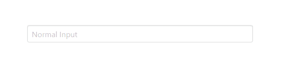
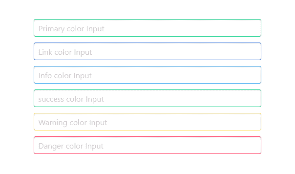
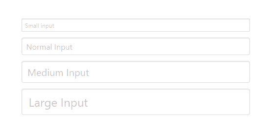
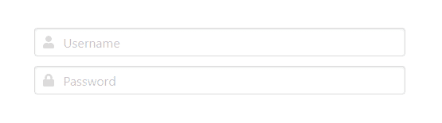
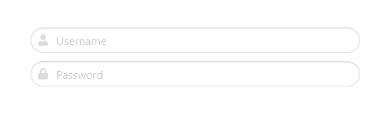

# Bulma | Input

> 哎哎哎:# t0]https://www . geeksforgeeks . org/bulma-input/

**[【布尔玛】](https://www.geeksforgeeks.org/bulma-introduction/)** 是一个基于 Flexbox 的免费开源 CSS 框架。它是组件丰富的，兼容的，并且有很好的文档记录。它本质上是高度反应的。它使用类来实现它的设计。

表单的“输入”组件在外观上没有那么吸引人。使用布尔玛，我们可以通过添加一些简单的布尔玛类，以更好的方式设计表单的输入元素。布尔玛输入元素有不同的颜色、不同的样式、不同的大小和不同的状态。

**示例 1:** 该示例说明了简单的布尔玛输入。

```
<!DOCTYPE html>
<html>
  <head>
    <title>Bulma Input</title>
    <link rel='stylesheet' href=
'https://cdnjs.cloudflare.com/ajax/libs/bulma/0.7.5/css/bulma.css'>

    <!-- custom css -->
    <style>
      div.columns
     {
        margin-top: 80px;
      }
    </style>
  </head>
  <body>   
    <div class='container'>
      <div class='columns is-mobile is-centered'>
        <div class='column is-5'>
          <div class="field">
            <div class="control">
              <input class="input" 
                     type="text" 
                     placeholder='Normal Input'>
            </div>
          </div>
        </div>
      </div>
    </div>
  </body>
</html>
```

**输出:**



**示例 2:** 该示例说明了彩色表单输入。

```
<!DOCTYPE html>
<html>
  <head>
    <title>Bulma Input</title>
    <link rel='stylesheet' href=
'https://cdnjs.cloudflare.com/ajax/libs/bulma/0.7.5/css/bulma.css'>

    <!-- custom css -->
    <style>
      div.columns{
        margin-top: 80px;
      }
    </style>
  </head>
  <body>   
    <div class='container'>
      <div class='columns is-mobile is-centered'>
        <div class='column is-5'>
          <div class="field">
            <div class="control">
              <input class="input is-primary" 
                     type="text" 
                     placeholder='Primary color Input'>
            </div>
          </div>
          <div class="field">
            <div class="control">
              <input class="input is-link" 
                     type="text" 
                     placeholder='Link color Input'>
            </div>
          </div>
          <div class="field">
            <div class="control">
              <input class="input is-info" 
                     type="text" 
                     placeholder='Info color Input'>
            </div>
          </div>
          <div class="field">
            <div class="control">
              <input class="input is-success" 
                     type="text" 
                     placeholder='success color Input'>
            </div>
          </div>
          <div class="field">
            <div class="control">
              <input class="input is-warning" 
                     type="text" 
                     placeholder='Warning color Input'>
            </div>
          </div>
          <div class="field">
            <div class="control">
              <input class="input is-danger" 
                     type="text" 
                     placeholder='Danger color Input'>
            </div>
          </div>
        </div>
      </div>
    </div>
  </body>
</html>
```

**输出:**



**示例 3:** 此示例说明了不同大小的表单输入。

```
<!DOCTYPE html>
<html>
  <head>
    <title>Bulma Input</title>
    <link rel='stylesheet' href=
'https://cdnjs.cloudflare.com/ajax/libs/bulma/0.7.5/css/bulma.css'>

    <!-- custom css -->
    <style>
      div.columns{
        margin-top: 80px;
      }
    </style>
  </head>
  <body>   
    <div class='container'>
      <div class='columns is-mobile is-centered'>
        <div class='column is-5'>
          <div class="field">
            <div class="control">
              <input class="input is-small" 
                     type="text"
                     placeholder='Small input'>
            </div>
          </div>
          <div class="field">
            <div class="control">
              <input class="input"
                     type="text"
                     placeholder='Normal Input'>
            </div>
          </div>
          <div class="field">
            <div class="control">
              <input class="input is-medium" 
                     type="text"
                     placeholder='Medium Input'>
            </div>
          </div>
          <div class="field">
            <div class="control">
              <input class="input is-large"
                     type="text"
                     placeholder='Large Input'>
            </div>
          </div>
        </div>
      </div>
    </div>
  </body>
</html>
```

**输出:**



**示例 4:** 此示例说明了表单输入的不同状态。

```
<!DOCTYPE html>
<html>
  <head>
    <title>Bulma Input</title>
    <link rel='stylesheet' href=
'https://cdnjs.cloudflare.com/ajax/libs/bulma/0.7.5/css/bulma.css'>

    <!-- custom css -->
    <style>
      div.columns{
        margin-top: 80px;
      }
    </style>
  </head>
  <body>   
    <div class='container'>
      <div class='columns is-mobile is-centered'>
        <div class='column is-5'>
          <div class="field">
            <div class="control">
              <input class="input" type="text" 
                     placeholder='Normal Input'>
            </div>
          </div>
          <div class="field">
            <div class="control">
              <input class="input is-hovered"
                     type="text" 
                     placeholder='Hovered Input'>
            </div>
          </div>
          <div class="field">
            <div class="control">
              <input class="input is-focused" 
                     type="text" 
                     placeholder='Focused Input'>
            </div>
          </div>
          <div class="field">
            <div class="control is-loading">
              <input class="input" type="text" 
                     placeholder="Loading input">
            </div>
          </div>
        </div>
      </div>
    </div>
  </body>
</html>
```

**输出:**


**示例 5:** 本示例用字体牛逼的图标说明表单输入。

```
<!DOCTYPE html>
<html>
  <head>
    <title>Bulma Input</title>
    <link rel='stylesheet' href=
'https://cdnjs.cloudflare.com/ajax/libs/bulma/0.7.5/css/bulma.css'>

    <!-- custom css -->
    <style>
      div.columns{
        margin-top: 80px;
      }
    </style>
  </head>
  <body>

    <!-- font-awesome cdn -->
    <script src=
'https://cdnjs.cloudflare.com/ajax/libs/font-awesome/5.12.0-2/js/all.min.js'>
    </script>
    <div class='container'>
      <div class='columns is-mobile is-centered'>
        <div class='column is-5'>
          <div class="field">
            <div class="control has-icons-left">
              <input class="input"
                     type="text"
                     placeholder="Username">
              <span class="icon is-small is-left">
                <i class="fas fa-user"></i>
              </span>
            </div>
          </div>
          <div class="field">
            <div class="control has-icons-left">
              <input class="input" 
                     type="password"
                     placeholder="Password">
              <span class="icon is-small is-left">
                <i class="fas fa-lock"></i>
              </span>
            </div>
          </div>
        </div>
      </div>
    </div>
  </body>
</html>
```

**输出:**



**示例 6:** 该示例说明了舍入类型的表单输入。

```
<!DOCTYPE html>
<html>
  <head>
    <title>Bulma Input</title>
    <link rel='stylesheet' href=
'https://cdnjs.cloudflare.com/ajax/libs/bulma/0.7.5/css/bulma.css'>

    <!-- custom css -->
    <style>
      div.columns{
        margin-top: 80px;
      }
    </style>
  </head>
  <body>

    <!-- font-awesome cdn -->
    <script src=
'https://cdnjs.cloudflare.com/ajax/libs/font-awesome/5.12.0-2/js/all.min.js'>
    </script>
    <div class='container'>
      <div class='columns is-mobile is-centered'>
        <div class='column is-5'>
          <div class="field">
            <div class="control has-icons-left">
              <input class="input is-rounded" 
                     type="text" 
                     placeholder="Username">
              <span class="icon is-small is-left">
                <i class="fas fa-user"></i>
              </span>
            </div>
          </div>
          <div class="field">
            <div class="control has-icons-left">
              <input class="input is-rounded" 
                     type="password" 
                     placeholder="Password">
              <span class="icon is-small is-left">
                <i class="fas fa-lock"></i>
              </span>
            </div>
          </div>
        </div>
      </div>
    </div>
  </body>
</html>
```

**输出:**

