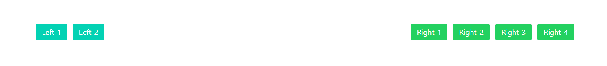
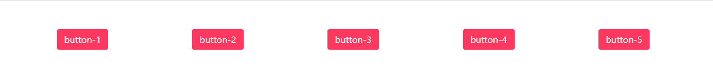
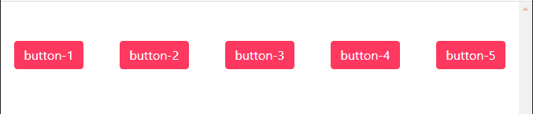
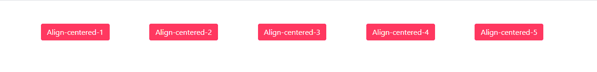

# 布尔玛|等级

> 原文:[https://www.geeksforgeeks.org/bulma-level/](https://www.geeksforgeeks.org/bulma-level/)

布尔玛是一个基于 Flexbox 的免费开源 CSS 框架。它是组件丰富的，兼容的，并且有很好的文档记录。它本质上是高度反应的。它使用类来实现它的设计。

Level 是一个多用途的水平级别，几乎可以包含任何其他元素。级别组件包括几个其他组件，我们必须专门添加这些组件才能很好地设计我们的内容。下面列出了这些组件。

1.  **级:**为主容器
2.  **左侧水平:**是左侧内容物的容器。
3.  **右侧水平:**它是右侧内容物的容器。
4.  **等级项目:**每个等级项目都有。在分级项目中，你可以插入几乎任何你想要的东西，一个标题，一个按钮，一个文本输入，或者只是简单的文本。无论您在布尔玛水平仪中放入什么元素，它们总是垂直居中。

**示例 1:** 简单级别元素

```
<html>
  <head>
    <title>Bulma Level</title>
    <link rel='stylesheet' 
          href=
'https://cdnjs.cloudflare.com/ajax/libs/bulma/0.7.5/css/bulma.css'>
    <!-- custom css -->
    <style>
      div.adjust{
        margin-top:50px;
      }

    </style>
  </head>
  <body>  
    <div class='container adjust'>
      <nav class="level">
        <!-- Left side -->
        <div class="level-left">
          <div class="level-item">
            <button class='button is-primary'>
                  Left-1
            </button>
          </div>
          <div class="level-item">
            <div class="field has-addons">
              <button class='button is-primary'>
                 Left-2
              </button>
            </div>
          </div>
        </div>

        <!-- Right side -->
        <div class='level-right'>
          <div class="level-item">
            <div class="field has-addons">
              <button class='button is-success'>
                   Right-1
              </button>
            </div>
          </div>
          <div class="level-item">
            <div class="field has-addons">
              <button class='button is-success'>
                  Right-2</button>
            </div>
          </div>
          <div class="level-item">
            <div class="field has-addons">
              <button class='button is-success'>
                  Right-3</button>
            </div>
          </div>
          <div class="level-item">
            <div class="field has-addons">
              <button class='button is-success'>
                    Right-4</button>
            </div>
          </div>
        </div>
      </nav>
    </div>
  </body>
</html>
```

**输出:**



**示例 2:** 移动级元素

```
<html>
  <head>
    <title>Bulma Level</title>
    <link rel='stylesheet' 
          href=
'https://cdnjs.cloudflare.com/ajax/libs/bulma/0.7.5/css/bulma.css'>
    <!-- custom css -->
    <style>
      div.adjust{
        margin-top:50px;
      }

    </style>
  </head>
  <body>
    <div class='container adjust'>
      <nav class="level is-mobile">
        <div class="level-item has-text-centered">
          <div>
            <button class='button is-danger'>
                button-1</button>
          </div>
        </div>
        <div class="level-item has-text-centered">
          <div>
            <button class='button is-danger'>
                button-2</button>
          </div>
        </div>
        <div class="level-item has-text-centered">
          <div>
            <button class='button is-danger'>
                button-3</button>
          </div>
        </div>
        <div class="level-item has-text-centered">
          <div>
            <button class='button is-danger'>
                   button-4</button>
          </div>
        </div>
        <div class="level-item has-text-centered">
          <div>
            <button class='button is-danger'>
                     button-5</button>
          </div>
        </div>
      </nav>
    </div>
  </body>
</html>
```

 

**示例 3:** 居中的级别元素

```
<html>
  <head>
    <title>Bulma Level</title>
    <link rel='stylesheet' 
          href=
'https://cdnjs.cloudflare.com/ajax/libs/bulma/0.7.5/css/bulma.css'>
    <!-- custom css -->
    <style>
      div.adjust{
        margin-top:50px;
      }

    </style>
  </head>
  <body>
    <div class='container adjust'>
      <nav class="level">
        <div class="level-item has-text-centered">
          <div>
            <button class='button is-danger'>
                  button-1</button>
          </div>
        </div>
        <div class="level-item has-text-centered">
          <div>
            <button class='button is-danger'>
                  button-2</button>
          </div>
        </div>
        <div class="level-item has-text-centered">
          <div>
            <button class='button is-danger'>
                 button-3</button>
          </div>
        </div>
        <div class="level-item has-text-centered">
          <div>
            <button class='button is-danger'>
                     button-4</button>
          </div>
        </div>
        <div class="level-item has-text-centered">
          <div>
            <button class='button is-danger'>
                     button-5</button>
          </div>
        </div>
      </nav>
    </div>
  </body>
</html>
```

**输出**



居中级别元素(大屏幕)


居中的级别元素(在小屏幕中)