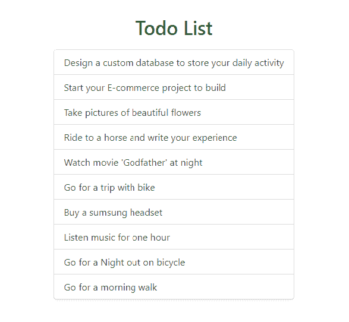
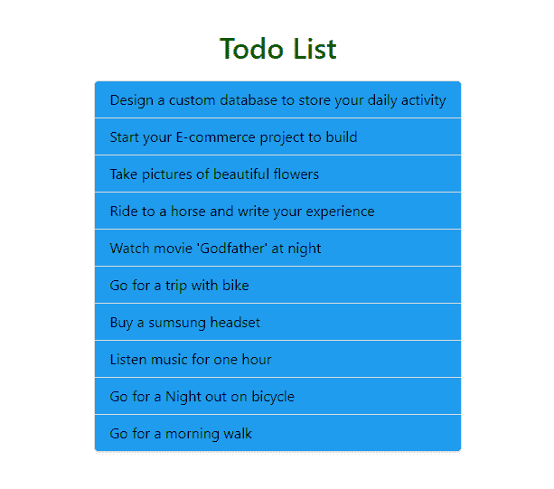
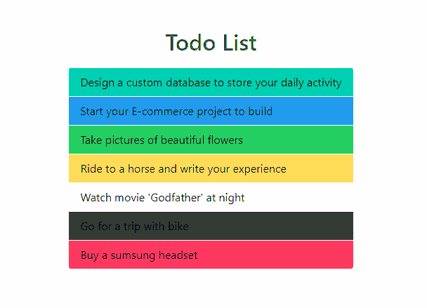
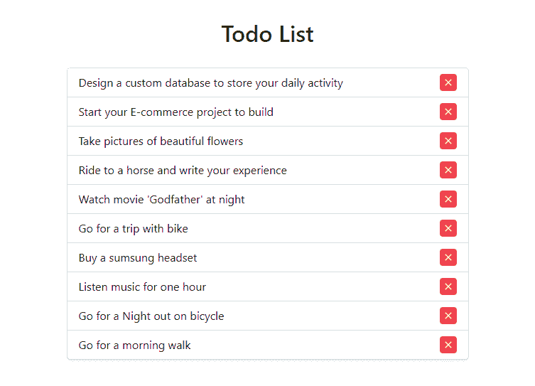
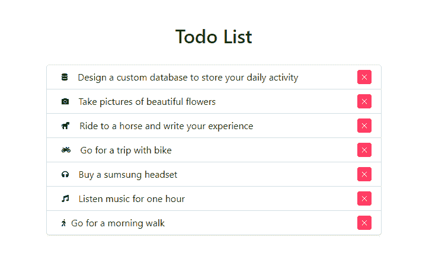

# bulma | list

> 哎哎哎:# t0]https://www . geeksforgeeks . org/bulma-list/

**布尔玛**是一个基于 Flexbox 的免费开源 CSS 框架。它是组件丰富的，兼容的，并且有很好的文档记录。它本质上是高度反应的。它使用类来实现它的设计。
项目中的列表组件可以设计成与布尔玛课程一起看起来很有吸引力。

**示例 1:** 本示例使用布尔玛创建项目列表。

## 超文本标记语言

```html
<!DOCTYPE html>
<html>

<head>
    <title>Bulma List</title>
    <link rel='stylesheet' href=
'https://cdnjs.cloudflare.com/ajax/libs/bulma/0.7.5/css/bulma.css'>

    <!-- custom css -->
    <style>
        div.columns {
            margin-top: 80px;
        }

        h1 {
            width: 100%;
            margin-top: 70px;
            color: green !important
        }

        div.columns {
            margin-top: 20px;
        }
    </style>
</head>

<body>
    <div class='container'>
        <div>
            <h1 class='title 
                has-text-centered'>Todo List</h1>
        </div>
        <div class='columns is-mobile is-centered'>
            <div class='column is-5'>
                <div class='list'>
                    <ul>
                        <div class='list-item'>
                            <li>
                                Design a custom database 
                                to store your daily activity
                            </li>
                        </div>

                        <div class='list-item'>
                            <li>
                                Start your E-commerce 
                                project to build
                            </li>
                        </div>

                        <div class='list-item'>
                            <li>
                                Take pictures of 
                                beautiful flowers
                            </li>
                        </div>

                        <div class='list-item'>
                            <li>
                                Ride to a horse and 
                                write your experience
                            </li>
                        </div>

                        <div class='list-item'>
                            <li>
                                Watch movie 'Godfather' 
                                at night
                            </li>
                        </div>

                        <div class='list-item'>
                            <li>
                                Go for a trip with bike
                            </li>
                        </div>

                        <div class='list-item'>
                            <li>
                                Buy a sumsung headset
                            </li>
                        </div>

                        <div class='list-item'>
                            <li>
                                Listen music for one hour
                            </li>
                        </div>

                        <div class='list-item'>
                            <li>
                                Go for a Night 
                                out on bicycle
                            </li>
                        </div>

                        <div class='list-item'>
                            <li>
                                Go for a morning walk
                            </li>
                        </div>
                    </ul>
                </div>
            </div>
        </div>
    </div>
</body>

</html>
```

**输出:**



**示例 2:** 本示例使用布尔玛显示当前活动项目。

## 超文本标记语言

```html
<html>

<head>
    <title>Bulma List</title>
    <link rel='stylesheet' href=
'https://cdnjs.cloudflare.com/ajax/libs/bulma/0.7.5/css/bulma.css'>

    <!-- custom css -->
    <style>
        div.columns {
            margin-top: 80px;
        }

        h1 {
            width: 100%;
            margin-top: 70px;
            color: green !important
        }

        div.columns {
            margin-top: 20px;
        }
    </style>
</head>

<body>
    <div class='container'>
        <div>
            <h1 class='title has-text-centered'>
                Todo List
            </h1>
        </div>
        <div class='columns is-mobile is-centered'>
            <div class='column is-5'>
                <div class='list'>
                    <ul>
                        <div class='list-item'>
                            <li>
                                Design a custom 
                                database to store 
                                your daily activity
                            </li>
                        </div>

                        <div class='list-item'>
                            <li>
                                Start your E-commerce 
                                project to build
                            </li>
                        </div>

                        <div class='list-item is-active'>
                            <li>
                                Take pictures of 
                                beautiful flowers
                            </li>
                        </div>

                        <div class='list-item'>
                            <li>
                                Ride to a horse and 
                                write your experience
                            </li>
                        </div>

                        <div class='list-item'>
                            <li>
                                Watch movie 'Godfather' 
                                at night
                            </li>
                        </div>

                        <div class='list-item'>
                            <li>
                                Go for a trip with bike
                            </li>
                        </div>

                        <div class='list-item'>
                            <li>
                                Buy a sumsung headset
                            </li>
                        </div>

                        <div class='list-item'>
                            <li>
                                Listen music 
                                for one hour
                            </li>
                        </div>

                        <div class='list-item'>
                            <li>
                                Go for a Night 
                                out on bicycle
                            </li>
                        </div>

                        <div class='list-item'>
                            <li>
                                Go for a morning walk
                            </li>
                        </div>
                    </ul>
                </div>
            </div>
        </div>
    </div>
</body>

</html>
```

**输出:**


**示例 3:** 本示例使用布尔玛创建一个彩色物品列表。

## 超文本标记语言

```html
<html>

<head>
    <title>Bulma List</title>
    <link rel='stylesheet' href=
'https://cdnjs.cloudflare.com/ajax/libs/bulma/0.7.5/css/bulma.css'>

    <!-- custom css -->
    <style>
        div.columns {
            margin-top: 80px;
        }

        h1 {
            width: 100%;
            margin-top: 70px;
            color: green !important
        }

        div.columns {
            margin-top: 20px;
        }

        .list-item {
            color: black !important;
        }
    </style>
</head>

<body>
    <div class='container'>
        <div>
            <h1 class='title has-text-centered'>
                Todo List
            </h1>
        </div>
        <div class='columns is-mobile is-centered'>
            <div class='column is-5'>
                <div class='list has-background-info'>
                    <ul>
                        <div class='list-item'>
                            <li>
                                Design a custom 
                                database to store 
                                your daily activity
                            </li>
                        </div>

                        <div class='list-item'>
                            <li>
                                Start your E-commerce 
                                project to build
                            </li>
                        </div>

                        <div class='list-item'>
                            <li>
                                Take pictures of 
                                beautiful flowers
                            </li>
                        </div>

                        <div class='list-item'>
                            <li>
                                Ride to a horse and 
                                write your experience
                            </li>
                        </div>

                        <div class='list-item'>
                            <li>
                                Watch movie 'Godfather' 
                                at night
                            </li>
                        </div>

                        <div class='list-item'>
                            <li>
                                Go for a trip 
                                with bike
                            </li>
                        </div>

                        <div class='list-item'>
                            <li>
                                Buy a sumsung headset
                            </li>
                        </div>

                        <div class='list-item'>
                            <li>
                                Listen music 
                                for one hour
                            </li>
                        </div>

                        <div class='list-item'>
                            <li>
                                Go for a Night 
                                out on bicycle
                            </li>
                        </div>

                        <div class='list-item'>
                            <li>
                                Go for a morning walk
                            </li>
                        </div>
                    </ul>
                </div>
            </div>
        </div>
    </div>
</body>

</html>
```

**输出:**



**示例 4:** 本示例创建一个不同颜色的项目。

## 超文本标记语言

```html
<!DOCTYPE html>
<html>

<head>
    <title>Bulma List</title>
    <link rel='stylesheet' href=
'https://cdnjs.cloudflare.com/ajax/libs/bulma/0.7.5/css/bulma.css'>

    <!-- custom css -->
    <style>
        div.columns {
            margin-top: 80px;
        }

        h1 {
            width: 100%;
            margin-top: 70px;
            color: green !important
        }

        div.columns {
            margin-top: 20px;
        }

        .list-item {
            color: black !important;
        }
    </style>
</head>

<body>
    <div class='container'>
        <div>
            <h1 class='title has-text-centered'>
                Todo List
            </h1>
        </div>
        <div class='columns is-mobile is-centered'>
            <div class='column is-5'>
                <div class='list'>
                    <ul>
                        <div class='list-item 
                            has-background-primary'>
                            <li>
                                Design a custom 
                                database to store 
                                your daily activity
                            </li>
                        </div>

                        <div class='list-item 
                            has-background-info'>
                            <li>
                                Start your E-commerce 
                                project to build
                            </li>
                        </div>

                        <div class='list-item 
                            has-background-success'>
                            <li>
                                Take pictures of 
                                beautiful flowers
                            </li>
                        </div>

                        <div class='list-item 
                            has-background-warning'>
                            <li>
                                Ride to a horse and 
                                write your experience
                            </li>
                        </div>

                        <div class='list-item 
                            has-background-light'>
                            <li>
                                Watch movie 'Godfather' 
                                at night
                            </li>
                        </div>

                        <div class='list-item 
                            has-background-dark'>
                            <li>
                                Go for a trip with bike
                            </li>
                        </div>

                        <div class='list-item 
                            has-background-danger'>
                            <li>
                                Buy a sumsung headset
                            </li>
                        </div>
                    </ul>
                </div>
            </div>
        </div>
    </div>
</body>

</html>
```

**输出:**



**示例 5:** 本示例创建一个带有删除链接的 Todo。

## 超文本标记语言

```html
<!DOCTYPE html>
<html>

<head>
    <title>Bulma List</title>
    <link rel='stylesheet' href=
'https://cdnjs.cloudflare.com/ajax/libs/bulma/0.7.5/css/bulma.css'>

    <!-- custom css -->
    <style>
        div.columns {
            margin-top: 80px;
        }

        h1 {
            width: 100%;
            margin-top: 70px;
            color: green !important
        }

        div.columns {
            margin-top: 20px;
        }

        .list-item {
            color: black !important;
        }

        .tag {
            float: right;
        }
    </style>
</head>

<body>
    <div class='container'>
        <div>
            <h1 class='title has-text-centered'>
                Todo List
            </h1>
        </div>
        <div class='columns is-mobile is-centered'>
            <div class='column is-6'>
                <div class='list'>
                    <ul>
                        <div class='list-item'>
                            <li>
                                Design a custom database to store 
                                your daily activity
                                <a class="tag is-delete is-danger"></a>
                            </li>
                        </div>

                        <div class='list-item'>
                            <li>Start your E-commerce project to build
                                <a class="tag is-delete is-danger"></a>
                            </li>
                        </div>

                        <div class='list-item'>
                            <li>Take pictures of beautiful flowers
                                <a class="tag is-delete is-danger"></a>
                            </li>
                        </div>

                        <div class='list-item'>
                            <li>Ride to a horse and write your experience
                                <a class="tag is-delete is-danger"></a>
                            </li>
                        </div>

                        <div class='list-item'>
                            <li>Watch movie 'Godfather' at night
                                <a class="tag is-delete is-danger"></a>
                            </li>
                        </div>

                        <div class='list-item'>
                            <li>Go for a trip with bike
                                <a class="tag is-delete is-danger"></a>
                            </li>
                        </div>

                        <div class='list-item'>
                            <li>Buy a sumsung headset
                                <a class="tag is-delete is-danger"></a>
                            </li>
                        </div>

                        <div class='list-item'>
                            <li>Listen music for one hour
                                <a class="tag is-delete is-danger"></a>
                            </li>
                        </div>

                        <div class='list-item'>
                            <li>Go for a Night out on bicycle
                                <a class="tag is-delete is-danger"></a>
                            </li>
                        </div>

                        <div class='list-item'>
                            <li>Go for a morning walk
                                <a class="tag is-delete is-danger"></a>
                            </li>
                        </div>
                    </ul>
                </div>
            </div>
        </div>
    </div>
</body>

</html>
```



**示例 6:** 本示例创建带有符号的列表项并删除链接。

## 超文本标记语言

```html
<!DOCTYPE html>
<html>

<head>
    <title>Bulma List</title>
    <link rel='stylesheet' href=
'https://cdnjs.cloudflare.com/ajax/libs/bulma/0.7.5/css/bulma.css'>

    <!-- custom css -->
    <style>
        div.columns {
            margin-top: 80px;
        }

        h1 {
            width: 100%;
            margin-top: 70px;
            color: green !important
        }

        div.columns {
            margin-top: 20px;
        }

        .list-item {
            color: black !important;
        }

        .tags {
            margin-bottom: 0px !important;
        }

        .tag {
            float: left;
        }

        .tag.is-delete {
            float: right
        }
    </style>
</head>

<body>
    <!-- font-awesome cdn -->
    <script src=
'https://cdnjs.cloudflare.com/ajax/libs/font-awesome/5.12.0-2/js/all.min.js'>
    </script>

    <div class='container'>
        <div>
            <h1 class='title has-text-centered'>
                Todo List
            </h1>
        </div>
        <div class='columns is-mobile is-centered'>
            <div class='column is-6'>
                <div class='list'>
                    <ul>
                        <div class='list-item tags'>
                            <span class='tag is-white'>
                                <i class="fas fa-database"></i>
                            </span>
                            <li>
                                Design a custom database
                                to store your daily activity
                                <a class="tag is-delete 
                                        is-danger"></a>
                            </li>
                        </div>

                        <div class='list-item tags'>
                            <span class='tag is-white'>
                                <i class="fas fa-camera"></i>
                            </span>
                            <li>
                                Take pictures of 
                                beautiful flowers
                                <a class="tag is-delete 
                                    is-danger"></a>
                            </li>
                        </div>

                        <div class='list-item tags'>
                            <span class='tag is-white'>
                                <i class="fas fa-horse"></i>
                            </span>
                            <li>
                                Ride to a horse and 
                                write your experience
                                <a class="tag is-delete 
                                    is-danger"></a>
                            </li>
                        </div>

                        <div class='list-item tags'>
                            <span class='tag is-white'>
                                <i class="fas fa-motorcycle"></i>
                            </span>
                            <li>
                                Go for a trip with bike
                                <a class="tag is-delete 
                                    is-danger"></a>
                            </li>
                        </div>

                        <div class='list-item tags'>
                            <span class='tag is-white'>
                                <i class="fas fa-headphones"></i>
                            </span>
                            <li>
                                Buy a sumsung headset
                                <a class="tag is-delete 
                                    is-danger"></a>
                            </li>
                        </div>

                        <div class='list-item tags'>
                            <span class='tag is-white'>
                                <i class="fas fa-music"></i>
                            </span>
                            <li>
                                Listen music for one hour
                                <a class="tag is-delete 
                                    is-danger"></a>
                            </li>
                        </div>

                        <div class='list-item'>
                            <span class='tag is-white'>
                                <i class="fas fa-walking"></i>
                            </span>
                            <li>
                                Go for a morning walk
                                <a class="tag is-delete 
                                    is-danger"></a>
                            </li>
                        </div>
                    </ul>
                </div>
            </div>
        </div>
    </div>
</body>

</html>
```



**注意:**在上面所有的例子中，我们使用了一些额外的 bulma 类，比如容器、列、标题、按钮、标签等。设计好我们的内容。