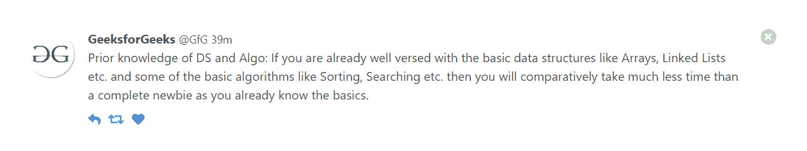
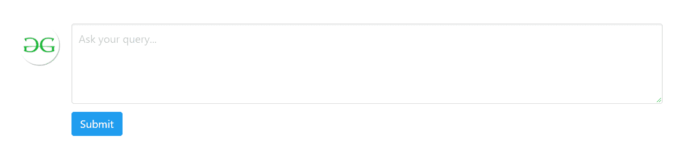
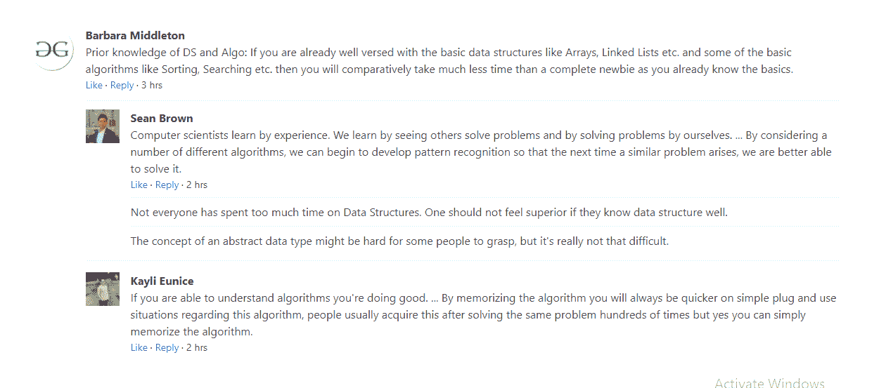

# 布尔玛|媒体对象

> 原文:[https://www.geeksforgeeks.org/bulma-media-object/](https://www.geeksforgeeks.org/bulma-media-object/)

布尔玛是一个基于 Flexbox 的免费开源 CSS 框架。它是组件丰富的，兼容的，并且有很好的文档记录。它本质上是高度反应的。它使用类来实现它的设计。著名的媒体对象在社交媒体界面中很流行，但它在任何环境中都很有用。

**示例 1:** 本示例说明了使用布尔玛媒体对象的简单社交媒体界面。

```
<html>
  <head>
    <title>Bulma Media Object</title>
    <link rel='stylesheet' 
          href=
'https://cdnjs.cloudflare.com/ajax/libs/bulma/0.7.5/css/bulma.css'>
    <!-- custom css -->
    <style>
      div.adjust{
        margin-top:50px;
      }

    </style>
  </head>
  <body> 
    <div class='container adjust'>
      <article class="media">
        <figure class="media-left">
          <p class="image is-64x64">
            
          </p>
        </figure>
        <div class="media-content">
          <div class="content">
            <p>
              <strong>GeeksforGeeks</strong> 
            <small>@GfG</small> <small>39m</small>
              <br>
              Prior knowledge of DS and Algo: 
If you are already well versed with the 
              basic data structures like Arrays, 
Linked Lists etc. and some of the basic
              algorithms like Sorting, Searching etc. 
then you will comparatively take much 
              less time than a complete newbie 
as you already know the basics.
            </p>
          </div>
          <nav class="level is-mobile">
            <div class="level-left">
              <a class="level-item">
                <span class="icon is-small">
                  <i class="fas fa-reply"></i></span>
              </a>
              <a class="level-item">
                <span class="icon is-small">
                   <i class="fas fa-retweet"></i></span>
              </a>
              <a class="level-item">
                <span class="icon is-small">
                  <i class="fas fa-heart"></i></span>
              </a>
            </div>
          </nav>
        </div>
        <div class="media-right">
          <button class="delete"></button>
        </div>
      </article>
    </div>
  </body>
</html>
```

**输出:**



**示例 2:** 我们可以包含任何布尔玛元素，如输入、按钮、图标、文本区域等。在这个例子中，我们在布尔玛媒体对象中包含了 Textarea 元素来说明它们是如何协同工作的。

```
<html>
  <head>
    <title>Bulma Media Object</title>
    <link rel='stylesheet' 
          href=
'https://cdnjs.cloudflare.com/ajax/libs/bulma/0.7.5/css/bulma.css'>
    <!-- custom css -->
    <style>
      div.adjust{
        margin-top:50px;
      }

    </style>
  </head>
  <body>
    <div class='container adjust'>
      <article class="media">
        <figure class="media-left">
          <p class="image is-64x64">
            
          </p>
        </figure>
        <div class="media-content">
          <div class="field">
            <p class="control">
              <textarea class="textarea"
                   placeholder="Ask your query...">
             </textarea>
            </p>
          </div>
          <nav class="level">
            <div class="level-left">
              <div class="level-item">
                <a class="button is-info">Submit</a>
              </div>
            </div>
          </nav>
        </div>
      </article>
    </div>
  </body>
</html>
```

**输出:**



媒体对象中的文本区域

**示例 3:** 该示例说明了嵌套的媒体对象。

```
<html>
  <head>
    <title>Bulma Media Object</title>
    <link rel='stylesheet' 
          href=
'https://cdnjs.cloudflare.com/ajax/libs/bulma/0.7.5/css/bulma.css'>
    <!-- custom css -->
    <style>
      div.adjust{
        margin-top:50px;
      }

    </style>
  </head>
  <body>
    <div class='container adjust'>
      <article class="media">
        <figure class="media-left">
          <p class="image is-64x64">
            
          </p>
        </figure>
        <div class="media-content">
          <div class="content">
            <p>
              <strong>Barbara Middleton</strong>
              <br>
              Prior knowledge of DS and Algo: 
If you are already well versed with the basic data 
              structures like Arrays, Linked Lists etc.
 and some of the basic algorithms 
              like Sorting, Searching etc.
 then you will comparatively take much less
              time than a complete newbie 
as you already know the basics.
              <br>
<small><a>Like</a> · <a>Reply</a> · 3 hrs</small>
            </p>
          </div>

          <article class="media">
            <figure class="media-left">
              <p class="image is-48x48">
                
              </p>
            </figure>
            <div class="media-content">
              <div class="content">
                <p>
                  <strong>Sean Brown</strong>
                  <br>
                  Computer scientists learn by experience.
 We learn by seeing others solve problems
                  and by solving problems by ourselves. 
... By considering a number of different 
                  algorithms, we can begin to develop
 pattern recognition so that 
                  the next time a similar problem 
arises, we are better able to solve it.
                  <br>
<small><a>Like</a> · <a>Reply</a> · 2 hrs</small>
                </p>
              </div>

              <article class="media">
                Not everyone has spent too much time on Data Structures.
 One should not feel superior if they know data structure well.
              </article>

              <article class="media">
                The concept of an abstract data type
 might be hard for some people to grasp, 
                but it's really not that difficult.
              </article>
            </div>
          </article>

          <article class="media">
            <figure class="media-left">
              <p class="image is-48x48">
                
              </p>
            </figure>
            <div class="media-content">
              <div class="content">
                <p>
                  <strong>Kayli Eunice </strong>
                  <br>
                  If you are able to understand 
algorithms you're doing good. ... 
                  By memorizing the algorithm you will always
 be quicker on simple plug and use
                  situations regarding this algorithm,
 people usually acquire this after solving 
                  the same problem hundreds of times 
but yes you can simply memorize the algorithm.
                  <br>
<small><a>Like</a> · <a>Reply</a> · 2 hrs</small>
                </p>
              </div>
            </div>
          </article>
        </div>
      </article>
    </div>
  </body>
</html>
```

**输出:**



嵌套媒体对象