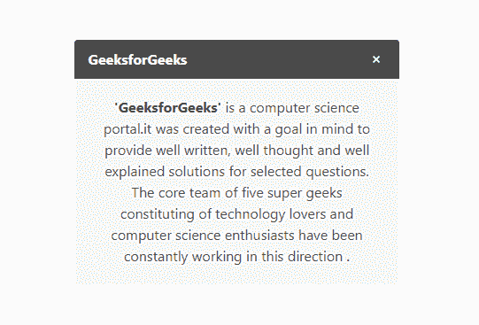
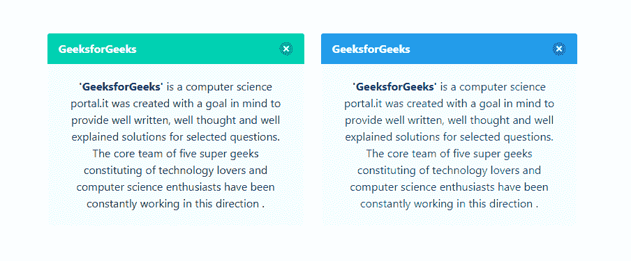
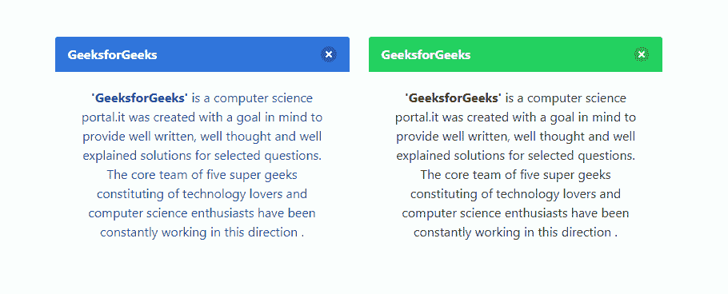
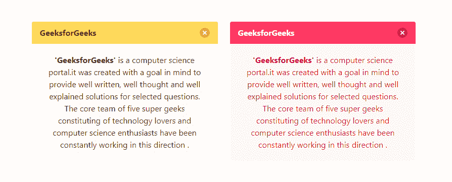
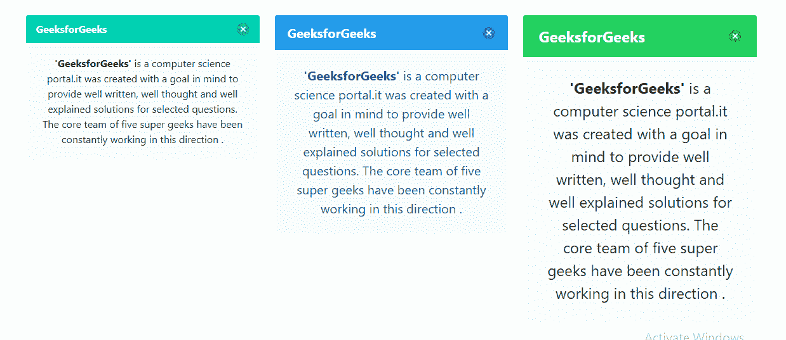
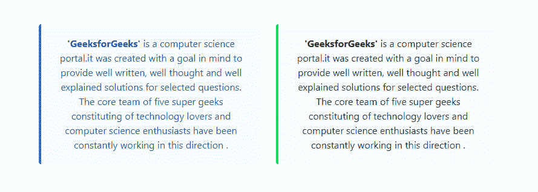

# bulma | message

> 哎哎哎:# t0]https://www . geeksforgeeks . org/bulma-message/

布尔玛是一个基于 Flexbox 的免费开源 CSS 框架。它是组件丰富的，兼容的，并且有很好的文档记录。它本质上是高度反应的。它使用类来实现它的设计。

布尔玛的消息组件提供了彩色框类型占位符来强调页面的某些部分。它包括几个可以添加到内容设计中的其他组件。这些组件如下所示:

*   **消息头:**保存消息标题和删除元素。它是一个可选组件。
*   **消息体:**保存消息体。

**示例 1:** 此示例显示了使用布尔玛创建简单消息。

## 超文本标记语言

```
<!DOCTYPE html>
<html>

<head>
  <title>Bulma Message</title>

  <!-- Include Bulma CSS -->
  <link rel='stylesheet' href=
'https://cdnjs.cloudflare.com/ajax/libs/bulma/0.7.5/css/bulma.css'>

  <!-- FontAwesome Library -->
  <script src=
'https://cdnjs.cloudflare.com/ajax/libs/font-awesome/5.12.0-2/js/all.min.js'>
  </script>

  <!-- Custom CSS -->
  <style>
    div.columns {
      margin-top: 70px;
    }
  </style>
</head>

<body>
  <div class='container has-text-centered'>
    <div class='columns is-mobile is-centered'>
      <div class='column is-4'>
        <article class="message">
          <div class="message-header">
            <p>GeeksforGeeks</p>
            <button class="delete" 
                aria-label="delete">
            </button>
          </div>
          <div class="message-body">
            <strong>'GeeksforGeeks'</strong> is
            a computer science portal.it was
            created with a goal in mind to
            provide well written, well thought
            and well explained solutions for
            selected questions. The core team
            of five super geeks constituting
            of technology lovers and computer
            science enthusiasts have been
            constantly working in this direction.
          </div>
        </article>
      </div>
    </div>
  </div>
</body>

</html>
```

**输出:**



**示例 2:** 该示例显示了使用布尔玛创建不同颜色的消息组件。

## 超文本标记语言

```
<!DOCTYPE html>
<html>

<head>
  <title>Bulma Message</title>

  <!-- Include Bulma CSS -->
  <link rel='stylesheet' href=
'https://cdnjs.cloudflare.com/ajax/libs/bulma/0.7.5/css/bulma.css'>

  <!-- FontAwesome Library -->
  <script src=
'https://cdnjs.cloudflare.com/ajax/libs/font-awesome/5.12.0-2/js/all.min.js'>
  </script>

  <!-- Custom CSS -->
  <style>
    div.columns {
      margin-top: 70px;
    }
  </style>
</head>

<body>
  <div class='container has-text-centered'>
    <div class='columns is-mobile is-centered'>
      <div class='column is-4'>
        <article class="message is-primary">
          <div class="message-header">

            <p>GeeksforGeeks</p>

            <button class="delete" aria-label="delete">
            </button>
          </div>
          <div class="message-body">
            <strong>'GeeksforGeeks'</strong> is a
            computer science portal.it was created
            with a goal in mind to provide well
            written, well thought and well explained
            solutions for selected questions. The
            core team of five super geeks
            constituting of technology lovers and
            computer science enthusiasts have been
            constantly working in this direction.
          </div>
        </article>
      </div>
      <div class="column is-4">
        <article class="message is-info">
          <div class="message-header">

            <p>GeeksforGeeks</p>

            <button class="delete" 
              aria-label="delete">
            </button>
          </div>
          <div class="message-body">
            <strong>'GeeksforGeeks'</strong> is a 
            computer science portal.it was created 
            with a goal in mind to provide well 
            written, well thought and well explained 
            solutions for selected questions. The 
            core team of five super geeks constituting 
            of technology lovers and computer science 
            enthusiasts have been constantly working
            in this direction.
          </div>
        </article>
      </div>
    </div>
  </div>
</body>

</html>
```

**输出:**



**例 3:**

## 超文本标记语言

```
<!DOCTYPE html>
<html>

<head>
  <title>Bulma Message</title>

  <!-- Include Bulma CSS -->
  <link rel='stylesheet' href=
'https://cdnjs.cloudflare.com/ajax/libs/bulma/0.7.5/css/bulma.css'>

  <!-- FontAwesome Library -->
  <script src=
'https://cdnjs.cloudflare.com/ajax/libs/font-awesome/5.12.0-2/js/all.min.js'>
  </script>

  <!-- Custom CSS -->
  <style>
    div.columns {
      margin-top: 70px;
    }
  </style>
</head>

<body>
  <div class='container has-text-centered'>
    <div class='columns is-mobile is-centered'>
      <div class='column is-4'>
        <article class="message is-link">
          <div class="message-header">

            <p>GeeksforGeeks</p>

            <button class="delete" aria-label="delete">
            </button>
          </div>
          <div class="message-body">
            <strong>'GeeksforGeeks'</strong> is a
            computer science portal.it was created with
            a goal in mind to provide well written,
            well thought and well explained solutions
            for selected questions. The core team
            of five super geeks constituting of
            technology lovers and computer science
            enthusiasts have been constantly working
            in this direction .
          </div>
        </article>
      </div>
      <div class="column is-4">
        <article class="message is-success">
          <div class="message-header">
            <p>GeeksforGeeks</p>
            <button class="delete" 
              aria-label="delete">
            </button>
          </div>
          <div class="message-body">
            <strong>'GeeksforGeeks'</strong> is a
            computer science portal.it was created with
            a goal in mind to provide well written,
            well thought and well explained solutions
            for selected questions. The core team
            of five super geeks constituting of
            technology lovers and computer science
            enthusiasts have been constantly working
            in this direction .
          </div>
        </article>
      </div>
    </div>
  </div>
</body>

</html>
```

**输出:**



**例 4:**

## 超文本标记语言

```
<!DOCTYPE html>
<html>

<head>
  <title>Bulma Message</title>

  <!-- Include Bulma CSS -->
  <link rel='stylesheet' href=
'https://cdnjs.cloudflare.com/ajax/libs/bulma/0.7.5/css/bulma.css'>

  <!-- FontAwesome Library -->
  <script src=
'https://cdnjs.cloudflare.com/ajax/libs/font-awesome/5.12.0-2/js/all.min.js'>
  </script>

  <!-- Custom CSS -->
  <style>
    div.columns {
      margin-top: 70px;
    }
  </style>
</head>

<body>
  <div class='container has-text-centered'>
    <div class='columns is-mobile is-centered'>
      <div class='column is-4'>
        <article class="message is-warning">
          <div class="message-header">

            <p>GeeksforGeeks</p>

            <button class="delete" aria-label="delete">
            </button>
          </div>
          <div class="message-body">
            <strong>'GeeksforGeeks'</strong> is a
            computer science portal.it was created with
            a goal in mind to provide well written,
            well thought and well explained solutions
            for selected questions. The core team
            of five super geeks constituting of
            technology lovers and computer science
            enthusiasts have been constantly working
            in this direction .
          </div>
        </article>
      </div>
      <div class="column is-4">
        <article class="message is-danger">
          <div class="message-header">

            <p>GeeksforGeeks</p>

            <button class="delete" aria-label="delete">
            </button>
          </div>
          <div class="message-body">
            <strong>'GeeksforGeeks'</strong> is a
            computer science portal.it was created with
            a goal in mind to provide well written,
            well thought and well explained solutions
            for selected questions. The core team
            of five super geeks constituting of
            technology lovers and computer science
            enthusiasts have been constantly working
            in this direction .
          </div>
        </article>
      </div>
    </div>
  </div>
</body>

</html>
```

**输出:**



**示例 5:** 该示例显示了使用布尔玛创建不同大小的消息组件。

## 超文本标记语言

```
<!DOCTYPE html>
<html>

<head>
  <title>Bulma Message</title>

  <!-- Include Bulma CSS -->
  <link rel='stylesheet' href=
'https://cdnjs.cloudflare.com/ajax/libs/bulma/0.7.5/css/bulma.css'>

  <!-- FontAwesome Library -->
  <script src=
'https://cdnjs.cloudflare.com/ajax/libs/font-awesome/5.12.0-2/js/all.min.js'>
  </script>

  <!-- Custom CSS -->
  <style>
    div.columns {
      margin-top: 50px;
    }
  </style>
</head>

<body>
  <div class='container has-text-centered'>
    <div class='columns is-mobile is-centered'>
      <div class='column is-4'>
        <article class="message is-primary">
          <div class="message-header">

            <p>GeeksforGeeks</p>

            <button class="delete" 
              aria-label="delete">
            </button>
          </div>
          <div class="message-body">
            <strong>'GeeksforGeeks'</strong> is a
            computer science portal.it was created with
            a goal in mind to provide well written,
            well thought and well explained solutions
            for selected questions. The core team
            of five super geeks constituting of
            technology lovers and computer science
            enthusiasts have been constantly working
            in this direction .
          </div>
        </article>
      </div>

      <div class="column is-4">
        <article class="message is-medium is-info">
          <div class="message-header">

            <p>GeeksforGeeks</p>

            <button class="delete" 
              aria-label="delete">
            </button>
          </div>
          <div class="message-body">
            <strong>'GeeksforGeeks'</strong> is a
            computer science portal.it was created with
            a goal in mind to provide well written,
            well thought and well explained solutions
            for selected questions. The core team
            of five super geeks constituting of
            technology lovers and computer science
            enthusiasts have been constantly working
            in this direction .
          </div>
        </article>
      </div>

      <div class="column is-4">
        <article class="message is-large is-success">
          <div class="message-header">

            <p>GeeksforGeeks</p>

            <button class="delete" 
              aria-label="delete">
            </button>
          </div>
          <div class="message-body">
            <strong>'GeeksforGeeks'</strong> is a
            computer science portal.it was created with
            a goal in mind to provide well written,
            well thought and well explained solutions
            for selected questions. The core team
            of five super geeks constituting of
            technology lovers and computer science
            enthusiasts have been constantly working
            in this direction .
          </div>
        </article>
      </div>
    </div>
  </div>
</body>

</html>
```

**输出:**



**示例 6:** 本示例使用布尔玛创建无标头的消息组件。

## 超文本标记语言

```
<!DOCTYPE html>
<html>

<head>
  <title>Bulma Message</title>

  <!-- Include Bulma CSS -->
  <link rel='stylesheet' href=
'https://cdnjs.cloudflare.com/ajax/libs/bulma/0.7.5/css/bulma.css'>

  <!-- FontAwesome Library -->
  <script src=
'https://cdnjs.cloudflare.com/ajax/libs/font-awesome/5.12.0-2/js/all.min.js'>
  </script>

  <!-- Custom CSS -->
  <style>
    div.columns {
      margin-top: 50px;
    }
  </style>
</head>

<body>
  <div class='container has-text-centered'>
    <div class='columns is-mobile is-centered'>
      <div class='column is-4'>
        <article class="message is-link">
          <div class="message-body">
            <strong>'GeeksforGeeks'</strong> is a
            computer science portal.it was created with
            a goal in mind to provide well written,
            well thought and well explained solutions
            for selected questions. The core team
            of five super geeks constituting of
            technology lovers and computer science
            enthusiasts have been constantly working
            in this direction .
          </div>
        </article>
      </div>

      <div class="column is-4">
        <article class="message is-success">
          <div class="message-body">
            <strong>'GeeksforGeeks'</strong> is a
            computer science portal.it was created with
            a goal in mind to provide well written,
            well thought and well explained solutions
            for selected questions. The core team
            of five super geeks constituting of
            technology lovers and computer science
            enthusiasts have been constantly working
            in this direction .
          </div>
        </article>
      </div>
    </div>
  </div>
</body>

</html>
```

**输出:**

