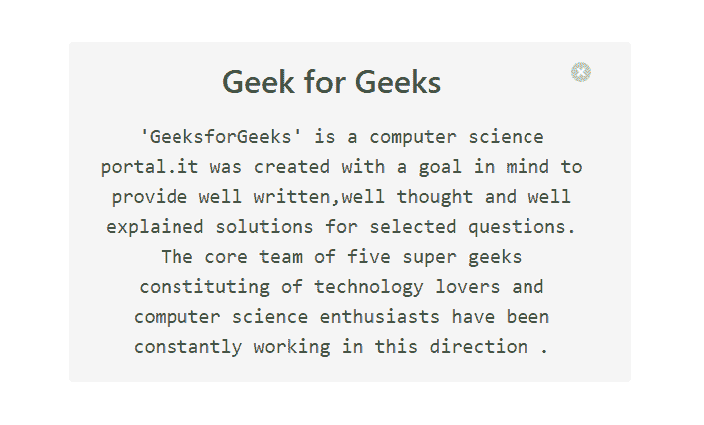
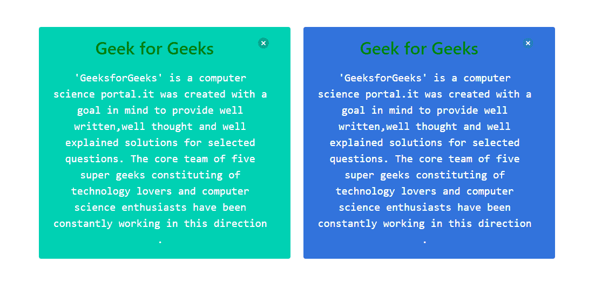
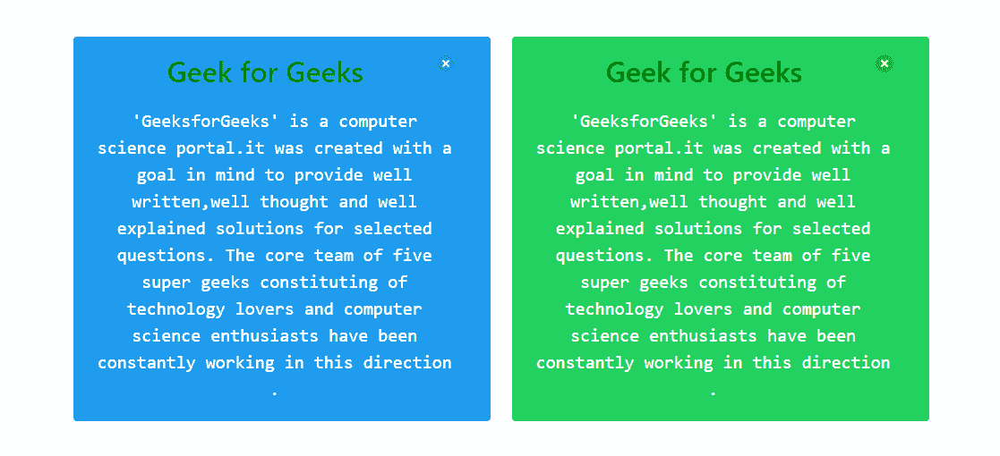
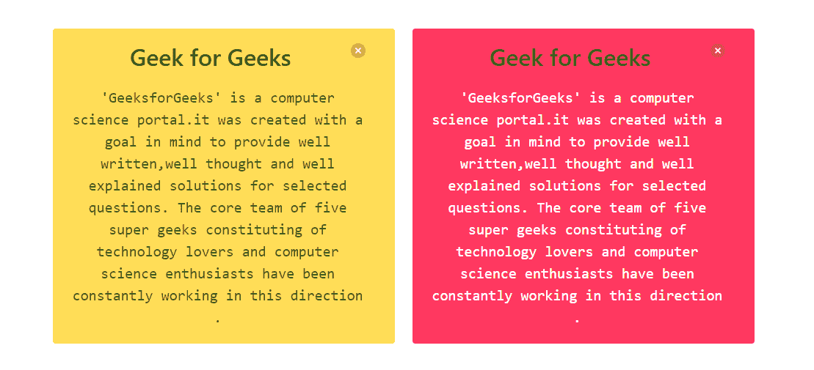
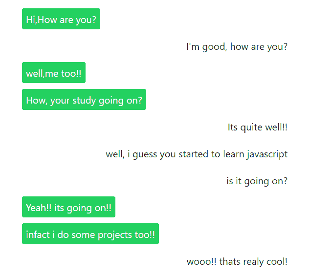

# Bulma | Notification

> 哎哎哎:# t0]https://www . geeksforgeeks . org/bulma-notification/

**布尔玛**是一个基于 Flexbox 的免费开源 CSS 框架。它是组件丰富的，兼容的，并且有很好的文档记录。它本质上是高度反应的。它使用类来实现它的设计。
通知是一个简单的彩色块，吸引用户对某事的注意。它可以用作视口角落的固定通知。它支持使用 delete 元素。

**示例 1:** 本示例使用布尔玛创建一个简单的通知框。

## 超文本标记语言

```html
<!DOCTYPE html>
<html>

<head>
  <title>Bulma Notification</title>
  <link rel='stylesheet' href=
'https://cdnjs.cloudflare.com/ajax/libs/bulma/0.7.5/css/bulma.css'>

  <!-- custom css -->
  <style>
    div.columns {
      margin-top: 70px;
    }

    h1 {
      color: green !important
    }

    p {
      font-size: 20px;
    }

    button {
      float: right
    }
  </style>
</head>

<body>
  <div class='container has-text-centered'>
    <div class='columns is-mobile is-centered'>
      <div class='column is-6'>
        <div class='notification'>
          <h1 class='title'>
            Geek for Geeks
            <button class="delete"></button>
          </h1>

          <p class='is-family-monospace'>
            'GeeksforGeeks' is a computer science
            portal. It was created with a goal in
            mind to provide well written, well
            thought and well explained solutions
            for selected questions. The core team
            of five super geeks constituting of
            technology lovers and computer science
            enthusiasts have been constantly working
            in this direction.
          </p>

        </div>
      </div>
    </div>
  </div>
</body>

</html>
```

**输出:**



**示例 2:** 本示例使用布尔玛创建带有颜色的通知块。

## 超文本标记语言

```html
<!DOCTYPE html>
<html>

<head>
  <title>Bulma Notification</title>
  <link rel='stylesheet' href=
'https://cdnjs.cloudflare.com/ajax/libs/bulma/0.7.5/css/bulma.css'>

  <!-- custom css -->
  <style>
    div.columns {
      margin-top: 70px;
    }

    h1 {
      color: green !important
    }

    p {
      font-size: 20px;
    }

    button {
      float: right
    }
  </style>
</head>

<body>
  <div class='container has-text-centered'>
    <div class='columns is-mobile is-centered'>
      <div class='column is-5'>
        <div class='notification is-primary'>
          <h1 class='title'>
            Geek for Geeks
            <button class="delete"></button>
          </h1>

          <p class='is-family-monospace'>
            'GeeksforGeeks' is a computer science
            portal.it was created with a goal in
            mind to provide well written, well
            thought and well explained solutions
            for selected questions. The core team
            of five super geeks constituting of
            technology lovers and computer science
            enthusiasts have been constantly working
            in this direction.
          </p>

        </div>
      </div>

      <div class='column is-5'>
        <div class='notification is-link'>
          <h1 class='title'>
            Geek for Geeks
            <button class="delete"></button>
          </h1>

          <p class='is-family-monospace'>
            'GeeksforGeeks' is a computer science
            portal.it was created with a goal in
            mind to provide well written, well
            thought and well explained solutions
            for selected questions. The core team
            of five super geeks constituting of
            technology lovers and computer science
            enthusiasts have been constantly working
            in this direction.
          </p>

        </div>
      </div>
    </div>
  </div>
</body>

</html>
```



**示例 3:** 本示例使用布尔玛创建带有颜色的通知块。

## 超文本标记语言

```html
<!DOCTYPE html>
<html>

<head>
  <title>Bulma Notification</title>
  <link rel='stylesheet' href=
'https://cdnjs.cloudflare.com/ajax/libs/bulma/0.7.5/css/bulma.css'>

  <!-- custom css -->
  <style>
    div.columns {
      margin-top: 70px;
    }

    h1 {
      color: green !important
    }

    p {
      font-size: 20px;
    }

    button {
      float: right
    }
  </style>
</head>

<body>
  <div class='container has-text-centered'>
    <div class='columns is-mobile is-centered'>
      <div class='column is-5'>
        <div class='notification is-info'>
          <h1 class='title'>
            Geek for Geeks
            <button class="delete"></button>
          </h1>

          <p class='is-family-monospace'>
            'GeeksforGeeks' is a computer science
            portal.it was created with a goal in
            mind to provide well written, well
            thought and well explained solutions
            for selected questions. The core team
            of five super-geeks constituting of
            technology lovers and computer science
            enthusiasts have been constantly working
            in this direction.
          </p>

        </div>
      </div>

      <div class='column is-5'>
        <div class='notification is-success'>
          <h1 class='title'>
            Geek for Geeks
            <button class="delete"></button>
          </h1>

          <p class='is-family-monospace'>
            'GeeksforGeeks' is a computer science
            portal.it was created with a goal in
            mind to provide well written, well
            thought and well explained solutions
            for selected questions. The core team
            of five super geeks constituting of
            technology lovers and computer science
            enthusiasts have been constantly working
            in this direction.
          </p>

        </div>
      </div>
    </div>
  </div>
</body>

</html>
```

**输出:**



**示例 4:** 本示例使用布尔玛创建带有颜色的通知块。

## 超文本标记语言

```html
<!DOCTYPE html>
<html>

<head>
  <title>Bulma Notification</title>
  <link rel='stylesheet' href=
'https://cdnjs.cloudflare.com/ajax/libs/bulma/0.7.5/css/bulma.css'>

  <!-- custom css -->
  <style>
    div.columns {
      margin-top: 70px;
    }

    h1 {
      color: green !important
    }

    p {
      font-size: 20px;
    }

    button {
      float: right
    }
  </style>
</head>

<body>
  <div class='container has-text-centered'>
    <div class='columns is-mobile is-centered'>
      <div class='column is-5'>
        <div class='notification is-warning'>
          <h1 class='title'>
            Geek for Geeks
            <button class="delete"></button>
          </h1>

          <p class='is-family-monospace'>
            'GeeksforGeeks' is a computer science
            portal.it was created with a goal in
            mind to provide well written, well
            thought and well explained solutions
            for selected questions. The core team
            of five super geeks constituting of
            technology lovers and computer science
            enthusiasts have been constantly working
            in this direction.
          </p>

        </div>
      </div>

      <div class='column is-5'>
        <div class='notification is-danger'>
          <h1 class='title'>
            Geek for Geeks
            <button class="delete"></button>
          </h1>

          <p class='is-family-monospace'>
            'GeeksforGeeks' is a computer science
            portal.it was created with a goal in
            mind to provide well written, well
            thought and well explained solutions
            for selected questions. The core team
            of five super geeks constituting of
            technology lovers and computer science
            enthusiasts have been constantly working
            in this direction.
          </p>

        </div>
      </div>
    </div>
  </div>
</body>

</html>
```

**输出:**



**示例 5:** 本示例创建一个文本消息界面(使用类“通知”)。

## 超文本标记语言

```html
<!DOCTYPE html>
<html>

<head>
  <title>Bulma Notification</title>
  <link rel='stylesheet' href=
'https://cdnjs.cloudflare.com/ajax/libs/bulma/0.7.5/css/bulma.css'>

  <!-- custom css -->
  <style>
    div.columns {
      margin-top: 10px;
    }

    p {
      font-size: 20px;
    }

    div.sender {
      float: left
    }

    div.receiver {
      float: right
    }

    div.notification {
      padding: 8px
    }

    .table td {
      border: none;
      padding: 0.4em
    }
  </style>
</head>

<body>
  <div class='container has-text-centered'>
    <div class='columns is-mobile is-centered'>
      <div class='column is-6'>
        <table class='table is-fullwidth'>
          <tr>
            <td>
              <div class='sender notification is-success'>

<p>Hi, How are you?</p>

              </div>
            </td>
          </tr>

          <tr>
            <td>
              <div class='receiver notification is-white'>

<p>I'm good, how are you?</p>

              </div>
            </td>
          </tr>

          <tr>
            <td>
              <div class='sender notification is-success'>

<p>well, me too!!</p>

              </div>
            </td>
          </tr>

          <tr>
            <td>
              <div class='sender notification is-success'>

<p>How, your study going on?</p>

              </div>
            </td>
          </tr>

          <tr>
            <td>
              <div class='receiver notification is-white'>

<p>Its quite well!!</p>

              </div>
            </td>
          </tr>

          <tr>
            <td>
              <div class='receiver notification is-white'>

<p>
                  well, i guess you started
                  to learn javascript
                </p>

              </div>
            </td>
          </tr>

          <tr>
            <td>
              <div class='receiver notification is-white'>

<p>is it going on?</p>

              </div>
            </td>
          </tr>

          <tr>
            <td>
              <div class='sender notification is-success'>

<p>Yeah!! its going on!!</p>

              </div>
            </td>
          </tr>

          <tr>
            <td>
              <div class='sender notification is-success'>

<p>infact i do some projects too!!</p>

              </div>
            </td>
          </tr>

          <tr>
            <td>
              <div class='receiver notification is-white'>

<p>wooo!! thats really cool!</p>

              </div>
            </td>
          </tr>
        </table>
      </div>
    </div>
  </div>
</body>

</html>
```

**输出:**



**注意:**在上面所有的例子中，我们使用了一些额外的布尔玛类，如容器、列、表等。设计好内容。