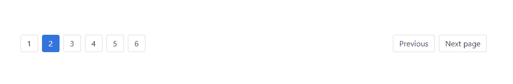
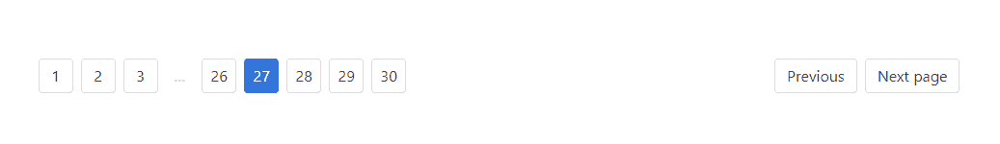
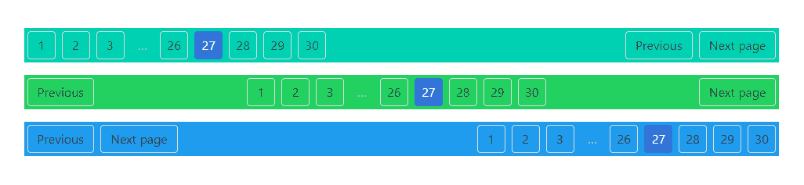
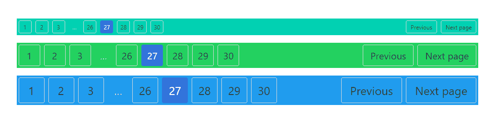
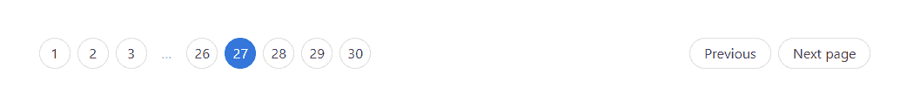

# 茶壶|分页

> 哎哎哎:# t0]https://www . geeksforgeeks . org/bulma-page/

**布尔玛**是一个基于 **FLexbox** 的开源 CSS 框架，其完全免费。它是组件丰富的，兼容的，并且有很好的文档记录。它本质上是高度反应的。它使用类来实现它的设计。
分页是一个组件，用于指示跨多个页面的一系列相关内容的存在。分页用于在网站的页面之间进行导航。分页组件包括几个其他组件，我们必须专门添加这些组件才能很好地设计我们的内容。下面列出了这些组件。

*   **分页-上一页:**用于导航到上一页。
*   **分页-下一页:**用于导航到下一页。
*   **分页列表:**用于显示网站的不同页面。
    *   **分页-链接:**是在锚点标签中标明页码。
    *   **分页-省略号:**在页码之间创建范围分隔符。

**示例 1:** 此示例显示了简单的布尔玛分页组件。

```html
<!DOCTYPE html>
<html>

<head>
  <title>Bulma Pagination</title>
  <link rel='stylesheet' href=
'https://cdnjs.cloudflare.com/ajax/libs/bulma/0.7.5/css/bulma.css'>

  <!-- custom css -->
  <style>
    div.columns {
      margin-top: 80px;
    }
  </style>
</head>

<body>
  <div class='container'>
    <div class='columns is-mobile is-centered'>
      <div class='column is-10'>
        <nav class="pagination" role="navigation" 
            aria-label="pagination">
          <a class="pagination-previous">Previous</a>
          <a class="pagination-next">Next page</a>
          <ul class="pagination-list">
            <li>
              <a href="#" class="pagination-link" 
                aria-label="Page 1">1</a>
            </li>
            <li>
              <a href="#" class="pagination-link 
                  is-current" aria-label="Goto page 2" 
                  aria-current="page">2</a>
            </li>
            <li>
              <a href="#" class="pagination-link" 
                aria-label="Goto page 3">3</a>
            </li>
            <li>
              <a href="#" class="pagination-link" 
                aria-label="Goto page 4">4</a>
            </li>
            <li>
              <a href="#" class="pagination-link" 
                aria-label="Goto page 5">5</a>
            </li>
            <li>
              <a class="pagination-link" 
                aria-label="Goto page 6">6</a>
            </li>
          </ul>
        </nav>
      </div>
    </div>
  </div>
</body>

</html>
```

**输出:**


**例 2:** 本例展示了大量页面的分页。

```html
<!DOCTYPE html>
<html>

<head>
  <title>Bulma Pagination</title>
  <link rel='stylesheet' href=
'https://cdnjs.cloudflare.com/ajax/libs/bulma/0.7.5/css/bulma.css'>

  <!-- custom css -->
  <style>
    div.columns {
      margin-top: 80px;
    }
  </style>
</head>

<body>
  <div class='container'>
    <div class='columns is-mobile is-centered'>
      <div class='column is-10'>
        <nav class="pagination" role="navigation" 
            aria-label="pagination">
          <a class="pagination-previous">Previous</a>
          <a class="pagination-next">Next page</a>
          <ul class="pagination-list">
            <li>
              <a class="pagination-link" 
                aria-label="Goto page 1">1</a>
            </li>
            <li>
              <a class="pagination-link" 
                aria-label="Goto page 2">2</a>
            </li>
            <li>
              <a class="pagination-link" 
                aria-label="Goto page 3">3</a>
            </li>
            <li>
              <span class="pagination-ellipsis">
                …
              </span>
            </li>
            <li>
              <a class="pagination-link" 
                aria-label="Goto page 26">26</a>
            </li>
            <li>
              <a class="pagination-link is-current" 
                  aria-label="Page 27" 
                  aria-current="page">27</a>
            </li>
            <li>
              <a class="pagination-link" 
                aria-label="Goto page 28">28</a>
            </li>
            <li>
              <a class="pagination-link" 
                aria-label="Goto page 29">29</a>
            </li>
            <li>
              <a class="pagination-link" 
                aria-label="Goto page 30">30</a>
            </li>
          </ul>
        </nav>
      </div>
    </div>
  </div>
</body>

</html>
```

**输出:**


**示例 3:** 本示例显示不同对齐方式的分页。

```html
<!DOCTYPE html>
<html>

<head>
  <title>Bulma Pagination</title>
  <link rel='stylesheet' href=
'https://cdnjs.cloudflare.com/ajax/libs/bulma/0.7.5/css/bulma.css'>

  <!-- custom css -->
  <style>
    div.columns {
      margin-top: 80px;
    }

    .pagination {
      margin-bottom: 20px;
    }
  </style>
</head>

<body>
  <div class='container'>
    <div class='columns is-mobile is-centered'>
      <div class='column is-10'>
        <nav class="pagination has-background-primary"
          role="navigation" aria-label="pagination">
          <a class="pagination-previous">Previous</a>
          <a class="pagination-next">Next page</a>
          <ul class="pagination-list">
            <li>
              <a class="pagination-link" 
                aria-label="Goto page 1">1</a>
            </li>
            <li>
              <a class="pagination-link" 
                aria-label="Goto page 2">2</a>
            </li>
            <li>
              <a class="pagination-link" 
                aria-label="Goto page 3">3</a>
            </li>
            <li>
              <span class="pagination-ellipsis">
                …
              </span>
            </li>
            <li>
              <a class="pagination-link" 
                aria-label="Goto page 26">26</a>
            </li>
            <li>
              <a class="pagination-link is-current" 
                  aria-label="Page 27" 
                  aria-current="page">27</a>
            </li>
            <li>
              <a class="pagination-link" 
                aria-label="Goto page 28">28</a>
            </li>
            <li>
              <a class="pagination-link" 
                aria-label="Goto page 29">29</a>
            </li>
            <li>
              <a class="pagination-link" 
                aria-label="Goto page 30">30</a>
            </li>
          </ul>
        </nav>

        <nav class="pagination is-centered 
            has-background-success" role="navigation"
            aria-label="pagination">
          <a class="pagination-previous">Previous</a>
          <a class="pagination-next">Next page</a>
          <ul class="pagination-list">
            <li>
              <a class="pagination-link" 
                  aria-label="Goto page 1">1</a>
            </li>
            <li>
              <a class="pagination-link" 
                  aria-label="Goto page 2">2</a>
            </li>
            <li>
              <a class="pagination-link" 
                  aria-label="Goto page 3">3</a>
            </li>
            <li>
              <span class="pagination-ellipsis">
                …
              </span>
            </li>
            <li>
              <a class="pagination-link" 
                  aria-label="Goto page 26">26</a>
            </li>
            <li>
              <a class="pagination-link is-current" 
                  aria-label="Page 27" 
                  aria-current="page">27</a>
            </li>
            <li>
              <a class="pagination-link" 
                  aria-label="Goto page 28">28</a>
            </li>
            <li>
              <a class="pagination-link" 
                  aria-label="Goto page 29">29</a>
            </li>
            <li>
              <a class="pagination-link" 
                  aria-label="Goto page 30">30</a>
            </li>

          </ul>
        </nav>

        <nav class="pagination is-right 
            has-background-info" role="navigation" 
            aria-label="pagination">
          <a class="pagination-previous">Previous</a>
          <a class="pagination-next">Next page</a>
          <ul class="pagination-list">
            <li>
              <a class="pagination-link" 
                  aria-label="Goto page 1">1</a>
            </li>
            <li>
              <a class="pagination-link" 
                  aria-label="Goto page 2">2</a>
            </li>
            <li>
              <a class="pagination-link" 
                  aria-label="Goto page 3">3</a>
            </li>
            <li>
              <span class="pagination-ellipsis">
                …
              </span>
            </li>
            <li>
              <a class="pagination-link" 
                aria-label="Goto page 26">26</a>
            </li>
            <li>
              <a class="pagination-link is-current" 
                  aria-label="Page 27" 
                  aria-current="page">27</a>
            </li>
            <li>
              <a class="pagination-link" 
                  aria-label="Goto page 28">28</a>
            </li>
            <li>
              <a class="pagination-link" 
                  aria-label="Goto page 29">29</a>
            </li>
            <li>
              <a class="pagination-link" 
                  aria-label="Goto page 30">30</a>
            </li>
          </ul>
        </nav>
      </div>
    </div>
  </div>
</body>

</html>
```

**输出:**


**示例 4:** 本示例显示不同大小的分页。

```html
<!DOCTYPE html>
<html>

<head>
  <title>Bulma Pagination</title>
  <link rel='stylesheet' href=
'https://cdnjs.cloudflare.com/ajax/libs/bulma/0.7.5/css/bulma.css'>

  <!-- custom css -->
  <style>
    div.columns {
      margin-top: 80px;
    }

    .pagination {
      margin-bottom: 20px;
    }
  </style>
</head>

<body>
  <div class='container'>
    <div class='columns is-mobile is-centered'>
      <div class='column is-10'>
        <nav class="pagination is-small 
            has-background-primary" role="navigation"
            aria-label="pagination">

          <a class="pagination-previous">Previous</a>
          <a class="pagination-next">Next page</a>
          <ul class="pagination-list">
            <li>
              <a class="pagination-link" 
                  aria-label="Goto page 1">1</a>
            </li>
            <li>
              <a class="pagination-link" 
                  aria-label="Goto page 2">2</a>
            </li>
            <li>
              <a class="pagination-link" 
                  aria-label="Goto page 3">3</a>
            </li>
            <li>
              <span class="pagination-ellipsis">
                …
              </span>
            </li>
            <li>
              <a class="pagination-link" 
                  aria-label="Goto page 26">26</a>
            </li>
            <li>
              <a class="pagination-link is-current" 
                  aria-label="Page 27" 
                  aria-current="page">27</a>
            </li>
            <li>
              <a class="pagination-link" 
                  aria-label="Goto page 28">28</a>
            </li>
            <li>
              <a class="pagination-link" 
                  aria-label="Goto page 29">29</a>
            </li>
            <li>
              <a class="pagination-link" 
                  aria-label="Goto page 30">30</a>
            </li>
          </ul>
        </nav>
        <nav class="pagination is-medium 
            has-background-success" role="navigation" 
            aria-label="pagination">

          <a class="pagination-previous">Previous</a>
          <a class="pagination-next">Next page</a>
          <ul class="pagination-list">
            <li>
              <a class="pagination-link" 
                  aria-label="Goto page 1">1</a>
            </li>
            <li>
              <a class="pagination-link" 
                  aria-label="Goto page 2">2</a>
            </li>
            <li>
              <a class="pagination-link" 
                  aria-label="Goto page 3">3</a>
            </li>
            <li>
              <span class="pagination-ellipsis">
                …
              </span>
            </li>
            <li>
              <a class="pagination-link" 
                  aria-label="Goto page 26">26</a>
            </li>
            <li>
              <a class="pagination-link is-current" 
                  aria-label="Page 27" 
                  aria-current="page">27</a>
            </li>
            <li>
              <a class="pagination-link" 
                  aria-label="Goto page 28">28</a>
            </li>
            <li>
              <a class="pagination-link" 
                  aria-label="Goto page 29">29</a>
            </li>
            <li>
              <a class="pagination-link" 
                  aria-label="Goto page 30">30</a>
            </li>
          </ul>
        </nav>

        <nav class="pagination is-large 
            has-background-info" role="navigation" 
            aria-label="pagination">
          <a class="pagination-previous">Previous</a>
          <a class="pagination-next">Next page</a>
          <ul class="pagination-list">
            <li>
              <a class="pagination-link" 
                  aria-label="Goto page 1">1</a>
            </li>
            <li>
              <a class="pagination-link" 
                  aria-label="Goto page 2">2</a>
            </li>
            <li>
              <a class="pagination-link" 
                  aria-label="Goto page 3">3</a>
            </li>
            <li>
              <span class="pagination-ellipsis">
                …
              </span>
            </li>
            <li>
              <a class="pagination-link" 
                  aria-label="Goto page 26">26</a>
            </li>
            <li>
              <a class="pagination-link is-current" 
                  aria-label="Page 27" 
                  aria-current="page">27</a>
            </li>
            <li>
              <a class="pagination-link" 
                  aria-label="Goto page 28">28</a>
            </li>
            <li>
              <a class="pagination-link" 
                  aria-label="Goto page 29">29</a>
            </li>
            <li>
              <a class="pagination-link" 
                  aria-label="Goto page 30">30</a>
            </li>
          </ul>
        </nav>
      </div>
    </div>
  </div>
</body>

</html>
```

**输出:**


**示例 5:** 本示例显示了舍入分页功能。

```html
<!DOCTYPE html>
<html>

<head>
  <title>Bulma Pagination</title>
  <link rel='stylesheet' href=
'https://cdnjs.cloudflare.com/ajax/libs/bulma/0.7.5/css/bulma.css'>

  <!-- custom css -->
  <style>
    div.columns {
      margin-top: 80px;
    }

    .pagination {
      margin-bottom: 20px;
    }
  </style>
</head>

<body>
  <div class='container'>
    <div class='columns is-mobile is-centered'>
      <div class='column is-10'>
        <nav class="pagination is-rounded" 
          role="navigation" aria-label="pagination">

          <a class="pagination-previous">Previous</a>
          <a class="pagination-next">Next page</a>
          <ul class="pagination-list">
            <li>
              <a class="pagination-link" 
                aria-label="Goto page 1">1</a>
            </li>
            <li>
              <a class="pagination-link" 
                aria-label="Goto page 2">2</a>
            </li>
            <li>
              <a class="pagination-link" 
                aria-label="Goto page 3">3</a>
            </li>
            <li>
              <span class="pagination-ellipsis">
                …
              </span>
            </li>
            <li>
              <a class="pagination-link" 
                aria-label="Goto page 26">26</a>
            </li>
            <li>
              <a class="pagination-link is-current" 
                  aria-label="Page 27" 
                  aria-current="page">27</a>
            </li>
            <li>
              <a class="pagination-link" 
                aria-label="Goto page 28">28</a>
            </li>
            <li>
              <a class="pagination-link" 
                aria-label="Goto page 29">29</a>
            </li>
            <li>
              <a class="pagination-link" 
                aria-label="Goto page 30">30</a>
            </li>
          </ul>
        </nav>
      </div>
    </div>
  </div>
</body>

</html>
```

**输出:**
