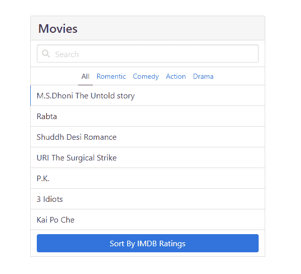
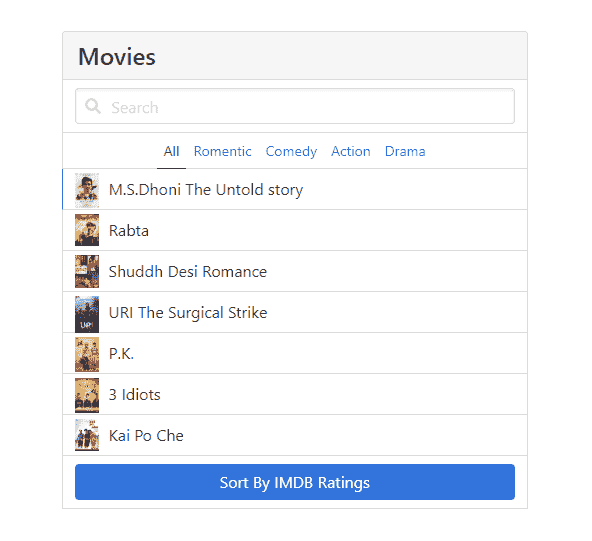
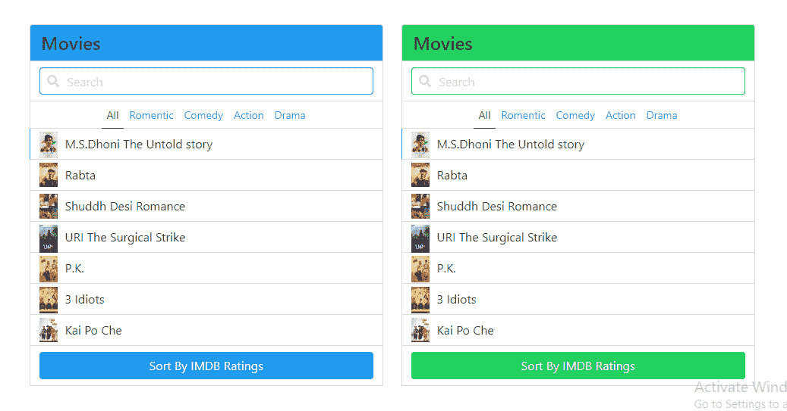

# Bulma | Panel

> 原文:[https://www.geeksforgeeks.org/bulma-panel/](https://www.geeksforgeeks.org/bulma-panel/)

**布尔玛**是一个基于 Flexbox 及其完全免费的 CSS 响应开源框架。这个框架的主要特点是，它非常兼容，有很好的文档记录，并且有丰富的组件。出于设计目的，**布尔玛**使用类。

面板元素只是一个紧凑控件的容器。我们可以在项目设计的许多地方使用这个。它为项目提供了一个交互式用户界面。面板组件包括几个其他组件，我们必须专门添加这些组件才能很好地设计我们的内容。下面列出了这些组件。

*   **面板标题:**是面板的第一个子级，负责面板标题的造型。
*   **面板-选项卡:**负责创建面板选项卡。
*   **面板块:**面板块是一种容器，可以包含输入控件、按钮、图标、表单等其他元素。

**例 1:**

```html
<!DOCTYPE html>
<html lang="en">

<head>
  <link rel='stylesheet' href=
'https://cdnjs.cloudflare.com/ajax/libs/bulma/0.7.5/css/bulma.css'>

  <style>
    div.container {
      margin-top: 80px;
    }
  </style>
</head>

<body>
  <!-- font-awesome cdn -->
  <script src=
'https://cdnjs.cloudflare.com/ajax/libs/font-awesome/5.12.0-2/js/all.min.js'>
  </script>

  <div class='container'>
    <div class="columns is-centered">
      <div class="column is-5">
        <nav class="panel">
          <p class="panel-heading">
            <span class='title is-4'>Movies</span>
          </p>
          <div class="panel-block">
            <p class="control has-icons-left">
              <input class="input" 
                type="text" placeholder="Search">
              <span class="icon is-left">
                <i class="fas fa-search" 
                    aria-hidden="true"></i>
              </span>
            </p>
          </div>
          <p class="panel-tabs">
            <a class="is-active">All</a>
            <a>Romentic</a>
            <a>Comedy</a>
            <a>Action</a>
            <a>Drama</a>
          </p>
          <a class="panel-block is-active">
            M.S.Dhoni The Untold story
          </a>
          <a class="panel-block">
            Rabta
          </a>
          <a class="panel-block">
            Shuddh Desi Romance
          </a>
          <a class="panel-block">
            URI The Surgical Strike
          </a>
          <a class="panel-block">
            P.K.
          </a>
          <a class="panel-block">
            3 Idiots
          </a>
          <a class="panel-block">
            Kai Po Che
          </a>
          <div class="panel-block">
            <button class="button 
              is-link is-fullwidth">
              Sort By IMDB Ratings
            </button>
          </div>
        </nav>
      </div>
    </div>
  </div>
</body>

</html>
```

**输出:**


**示例 2:** 带图像的面板。

```html
<!DOCTYPE html>
<html lang="en">

<head>
  <link rel='stylesheet' href=
'https://cdnjs.cloudflare.com/ajax/libs/bulma/0.7.5/css/bulma.css'>

  <style>
    div.container {
      margin-top: 80px;
    }

    .image {
      margin-right: 10px;
      position: relative;
      bottom: 4px;
    }
  </style>
</head>

<body>
  <!-- font-awesome cdn -->
  <script src=
'https://cdnjs.cloudflare.com/ajax/libs/font-awesome/5.12.0-2/js/all.min.js'>
  </script>

  <div class='container'>
    <div class="columns is-centered">
      <div class="column is-5">
        <nav class="panel">
          <p class="panel-heading">
            <span class='title is-4'>
              Movies
            </span>
          </p>
          <div class="panel-block">
            <p class="control has-icons-left">
              <input class="input" 
                type="text" placeholder="Search">
              <span class="icon is-left">
                <i class="fas fa-search" 
                  aria-hidden="true"></i>
              </span>
            </p>
          </div>
          <p class="panel-tabs">
            <a class="is-active">All</a>
            <a>Romentic</a>
            <a>Comedy</a>
            <a>Action</a>
            <a>Drama</a>
          </p>
          <a class="panel-block is-active">
            <figure class='image is-24x24'>
              
            </figure>
            M.S.Dhoni The Untold story
          </a>
          <a class="panel-block">
            <figure class='image is-24x24'>
              
            </figure>
            Rabta
          </a>
          <a class="panel-block">
            <figure class='image is-24x24'>
              
            </figure>
            Shuddh Desi Romance
          </a>
          <a class="panel-block">
            <figure class='image is-24x24'>
              
            </figure>
            URI The Surgical Strike
          </a>
          <a class="panel-block">
            <figure class='image is-24x24'>
              
            </figure>
            P.K.
          </a>
          <a class="panel-block">
            <figure class='image is-24x24'>
              
            </figure>
            3 Idiots
          </a>
          <a class="panel-block">
            <figure class='image is-24x24'>
              
            </figure>
            Kai Po Che
          </a>
          <div class="panel-block">
            <button class="button is-link is-fullwidth">
              Sort By IMDB Ratings
            </button>
          </div>
        </nav>
      </div>
    </div>
  </div>
</body>

</html>
```

**输出:**


**示例 3:** 彩色面板组件。

```html
<!DOCTYPE html>
<html lang="en">

<head>
  <link rel='stylesheet' href=
'https://cdnjs.cloudflare.com/ajax/libs/bulma/0.7.5/css/bulma.css'>

  <style>
    div.container {
      margin-top: 80px;
    }

    .image {
      margin-right: 10px;
      position: relative;
      bottom: 4px;
    }
  </style>
</head>

<body>
  <!-- font-awesome cdn -->
  <script src=
'https://cdnjs.cloudflare.com/ajax/libs/font-awesome/5.12.0-2/js/all.min.js'>
  </script>

  <div class='container'>
    <div class="columns is-centered">
      <div class="column is-5">
        <article class="panel">
          <p class="panel-heading 
              has-background-info">
            <span class='title is-4'>Movies</span>
          </p>
          <div class="panel-block">
            <p class="control has-icons-left">
              <input class="input is-info" 
                type="text" placeholder="Search">
              <span class="icon is-left">
                <i class="fas fa-search" 
                  aria-hidden="true"></i>
              </span>
            </p>
          </div>
          <p class="panel-tabs">
            <a class="is-active">All</a>
            <a>Romentic</a>
            <a>Comedy</a>
            <a>Action</a>
            <a>Drama</a>
          </p>
          <a class="panel-block is-active">
            <figure class='image is-24x24'>
              
            </figure>
            M.S.Dhoni The Untold story
          </a>
          <a class="panel-block">
            <figure class='image is-24x24'>
              
            </figure>
            Rabta
          </a>
          <a class="panel-block">
            <figure class='image is-24x24'>
              
            </figure>
            Shuddh Desi Romance
          </a>
          <a class="panel-block">
            <figure class='image is-24x24'>
              
            </figure>
            URI The Surgical Strike
          </a>
          <a class="panel-block">
            <figure class='image is-24x24'>
              
            </figure>
            P.K.
          </a>
          <a class="panel-block">
            <figure class='image is-24x24'>
              
            </figure>
            3 Idiots
          </a>
          <a class="panel-block">
            <figure class='image is-24x24'>
              
            </figure>
            Kai Po Che
          </a>
          <div class="panel-block">
            <button class="button is-info is-fullwidth">
              Sort By IMDB Ratings
            </button>
          </div>
        </article>
      </div>

      <div class="column is-5">
        <article class="panel">
          <p class="panel-heading has-background-success">
            <span class='title is-4'>Movies</span>
          </p>
          <div class="panel-block">
            <p class="control has-icons-left">
              <input class="input is-success" 
                  type="text" placeholder="Search">
              <span class="icon is-left">
                <i class="fas fa-search" 
                  aria-hidden="true"></i>
              </span>
            </p>
          </div>
          <p class="panel-tabs">
            <a class="is-active">All</a>
            <a>Romentic</a>
            <a>Comedy</a>
            <a>Action</a>
            <a>Drama</a>
          </p>
          <a class="panel-block is-active">
            <figure class='image is-24x24'>
              
            </figure>
            M.S.Dhoni The Untold story
          </a>
          <a class="panel-block">
            <figure class='image is-24x24'>
              
            </figure>
            Rabta
          </a>
          <a class="panel-block">
            <figure class='image is-24x24'>
              
            </figure>
            Shuddh Desi Romance
          </a>
          <a class="panel-block">
            <figure class='image is-24x24'>
              
            </figure>
            URI The Surgical Strike
          </a>
          <a class="panel-block">
            <figure class='image is-24x24'>
              
            </figure>
            P.K.
          </a>
          <a class="panel-block">
            <figure class='image is-24x24'>
              
            </figure>
            3 Idiots
          </a>
          <a class="panel-block">
            <figure class='image is-24x24'>
              
            </figure>
            Kai Po Che
          </a>
          <div class="panel-block">
            <button class="button 
              is-success is-fullwidth">
              Sort By IMDB Ratings
            </button>
          </div>
        </article>
      </div>
    </div>
  </div>
</body>

</html>
```

**输出:**
