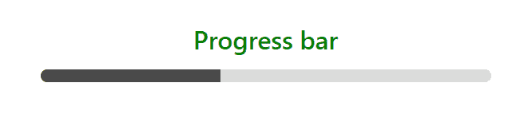
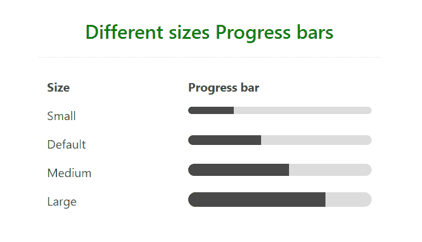
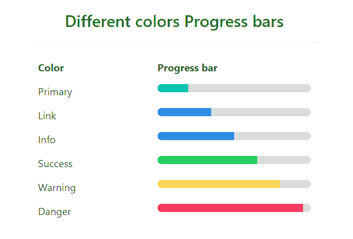

# 布尔玛|进度条

> 原文:[https://www.geeksforgeeks.org/bulma-progress-bar/](https://www.geeksforgeeks.org/bulma-progress-bar/)

**布尔玛**是一个基于 Flexbox 的免费开源 CSS 框架。它是组件丰富的，兼容的，并且有很好的文档记录。它本质上是高度反应的。它使用类来实现它的设计。
进度条用于在计算机上显示进程的进度。进度条显示流程完成了多少，还剩下多少。

**示例 1:** 本示例使用布尔玛创建一个简单的进度条。

```html
<!DOCTYPE html>
<html>

<head>
    <title>Bulma Progress bar</title>
    <link rel='stylesheet' href=
'https://cdnjs.cloudflare.com/ajax/libs/bulma/0.7.5/css/bulma.css'>

    <!-- custom css -->
    <style>
        div.columns {
            margin-top: 70px;
        }

        h1 {
            color: green !important;
            margin-bottom: 20px;
        }
    </style>
</head>

<body>
    <div class='container has-text-centered'>
        <div class='columns is-mobile is-centered'>
            <div class='column is-6'>
                <div>
                    <h1 class='title'>
                        Progress bar
                    </h1>
                </div>

                <div>
                    <progress class="progress" 
                        value="40" max="100">40
                    </progress>
                </div>
            </div>
        </div>
    </div>
</body>

</html>
```

**输出:**


**示例 2:** 本示例创建不同大小的进度条。

```html
<!DOCTYPE html>
<html>
  <head>
    <title>Bulma Progress bar</title>
    <link rel='stylesheet' href=
'https://cdnjs.cloudflare.com/ajax/libs/bulma/0.7.5/css/bulma.css'>

    <!-- custom css -->
    <style>
      div.columns{
        margin-top: 70px;
      }

      h1{
        color:green !important;
        margin-bottom: 20px;

      }

      .table td{
        font-size: 20px;
        border: none
      }

      .table th{
        font-size: 20px;
        border: none
      }
    </style>
  </head>

  <body>
    <div class='container has-text-centered'>
      <div class='columns is-mobile is-centered'>
        <div class='column is-6'>
          <div>
            <h1 class='title'>
              Different sizes Progress bars
            </h1>
            <hr>
          </div>

          <table class='table is-fullwidth'>
            <thead>
              <tr>
                <th>Size</th>
                <th>Progress bar</th>
              </tr>
            </thead>

            <tbody>
              <tr>
                <td>Small</td>
                <td>
                  <div>
                    <progress class=
                      "progress is-small" 
                      value="25" max="100">25
                    </progress>
                  </div>
                </td>
              </tr>

              <tr>
                <td>Default</td>
                <td>
                  <div>
                    <progress class=
                      "progress" value="40" 
                      max="100">40
                    </progress>
                  </div>
                </td>
              </tr>

              <tr>
                <td>Medium</td>
                <td>
                  <div>
                    <progress class=
                      "progress is-medium" 
                      value="55" max="100">55
                    </progress>
                  </div>
                </td>
              </tr>

              <tr>
                <td>Large</td>
                <td>
                  <div>
                    <progress class=
                      "progress is-large" 
                      value="75" max="100">75
                    </progress>
                  </div>
                </td>
              </tr>
            </tbody>
          </table>
        </div>
      </div>
    </div>
  </body>
</html>
```

**输出:**



**示例 3:** 本示例创建不同颜色的进度条。

```html
<!DOCTYPE html>
<html>
  <head>
    <title>Bulma Progress bar</title>
    <link rel='stylesheet' href=
'https://cdnjs.cloudflare.com/ajax/libs/bulma/0.7.5/css/bulma.css'>

    <!-- custom css -->
    <style>
      div.columns{
        margin-top: 70px;
      }

      h1{
        color:green !important;
        margin-bottom: 30px;
      }

      .table td{
        font-size: 20px;
        border:none
      }

      .table th{
        font-size: 20px;
        border:none
      }
    </style>
  </head>
  <body>
    <div class='container has-text-centered'>
      <div class='columns is-mobile is-centered'>
        <div class='column is-6'>
          <div>
            <h1 class='title'>
                 Different colors Progress bars
            </h1>
            <hr>
          </div>

          <table class='table is-fullwidth'>
            <thead>
              <tr>
                <th>Color</th>
                <th>Progress bar</th>
              </tr>
            </thead>

            <tbody>
              <tr>
                <td>Primary</td>
                <td>
                  <div>
                    <progress class=
                      "progress is-primary" 
                      value="20" max="100">20
                    </progress>
                  </div>
                </td>
              </tr>

              <tr>
                <td>Link</td>
                <td>
                  <div>
                    <progress class=
                      "progress is-link" 
                      value="35" max="100">
                      35
                    </progress>
                  </div>
                </td>
              </tr>

              <tr>
                <td>Info</td>
                <td>
                  <div>
                    <progress class=
                      "progress is-info" 
                      value="50" max="100">
                      50
                    </progress>
                  </div>
                </td>
              </tr>

              <tr>
                <td>Success</td>
                <td>
                  <div>
                    <progress class=
                      "progress is-success" 
                      value="65" max="100">65
                    </progress>
                  </div>
                </td>
              </tr>

              <tr>
                <td>Warning</td>
                <td>
                  <div>
                    <progress class=
                      "progress is-warning" 
                      value="80" max="100">80
                    </progress>
                  </div>
                </td>
              </tr>

              <tr>
                <td>Danger</td>
                <td>
                  <div>
                    <progress class=
                      "progress is-danger" 
                      value="95" max="100">95
                    </progress>
                  </div>
                </td>
              </tr>
            </tbody>
          </table>
        </div>
      </div>
    </div>
  </body>
</html>
```

**输出:**



**示例 4:** 本示例创建不同颜色的不确定进度条。

```html
<!DOCTYPE html>
<html>

<head>
  <title>Bulma Progress bar</title>
  <link rel='stylesheet' href=
'https://cdnjs.cloudflare.com/ajax/libs/bulma/0.7.5/css/bulma.css'>

  <!-- custom css -->
  <style>
    div.columns {
      margin-top: 70px;
    }

    h1 {
      color: green !important;
      margin-bottom: 30px;
    }

    .table td {
      font-size: 20px;
      border: none
    }

    .table th {
      font-size: 20px;
      border: none
    }
  </style>
</head>

<body>
  <div class='container has-text-centered'>
    <div class='columns is-mobile is-centered'>
      <div class='column is-6'>
        <div>
          <h1 class='title'>
            indeterminate Progress bars
          </h1>
          <hr>
        </div>

        <table class='table is-fullwidth'>
          <thead>
            <tr>
              <th>Color</th>
              <th>Progress bar</th>
            </tr>
          </thead>

          <tbody>
            <tr>
              <td>Primary</td>
              <td>
                <div>
                  <progress class=
                    "progress is-primary" 
                    max="100">20
                  </progress>
                </div>
              </td>
            </tr>

            <tr>
              <td>Link</td>
              <td>
                <div>
                  <progress class=
                    "progress is-link" 
                    max="100">35
                  </progress>
                </div>
              </td>
            </tr>

            <tr>
              <td>Info</td>
              <td>
                <div>
                  <progress class=
                    "progress is-info" 
                    max="100">50
                  </progress>
                </div>
              </td>
            </tr>

            <tr>
              <td>Success</td>
              <td>
                <div>
                  <progress class=
                    "progress is-success" 
                    max="100">65
                  </progress>
                </div>
              </td>
            </tr>

            <tr>
              <td>Warning</td>
              <td>
                <div>
                  <progress class=
                    "progress is-warning" 
                    max="100">80
                  </progress>
                </div>
              </td>
            </tr>

            <tr>
              <td>Danger</td>
              <td>
                <div>
                  <progress class=
                    "progress is-danger" 
                    max="100">95
                  </progress>
                </div>
              </td>
            </tr>
          </tbody>
        </table>
      </div>
    </div>
  </div>
</body>

</html>
```

**输出:**

<video class="wp-video-shortcode" id="video-433234-1" width="665" height="360" preload="metadata" controls=""><source type="video/mp4" src="https://media.geeksforgeeks.org/wp-content/uploads/20200613135444/Bulma-Progress-bar-Google-Chrome-2020-06-13-13-53-55.mp4?_=1">[https://media.geeksforgeeks.org/wp-content/uploads/20200613135444/Bulma-Progress-bar-Google-Chrome-2020-06-13-13-53-55.mp4](https://media.geeksforgeeks.org/wp-content/uploads/20200613135444/Bulma-Progress-bar-Google-Chrome-2020-06-13-13-53-55.mp4)</video>

**说明:**不确定进度条用于显示正在进行的一些进度，但实际持续时间尚未确定。未定义 HTML 值属性时，将显示不确定的进度条。

**注意:**在上面的例子中，我们使用了一些额外的布尔玛类，如容器、列、标题、表等。设计好内容。